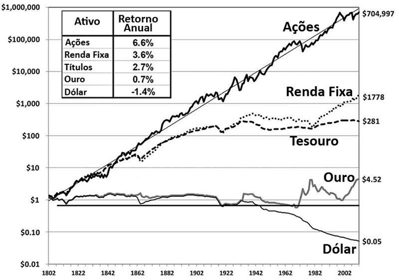
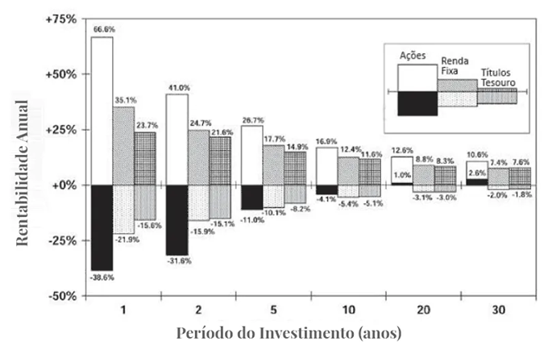
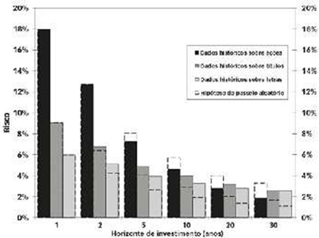
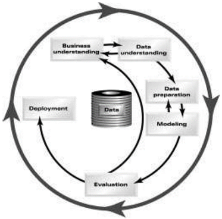

# AVALIAÇÃO DE SOCIEDADES ANÔNIMAS BRASILEIRAS: Uma proposta de _valuation_ com Fluxo de Caixa Descontado e ordenação por TOPSIS
Trabalho de Conclusão de Curso apresentado ao Corpo Docente do Departamento de Engenharia de Produção da Escola de Engenharia da Universidade Federal Fluminense, como parte dos requisitos necessários à obtenção do título de Engenheiro de Produção.

- **UNIVERSIDADE FEDERAL FLUMINENSE**
- **ESCOLA DE ENGENHARIA**
- **Autor**: Rodrigo Celso de Lima Porto
- **Orientador**: Prof. Dr. Gilson Brito Alves Lima
- **Coorientador**: Prof. Dr. Ricardo Bordeaux Rego
- Aprovado em 25 de junho de 2024
- Niterói - RJ

## RESUMO
Este trabalho tem como objetivo apresentar um método automatizado para avaliar empresas brasileiras listadas na B3 com base na análise de seus balanços patrimoniais, demonstrações de resultados e demonstrações de fluxo de caixa. O processo de avaliação é dividido em duas etapas. Primeiramente, adota-se uma abordagem intrínseca, utilizando o método de Fluxo de Caixa Descontado (FCD) para calcular o valor intrínseco inicial das ações. Em seguida, recorre-se a uma abordagem comparativa, na qual empresas pertencentes ao mesmo setor são ordenadas através do método multicritério TOPSIS, utilizando indicadores fundamentalistas como critérios do modelo. O TOPSIS, por sua vez, determina um coeficiente de similaridade para cada empresa, que serve como subsídio para o cálculo do prêmio ou desconto em relação ao valor intrínseco original. Esse cálculo resulta no valor intrínseco ajustado, que por sua vez é utilizado para estimar o potencial de valorização ou desvalorização das ações, também conhecido por margem de segurança, a qual será usada para selecionar as ações com as maiores margens em cada setor para compor a carteira a ser performada no ano. Após simular a performance das carteiras selecionadas pelo método proposto, para o período de 2016 a 2023, observou-se que elas rentabilizaram mais do que o índice de mercado brasileiro, o Ibovespa.

**Palavras-chave**: Valuation, Fluxo de Caixa Descontado, TOPSIS, ETL.

## LISTA DE ABREVIATURAS E SIGLAS

- **AHP**: *Analytic Hierarchy Process* (Processo de Hierarquia Analítica)
- **B3**: Brasil, Bolsa e Balcão
- **BP**: Balanço Patrimonial
- **CAPM**: *Capital Asset Pricing Model* (Modelo de Precificação de Ativos Financeiros)
- **CAPEX**: *Capital Expenditures* (Investimentos em Capital)
- **CC**: *Closeness Coeficient* (Coeficiente de Similaridade)
- **CMPC**: Custo Médio Ponderado de Capital
- **COFINS**: Contribuição para o Financiamento da Seguridade Social
- **CRISP-DM**: *Cross Industry Standard Process for Data Mining* (Processo Padrão Interindústrias para Mineração de Dados)
- **CSSL**: Contribuição Social Sobre o Lucro
- **CVM**: Comissão de Valores Mobiliários
- **DFC**: Demonstrativo de Fluxo de Caixa
- **DL/PL**: Dívida Líquida sobre Patrimômio Líquido
- **DRE**: Demonstrativo de Resultado do Exercício
- **DY**: *Dividend Yield* (Rendimento de Dividendos)
- **EBIT**: *Earnings Before Interests and Taxes* (Lucro Antes de Juros e Impostos)
- **EBITDA**: *Earnings Before Interests, Taxes, Depreciation and Amortization* (Lucro Antes de Juros, Impostos, Depreciações e Amortizações)
- **ESG**: *Environmental, Social & Governance* (Meio Ambiente, Social e Governança Corporativa)
- **ETL**: *Extract, Transform & Load* (Extração, Transformação e Carregamento)
- **EUA**: Estados Unidos da América
- **FCD**: Fluxo de Caixa Descontado
- **FCF**: Fluxo de Caixa dos Financiamentos
- **FCFE**: *Free Cash Flow to Equity* (Fluxo de Caixa Livre para os Acionistas)
- **FCFF**: *Free Cash Flow to Firm* (Fluxo de Caixa Livre para a Empresa)
- **FCI**: Fluxo de Caixa dos Investimentos
- **FCO**: Fluxo de Caixa Operacional
- **FRE**: Formulário de Referência
- **HME**: Hipótese do Mercado Eficiente
- **IBrA**: Índice Brasil Amplo
- **ICMS**: Imposto sobre Circulação de Mercadorias e Serviços
- **IR**: Imposto de Renda
- **IoT**: *Internet of Things* (Internet das Coisas)
- **LAIR**: Lucro Antes do Imposto de Renda
- **LL**: Lucro Líquido
- **MCDM**: *Multi-Criteria Decision-Making* (Método de Apoio à Decisão Multicritério)
- **MPE**: Micro e Pequenas Empresas
- **MS**: Margem de Segurança
- **NASDAQ**: *National Association of Securities Dealers Automated Quotations* (Cotações Automatizadas da Associação Nacional de Corretores de Valores Mobiliários)
- **NIS**: *Negative Ideal Solution* (Solução Ideal Negativa)
- **NOPAT**: *Net Operating Profit After Tax* (Lucro Operacional Líquido Após Impostos)
- **NYSE**: *New York Stock Exchange* (Bolsa de Valores de Nova York)
- **PG**: Progressão Geométrica
- **PIB**: Produto Interno Bruto
- **PIS**: Programa de Integração Social
- **PIS**: *Positive Ideal Solution* (Solução Ideal Positiva)
- **PL**: Patrimônio Líquido
- **P/L**: Preço por Ação sobre Lucro por Ação
- **P/VP**: Preço por Ação sobre Valor Patrimonial por Ação
- **RL**: Receita Líquida
- **ROA**: *Return On Asset* (Retorno Sobre o Ativo)
- **ROE**: *Return On Equity* (Retorno Sobre o Patrimônio Líquido)
- **Selic**: Sistema Especial de Liquidação e Custódia
- **TOPSIS**: *Technique for Order of Preference by Similarity to Ideal Solution* (Técnica para Ordem de Preferência por Similaridade com a Solução Ideal)
- **WACC**: *Weighted Average Cost of Capital* (Custo Médio Ponderado de Capital)

## DEDICATÓRIA

À minha família, que me deu o apoio necessário para tornar este trabalho realidade.

## AGRADECIMENTOS

Agradeço, primeiramente, aos meus pais, que depositaram todos os seus esforços em mim, sem os quais não conseguiria ter chegado tão longe.

Agradeço ao Prof. Gilson Lima pela sua orientação com este trabalho e pelos insights sobre a sua elaboração. Também agradeço ao Prof. Ricardo Bordeaux pela sua orientação, pela sua disponibilidade para tirar minhas dúvidas e pelas recomendações bibliográficas sobre finanças e avaliação de econômica de empresas, os quais foram úteis para o desenvolvimento deste trabalho.

Agradeço também aos vários colegas e ao restante dos professores com quem me encontrei ao longo da minha jornada acadêmica na UFF

## EPÍGRAFE

> _O sucesso em investimentos decorre não de acertar sempre, mas de errar com menos frequência do que os outros._

_Aswath Damodaran_

## LISTA DE FIGURAS

1. [Figura 1 – Fases do modelo CRISP-DM](#figure1)
1. [Figura 2 – Tripé do investidor](#figure2)
1. [Figura 3 – Fluxograma ETL da proposta de _valuation_](#figure3)

## LISTA DE GRÁFICOS

1. [Gráfico 1 – Rentabilidades reais dos ativos no mercado dos EUA,1802-2012](#graphic1)
1. [Gráfico 2 – Retornos reais máximos e mínimos das ações, renda fixa e tesouro ao longo dos anos](#graphic2)
1. [Gráfico 3 – Desvio padrão dos retornos reais médios das ações, dos títulos de longo prazo e das letras em vários horizontes de investimento: dados históricos e hipótese do passeio aleatório, 1802-2012](#graphic3)
1. [Gráfico 4 – Retornos das Carteiras Selecionadas vs Retornos do Ibovespa](#graphic4)
1. [Gráfico 5 – Retornos dos modelos vs Retornos do Ibovespa](#graphic5)

## LISTA DE TABELAS

1. [Tabela 1 – Modelo de Balanço Patrimonial](#table1)
1. [Tabela 2 – Modelo de DRE](#table2)
1. [Tabela 3 – Modelo de DFC](#table3)
1. [Tabela 4 – Cálculo do FCFE](#table4)
1. [Tabela 5 – Objetivos e valores do investidor conservador](#table5)
1. [Tabela 6 – Conjunto de dados utilizados](#table6)
1. [Tabela 7 – Indicadores fundamentalistas utilizadas no TOPSIS](#table7)
1. [Tabela 8 – Definição por parte da função](#table8)
1. [Tabela 9 – Carteiras Selecionadas (2016 – 2019)](#table9)
1. [Tabela 10 – Carteiras Selecionadas (2020 – 2023)](#table10)
1. [Tabela 11 – Retornos das carteiras dos modelos de backtest](#table11)

## Sumário

1. [INTRODUÇÃO](#introdução)
    1. [OBJETIVOS](#objetivos)
        1. [Objetivo Geral](#objetivo-geral)
        1. [Objetivos Específicos](#objetivos-específicos)
    1. [Delimitações do estudo](#delimitações-do-estudo)
    1. [Estruturação do estudo](#estruturação-do-estudo)
1. [REFERENCIAL TEÓRICO](#referencial-teórico)
    1. [DEMONSTRAÇÕES CONTÁBEIS](#demonstrações-contábeis)
        1. [Balanço Patrimonial (BP)](#balanço-patrimonial-bp)
        1. [Demonstração de Resultado de Exercício (DRE)](#demonstração-de-resultado-de-exercício-dre)
        1. [Demonstração de Fluxo de Caixa (DFC)](#demonstração-de-fluxo-de-caixa-dfc)
    1. [VALUATION](#valuation)
        1. [Fluxo de Caixa Descontado (FCD)](#fluxo-de-caixa-descontado-fcd)
        1. [Avaliação Comparativa](#avaliação-comparativa)
        1. [Apoio Multicritério para Tomada de Decisão (DCMD)](#apoio-multicritério-para-tomada-de-decisão-dcmd)
        1. [Power Query](#power-query)
1. [METODOLOGIA](#metodologia)
    1. [COMPREENSÃO DO NEGÓCIO](#compreensão-do-negócio)
    1. [COMPREENSÃO DOS DADOS](#compreensão-dos-dados)
    1. [PREPARAÇÃO DOS DADOS](#preparação-dos-dados)
    1. [MODELAGEM](#modelagem)
    1. [AVALIAÇÃO](#avaliação)
    1. [IMPLANTAÇÃO](#implantação)
1. [ANÁLISE E DISCUSSÃO DOS RESULTADOS](#análise-e-discussão-dos-resultados)
1. [CONCLUSÕES](#conclusões)
1. [REFERÊNCIAS](#referências)

# **INTRODUÇÃO**

Avaliar com precisão o valor justo de um ativo é uma tarefa imprescindível para os analistas, investidores, administradores e gestores de empresas e instituições financeiras. Tomar decisões acertadas sobre a alocação de recursos é crucial, pois isso representa um potencial significativo para o crescimento dos investimentos. Isso se traduz em benefícios tanto para as empresas e instituições, que podem obter mais capital próprio para financiar a implementação de seus planos estratégicos, por meio de CAPEX, programas, projetos etc., quanto para o investidor individual, que pode acelerar a acumulação do patrimônio necessário para gerar a renda passiva que cubra seu custo de vida, alcançando, assim, a almejada independência financeira.

Dentre os ativos negociados no mercado financeiro, as ações são os que possuem o maior potencial de valorização no longo prazo, como apontado por Siegel (2015). Ele analisou a rentabilidade real das principais aplicações financeiras estadunidenses ao longo dos últimos 210 anos, verificando o quanto o investimento de US$ 1,00 em 1802, em cada um dos principais conjuntos de ativos do mercado, valeria em 2012.

|Gráfico 1 – Rentabilidades reais dos ativos no mercado dos EUA, em escala logarítmica, 1802-2012|
|:---:|
||
|Fonte: Siegel (2015)|

O [Gráfico 1](#graphic1) apresenta, em escala logarítmica, a rentabilidade do conjunto de ativos considerados no estudo de Siegel (2015) e evidencia que as ações auferiram o maior retorno do período, superando notoriamente o crescimento dos outros ativos. Enquanto US$ 1,00 investido em ações em 1802 teria rentabilizado mais de US$ 700 mil, com crescimento médio anual de 6,6% acima da inflação, a segunda maior rentabilidade real seria a da renda fixa, em que US$ 1,00 em 1802 teriam auferido apenas quase US$ 1,8 mil de lucro ao longo de mais de dois séculos, a uma média de 3,6% ao ano. Outro ponto interessante é que a rentabilidade das ações, na escala logarítmica, segue uma notória tendência linear crescente, enquanto no restante dos ativos, tal tendência não foi claramente observada.

Além disso, ainda segundo Siegel (2015, p. 66), as ações são os ativos que apresentam menores riscos para a carteira no longo prazo. O [Gráfico 2](#graphic2) mostra os retornos máximos e mínimos das ações comparadas com os da renda fixa e títulos do Tesouro dos EUA, considerados os mais conservadores. Ao interpretar que o retorno máximo é uma medida de rentabilidade, enquanto o mínimo é uma medida de risco, então se constata que, nos primeiros cinco anos, as ações são mais rentáveis, porém são mais arriscadas que a renda fixa e o Tesouro, indo ao encontro do consenso. Porém, após esse período, elas apresentam em média um retorno mínimo maior do que os outros dois. E após duas décadas, apresenta um retorno mínimo positivo, enquanto os outros dois tipos conservadores permanecem com retorno mínimo negativo.

|Gráfico 2 – Retornos reais máximos e mínimos das ações, renda fixa e tesouro ao longo dos anos|
|:---:|
||
|Fonte: Siegel (2015)|

Além disso, ao definir que o risco de um ativo pode ser determinado pelo seu desvio-padrão dos retornos reais anuais médios sua série histórica, é possível ver pelo [Gráfico 3](#graphic3) que o desvio padrão do retorno acionário supera o dos títulos públicos e de renda fixa na primeira década. Entretando, o risco acionário se torna menor do que os outros dois após esse período, não condizendo com o risco estimado pela hipótese do passeio aleatório (SIEGEL, 2015).

|Gráfico 3 – Desvio padrão dos retornos reais médios das ações, dos títulos de longo prazo e das letras em vários horizontes de investimento: dados históricos e hipótese do passeio aleatório, 1802-2012|
|:---:|
||
|Fonte: Siegel (2015)|

Siegel (2015) alerta que, pelo [Gráfico 3](.github/assets/graphic3.png), não está afirmando que o risco das ações diminui à medida que o tempo passa. Na verdade, o que ocorre é que o desvio padrão dos retornos totais das ações aumenta com o tempo, porém a um ritmo progressivamente mais lento do que o dos títulos ou da renda fixa. Isso é atribuído à incerteza quanto à inflação, a qual leva a um rápido aumento da volatilidade dos ativos mais conservadores à medida que o período se estende (SIEGEL, 2015).

Assim, fica evidente que as ações são as mais ideais para investimentos de longo prazo. Não obstante, tal conclusão não pode ser estendida para o mercado brasileiro, uma vez que não se tem registro de dados financeiros com intervalo de tempo tão longo quanto o dos EUA. Porém, trabalhos de Borfe e Schwerz (2018), Duarte (2019), Hendges e Rodrigues (2021) e Bainha e Sodré (2022) dão ao menos alguns leves indícios de que as rentabilidades das ações brasileiras superaram as da renda fixa ou que foram menos voláteis que a renda fixa em certos períodos.

Outra distinção fundamental entre o mercado financeiro dos [EUA](#eua) e o do Brasil é a diferença de escala. Enquanto a capitalização de mercado da [B3](#b3) gira em torno de US$ 791 bilhões, as duas principais bolsas de valores do mundo, [NYSE](#nyse) e [Nasdaq](#nasdaq), apresentam uma capitalização de US$ 22,7 trilhões e US$ 18 trilhões, respectivamente (TORO, 2023). Isso equivale a quase 29 vezes e 23 vezes a capitalização da B3. Além disso, o número de investidores no Brasil é consideravelmente limitado, totalizando apenas 17,3 milhões, dos quais cerca de 5 milhões investem em renda variável, ou seja, apenas um pouco mais de 2% da sua população (B3, 2022).

O contexto apresentado sugere que as premissas da [HME](#hme), formulada por Fama (1970), não se aplicariam adequadamente ao mercado financeiro brasileiro. De acordo com essa hipótese, em um mercado eficiente, é improvável que haja uma discrepância significativa entre o preço negociado dos ativos e seu valor justo (_fair value_), uma vez que existe uma ampla cobertura por analistas financeiros em todo o mundo, acompanhando consistentemente as informações referentes a esses ativos em tempo real. Além disso, todos os participantes teriam igual acesso a informações relevantes sobre a qualidade desses ativos, resultando em um consenso em relação ao valor mais apropriado para cada um deles.

Fama (1970) ainda detalha três formas de eficiência de mercado: (1) a eficiência fraca, onde não é possível que um investidor consiga uma performance acima da média do mercado a partir de inferências de preços antigos; (2) a semiforte, em que não é possível ao investidor superar o mercado nem com dados históricos ou públicos; (3) a forma forte, em que nem mesmo informações privadas (privilegiadas) representariam uma vantagem, pois todos os tipos de informações já estariam refletidas nos preços.

Trabalhos realizados por Camargos e Barbosa (2006, 2015) e Forti, Peixoto e Santiago (2009) revelam que o mercado brasileiro não é tão eficiente quanto a forma semiforte definida pela HME, o que revela possíveis oportunidades de ações sendo precificadas bem além ou aquém do seu valor intrínseco na B3, devido ao seu ajuste lento e gradual dos preços após a publicação de fatos relevantes, como fusões e aquisições, por exemplo.

Por isso, é imprescindível que análises de _valuation_ das empresas sejam realizados para o mercado brasileiro, por meio da análise dos demonstrativos contábeis, como Balanços Patrimoniais (BP), Demonstrações de Resultado de Exercício (DRE), Demonstrações de Fluxo de Caixa (DFC) etc., para o cálculo de seus indicadores fundamentalistas. Segundo Damodaran (2012), os vários tipos de modelos existentes de _valuation_ podem ser resumidos em duas abordagens: intrínseca e comparativa. Na avaliação intrínseca, o valor de um ativo é determinado pela expectativa dos seus fluxos de caixa futuros, gerados ao longo de sua vida útil. O modelo de avaliação intrínseca mais empregado é o de Fluxo de Caixa Descontado (FCD), que traz os fluxos futuros para o seu valor presente por meio da aplicação de uma taxa de desconto. Já na avaliação comparativa (ou relativa), define-se o valor de um ativo comparando-o com outros ativos semelhantes, geralmente feito por meio da comparação de indicadores fundamentalistas, como P/L, P/VP, ROE, Margem Líquida etc. No entanto, como o próprio Damodaran (2012) explica, as duas abordagens não são mutuamente excludentes, não impedindo de haver avaliações que apliquem ambas.

Dado isso, este estudo visa apresentar um modelo de avaliação que combina as duas abordagens: uma primeira avaliação intrínseca, utilizando o método FCD, seguida de uma avaliação comparativa empregada pelo método multicritério de apoio à decisão (MCDM) TOPSIS. O TOPSIS compara cada alternativa de uma matriz de decisão com as soluções ideais (PIS) e anti-ideais (NIS), calculando um coeficiente de similaridade (CC) para cada uma delas, e as ordena segundo esse valor, em ordem decrescente. O intuito é usar esse coeficiente para ajustar o valor intrínseco calculado pelo FCD a fim de obter o resultado definitivo da avaliação, algo que é chamado por Damodaran (2012) de _polimento pós-avaliação_.

Essa proposta de _valuation_ é inspirada no trabalho realizado por Lima et al. (2010), onde os autores aplicaram o modelo de FCD para calcular o valor intrínseco de três MPEs, dos setores químico, farmacêutico e de turismo. Posteriormente, esse valor foi ajustado (polido) com base nos resultados obtidos por um método MCDM, conduzido pelo software Macbeth.

A principal distinção deste estudo em relação ao trabalho de Lima et al. (2010) reside na proposta de um modelo automatizado de avaliação, por meio de um processo de Extração, Transformação e Carregamento ([ETL](#etl)) de dados financeiros de todas as empresas listadas na [B3](#b3). A partir desses dados, os valores intrínsecos das ações serão inicialmente estimados pelo FCD para, posteriormente, serem ajustados pelo coeficiente de similaridade calculado pelo TOPSIS.

Desse modo, o estudo busca introduzir um método abrangente que leve em consideração tanto os fatores internos quanto externos para estimar o valor das empresas. Isso é alcançado não somente por meio da análise dos aspectos financeiros internos, mas também através da comparação da empresa com outras entidades do mesmo setor.

## **OBJETIVOS**

A seguir, são apresentados os objetivos deste trabalho, os quais têm como propósito responder a seguinte questão: “Dado a ineficiência existente no mercado financeiro brasileiro, é possível criar uma carteira de ações com performance superior e consistente no mercado acionário, ao avaliar os seus potenciais de valorização por meio da aplicação de um método que considere não só o seus valores intrínsecos, mas também os seus valores relativos às outras empresas pela comparação de indicadores fundamentalistas por meio de um MCDM?”.

### **Objetivo Geral**

O objetivo geral será criar um processo automatizado de _valuation_ que busca construir uma carteira de ações a partir do seu potencial de valorização, calculado por um método de _valuation_ que considere tanto as abordagens intríseca e comparativa.

Para alcançar esse objetivo, um processo ETL de dados financeiros das empresas listadas na B3 será escrito em um script em código Mashup (M Code), linguagem de consulta nativa do Power Query.

### **Objetivos Específicos**

a. Estudar as principais referências disponíveis sobre _valuation_, com o intuito de verificar quais os melhores métodos para serem aplicados para o mercado brasileiro, quais os índices de referência a serem considerados e quais as premissas mais adequadas para o modelo adotado.

a. Estudar o valor intrínseco das empresas a partir dos documentos e relatórios publicados na CVM, tais como BPs, DREs e DFCs.

a. Verificar o valor relativo das empresas de um mesmo setor a partir de um método multicritério de apoio à decisão, comparando as empresas por meio de indicadores fundamentalistas.

## **DELIMITAÇÕES DO ESTUDO**

Para a composição de uma carteira de um determinado ano, o estudo delimitar-se-á na aplicação de um método de avaliação intrínseca seguida de um ajuste por meio da avaliação comparativa. A avaliação intrínseca limitar-se-á na análise financeira e operacional dos dados públicos das empresas de capital aberto na B3 ao longo dos últimos 5 anos a partir de uma data de referência, com cálculo para projeções dos seus fluxos de caixa para os próximos 3 anos.

A avaliação comparativa, por sua vez, limitar-se-á na análise dos indicadores fundamentalistas das empresas no ano de referência, calculados a partir das informações extraídas de seus demonstrativos contábeis, das cotações históricas e da distribuição de dividendos (estas duas últimas extraídas do Yahoo! Finance).

Para a realização dos _backtests_, pegou-se o maior período histórico disponível que dava para extrair dos dados disponíveis pela CVM e pela estruturação das avaliações, de 2016 a 2023.

## **ESTRUTURAÇÃO DO ESTUDO**

O presente trabalho foi estruturado em cinco seções: introdução, referencial teórico, metodologia, discussão dos resultados e conclusão.

A introdução serviu para explicar a importância de realizar a análise de ações no contexto brasileiro, justificar a motivação de propor o método de _valuation_ a ser apresentado e delinear os principais objetivos a ser alcançado neste estudo.

O referencial teórico visa explanar sobre o arsenal teórico proveniente das áreas de finanças corporativas, avaliação de investimentos e MCDM, a fim de que o leitor acompanhe e entenda a linha de raciocínio traçada para a confecção do método proposto.

A terceira seção foi reservada para explicar sobre o CRISP-DM, proposta por Chapman et al. (2000), que se trata da metodologia adotada para a execução do passo a passo do processo de _valuation_, que engloba desde a fase de entendimento do problema, entendimento e tratamento dos dados, até a fase de validação e implementação do modelo. Também nesta seção será explicado a execução da metodologia adotada, descrevendo as fontes utilizadas, o tratamento dos dados, a amostra obtida, os critérios e pesos utilizados, a execução do processo de _valuation_, os resultados obtidos e a sua validação.

A penúltima seção se reservará para detalhar e explicar os resultados obtidos do modelo de _valuation_ proposto e das suas variantes, a fim de averiguar a contribuição do MCDM escolhido para a melhora da consistência, rentabilidade e segurança das carteiras selecionadas.

For fim, a última seção apresentará as principais conclusões feitas sobre os resultados e sobre o êxito no alcance dos objetivos almejados.

# **REFERENCIAL TEÓRICO**

Nesta seção, será explicado os principais conceitos teóricos por trás da metodologia adotada, de modo que o leitor entenda e acompanhe o raciocínio empregado para o processo de avaliação das empresas proposta neste trabalho.

## **DEMONSTRAÇÕES CONTÁBEIS**

De acordo com o artigo 176, da Lei 6.404/1976, a Lei das Sociedades por Ações, as demonstrações contábeis, também chamadas de demonstrações financeiras, são relatórios que as sociedades de capital aberto devem elaborar e publicar para informar com clareza sobre a sua posição patrimonial, financeira e o seu desempenho durante o seu exercício social, que geralmente tem duração de um ano.

Dentre as demonstrações financeiras exigidas, as principais para a realização de análises de _valuation_ são o Balanço Patrimonial (BP), a Demonstração de Resultado de Exercício (DRE) e a Demonstração do Fluxo de Caixa (DFC).

### **Balanço Patrimonial (BP)**

O BP busca resumir a situação patrimonial da empresa, geralmente estruturado em forma de “T”, em que se convencionou que o lado esquerdo são listados os bens e direitos (aplicações de recursos), enquanto no lado direito são listados as obrigações e o patrimônio líquido da empresa (fontes de recursos).

Ribeiro (2010) explica que o lado direito, chamado de passivo do balanço, representa as origens de financiamento da empresa, em que as obrigações englobam recursos obtidos de terceiros (capital de terceiros) e o patrimônio líquido, os recursos oriundos dos sócios ou dos lucros apurados após o exercício (capital próprio). O lado esquerdo, por sua vez, chamado de ativo do balanço, reúne as aplicações dos financiamentos, isto é, mostra onde a empresa aplicou o capital obtido. Por consequência dessa definição, o somatório do lado do ativo deve ser igual ao lado do passivo, daí o motivo do termo _Balanço_ Patrimonial, pois os dois lados devem estar equilibrados, assim como uma balança (RIBEIRO, 2010).

Os bens e direitos devem estar ordenados no [BP](#bp) em ordem decrescente de seu grau de liquidez (isto é, quão pouco tempo leva para transformar bens e direitos em dinheiro), dividindo o lado esquerdo em dois grandes grupos: Ativo Circulante e Não Circulante. Enquanto as dívidas e obrigações devem estar ordenadas em ordem decrescente de seu grau de exigibilidade (isto é, pelo quão curto é o prazo para o seu cumprimento), o que os divide em dois grupos: Passivo Circulante e Não Circulante. Além disso, o lado direito também inclui o Patrimônio Líquido (PL) dos sócios.

A [Tabela 1](#table1) exemplifica um modelo de Balanço Patrimonial e as contas que podem compor os ativos e passivos de uma empresa.

<table id="table1" style="text-align:center">
    <caption><strong>Tabela 1 – Modelo de Balanço Patrimonial</strong></caption>
    <thead>
        <tr>
            <th style="text-align: center">ATIVO</th>
            <th style="text-align: center">PASSIVO</th>
        </tr>
    </thead>
    <tbody>
        <tr>
            <td>CIRCULANTE</td>
            <td>CIRCULANTE</td>
        </tr>
        <tr>
            <td>
                <ul style="list-style-type:none">
                    <li>Disponibilidades</li>
                    <li>Clientes</li>
                    <li>Estoque</li>
                    <li>Tributos a recuperar</li>
                </ul>
            </td>
            <td>
                <ul style="list-style-type:none">
                    <li>Fornecedores</li>
                    <li>Empréstimos e financiamentos</li>
                    <li>Obrigações tributárias</li>
                    <li>Obrigações trabalhistas e previdenciárias</li>
                    <li>Participações e destinações do lucro líquido</li>
                </ul>
            </td>
        </tr>
        <tr>
            <td>NÃO CIRCULANTE</td>
            <td>NÃO CIRCULANTE</td>
        </tr>
        <tr>
            <td rowspan="3">
                <ul style="list-style-type:none">
                    <li>Direitos a receber a longo prazo</li>
                    <li>Investimentos</li>
                    <li>Imobilizado</li>
                    <li>Intangível</li>
                </ul>
            </td>
            <td>
                <ul style="list-style-type:none">
                    <li><em>Pode configurar as mesmas contas do passivo circulante, porém vencíveis após o término do exercício social.</em></li>
                </ul>
            </td>
        </tr>
        <tr>
            <td>PATRIMÔNIO LÍQUIDO</td>
        </tr>
        <tr>
            <td>
                <ul style="list-style-type:none">
                    <li>Capital Social</li>
                    <li>Reservas de Capital</li>
                    <li>Reservas de Lucros</li>
                    <li>Ações em Tesouraria</li>
                    <li>Prejuízos Acumulados</li>
                </ul>
            </td>
        </tr>
        <tr>
            <td>ATIVO TOTAL</td>
            <td>PASSIVO TOTAL</td>
        </tr>
        <tr>
            <td colspan="2">
                
Fonte: Adaptado de Ribeiro (2010)

            </td>
        </tr>
    </tbody>
</table>

### **Demonstração de Resultado de Exercício (DRE)**

A <abbr title="Demonstração de Resultado de Exercício">DRE</abbr> busca documentar o desempenho econômico da empresa, isto é, se ela teve lucro ou prejuízo por meio das suas operações ou do seu resultado financeiro. Geralmente, o exercício social considerado é de um ano.

Segundo Ribeiro (2010), a <abbr title="Demonstração de Resultado de Exercício">DRE</abbr> serve para evidenciar a composição do resultado de uma empresa, mostrando os vários níveis do seu desempenho econômico mediante confronto entre as suas receitas e seus respectivos custos e despesas. Ele explica que a <abbr title="Demonstração de Resultado de Exercício">DRE</abbr> é composta por contas de resultado e por contas patrimoniais, sendo as primeiras correspondentes às receitas realizadas bem como aos custos e despesas incorridas no exercício; enquanto as últimas, às deduções e participações de resultados.

A [Tabela 2](#table2) exemplifica um modelo de DRE e as possíveis contas que a compõe.

<table id="table2">
    <caption>Tabela 2 – Modelo de DRE</caption>
    <thead>
        <tr>
            <th style="text-align:center">CONTA</th>
            <th style="text-align:center">EXEMPLOS</th>
        </tr>
    </thead>
    <tbody>
        <tr>
            <td>(+) Receita Operacional Bruta</td>
            <td>
                <ul>
                    <li>Vendas de mercadorias</li>
                    <li>Prestação de serviços</li>
                </ul>
            </td>
        </tr>
        <tr>
            <td>(-) Deduções e Abatimentos</td>
            <td>
                <ul>
                    <li>Vendas Anuladas</li>
                    <li>Descontos Incondicionais Concedidos</li>
                    <li>ICMS sobre as vendas</li>
                    <li>PIS/COFINS sobre faturamento</li>
                </ul>
            </td>
        </tr>
        <tr>
            <td>(=) Receita Operacional Líquida</td>
            <td></td>
        </tr>
        <tr>
            <td>(-) Custos Operacionais</td>
            <td>
                <ul>
                    <li>Custos das mercadorias vendidas</li>
                    <li>Custos dos serviços prestados</li>
                </ul>
            </td>
        </tr>
        <tr>
            <td>(=) Lucro Operacional Bruto</td>
            <td></td>
        </tr>
        <tr>
            <td>(-) Despesas Operacionais</td>
            <td>
                <ul>
                    <li>Despesas com vendas</li>
                    <li>Despesas Gerais e Administrativas</li>
                </ul>
            </td>
        </tr>
        <tr>
            <td>(=) EBITDA</td>
            <td>
                <ul>
                    <li>Resultado do exercício antes das deduções</li>
                </ul>
            </td>
        </tr>
        <tr>
            <td>(-) Amortizações</td>
            <td>
                <ul>
                    <li>Pagamento do principal</li>
                </ul>
            </td>
        </tr>
        <tr>
            <td>(-) Depreciação</td>
            <td>
                <ul>
                    <li>Depreciação de equipamentos e máquinas</li>
                    <li>Depreciação de imóveis</li>
                    <li>Depreciação de veículos</li>
                </ul>
            </td>
        </tr>
        <tr>
            <td>(=) EBIT</td>
            <td>
                <ul>
                    <li>Resultado antes dos impostos e despesas financeiras</li>
                </ul>
            </td>
        </tr>
        <tr>
            <td>(-) Impostos</td>
            <td>
                <ul>
                    <li>CSSL</li>
                    <li>IR</li>
                </ul>
            </td>
        </tr>
        <tr>
            <td>(+) Resultado Não Operacional</td>
            <td>
                <ul>
                    <li>Venda de Veículos</li>
                    <li>Venda de Terrenos</li>
                    <li>Ganhos ou perdas judiciais</li>
                    <li>Resultados de outras atividades não operacionais</li>
                </ul>
            </td>
        </tr>
        <tr>
            <td>(-) Despesas Financeiras</td>
            <td>
                <ul>
                    <li>Pagamento de juros</li>
                </ul>
            </td>
        </tr>
        <tr>
            <td>(+) Receitas Financeiras</td>
            <td>
                <ul>
                    <li>Rendimentos de aplicações financeiros</li>
                    <li>Prêmios sobre resgate de títulos e debêntures</li>
                </ul>
            </td>
        </tr>
        <tr>
            <td>(=) Resultado do exercício após as deduções</td>
            <td></td>
        </tr>
        <tr>
            <td>(-) Participações</td>
            <td>
                <ul>
                    <li>Debêntures</li>
                    <li>Empregados</li>
                    <li>Administradores</li>
                    <li>Partes Beneficiárias</li>
                </ul>
            </td>
        </tr>
            <tr>
                <td>(=) Lucro Líquido</td>
                <td>
                    <ul>
                        <li>Resultado do exercício social</li>
                    </ul>
                </td>
            </tr>
        <tr>
            <td colspan="2" style="text-align:center">Fonte: Adaptado de Ribeiro (2010)</td>
        </tr>
    </tbody>
</table>

### **Demonstração de Fluxo de Caixa (DFC)**

Fluxos de caixa são todas as saídas (créditos) e entradas (débitos) da conta caixa da empresa e seus equivalentes. Segundo Ribeiro (2010), o conceito de caixa e seus equivalentes engloba todo tipo de conta ou aplicação financeira com liquidez e disponibilidade imediata tais como a própria conta Caixa, Banco conta Movimento, Aplicações Financeiras de Liquidez Imediata, caderneta de poupança, CDB etc.

A DFC, por sua vez, visa evidenciar todas as transações realizadas nas disponibilidades de empresa, incorridas durante o exercício social. De acordo com o inciso I do artigo 188 da Lei 6.404/1976, os fluxos devem estar segregados na estrutura da DFC em, no mínimo, três grupos: fluxos das operações, dos financiamentos e dos investimentos.

A [Tabela 3](#table3) exemplifica um modelo de DFC e suas possíveis transações.

<table id="table3">
    <caption>Tabela 3 – Modelo de DFC</caption>
    <thead>
        <tr>
            <th style="text-align:center">DESCRIÇÃO</th>
            <th style="text-align:center">EXEMPLOS</th>
        </tr>
    </thead>
    <tbody>
        <tr>
            <td colspan="2" style="text-align:center"><strong>FLUXOS OPERACIONAIS</strong></td>
        </tr>
        <tr>
            <td>Resultado do exercício/período</td>
            <td>
                <ul>
                    <li>Ajustes para conciliar o resultado às disponibilidades geradas pelas atividades operacionais</li>
                </ul>
            </td>
        </tr>
        <tr>
            <td>Depreciação e Amortização</td>
            <td></td>
        </tr>
        <tr>
            <td>Resultado na venda de ativos permanentes</td>
            <td></td>
        </tr>
        <tr>
            <td>Equivalência patrimonial</td>
            <td></td>
        </tr>
        <tr>
            <td>Recebimento de lucros e dividendos de subsidiárias</td>
            <td>
                <ul>
                    <li>Variações nos ativos e passivos</li>
                    <li>Variação em Contas a Receber</li>
                    <li>Variação dos Estoques</li>
                    <li>Variação da conta Fornecedores</li>
                    <li>Variação em Contas a Pagar e provisões</li>
                    <li>Variação no IR e CSSL</li>
                    <li>Disponibilidades líquidas geradas pelas (aplicadas nas) atividades operacionais</li>
                </ul>
            </td>
        </tr>
        <tr>
            <td colspan="2" style="text-align:center"><strong>FLUXOS DE INVESTIMENTOS</strong></td>
        </tr>
        <tr>
            <td>Imobilizado</td>
            <td>
                <ul>
                    <li>Compras do Imobilizado</li>
                    <li>Vendas do Imobilizado</li>
                </ul>
            </td>
        </tr>
        <tr>
            <td>Ações/quotas</td>
            <td>
                <ul>
                    <li>Aquisição ações/cotas</li>
                    <li>Venda de ações/cotas</li>
                </ul>
            </td>
        </tr>
        <tr>
            <td>Recebimento por vendas de ativos não circulantes</td>
            <td>
                <ul>
                    <li>Disponibilidades líquidas geradas pelas (aplicadas nas) atividades operacionais</li>
                </ul>
            </td>
        </tr>
        <tr>
            <td colspan="2" style="text-align:center"><strong>FLUXOS DE FINANCIAMENTOS</strong></td>
        </tr>
        <tr>
            <td><Capital</td>
            <td>
                <ul>
                    <li>Integralização de capital</li>
                    <li>Pagamento de lucros/dividendos</li>
                </ul>
            </td>
        </tr>
        <tr>
            <td>Empréstimos</td>
            <td>
                <ul>
                    <li>Empréstimos tomados</li>
                    <li>Pagamentos de empréstimos/debêntures</li>
                </ul>
            </td>
        </tr>
        <tr>
            <td>Juros</td>
            <td>
                <ul>
                    <li>Juros recebidos de empréstimos</li>
                    <li>Juros pagos por empréstimos</li>
                </ul>
            </td>
        </tr>
        <tr>
            <td colspan="2" style="text-align:center"><strong>VARIAÇÃO DAS DISPONIBILIDADES</strong></td>
        </tr>
        <tr>
            <td colspan="2" style="text-align:center">Fonte: Adaptado de Ribeiro (2010)</td>
        </tr>
    </tbody>
</table>

## **VALUATION**

Para que um bom investimento seja feito, é necessário que o investidor não pague caro demais por um ativo para que não perca o seu potencial de retorno, nem o venda barato demais, pois representaria um significativo custo de oportunidade. Ao se comparar a cotação de uma ação com seu valor intrínseco, o investidor encontrará o que Graham (2016) chama de margem de segurança (MS), dada pelo seu potencial de valorização. Portanto, teoricamente, quanto maior fosse essa margem, mais seguro e certo era de estar investido nessa ação.

Porém, Damodaran (2012) salienta que estimar o valor intrínseco de uma ação não é uma tarefa simples.

Primeiramente, toda análise de _valuation_ é inevitavelmente tendenciosa, pois os avaliadores nunca partem de uma tábula rasa, já tendo opiniões, preconceitos e julgamentos sobre a empresa ou seu setor de atuação antes mesmo do início da avaliação, muitas vezes ocasionado pelo acompanhamento de rumores, comentários, opiniões ou avaliações de outros analistas (DAMODARAN, 2012). Por isso, não é incomum haver analistas terem avaliações otimistas, pessimistas e incertas sobre um mesmo ativo ao mesmo tempo, pois todos partiram de premissas ou modelos que diferem entre si (por exemplo, taxas de crescimento distintas, previsões distintas sobre a evolução das variáveis macroeconômicas, horizontes de projeção com intervalos diferentes, consideração ou não de um valor de perpetuidade etc.).

Segundo, até mesmo as melhores avaliações podem conter imprecisões. Mesmo se as informações sobre os resultados de uma empresa fossem impecáveis e completamente disponíveis ao público, ainda seria necessário projetá-los, o que acarreta sempre em erros de estimativa nas previsões. E, ainda, mesmo que a empresa evolua conforme as expectativas, o ambiente macroeconômico pode sofrer mudanças acentuadas, e até mesmo imprevisíveis. (DAMODARAN, 2012).

Por isso, como recomendado pelo autor, se for possível modelar bem a análise de _valuation_ com a menor quantidade de _inputs_ necessários possível, menor serão as chances de ocorrerem erros e distorções nas estimativas, pois um modelo complexo sempre terá um custo compensatório de ser menos inteligível, mais opaco e de necessitar um maior intervalo de confiança para os resultados obtidos. Portanto, nesse caso, menos é mais. (DAMODARAN, 2012).

Dado esse contexto, uma pessoa pode chegar à conclusão de que o processo de _valuation_ é mais um parecer altamente subjetivo do que um procedimento científico, já que é altamente dependente das premissas adotadas pelo avaliador. Porém, Damodaran (2012) esclarece que, apesar dessas verdades, elas não são razões suficientes para não aplicar _valuation_ nas análises de investimentos, pois todo modelo, até mesmo os científicos, são intrínsicamente imprecisos, uma vez que buscam ser uma representação simplificada da realidade. Além disso, o grande sucesso dos investimentos reside em não acertar sempre, mas sim em consistentemente acertar mais do que errar. (DAMODARAN, 2012).

Existem vários tipos de modelos de _valuation_ e a sua complexidade aceitada dependerá majoritariamente da relação custo-benefício entre o tempo necessário para a sua realização e a sua precisão desejada. Um exemplo simples, proposta por Graham (2016), envolve a determinação do valor intrínseco da ação ($VIA$) pela equação:

$$ VIA = \sqrt{22.5 \times LPA \times VPA} \tag{2.1} $$

Onde:

- $LPA$ é o lucro dos últimos 12 meses por ação;
- $VPA$ é o valor patrimonial por ação.

Donde o investidor pode estimar a margem de segurança como sendo:

$$ MS = \frac{VIA - P}{P} \times 100\% \tag{2.2} $$

Onde $P$ é o preço da ação.

Já os modelos mais complexos podem envolver Fluxo de Caixa Descontado Estocástico, simulações, métodos de Monte Carlo, IA, _Machine Learning_, etc., dependendo das necessidades do avaliador.

Apesar dos diversos tipos de modelos de _valuation_, Damodaran (2012) os agrupa em duas abordagens: _intrínseca_ e _comparativa_. A primeira envolve a avaliação da ação a partir dos fluxos de caixa gerados pela empresa, enquanto a segunda envolve a avaliação da ação a partir da sua comparação com ações de empresas semelhantes. O modelo mais utilizado para a abordagem intrínseca é o FCD, enquanto a abordagem comparativa comumente emprega a comparação de múltiplos, também conhecidos como indicadores fundamentalistas.

### **Fluxo de Caixa Descontado (FCD)**

Os modelos de FCD partem do princípio de que o valor do dinheiro no futuro é sempre menor do que o seu valor presente, pois é sempre preferível receber, por exemplo, R$ 1.000,00 agora do que esperar para receber a mesma quantia em qualquer período futuro. Tal desvalorização do dinheiro é determinada por uma taxa de desconto, que é proporcional ao risco assumido de ter de esperar para recebê-lo.

Por conta disso, conforme explicado por Damodaran (2012) e Filho _et al._ (2008), os modelos de FCD determinam que valor de um ativo é determinado pelo valor presente dos seus fluxos de caixa futuros, descontados por uma taxa que reflete o risco admissível de se investir no ativo. Portanto, a partir desta definição, o valor de um imóvel é determinado pelos fluxos dos aluguéis; o valor das debêntures, pelo fluxo dos juros; das patentes, pelos royalties; e o valor das ações, pelo fluxo de dividendos projetados (FILHO _et al.,_ 2008).

A equação a seguir apresenta a fórmula geral comumente empregada para a determinação do valor presente de um ativo.

$$ VIA = \sum_{t=1}^{n}{\frac{FCL_{t}}{(1+r)^t}} \tag{2.3} $$

Onde:

- $VIA$ é o valor presente ou valor intrínseco do ativo;
- $FCL_{t}$ é o fluxo de caixa livre do período $t$, após pagamento de impostos, juros e despesas;
- $r$ é a taxa de desconto;
- $n$ é o número de períodos esperados para a geração do fluxo de caixa.

No entanto, para modelos em que se admite que o ativo gerará fluxo de caixa permanentemente, – como é o caso na avaliação de ações, já que não se espera que os sócios abram a empresa com expectativas que de seus negócios se findem – é comum incluir mais uma parcela à [equação (2.3)](#eq2-3).

$$ VIA = \underbrace{\sum_{t=1}^{n}{\frac{FCL_{t}}{(1+r)^t}}}_{V_{hp}} + \underbrace{\frac{VT}{(1+r)^n}}_{V_p} \tag{2.4} $$

Onde:

- $V_{hp}$ é o valor presente do fluxo de caixa livre do ativo no horizonte de projeção;
- $V_p$ é o valor presente do fluxo de caixa livre do ativo na perpetuidade;
- $n$ é o intervalo de projeção antes da perpetuidade;
- $VT$ é o valor terminal (ou residual) do fluxo de caixa na perpetuidade.

Para o cálculo do $VT$, geralmente é empregado o modelo de crescimento perpétuo de Gordon.

#### **Modelo de Gordon**

O modelo de Gordon foi originalmente proposto por J. B. Williams, mas que recebeu o sobrenome de M. J. Gordon, que divulgou em 1956 o modelo de crescimento perpétuo (FILHO et al., 2008).

Este modelo parte da premissa de que os dividendos esperados de uma ação crescem em uma PG, a uma taxa $g$ a cada período $t$, admitindo que uma empresa, em constante crescimento, pagaria dividendos sempre crescentes. Assim, a partir do último dividendo distribuído $D_0$, projetar-se-ia os dividendos futuros como:

$$ D_1 = D_0(1+g) $$
$$ D_2 = D_0(1+g)^2 $$
$$ \vdots $$
$$ D_t = D_0(1+g)^n $$

Portanto, o valor intrínseco de uma ação seria determinado pelo somatório de todos os dividendos descontados a uma taxa $r$.

$$ VIA = \sum_{t=1}^{\infty}{\frac{D_0(1+g)^t}{(1+r)^t}} = D_0\sum_{t=1}^{\infty}{(\frac{1+g}{1+r})^t} $$

No entanto, para que o valor presente da ação convirja para um número finito, é necessário que a razão $q$ da PG infinita seja estritamente menor do que 1. Logo:

$$ q = \frac{1+g}{1+r} \lt 1 \implies 1 + g \lt 1+r \implies g \lt r $$

Ou seja, a taxa de crescimento perpétuo dos dividendos deve ser menor do que a taxa de desconto. Como observado por Damodaran (2012) e Filho et al. (2008), presumir que a taxa $g$ se mantenha constante no infinito implica em também presumir que a taxa de crescimento dos lucros da empresa se mantenha, no mínimo, igual a $g$. Pois, caso contrário, não seria possível manter a taxa de crescimento dos dividendos infinitamente. E para que a taxa de crescimento dos lucros se mantenha constante infinitamente, é necessário que a taxa $g$ seja menor do que a média da taxa de crescimento nominal da economia como um todo. Pois do contrário, isto é, se for assumido que a taxa de crescimento dos dividendos se mantenha maior do que a da economia infinitamente, implicará dizer que os lucros da empresa crescem mais do que a economia indefinidamente, o que a levaria eventualmente a ocupar a sua totalidade. Portanto, chegaríamos a um absurdo.

Admitindo que tal condição seja cumprida, pode-se calcular o valor da soma da PG infinita por:

$$ \sum_{t=1}^{\infty}{(\frac{1+g}{1+r})^t} = \frac{q}{1-q} = \frac{\frac{1+g}{1+r}}{1-\frac{1+g}{1+r}} = \frac{1+g}{1+r-1-g} = \frac{1+g}{r-g} $$

Portanto, o valor presente de uma ação pelo modelo de Gordon será de:

 $$ VIA = \frac{D_{0}(1+g)}{r-g} \tag{2.5} $$ 

Apesar de ser um modelo bem criticado por assumir uma premissa considerada bastante irrealista para muitas empresas, tendo a sua aplicação limitada para empresas com crescimento estável, ele é um bom exemplo intuitivo sobre como as principais variáveis afetam o preço de uma ação.

Conforme apontado por Filho et al. (2008), o modelo de Gordon não apenas demonstra claramente que o aumento na distribuição de dividendos eleva o preço da ação, mas também revela que um aumento na taxa de retorno $r$ – mantendo $g$ constante – reduz o valor da ação. Isso geralmente ocorre quando os investidores percebem um aumento no risco associado à empresa.

No entanto, como ressaltado também por Filho et al. (2008), embora o aumento de $D_0$ aumente o $VIA$, isso acaba implicando em uma redução em $g$, pois a empresa terá menos recursos disponíveis para investimentos de capital (CAPEX). Consequentemente, o denominador $(r-g)$ aumenta, resultando em uma diminuição compensatória do valor da ação. De maneira similar, o oposto ocorre quando $D_0$ diminui. Embora a distribuição de dividendos diminua o $VIA$, a empresa terá mais recursos para investimentos de capital. Assim, $g$ aumenta e o denominador $(r-g)$ diminui, o que leva a um aumento compensatório no preço da ação.

#### **FCFE**

O modelo de Fluxo de Caixa Livre para os Acionistas busca, primeiramente, estimar qual o valor intrínseco de mercado $VIM$ da empresa a partir do desconto dos fluxos de caixa pertencentes exclusivamente aos acionistas após o pagamento das despesas, impostos e amortização de dívidas.

$$ VIM = \sum_{t=1}^{n}{\frac{FCFE_t}{(1+r)^t}} + \frac{VT}{(1+r)^n} \tag{2.6} $$

Onde:

- $n$ é o período de projeção;
- $FCFE_t$ é o fluxo de caixa livre para os acionistas no período $t$;
- $r$ é a taxa de desconto que, neste modelo, representará o custo do capital próprio da empresa;
- $VT = \frac{FCFE_n(1+g)}{r-g}$ é o valor terminal do fluxo após o período de projeção;
- $g$ é a taxa de crescimento da empresa na perpetuidade;

Com o valor de mercado estimado, divide-se pelo número de ações emitidos no mercado para obter o valor intrínseco da ação.

$$ VIA = \frac{VIM}{N} \tag{2.7} $$

Onde $N$ é o número de ações emitidas da empresa.

A projeção dos $FCFE_t$, para $1 \le t \le n$, deve ser realizado com base nos FCFEs históricos, cujo cálculo pode ser feita pela fórmula geral apresentada por Kobori (2018), dada por:

$$ FCFE = FCO + FCI + FCF \tag{2.8} $$

Onde:

- $FCO$ é o Fluxo de Caixa Operacional, que corresponde ao lucro líquido mais as despesas não desembolsáveis, como depreciação, amortização exaustão etc., e a necessidade de capital de giro ( KOBORI, 2018);
- $FCI$ é o Fluxo de Caixa dos Investimentos, que corresponde à soma de todos os investimentos e desinvestimentos de capital, como compras ou vendas de máquinas, equipamentos, móveis, instalações etc., necessários para manter a geração de caixa da empresa em situações de estabilidade ( KOBORI, 2018). Compras representam saídas de caixa (parcelas negativas), enquanto vendas, entradas de caixa (parcelas positivas);
- $FCF$ é o Fluxo de Caixa dos Financiamentos, que corresponde à soma dos empréstimos e financiamentos captados pela empresa e as amortizações e pagamentos de dívidas. Esta parcela também inclui os recursos recebidos dos sócios e a distribuição de dividendos ( KOBORI, 2018);

Entretando, Damodaran (2012), Póvoa (2012) e Reis (2023), falam que os FCFEs históricos também podem ser calculados conforme o procedimento apresentado pela [Tabela 4](#table4).

<table id="table4" style="text-align:center">
    <caption>Tabela 4 – Cálculo do FCFE</caption>
    <thead>
        <tr>
            <th style="text-align:center">PARCELA</th>
            <th style="text-align:center">SÍMBOLO</th>
            <th style="text-align:center">EXPLICAÇÃO</th>
        </tr>
    </thead>
    <tbody>
        <tr>
            <td>(+) Lucro Líquido do Exercício</td>
            <td><em>LL</em></td>
            <td>Já tendo sido realizado o pagamento de juros e amortizações.</td>
        </tr>
        <tr>
            <td>(+) Depreciação</td>
            <td><em>DP</em></td>
            <td>É adicionado de volta já que serviu apenas para efeito de cálculo da base tributária.</td>
        </tr>
        <tr>
            <td>(-) Despesas de capital</td>
            <td><em>CAPEX</em></td>
            <td>Despesas de capital.</td>
        </tr>
        <tr>
            <td>(-) Variação da necessidade de capital de giro</td>
            <td><em>&Delta;NCG</em></td>
            <td>Os aumentos em estoque e em contas a receber reduzem a geração de caixa; os aumentos em contas a pagar aumentam a geração de caixa.</td>
        </tr>
        <tr>
            <td>(+) Captação de novos financiamentos</td>
            <td><em>F</em></td>
            <td>Emissão de novas dívidas.</td>
        </tr>
        <tr>
            <td>(=) Fluxo de Caixa Livre para os Acionistas.</td>
            <td><em>FCFE</em></td>
            <td>Este é o caixa que sobra depois do atendimento de todas as necessidades. Se for positivo, representa um dividendo potencial</td>
        </tr>
        <tr>
            <td colspan=3 style="text-align:center">Fonte: Adaptado de Damodaran (2012) e Póvoa (2012)</td>
        </tr>
    </tbody>
</table>

Além das projeções dos $FCFE_t$, um outro desafio para o cálculo do $VIM$ é a determinação da taxa de custo de capital próprio ($r$) mais apropriada. Neste trabalho, foi adotado o modelo CAPM para o cálculo dessa taxa.

#### **Modelo CAPM**

Segundo Damodaran (2012), um dos modelos mais empregados para a determinação do custo do capital próprio é o CAPM, desenvolvido no início da década de 1960. Partindo da hipótese de que a diversificação de ativos não traz custos adicionais nem aumento de ganhos, então a melhor carteira de ações seria aquela que compõe todas as ações negociadas na bolsa, isto é, a _carteira de mercado_. Nesse cenário, o risco de um ativo seria equivalente ao seu risco adicional à carteira de mercado, representado pelo indicador $\beta$, calculado por:

$$ \beta_i = \frac{\text{Cov}(R_i, R_m)}{\sigma^2(R_m)} \tag{2.9}$$

Onde:

- $\beta_i$ é o risco incremental da ação $i$
- $R-i$ são os retornos percentuais da ação $i$
- $R_m$ são os retornos percentuais do mercado
- $\text{Cov}(R_i,R_m)$ é a covariância entre os retornos médios da ação $i$ e do mercado
- $\sigma^2(R_m)$ é a variância dos retornos do mercado

Segundo Póvoa (2012), o $\beta$ pode ser interpretado como o nível de sensibilidade de uma ação em relação às variações do mercado. Uma ação com $\beta \lt 1$ tende a ser menos sensível às variações de mercado. Ou seja, o preço da ação tende a cair menos quando o mercado cai e vice-versa. Já uma ação com $\beta \gt 1$ é mais sensível aos movimentos do mercado, pois significa que em momentos de queda do mercado, o seu preço tende a cair mais que o próprio mercado, e vice-versa. Por fim, $\beta = 1$ significa que as variações do preço da ação tendem refletir as variações do próprio mercado.

Ainda segundo Póvoa (2012), uma outra forma de calcular o $\beta_i$ de uma ação é calculando o coeficiente angular da regressão linear entre os retornos da ação e o os retornos do mercado. O índice mais comumente adotado para representar a carteira do mercado brasileiro é o Ibovespa, que busca simular uma carteira teórica dos ativos mais negociados na Bolsa de Valores de São Paulo (B3, 2023).

Partindo das hipóteses anteriormente mencionadas, o CAPM diz que o retorno esperado de uma ação será dado por:

$$ r = R_f + \beta_i (E[R_m]-R_f) \tag{2.10}$$

Onde:

- $R_f$ é a taxa livre de risco
- $E[R_m]$ é o valor esperado dos retornos do mercado
- $(E[R_m]-R_f)$ é o prêmio pelo risco

A lógica por trás da fórmula é a de que, ao investir em um ativo com risco, o investidor deverá exigir uma taxa equivalente à taxa que um ativo livre de riscos renderia, mais um prêmio por estar investindo no ativo com risco. Portanto, quanto maior for a sensibilidade do ativo em relação aos movimentos do mercado – isto é, quanto maior for o valor do $\beta_i$ –, maior deverá ser a remuneração pelo risco incorrido.

No entanto, no método de estimação dos FCFEs não se leva em consideração a estrutura de capital da empresa, pois não é considerado nenhum outro capital além do seu capital próprio. Portanto, deve-se desconsiderar a sua alavancagem financeira, uma vez que boa parte da volatilidade de suas ações se deve pela proporção das dívidas assumidas (PÓVOA, 2012). Além disso, uma vez que diferentes empresas apresentam diferentes estruturas de capital, o beta a ser utilizado no modelo CAPM deve ser o desalavancado ($\beta_d$), calculado como:

$$\beta_d = \frac{\beta}{1+(1-T)\frac{D}{E}} \tag{2.11}$$

Onde:

- $\beta$ é o beta original, alavancado;
- $T$ é a alíquota do imposto;

Segundo Damodaran (2012), apesar do CAPM ser intuitivo e simples, ele parte de premissas irrealistas, além do fato de os $\beta_i$ individuais dos ativos não serem eficazes para explicar diferenças de retorno entre diferentes ações. Póvoa (2012) enumera como principais desvantagens do uso dos $\beta_i$ estatísticos (1) a eventual ou recorrente falta de liquidez de uma ação, havendo longos períodos em que ela não é negociada na bolsa, o que pode distorcer bastante o seu $\beta_i$; (2) os desvios-padrão dos $\beta_i$ estatísticos são excessivamente grandes, sendo, portanto, pouco críveis para o cálculo da taxa de desconto $r$; (3) Cálculo dos $\beta_i$ com base em dados históricos, o que não necessariamente reflete a sensibilidade futura do ativo; (4) Uso de índices de referência distorcidos para o seu cálculos, com alguns sendo altamente concentrados em um ou vários setores específicos, não sendo, portanto, bons representantes da carteira de mercado.

Por conta disso, Damodaran (2012) sugere como solução substituir o $\beta_i$ pelo beta médio do setor ($\beta_{\text{setor}}$) em que a empresa se encontra, uma vez que a média de muitos $\beta_i$ atenua o efeito dos erros e das distorções. Póvoa (2012) sugere como cálculo para o $\beta_{\text{setor}}$ a média ponderada pelos valores de mercado $VM_i$ das empresas.

$$\beta_{\text{setor}} = \frac{\sum_{i=1}^{m}{\beta_i VM_i}}{\sum_{i=1}^{m}{VM_i}} \tag{2.12}$$

Onde $m$ é o total de empresas presentes no setor.

Portanto, a equação recomendada para o cálculo do custo do capital próprio no método de FCFE seria:

$$r = R_f + \beta_{\text{setor}}(E[R_m]-R_f) \tag{2.13}$$

#### **FCFF**

O modelo de Fluxo de Caixa Livre para a Empresa, diferentemente do FCFE, busca estimar o valor intrínseco da empresa ou da firma ($VIF$), isto é, o valor considerando o capital total alocado na empresa, financiado pelo capital dos sócios e acionistas (capital próprio) e as dívidas e empréstimos dos credores (capital de terceiros). A fórmula do $VIF$ é análoga à do $VIM$.

$$ VIF = \sum_{t=1}^{n}{\frac{FCFF_{t}}{(1+r)^t}} + \frac{VT}{(1+r)^n} \tag{2.14} $$

Onde:

- $r$, neste modelo, é a taxa do custo de capital total da empresa;
- $VT=\frac{FCFF_n(1+g)}{r-g}$é o valor terminal do fluxo de caixa para a empresa na perpetuidade.

Por fim, para a obtenção do valor intrínseco da ação, é necessário retirar a dívida total da empresa do valor da firma e dividir a diferença pelo número total de ações.

$$ VIA = \frac{VIF-D}{N} \tag{2.15} $$

Para o cálculo dos FCFF históricos, é necessário considerar a dívida, já que estamos considerando tanto o capital próprio como de terceiros. Assim, na avaliação dos demonstrativos contábeis, ao invés de se partir do lucro líquido do exercício social, parte-se do EBITDA, por não considerar as deduções dos juros e das amortizações.

$$ FCFF = EBITDA(1-T) + DP \dot T - CAPEX - \Delta NCG \tag{2.16} $$

Em relação à formula geral (2.8), bastaria retirar a parcela FCF para obter o FCFF, ficando portanto:

$$ FCFF = FCO + FCI \tag{2.17} $$

Além dessas adaptações em relação ao FCFE, é necessário salientar que a taxa a ser considerada deve levar em conta não só o custo do capital próprio, como também o de terceiros. Para isso, foi empregado o cálculo do WACC da empresa.

#### **WACC**

O CMPC, como também é conhecido o WACC, estima o custo de capital da empresa considerando tanto o financiamento da empresa pelo capital dos sócios quanto o risco de alavancagem financeira pela tomada de empréstimos de capitais de terceiros. Para isso, é calculado um custo médio das fontes de capital, ponderados pelas suas respectivas proporções em relação ao capital total da empresa.

Segundo Filho et al. (2008), considerando que uma empresa possua fontes de financiamento, com cada uma possuindo uma taxa de custo $r_i$, a fórmula geral para o custo médio ponderado de capital da empresa deverá ser dada por:

$$ WACC = \frac{\sum_{i=1}^{n}{C_ir_i}}{\sum_{i=1}^{n}{C_i}} \tag{2.18} $$

Onde $C_i$ é o total financiado à empresa pela fonte $i$.

Portanto, considerando que as fontes de financiamento possam ser resumidas em capital próprio ($E$) e de terceiros ($D$), com suas respectivas taxas de custo $r_E$ e $r_D$, então a taxa mínima aceitável pelos acionistas deverá ser dada por:

$$ WACC = \frac{E}{E+D}r_E + \frac{D}{E+D}r_D(1-T) \tag{2.19} $$

O $r_E$ é calculado pelo modelo CAPM, como explicado em um tópico anterior. Neste caso, é necessário fazer uso do beta alavancado ao invés do desalavancado, uma vez que o risco da dívida deverá ser avaliado junto com o risco do próprio negócio. Vale comentar também que o termo representa a alíquota do imposto de renda pago pela empresa e, portanto, o fator $(1-T)$ representa o benefício fiscal que a empresa ganha sobre o cutos do capital de terceiros.

Devido às desvantagens do uso do beta individual $\beta_i$, apresentadas no tópico sobre CAPM, Póvoa (2012) propõe o uso de um _bottom-up_ beta ($\hat{\beta}$) em seu lugar. Esse coeficiente se baseia na regra estatística de que o desvio padrão da média de betas individuais é sempre menor que o desvio-padrão médio dos betas individuais, uma vez que:

$$ \sigma(\overline{\beta_i}) = \frac{\overline{\sigma}(\beta_i)}{\sqrt{n}} \tag{2.20} $$

Onde:

- $\overline{\beta_i}$ é a média dos betas individuais;
- $\sigma$ é o desvio-padrão;
- $\overline{\sigma}$ é o desvio-padrão médio;
- $n$ é o número de observações.

Para o cálculo do $\hat{\beta_i}$ de uma ação, será necessário realizar a seguinte série de passos:

1. Calcular $\beta_i$ os tradicionais de cada uma das ações das empresas que pertençam ao mesmo setor da empresa $i$.
2. Calcular o beta do setor a partir de uma soma ponderada dos $\beta_i$ de cada empresa, tendo como pesos os valores $VM_i$ negociados no mercado de cada empresa $i$.
3. Calcular a proporção entre capital de terceiros e capital próprio médio do setor a partir da média ponderada, tendo como pesos o valor de mercado das empresas no setor.

$$ \overline{\frac{D}{E}} = \frac{\sum_{i=1}^{m}{VM_i}\frac{D_i}{E_i}}{\sum_{i=1}^{m}{VM_i}} \tag{2.21} $$

4. Uma vez que empresas com maior alavancagem financeiras apresentam maior volatilidade, é necessário calcular o beta desalavancado do setor ($\beta_{d^{\text{setor}}}$) por:

$$ \beta_{d^{\text{setor}}} = \frac{\beta_{\text{setor}}}{1+(1-T) \overline{(\frac{D}{E}})}  \tag{2.22} $$

5. Realavancar o $\beta_{d^{\text{setor}}}$ pela alavancagem financeira da empresa $i$ para finalmente obter o seu $\hat{\beta_i}$.

$$ \hat{\beta_i} =  \beta_{d^{\text{setor}}}[1 + (1-T)\frac{D_i}{E_i}] \tag{2.23} $$

Portanto, o custo de capital próprio $r_E$ recomendado por Póvoa (2012) passaria a ser dado por:

$$ r_E = R_f + \hat{\beta_i}(E[R_m] - R_f) \tag{2.24} $$

Por fim, o último _input_ necessário para calcular o WACC é a taxa de custo de capital de terceiros $r_D$, que pode ser facilmente calculada pela razão:

$$ r_D = \frac{J}{D} \tag{2.25} $$

Onde $J$ é o total das despesas financeiras.

### **Avaliação Comparativa**

A avaliação comparativa se trata de determinar o valor de um ativo comparando-o com outros ativos semelhantes. Por exemplo, para determinar o valor de um veículo, algumas pessoas poderiam pesquisar pelos preços de outros veículos semelhantes – veículos que sejam do mesmo modelo, tenham a cilindrada parecida, mesma tração ou com aproximadamente a mesma quantidade de metros cúbicos de espaço etc. –, calcular uma média e comparar com o preço cotado pelo veículo no mercado e verificar se o preço é razoável.

Segundo Damodaran (2012), há três passos a serem seguidos neste tipo de avaliação: (1) Determinar os ativos comparáveis; (2) Padronizar os valores de mercado a valores comparáveis; (3) Comparar os valores padronizados, fazendo os devidos ajustes que considerem as diferenças dos ativos.

Empresas comparáveis, segundo o autor, são aquelas com capacidade de geração de caixa, potencial de crescimento e riscos semelhantes. Póvoa (2012), por sua vez, leva em conta a ciclicidade, a alavancagem operacional e diferenciação do produto/especialização da empresa como critérios para segmentação de empresas comparáveis. No entanto, como é ressaltado por Póvoa (2012), é sempre importante privilegiar a simplicidade à complexidade nos processos de _valuation_. Caso haja um alto detalhamento dos critérios para segmentação das empresas, corre-se o risco do avaliador cair no paradoxo de “segmentos formados por uma ou duas empresas”, o que acabará por comprometer a análise comparativa por se estar lidando com amostras muito diminutas.

Por isso, apesar das definições apresentadas não terem algum critério pertinente à indústria ou ao setor em que a empresa atua, é bastante comum que os analistas definam “empresas comparáveis” como aquelas que possuam o mesmo modelo de negócio ou que atuam no mesmo setor. Por questão de simplicidade, foi definido neste trabalho empresas comparáveis como aquelas que atuam em um mesmo setor da economia ou que possui o conjunto majoritário de suas atividades e operações pertencentes ao mesmo setor.

No que tange à escolha de valores padronizados, um dos mais adotados são indicadores fundamentalistas, como o P/L, P/VP, ROE, ROA, margem líquida etc. Para a escolha dos indicadores, Damodaran (2012) alerta que eles devem ser consistentes. Como o próprio autor exemplifica, o índice P/L pode ser calculado de várias formas – com base no lucro do último exercício social, dos últimos 12 meses, dos próximos 12 meses etc. – e é recomendável que apenas uma definição seja aplicada a todas as empresas para que se tenha uma comparação válida.

Como parte da metodologia deste trabalho, a comparação entre os indicadores das empresas se dará pela distância que esta estará da empresa anti-ideal do setor (NIS) e da empresa ideal do setor (PIS). Uma explicação mais detalhada se encontrará na seção sobre o método TOPSIS.

A seguir, serão explicados os principais indicadores fundamentalistas considerados para a realização da avaliação comparativa.

#### Volume de negociações

Representa o volume de negociações da ação de uma empresa nos últimos 30 dias. Esse indicador será usado tanto como um critério no TOPSIS quanto como critério de unicidade. Isto é, caso uma empresa esteja sendo negociada na bolsa em mais de um tipo de ação, apenas a ação mais líquida entrará para o conjunto de alternativas do modelo TOPSIS.

#### P/L

Segundo Gitman (2013), a relação preço/lucro mede o montante que os investidores estão dispostos a pagar por cada unidade monetária do lucro de uma ação. Neste trabalho, foi calculado pela razão entre o preço da ação e o lucro líquido por ação dos últimos 12 meses. Portanto, ele representa o preço do lucro auferido pela empresa nos últimos 12 meses. Por exemplo, se uma ação está sendo negociada na bolsa com P/L = 10, significa que os investidores estão dispostos a comprar R$ 1,00 dos lucros da empresa por R$ 10,00.

Uma segunda interpretação deste indicador é a quantidade de anos do retorno da ação. Portanto, um investidor que comprou uma ação quando seu P/L = 10, significa que, caso os lucros da empresa se mantenham constantes, e caso o lucro auferido fosse totalmente distribuído aos acionistas, então o investidor verá o retorno total do seu investimento em 10 anos.

Por isso, melhor será para o investidor quanto menor for valor do P/L de uma ação, ainda mais quando o P/L pequeno não for justificável, pois significa que uma ação boa está sendo subprecificada. No entanto, isso só vale enquanto P/L for positivo. Quando P/L < 0, significa que a empresa vem tendo prejuízo nos últimos 12 meses.

#### P/VP

Segundo Gitman (2013), a relação preço-valor patrimonial é calculado pela razão entre o valor de mercado da empresa e o seu PL. Ou ainda, pela razão entre o preço da ação e o patrimônio líquido por ação (LPA). Portanto, ele fornece uma avaliação de como os investidores encaram o desempenho de uma empresa e ele representa o quanto os investidores estão dispostos a comprar para cada unidade monetária do patrimônio líquido contábil da empresa. Por exemplo, se uma ação está sendo negociada na Bolsa com P/VP = 5, significa que os investidores estão dispostos a comprar R$ 1,00 do PL da empresa por R$ 5,00.

Como o site da Status Invest (2020) explica, quando um P/VP é baixo, com valor abaixo de 1, indica que a empresa está sendo negociada por um valor de mercado menor do que o seu patrimônio líquido, o que pode revelar uma oportunidade de potencial de valorização daquela ação.

Por conta disso, melhor para o investidor quanto menor for o valor de P/VP. Porém, da mesma forma como ocorre com o P/L, este indicador passa a ser indesejável quando P/VP < 0, pois significa que a empresa possui um patrimônio líquido negativo, isto é, possui mais dívidas e obrigações do que bens ou direitos.

#### Dividend Yield (DY)

O DY é calculado pela razão entre o somatório dos dividendos por ação pagos pela empresa nos últimos 12 meses e o preço da ação. Ele é um indicador de performance no pagamento de dividendos de uma ação. Por exemplo, uma ação com DY = 10% significa que, nos últimos 12 meses, ela pagou R$ 0,10 de dividendos para cada R$ 1,00 do seu preço atual.

Portanto, quanto maior o DY de uma ação, mais interessante é de investir nela. Porém, como a própria Status Invest (2021) alerta, devido ao fato desse indicador estar relacionado inversamente com o preço da ação, um investidor pode chegar erroneamente na conclusão de que a empresa é boa pagadora de dividendos quando o preço do seu papel está bem subprecificada. Além disso, pode acontecer de uma ação ter um DY bem alto devido a uma distribuição de lucros extraordinários não provenientes da sua operação, mas de um fato não recorrente, como ganhos judiciais, desinvestimentos, vendas de terrenos etc.

#### Margem Líquida

Segundo Kobori (2018), a margem líquida é a razão entre o lucro líquido e as receitas, isto é, o quanto de lucro a empresa gera a cada R$ 100,00 em receita líquida (RL). Por exemplo, uma empresa que possui uma margem líquida de 30% consegue auferir, em média, R$ 30,00 de lucro a cada R$ 100,00 de receita (seja vendas de produtos ou prestação de serviços). Neste, trabalho, calculou-se a margem líquida como sendo a razão entre o lucro líquido dos últimos 12 meses e a receita líquida dos últimos 12 meses.

#### Retorno sobre o Patrimônio Líquido (ROE)

Segundo Kobori (2018), o ROE é um indicador de rentabilidade do dinheiro investido pelos acionistas da empresa e representa o quanto de lucro a empresa gera para cada R$ 100,00 investidos pelos acionistas. Por exemplo, uma empresa com um ROE de 20% é capaz de gerar R$ 20,00 de lucro para cada R$ 100,00 de recursos provenientes do patrimônio líquido.

Portanto, ele é um importante indicador de rentabilidade para avaliar a eficiência da empresa na utilização de seus recursos próprios. Um ROE elevado sugere que a empresa está empregando seus recursos de maneira produtiva, enquanto um ROE baixo sinaliza problemas na gestão financeira do negócio ( STATUS INVEST, 2020). Neste trabalho, o seu cálculo se deu pela razão entre o lucro líquido dos últimos 12 meses e o patrimônio líquido da empresa.

#### Média das variações dos lucros líquidos ($\overline{\Delta LL}$)

Este indicador foi adotado como sendo a métrica de crescimento da empresa, uma vez que ele sugere se, na média, os lucros líquidos da empresa vem crescendo, se encontram estagnadas, ou se vem decrescendo ao longo do tempo.

Neste trabalho, arbitrou-se por calcular a média aritmética das variações dos lucros das empresas nos últimos 5 anos, conforme a seguinte fórmula:

$$ \overline{\Delta LL} = \frac{\sum_{t=1}^{5}{{\Delta LL}_{t}}}{5} = \frac{\sum_{t=1}^{5}{\frac{LL_t}{LL_{t-1}}-1}}{5} \tag{2.26}$$

#### Dívida Líquida / Patrimônio Líquido (DL/PL)

A razão entre dívida líquida (DL) e patrimônio líquido (PL) é um indicador de endividamento que mostra se o patrimônio líquido da empresa será capaz de cobrir o valor das dívidas em caso de falência (STATUS INVEST, 2020).

Por isso, quanto menor o DL/PL, maior é a indicação de boa saúde financeira da empresa, inclusive quando a dívida líquida é negativa, pois indica que a empresa terá dinheiro sobrando em caixa mesmo após o pagamento de toda sua dívida bruta. Consequentemente, quanto maior este indicador maior é a sua alavancagem e o seu risco.

#### DL/EBIT

A razão entre a dívida líquida e o EBIT dos últimos 12 meses é um indicador de endividamento que representa a quantidade de anos que a empresa levará para pagar toda sua dívida líquida a partir do seu lucro operacional, caso o EBIT permaneça constante (STATUS INVEST, 2021). Logo, uma empresa que tenha DL/EBIT = 3, por exemplo, levará 3 anos para que o lucro operacional pague toda a sua dívida líquida, caso esse lucro permaneça constante ao longo desses 3 anos. Por conta disso, entende-se que menor será o risco para o investidor quanto menor for o DL/EBIT da empresa.

#### Índice de Basileia

Utilizado neste trabalho apenas para analisar a solvência dos bancos, o Índice de Basileia informa o quanto um banco possui de capital própria para cada unidade monetária de capital de terceiros (captações) exposto a risco por meio da carteira de crédito. Por exemplo, se um banco possui Índice de Basiléia de 20%, significa que, para cada R$ 1,00 emprestados, o banco possui patrimônio de R$ 0,20 ( BANCO DATA, 2024).

Ou seja, quanto maior o Índice de Basileia de um banco, maior é a capacidade do banco de saldar as suas dívidas. No Brasil, o índice mínimo exigido pelo Banco Central é 11% (BANCO DATA, 2024).

#### Índice de Imobilização

Utilizado neste trabalho apenas para medir o nível de ativo imobilizado dos bancos, este índice mede o nível de liquidez de um banco para conseguir honrar seus compromissos e indica a proporção de ativos que estão imobilizados. Por exemplo, se um banco possui Índice de Imobilização de 30%, significa que, a cada R$ 100,00 em seu patrimônio, R$ 30,00 estarão investidos em bens que não possuem uma liquidez imediata, ou seja, imobilizado em imóveis, veículos, materiais, etc. (BANCO DATA, 2024).

Portanto, quanto mneor for o Índice de Imobilização, maior a capacidade do banco de financiar suas dívidas a partir de seu patrimônio. O índice máximo tolerado pelo Banco Central do Brasil é 50% (BANCO DATA, 2024).

#### Índice de Liquidez Corrente (ILC)

Segundo Kobori (2018), o ILC indica a quantidade de reais que uma empresa tem em disponibilidade no curto prazo para cada R$ 1,00 de dívidas no curto prazo. Ele é calculado a partir da razão entre o ativo e o passivo circulantes e representa a capacidade de pagamento das dívidas de curto prazo com os ativos recebíveis no curto prazo.

Caso o ILC seja menor do que 1, significa que a empresa é dependente de geração de caixa para cumprir as suas obrigações de curto prazo, podendo ser necessário em algumas vender parte do seu ativo não circulante para financiar o seu passivo circulante. Portanto, entende-se que quanto maior a liquidez corrente, menor o risco de inadimplemento no curto prazo.

#### Índice de Liquidez Geral (ILG)

Parecido com o ILC, o ILG avalia todos os ativos liquidáveis da empresa frente a todos os seus passivos, sendo calculado pela razão entre a soma do ativo circulante e recebível a longo prazo e o passivo circulante e exigível a longo prazo ( KOBORI, 2018). Portanto, o ILG mede a capacidade de a empresa pagar a sua dívida bruta a partir dos seus ativos liquidáveis.

Como será explicado em um tópico posterior, o ILG foi empregado neste trabalho apenas para medir a liquidez dos bancos.

### **Apoio Multicritério para Tomada de Decisão (DCMD)**

Os métodos multicritério geralmente auxiliam na tomada de decisão de cenários em há várias alternativas a serem consideradas, com cada uma possuindo vários critérios a serem determinados, ponderados e analisados, objetiva ou subjetivamente, pelo tomador de decisão.

Dentre os principais métodos de apoio multicritério para tomada de decisão, o mais referenciado é o AHP, proposto por Saaty (1994), que leva em consideração a definição de uma hierarquia entre os diferentes critérios por parte do tomador de decisão a partir do seu julgamento sobre a importância relativa entre cada um dos critérios.

Diversos métodos multicritérios foram desenvolvidos para atender a uma variedade de necessidades, cada um aplicando lógicas e funcionalidades distintas. Para este estudo, optou-se por empregar o método TOPSIS, com o intuito de utilizar indicadores fundamentalistas como critérios para classificar as ações segundo à sua similaridade com as soluções ideal e anti-ideal de seus respectivos setores.

#### TOPSIS

O método multicritério TOPSIS, introduzido por Hwang e Yoon (1981), é um procedimento de classificação de alternativas com base em sua proximidade à solução ideal positiva (PIS) e à solução ideal negativa (NIS), também conhecidas respectivamente por soluções ideal e anti-ideal. PIS e NIS representam vetores formados pelas melhores e piores pontuações em cada critério, respectivamente. Portanto, não se referem a alternativas reais presentes na matriz decisão, mas a dois pontos de referência fictícios que são utilizados para calcular as distâncias euclidianas entre esses pontos e cada uma das alternativas.

Para a execução do algoritmo do TOPSIS, é necessário que o tomador de decisão inventarie um conjunto de alternativas $A = [A_1, \dots, A_n]$ com cada um de seus critérios $C=[C_1, \dots, C_m]$ quantificados segundo a sua utilidade $U(C)$ e com seus pesos definidos por $w = [w_1, \dots, w_m]$. Desta forma, obtém-se a matriz de decisão $D_{n \times m}$, composta por valores $v_{ij} = U(C)$, com $i \in \{1, \dots, n\}$ e $j \in \{1, \dots, m\}$.

$$
D_{n \times m} =
\begin{matrix}
    \ & \begin{matrix} C_1 & C_2 & \dots & C_m\end{matrix} \\
    \begin{matrix}A_1 \\ A_2 \\ \vdots \\ A_n\end{matrix} &
    \begin{bmatrix}
        v_{11} & v_{12} & \dots  & v_{1m} \\
        v_{21} & v_{22} & \dots  & v_{2m} \\
        \vdots & \vdots & \ddots & \vdots \\
        v_{n1} & v_{n2} & \dots  & v_{nm}
    \end{bmatrix}
\end{matrix}
\tag{2.27}
$$

Além disso, o tomador de decisão deve ainda estabelecer um vetor de impactos $I = [I_1, I_2, \dots, I_m]$ para cada um dos $m$ critérios, caso estes não tenham sido considerados nas respectivas funções de utilidade. Se um critério é considerado melhor quando seu valor aumenta, então $I_j = +1$. Caso ele seja pior quanto maior o seu valor, então $I_j = -1$.

Uma das maneiras de se interpretar o impacto $I_j$ de um critério $C_j$ é considerá-lo como sendo o sinal algébrico da primeira derivada da função utilidade $U_j:C_j \in \mathbb{R} \rightarrow \mathbb{R}$ ao longo de todo o seu domínio. Por esse motivo, essa interpretação do impacto $I_j$ só será válido se a função utilidade para o critério $C_j$ for monotônico, isto é, se ele for estritamente crescente ou estritamente decrescente em todo o seu domínio, para que o sinal da primeira derivada de $U_j$ seja o mesmo em todo o seu domínio.

Um exemplo ilustrativo que ressalta a complexidade na definição de impacto para um critério é o que ocorre com o indicador P/L. No caso de P/L > 0, seu impacto é negativo, já que quanto menor o P/L de uma ação, mais atrativa ela se torna para investimento, pois significa que ela está mais barata. No entanto, essa interpretação muda quando P/L < 0, indicando que a empresa apresentou prejuízo nos últimos 12 meses, tornando o indicador tão indesejável quanto menor for o seu valor. Em resumo, a utilidade do indicador P/L não é monotônica, visto que exibe impacto negativo no intervalo $(0, +\infty)$ e impacto positivo em $(-\infty, 0)$.

Uma maneira de contornar essa situação é limitar o domínio da função utilidade para um intervalo em que a função é monotônica. Considerar apenas as ações com P/L > 0 para compor o conjunto de alternativas da matriz de decisão é um exemplo disso. Outra maneira seria redefinir a função utilidade de forma que ela passe a ser monotônica. Por exemplo, não considerar o P/L, mas sim o seu inverso, L/P (lucro dos últimos 12 meses por ação dividido pelo preço da ação), é uma alternativa para isso, já que criar-se-ia um indicador com impacto positivo em todo o conjunto dos números reais. Como será visto na metodologia, a inversão dos indicadores P/L e P/VP serão arbitrados pelo autor para a compor os seus $U(C)$ antes de aplicar o TOPSIS.

Após a definição da matriz $D_{n \times m}$, os pesos são normalizados conforme a equação a seguir:

$$ \overline{w}_j = \frac{w_j}{\sum_{j=1}^{m}{w_j}} \tag{2.28}$$

Com o vetor de pesos normalizados $ \overline{w}_j = [ \overline{w}_1,  \overline{w}_2, \dots,  \overline{w}_m]$ calculados, os valores da matriz $D_{n \times m}$ serão normalizados pela fórmula:

$$ \overline{v}_{ij} = \frac{I_jv_{ij}}{\sqrt{\sum_{i=1}^{n}{v^{2}_{ij}}}} \tag{2.29}$$

Obtendo, assim, a matriz de decisão normalizada .

$$
\overline{D}_{n \times m} =
\begin{matrix}
    \ & \begin{matrix} C_1 & \dots & C_j & \dots & C_m\end{matrix} \\
    \begin{matrix}A_1 \\ \vdots \\ A_i \\ \vdots \\ A_n\end{matrix} &
    \begin{bmatrix}
        \overline{v}_{11} & \dots & \overline{v}_{1j} & \dots  & \overline{v}_{1m} \\
        \vdots & \ddots & \vdots & \ddots & \vdots \\
        \overline{v}_{i1} & \dots & \overline{v}_{ij} & \dots  & \overline{v}_{im} \\
        \vdots & \ddots & \vdots & \ddots & \vdots \\
        \overline{v}_{n1} & \dots & \overline{v}_{nj} & \dots  & \overline{v}_{nm}
    \end{bmatrix}
\end{matrix}
\tag{2.30}
$$

A partir de $\overline{D}_{n \times m}$, serão obtidos os vetores das soluções ideal (PIS) e anti-ideal (NIS) a partir dos valores máximos e mínimos presentes em cada um dos critérios $C_j$.

$$PIS = [\text{Max}_j\{\overline{v}_{ij}\}| \forall j \in \{1, \dots, m\}] = [\overline{v}_{1}^{+}, \dots, \overline{v}_{j}^{+}, \dots, \overline{v}_{m}^{+}] \tag{2.31}$$
$$NIS = [\text{Min}_j\{\overline{v}_{ij}\}| \forall j \in \{1, \dots, m\}] = [\overline{v}_{1}^{-}, \dots, \overline{v}_{j}^{-}, \dots, \overline{v}_{m}^{-}] \tag{2.32}$$

Usando PIS e NIS como referências, calcula-se as distâncias euclidianas até a solução ideal ($d_{i}^{+}$) e a anti-ideal ($d_{i}^{-}$) para cada uma das alternativas $A_i$.

$$ d_{i}^{+} = \sqrt{\sum_{j=1}^{m}{(\overline{v}_{ij} - \overline{v}_{j}^{+})^2}} \tag{2.33}$$
$$ d_{i}^{-} = \sqrt{\sum_{j=1}^{m}{(\overline{v}_{ij} - \overline{v}_{j}^{-})^2}} \tag{2.34}$$

Finalmente, calcula-se o coeficiente de similaridade ${CC}_{i}$ para cada uma das alternativas $A_i$, a fim de que elas sejam ordenadas em ordem decrescente de ${CC}_{i}$.

$$ {CC}_{i} = \frac{d_{i}^{-}}{d_{i}^{-}+d_{i}^{+}} \tag{2.35}$$

#### Método da Entropia

Para a execução do método TOPSIS, exige-se que os pesos dos critérios sejam definidos pelo tomador de decisão, o que pode acabar sendo um processo dispendioso em decisões que envolvam uma vasta quantidade critérios ou que exijam o conhecimento de especialistas para a sua devida ponderação.

Como alternativa para a definição dos pesos sem a necessidade da intervenção do tomador de decisão ou de consultas especializadas na área de investimentos ou de avaliação de ações, adotou-se para este trabalho o método da entropia, que servirá para mensurar a importância informacional oferecida por um critério em uma tomada de decisão (HEIN at al., 2013).

Conforme explicado no trabalho de Hein _et al_. (2013), o conceito de entropia foi definido pelo físico Rudolf Clausius em 1865 como medida do grau de irreversibilidade de um sistema termodinâmico fechado. Em 1948, esse conceito foi ampliado para a área da Teoria da Informação, fundada por Claude Shannon, quem redefiniu a entropia para uma variável aleatória discreta como sendo:

$$ S[X] = -\sum_{i=1}^{n}{p_i(x)\ln (p_i(x))} \tag{2.36}$$

Onde $0 \le p_i(x) \le 1$ é a probabilidade de $X=i$.

Por convenção, caso $p_i(x) = 0$ para algum valor $i$, então teremos que $p_i(x)\text{ln}(p_i(x)) = 0$. De fato, esse é o valor para qual a expressão converge quando $p$ tende a 0, como demonstrado a seguir:

$$ \lim_{p \to 0^{+}}{p \ln p} = \lim_{p \to 0^{+}}{\frac{\ln p}{1/p}} = -\frac{\infty}{\infty} \therefore \lim_{p \to 0^{+}}{\frac{\ln p}{1/p}} = \lim_{p \to 0^{+}}{\frac{\frac{d}{dp}(\ln p)}{\frac{d}{dp}(1/p)}} = \lim_{p \to 0^{+}}{\frac{1/p}{-1/p^2}} = \lim_{p \to 0^{+}}{-p} = 0$$

Já no caso de uma variável aleatória contínua, com função de distribuição de probabilidade $p(x)$, a sua entropia é definida por:

$$ S[X] = -\int_{0}^{\infty}{p_i(x) \ln (p_i(x))} \tag{2.37}$$

Conforme explicado por Hein _et al_. (2013), quanto maior for a diferenciação dos valores de um dado atributo (isto é, quanto menor for a sua entropia), maior é o seu poder informacional para a determinação de uma decisão. Para ser mais ilustrativo, em um exemplo de tomada de decisão da compra de uma casa, em que o preço de todas as casas é o mesmo, tratar-se-ia de um critério com o mais alto grau de entropia, pois o preço da moradia não informa nenhuma discriminação entre as alternativas que possibilite ao tomador de decisão escolher a melhor casa. Nesses casos, o critério “preço” teria a máxima entropia e seria descartada da matriz de decisão.

O processo para a determinação dos pesos $w_j$ pelo método da entropia, conforme apresentado por Hein _et al_. (2013), se inicia com a normalização dos valores da matriz de decisão $D_{n \times m}$ em relação a cada um dos critérios $C_j$ por:

$$ \overline{v}_{ij} = \frac{v_{ij}}{\text{Max}_j\{v_{ij}\}} \tag{2.38}$$

No entanto, vale salientar que a fórmula 2.38 só é aplicável quando todos os respectivos $v_{ij}$ a um critério $C_j$ são positivos. No caso de haver alguns $v_{ij} \le 0$, a normalização de $D_{n \times m}$ deve ser feita de forma a torna todos os valores $v_{ij}$ em números positivos, uma vez que o cálculo da entropia de um critério envolve o uso da função logarítmica, cujo domínio corresponde ao conjunto dos números reais positivos. Portanto, nesta etapa, adotou-se a seguinte Normalização Min-Máx para que os valores $v_{ij}$ fossem reescalados para o intervalo $(0, 1]$.

$$ \overline{v}_{ij} = \frac{v_{ij} - \text{Min}_j\{v_{ij}\}}{\text{Max}_j\{v_{ij}\} - \text{Min}_j\{v_{ij}\}} \tag{2.39}$$

Com os dados normalizados, calcula-se a entropia $s_j$ do critério $j$ como sendo:

$$ s_j = -\frac{1}{s_{\text{Max}}} \sum_{i=1}^{n}{\frac{\overline{v}_{ij}}{V_j} \ln (\frac{\overline{v}_{ij}}{V_j})} \tag{2.40}$$

Onde:

- $s_{\text{Max}} = \ln(n)$ é a entropia máxima que um critério pode alcançar;
- $V_j = \sum_{i=1}^{n}{\overline{v}_{ij}}$ corresponde ao somatório de todos os valores normalizados do critério $j$.

Como explicado anteriormente, quanto maior a entropia $s_j$ menor será o poder informacional do critério $j$. Assim, o seu peso final $\lambda_j$ deverá ser proporcional a $1-s_j$, e não a $s_j$, e normalizado para assegurar que $0 \le \lambda_j \le 1$ e que $\sum_{j=1}^{m}{\lambda_j} = 1$ (HEIN _et al_., 2013). Portanto, o seu cálculo deverá ser dado por:

$$ \lambda_j = \frac{1-s_j}{m-S} \tag{2.41}$$

Onde $S=\sum_{j=1}^{m}{s_j}$ é o somatório das entropias de todos os critérios.

Vale lembrar que, como exemplificado anteriormente, no caso de todos os valores $v_{ij}$ para um dado critério $j$ sejam iguais entre si, então a sua entropia será igual a:

$$ s_j = -\frac{1}{\ln(n)} \sum_{i=1}^{n}{\frac{1}{n}\ln(\frac{1}{n})} = -\frac{1}{\ln(n)}n (\frac{1}{n}\ln(\frac{1}{n})) = \frac{\ln(n)}{\ln(n)} = 1$$

Isto é, o critério alcançará a entropia máxima e, portanto, deverá ser retirada do modelo, já que em nada contribui na discriminação das alternativas, e os $\lambda_j$ deverão ser recalculados.

Dessa forma, os pesos finais dos critérios no método TOPSIS serão dados por $\overline{w}_{j} = \lambda_j$, como foi o caso deste trabalho. Não obstante, no caso de o tomador de decisão ainda quiser desempenhar o papel de atribuir os pesos subjetivos $w_{j}$, Hein _et al_. (2013) sugerem combiná-los e normalizá-los com os $\lambda_j$ obtidos do método da entropia pela seguinte normalização:

$$ \overline{w}_{j} = \frac{w_j\lambda_j}{\sum_{j=1}^{m}{w_j\lambda_j}} \tag{2.42}$$

### **Power Query**

O Power Query é um mecanismo de transformação e preparação de dados criado pela Microsoft Corporation. Ele vem com uma interface gráfica para obter dados de fontes e um Editor do Power Query para aplicar transformações. Ele permite que o usuário escreva e execute processamentos ETL (extrair, transformar e carregar) com os dados ( MICROSOFT, 2024). Com o Power Query, é possível extrais informações das mais diversas fontes, sem a necessidade de instalar pacotes, bibliotecas ou programas adicionais. Toda a execução do ETL é feito por meio de um script em código Mashup (M Code) e por meio de funções nativas que permitem a edição, transformação, conversão, exclusão, reestruturação, cálculo e carregamento de dados.

Neste trabalho, os modelos, os cálculos e as simulações foram criadas no Power Query do Excel.

# **METODOLOGIA**

A metodologia adotada para este trabalho envolve as etapas do processo do CRISP-DM (CHAPMAN _et al._, 2000), um dos comumente empregados em projetos de Ciência de Dados por considerar um projeto de _Data Mining_ com um ciclo de vida flexível, havendo possibilidades de idas e voltas entre as fases para constante revisão e aprimoramento dos objetivos, do escopo, dos procedimentos e do modelo adotado antes da sua implementação. Além disso, como indicado pela Figura 1, considera-se que o projeto não se finaliza completamente após a sua implementação, podendo sempre haver projetos subsequentes, mais aperfeiçoados e mais direcionada a atender os objetivos do negócio por se basear nas lições aprendidas dos ciclos antecessores.

|Figura 1 – Fases do modelo CRISP-DM|
|:---:|
||
|Fonte: CHAPMAN, 2000|

Como apresentado pela [Figura 1](#figure1), o CRISP-DM é constituído por seis fases, os quais serão explicadas a seguir, junto com os detalhamentos deste trabalho.

## **COMPREENSÃO DO NEGÓCIO**

Como descrito por Chapman _et al_. (2000), a etapa inicial concentra-se na definição dos objetivos e requisitos do projeto a partir de uma perspectiva de negócios a fim de definir o processo de mineração de dados e as técnicas de modelagem necessárias para o cumprimento desses objetivos.

Como uma adaptação desta fase inicial do CRISP-DM ao escopo do presente estudo, a “perspectiva de negócio” a ser considerada seria a análise de investimento em ações no Brasil. No nicho dos investimentos, sabe-se que a decisão de investir em um ativo é fundamentada em três pilares: segurança, rentabilidade e liquidez (ANBIMA, 2023).

Rentabilidade está relacionado ao retorno auferido pelo ativo.

Segurança, ao encontro da expectativa esperada de retorno. Quanto menor for a volatilidade de um ativo, menos arriscado ele é.

A liquidez, por sua vez, se refere à facilidade com que um ativo pode ser transformar em dinheiro, sem resultar em prejuízo na sua liquidação.

Apesar da rentabilidade de um ativo ser considerado por muitos o aspecto mais importante, a negligência aos outros dois poderá acarretar em frustrações e prejuízos aos investidores, ainda mais quando a avaliação do tripé de um ativo não corresponde bem ao perfil do investidor ou à necessidade de alocação da quantia investida. Geralmente é com base nesse tripé que os investidores tomam suas decisões, para atender a suas expectativas e objetivos, dentro da sua tolerância ao risco (ANBIMA, 2023).

Uma qualidade notável do clássico tripé é o fato de sempre haver um _trade-off_ quando há uma preferência para um ou dois dos objetivos. Isto é, nunca será possível encontrar um investimento que seja, ao mesmo tempo, altamente rentável, livre de risco e cujo valor (principal mais os juros) possa ser resgatado a qualquer instante por qualquer quantia sem realizar prejuízo. Uma forma bem didática de ilustrar esse custo de compensação é representar o tripé por meio de um triângulo (Figura 2): quanto mais nos aproximarmos de um dos seus vértices, mais nos afastamos dos outros dois.

|Figura 2 – Tripé do investidor|
|:---:|
||
|Fonte: Elaboração própria|

Porém, nada impede de um investidor inserir outros objetivos para a escolha de ações, tais como a eficiência financeira e operacional dos negócios, a sua sustentabilidade, a preocupação da empresa com questões ambientais e sociais, ter boa governança corporativa e bom relacionamento com os _stakeholders_ etc.

Como objetivos para a escolha de uma ação, foi adotado uma postura conservadora, assumindo que o tomador de decisão seja um investidor mais preocupado em não correr tanto risco no mercado do que em auferir grandes retornos em períodos de curto e médio prazo, porque visa aproveitar grandes movimentações no longo e no longuíssimo prazo.

A partir desta premissa, foi elaborado a [Tabela 5](#table5), que reúne os valores e objetivos pretendidos pela avaliação das ações disponíveis no mercado.

<table id="table5">
    <caption>Tabela 5 – Objetivos e valores do investidor conservador</caption>
    <thead>
        <tr>
            <th style="text-align:center">OBJETIVOS</th>
            <th style="text-align:center">VALORES</th>
        </tr>
    </thead>
    <tbody>
        <tr>
            <td style="text-align:center">Liquidez</td>
            <td>
                <ul>
                    <li>Ter o poder de comprar e vender as ações sem precisar se preocupar em ter que comprá-las caras demais ou vendê-las baratas demais só para conseguir comprar ou vender.</li>
                </ul>
            </td>
        </tr>
        <tr>
            <td style="text-align:center">Rentabilidade</td>
            <td>
                <ul>
                    <li>Adquirir ações de boas empresas que estejam subprecificadas e vendê-las quando estiverem sobreprecificadas;</li>
                    <li>Comprar ações de empresas que tenham alta eficiência financeira, alto <em>payout</em> e que seja boa pagadora de dividendos;</li>
                    <li>Buscar por empresas que apresentaram lucros líquidos crescentes nos últimos anos.</li>
                </ul>
            </td>
        </tr>
        <tr>
            <td style="text-align:center">Segurança</td>
            <td>
                <ul>
                    <li>Investir em empresas sólidas e que possuam bons fundamentos para não haver preocupações constantes, surpresas desagradáveis e futuros arrependimentos;</li>
                    <li>Preferir aproveitar grandes movimentações no longo prazo a correr o risco de perdas significativas do patrimônio no curto prazo</li>
                    <li>Não concentrar demais a carteira a ponto de não diluir o risco específico suficientemente bem, porém tampouco diversificá-lo demais para não elevar o custo de oportunidade e pulverizar o seu potencial de rentabilidade</li>
                    <li>Uma vez ciente de que os investimentos em ações foram boas, aceita-se perdas momentâneas no curto e no médio prazo.</li>
                </ul>
            </td>
        </tr>
        <tr>
            <td style="text-align:center">Endividamento</td>
            <td>
                <ul>
                    <li>Investir em empresas que possuam uma dívida saudável e controlada;</li>
                    <li>Investir em empresas que tenham caixa e disponibilidades suficientes para cobrir seu passivo circulante;</li>
                </ul>
            </td>
        </tr>
        <tr>
            <td style="text-align:center">Sustentabilidade</td>
            <td>
                <ul>
                    <li>Preferir empresas com fundamentos sólidos e boa saúde financeira do que empresas rentáveis, porém altamente alavancadas;</li>
                </ul>
            </td>
        </tr>
    </tbody>
    <tfoot>
        <tr>
            <td style="text-align:center" colspan="2">Fonte: Elaboração própria</td>
        </tr>
    </tfoot>
</table>

## **COMPREENSÃO DOS DADOS**

Após a análise do contexto de negócio, procura-se identificar os conjuntos de dados necessários para atender aos objetivos estabelecidos, determinar em quais fontes esses dados estão disponíveis para a sua coleta inicial (CHAPMAN _et al_., 2000).

A [Tabela 6](#table6) resume as principais informações consideradas necessárias para o processo de _valuation_ proposto neste trabalho e as fontes das quais elas foram obtidas. Como optou-se por formular um modelo de FCD com fluxos de caixas reais, era necessário obter as taxas de inflação – tendo arbitrado o IPCA como o indicador dessa variável macroeconômica – para serem descontadas das taxas nominais. Por conta disso, não foram consideradas a aplicação das tributações na avaliação das rentabilidades das carteiras selecionadas ou sobre a Selic, uma vez que a base de cálculo do IR é a rentabilidade nominal, e não a real.

<table id="table6">
    <caption>Tabela 6 – Conjunto de dados utilizados</caption>
    <thead>
        <tr>
            <th style="text-align:center">Dado</th>
            <th style="text-align:center">Fonte</th>
            <th style="text-align:center">Descrição</th>
            <th style="text-align:center">Período</th>
        </tr>
    </thead>
    <tbody>
        <tr>
            <td>IPCA – Mensal SGS</td>
            <td>Percentuais mensais da inflação.</td>
            <td>Últimos 30 anos a partir do ano de referência (intervalo de tempo arbitrado pelo autor).</td>
            <td>Liquidez</td>
        </tr>
        <tr>
            <td>IPCA – Anual</td>
            <td>ISGS</td>
            <td>Percentuais anuais da inflação (calculados a partir das variações mensais do IPCA)</td>
            <td>Últimos 30 anos a partir do ano de referência (intervalo de tempo arbitrado pelo autor).</td>
        </tr>
        <tr>
            <td>Ibovespa</td>
            <td>Ipeadata</td>
            <td>Retornos mensais reais da carteira teórica do Ibovespa (calculados descontando as variações mensais do IPCA).</td>
            <td>Últimos 30 anos a partir do ano de referência (intervalo de tempo arbitrado pelo autor).</td>
        </tr>
        <tr>
            <td>PIB</td>
            <td>Ipeadata</td>
            <td>Retornos anuais reais do PIB brasileiro (obtidos diretamente da fonte)</td>
            <td>Últimos 100 anos a partir do ano de referência (intervalo de tempo arbitrado pelo autor).</td>
        </tr>
        <tr>
            <td>Taxa Selic</td>
            <td>SGS</td>
            <td>Taxas mensais reais da Selic no ano de referência. (Calculados retirando as inflações mensais da Taxa Selic nominal).</td>
            <td>Os 12 meses do ano de referência (intervalo de tempo arbitrado pelo autor).</td>
        </tr>
        <tr>
            <td>Balanços Patrimoniais (BPs)</td>
            <td>Sistemas CVM</td>
            <td>Obtidos das Demonstrações Financeiras Padronizadas (DFP) do Portal de Dados Abertos da CVM.</td>
            <td>Últimos 5 anos a partir do ano de referência (intervalo de tempo arbitrado pelo autor).</td>
        </tr>
        <tr>
            <td>Demonstrações de Fluxo de Caixa (DFCs)</td>
            <td>Sistemas CVM</td>
            <td>Obtidos das DFPs do Portal de Dados Abertos da CVM.</td>
            <td>Últimos 5 anos a partir do ano de referência (intervalo de tempo arbitrado pelo autor).</td>
        </tr>
        <tr>
            <td>Demonstrações de Resultado de Exercício (DRE)</td>
            <td>Sistemas CVM</td>
            <td>Obtidos das DFPs do Portal de Dados Abertos da CVM.</td>
            <td>Últimos 5 anos a partir do ano de referência (intervalo de tempo arbitrado pelo autor).</td>
        </tr>
        <tr>
            <td>Cotações e retornos históricos das ações</td>
            <td>Yahoo! Finance</td>
            <td>Retornos percentuais mensais das ações baseados nas variações das cotações entre o último dia de um mês e o do seu anterior.</td>
            <td>Últimos 5 anos a partir do ano de referência (intervalo de tempo arbitrado pelo autor).</td>
        </tr>
        <tr>
            <td>Lista das empresas cadastradas na CVM</td>
            <td>Sistemas CVM</td>
            <td>Obtida dos Formulários de Referência (FRE) do Portal de Dados Abertos da CVM.</td>
            <td>Últimos 5 anos a partir do ano de referência (intervalo de tempo arbitrado pelo autor).</td>
        </tr>
        <tr>
            <td>Capital social as empresas</td>
            <td>Sistemas CVM</td>
            <td>Obtida dos FREs do Portal de Dados Abertos da CVM.</td>
            <td>Últimos 5 anos a partir do ano de referência (intervalo de tempo arbitrado pelo autor).</td>
        </tr>
        <tr>
            <td>Lista das instituições financeiras</td>
            <td>IFData</td>
            <td>Informações sobre as instituições financeiras independentes e conglomerados prudenciais que compõem os relatórios disponíveis no IFData.</td>
            <td>Dados de dezembro do ano de referência.</td>
        </tr>
        <tr>
            <td>Indicadores de endividamento das instituições financeiras</td>
            <td>IFData</td>
            <td>Índice de Basileia e de Imobilização das instituições financeiras independentes e conglomerados prudenciais.</td>
            <td>Dados de dezembro do de referência.</td>
        </tr>
        <tr>
            <td>Indicadores fundamentalistas</td>
            <td>Demonstrativos contábeis das empresas (BPs, DREs e DFCs)</td>
            <td>Calculados a partir dos demonstrativos contábeis das empresas negociadas na B3.</td>
            <td>Dados de dezembro do de referência.</td>
        </tr>
    </tbody>
    <tfoot>
        <tr>
            <td style="text-align:center" colspan="4">Fonte: Elaboração própria</td>
        </tr>
    </tfoot>
</table>

Com os dados adquiridos, busca-se uma compreensão aprofundada para extrair os primeiros _insights_ e formular hipóteses sobre os potenciais informações e conhecimentos a serem extraídos do conjunto de dados. Além disso, realiza-se uma avaliação criteriosa, identificando possíveis problemas de qualidade dos dados, como dados faltantes, _outliers_, escalas inadequadas e medidas inconsistentes, corrigindo-os na fase subsequente do projeto.

Dentre as principais inconsistências percebidas ao extrair as informações descritas na Tabela 6 estava a ausência de ajuste dos preços de fechamento das cotações hisóricas das ações. Inicialmente, as cotações estavam sendo extraídas dos dados da B3 a fim de calcular os retornos mensais históricos das ações, os quais serão necessários para calcular os seus e, por conseguinte, o custo de capital próprio . No entanto, ao calculá-los, percebeu-se que as cotações de fechamento das ações não estavam devidamente ajustadas segundo fatos societários que acarretam na mudança do preço teórico da ação, tais como desdobramentos, agrupamentos, subscrições, bonificações e distribuição de dividendos, o que resultava em distorções nos seus retornos.

Por exemplo, uma ação que estava sendo negociado por R$ 100,00 e sofresse um desdobramento 1:2 (1 ação se divide em 2) deve ter os seu preço de fechamento teórico ajustado para R$ 50,00. Portanto, caso no dia logo após esse desdobramento o seu preço feche por R$ 52,00, a variação daquele dia deve ser de . No entanto, como os fechamentos da B3 não estavam ajustados, a mesma ação teria o retorno daquele dia calculado como , o que é incorreto. Por conta disso, viu-se que as séries históricas fornecidas pela B3 não seriam adequadas e necessitou-se de uma outra fonte de dados que fornecesse os preços de fechamento ajustados para o cálculo adequado dos retornos, sendo a melhor opção encontrada o Yahoo! Finance. Apenas por questão de conveniência, apenas os tickers cujas cotações históricas foram encontradas no Yahoo! Finance para mais da metade do período histórico considerado comporam a amostra para a proposta do modelo de _valuation_.

Uma outra inconsistência percebida foi a existência de incorreções nos valores dos capitais sociais das empresas nos FREs disponibilizados pela CVM, cujos valores não correspondiam ao seu valor de mercado negociado no último dia do ano. Também foi visto que a quantidade de ações para alguns tickers se diferia da quantidade de papéis que de fato compunham o seu capital social em alguns anos, mesmo não havendo fatos sociais que justificassem essa divergência (agrupamentos, desdobramentos, bonificações, subscrições etc.). Houve até mesmo registros em que constavam uma quantidade nula de papéis, tanto para ações ordinárias quanto para as preferenciais, mesmo quando constava um capital social não nulo. Apesar da ocorrência de inconsisências na quantidade de papéis ter sido rara, foi arbitrado que os valores de capitais sociais a serem consideradas seria o seu próprio valor de mercado, resultado do produto entre o preço de fechamento ajustado do último dia do ano e o número de ações. No caso de a quantidade de ações estiver zerada mesmo quando o capital social não fosse nulo, então utilizava-se o próprio capital social constado na FRE, uma vez que não seria possível calcular o seu valor de mercado.

Uma terceira relevante inconsistência deparada ao longo da criação do processo de extração dos dados foi a diferença na estruturação das contas patrimoniais nos BPs da CVM, entre os bancos e o restante das empresas. Enquanto as BPs das empresas geralmente separam os ativos e os passivos em circulantes e não circulantes, os BPs dos bancos não possuem essa separação, o que dificultou a distinção entre as contas de curto e longo prazo e impossibilitou o cálculo de um dos indicadores fundamentalistas necessários para a etapa do TOPSIS, o Índice de Liquidez Corrente (ILC), que teve de ser substituída pelo Índice de Liquidez Geral (ILG) para a análise reservada do setor bancário. Por causa dessa e de outras peculiaridades a serem tratadas para a análise de bancos, arbitrou-se por separar os bancos do restante do setor financeiro (holdings, seguradoras, corretoras, intermediadoras imobiliárias etc.), tratando o setor bancário como um setor a parte por si só.

## PREPARAÇÃO DOS DADOS

A fase de preparação de dados abrange todas as atividades para construir o conjunto final de dados que será alimentado pela(s) técnica(s) de modelagens adotadas para o projeto (CHAPMAN _et al_., 2000).

É nessa fase em que os processos de ETL mais se destacam, os quais envolvem justamente a extração dos dados brutos a partir das fontes escolhidas na fase anterior, seguidas pelos seu tratamento para a confecção e consolidação dos dados finais, os quais serão armazenados e carregados para dentro dos modelos.

As atividades de tratamento e pré-processamento dos dados envolve a seleção de tabelas, registros e atributos relevantes para o projeto; formatação e reajuste dos dados; exclusão de informações desnecessárias; normalização para escalas adequadas; tratamento de _outliers_, nulos, dados faltantes etc.; tipificação dos dados (definir se um dado é do tipo texto, número, monetário, data, lógico, binário etc.); obtenção de novas informações a partir de ferramentas estatísticas ou da combinação dos dados originais, como cálculo entre colunas, adição de uma coluna a partir de dados existentes, junção ou concatenação de duas ou mais tabelas etc.

O processo ETL escolhido para esta fase se baseou nas seguintes regras de tratamento:

- Dados categóricos faltantes foram preenchidos pela moda;
- Dados quantitativos faltantes foram preenchidos pela mediana e pela média na presença ou na ausência de _outliers_ nos atributos, respectivamente.
- Empresas que apresentarem valor de mercado intrínseco não positivo foram desconsideradas para as avaliações intríseca e comparativa.
- Para empresas que eram negociadas no mercado em mais de um tipo de ação (ordinária e preferencial), foi selecionada apenas a ação com o maior volume de negociações para a sua análise.
- Conversão das taxas nominais para reais por meio do desconto do IPCA anual ou mensal, dependendo da periodicidade da taxa.
- A normalização dos dados não foi necessária nesta fase, uma vez que o TOPSIS já realiza essa tarefa como uma das etapas do seu modelo.
- Para a realização do TOPSIS, alguns indicadores tiveram que ser modificados segundo a sua função de desejabilidade para que fossem adequadamente aplicados ao método multicritério (por exemplo, multiplicar o critério por um fator de -1 caso o seu aumento representasse um valor indesejável ao tomador de decisão), como estão melhor explicados na Tabela 7.

| Tabela 7 – Indicadores fundamentalistas utilizadas no TOPSIS |     |     |     |
| --- |     |     |     | --- | --- | --- |
| __Critério__ | __Descrição__ |     | __Justificativa__ |
| --- | --- | --- | --- |
| Volume de negociação | Total do volume de negociação referente a uma ação no mês atual | O próprio indicador | Quanto maior o volume de negocioções de um papel, mais líquidez ele possui, diminuindo o risco de o investidor ter que vender mais barato apenas para se livrar do papel ou de ter que comprar mais caro apenas para conseguir assumir posição. |
| Dividend Yield (DY) | Somatório dos dividendos por ação distribuídos nos últimos 12 meses dividido pelo preço da ação, ou total de dividendos distribuídos dividido pelo valor de mercado da empresa. | O próprio indicador. | Não houve necessidade de modificação, já que quanto maior o DY, melhor é o indicativo de uma boa empresa pagadora de dividendos. |
| P/L | Razão entre valor de mercado da empresa e o total de lucros auferidos nos últimos 12 meses. | L/P. | P/L é desejável quanto menor ele for, desde que positivo. Caso contrário, ele passa a ser indesejável. Para tornar a sua função de desejabilidade monótona, arbitrou-se usar o seu inverso, isto é, o L/P, que é melhor quando maior for e vice-versa. |
| P/VP | Razão entre o valor de mercado da empresa e o seu patrimônio líquido | VP/P | Justificativa análoga a do P/L. |
| DL/PL | Razão entre a dívida líquida e o patrimônio líquido. | \-DL/PL | Quanto menor o DL/PL menor é a alavancagem da empresa e, portanto, menor é a percepção de risco dos acionistas. |
| DL/EBIT | Razão entre a dívida líquida e o EBIT. | \-DL/EBIT | Como o DL/EBIT pode ser interpretado como sendo a quantidade de anos que uma empresa levará para quitar toda a sua dívida líquida a partir do seu resultado operacional. Portanto, quanto menor o seu valor, melhor. |
| Índice de Basileia | Razão entre o Patrimônio de Referência da instituição financeira e o Ativos Ponderados pelo Risco. | O próprio indicador | Esse indicador mede o nível de solvência de um banco e representa a relação entre o capital próprio e as captações. Quanto maior esse índice, menor é a alvancagem do banco. |
| Índice de Imobilização | Percentual dos ativos do banco que se encontram imobilizados. | \-(Índice de Imobilização) | Quanto menor esse índice, menor é a quantidade de ativos imobilizados no banco e, portanto, maior é a sua liquidez para honrar seus compromissos. |
| Índice de Liquidez Corrente (ILC) | Razão entre ativo circulantes e passivo circulante. | O próprio indicador | Quanto maior esse indicador, melhor é a liquidez que uma empresa tem para honrar suas obrigações de curto prazo. |
| Índice de Liquidez Geral (ILG) | Razão entre o total de ativos e o total capital de terceiros | O próprio indicador | Quanto maior esse indicador, maior é a capacidade de a empresa pagar todo o seu capital de terceiros com seus ativos liquidáveis. |
| Margem Líquida | Razão entre o lucro líquido (LL) e a receita líquida (RL). | O próprio indicador | Quanto maior a margem líquida, maior é a eficiência operacional da empresa. |
| Retorno sobre o Capital Próprio (ROE) | Razão entre o lucro líquido dos últimos 12 meses e o patrimômio líquido da empresa | O próprio indicador | Quanto maior o ROE, maior é a eficiência da empresa na aplicação de seus próprios recursos. |
| Média da variação dos lucros | Média da variação dos lucros líquidos da empresa nos útlimos 5 anos a partir do ano de referência. | O próprio indicador | Quanto maior a média, maior foi o crescimentos dos lucros da empresa, o que indica um maior potencial de retorno dos lucros futuros. |
| Fonte: Elaboração própria |     |     |     |

Ainda quanto aos indicadores, vale salientar que para alguns deles a função teve que ser redefinida por partes (Tabela 8) a fim de evitar a ocorrência de valores espúrios, como, por exemplo, a margem líquida de uma empresa apresentar valor positivo por conta da divisão entre lucro e receita negativos, o que daria uma falsa impressão de que a empresa teria uma boa eficiência operacional.

Para contornar esse problema, arbitrou-se que a função de um indicador espúrio sempre seria um número negativo, cujo valor seria o resultado da multiplicação do módulo do indicador por um impacto . A motivação disso é dada pela necessidade de evitar a possibilidade de que empresas diferentes acabem por receber um valor parecido para o mesmo indicador.

Para exemplificar, consideremos 3 empresas, A, B e C, em que a empresa A possui R$ 10 milhões de patrimônio, porém com um lucro líquido de -R$ 1 milhão nos últimos 12 meses (isto é, um prejuízo de R$ 1 milhão); a empresa B possui um lucro líquido de R$ 1 milhão, porém com um PL de -R$ 10 milhões; enquanto a empresa C possui os mesmos valores, porém ambos negativos. Caso o ROE fosse calculado para estas empresas, A e B teriam um ROE de -10%, enquanto C teria ROE de +10%, o que é incongruente com a verdadeira desejabilidade do investidor. Caso a ordem de preferência entre essas três empresas fosse formada exclusivamente pelos dados de lucro e patrimônio líquidos anteriormente fornecidos, concordar-se-ia que . A empresa A seria preferível a B pois seria menos pior investir em uma empresa que teve prejuízo, mas possui alguma reserva de riqueza para se financiar, do que em uma empresa com lucro porém com a mesma quantia em saldo devedor no patrimônio líquido. E a empresa B seria preferível a C, pois, se fosse para investir em duas empresas com o mesmo saldo devedor em patrimônio líquido, menos pior seria investir em uma empresa lucrativa do que a com prejuízos. Portanto, cabe ao tomador de decisão estimar o quão pior seria escolher entre um ou outro em cada um dos cenários para melhor adequar as funções às suas necessidades.

Neste trabalho, ainda tomando o caso do ROE como exemplo, arbitrou-se que, caso PL > 0, a sua desejabilidade seria calculado normalmente, isto é, ; caso PL &lt; 0 e LL &gt; 0, , porque considerou que seria 3 vezes pior investir numa empresa com PL &lt; 0 e LL &gt; 0 do que em uma cujos PL e LL seriam os mesmos mas com LL &lt; 0 e PL &gt; 0. Já para quando ambas as métricas fossem negativas, o impacto foi arbitrado como , ou seja, seria 5 vezes pior para o tomador de decisão investir em uma empresa com PL e LL negativos do que em uma empresa com os mesmos valores absolutos de PL e LL, mas com a primeira sendo positiva e a segunda, negativa.

A função utilidade dos indicadores P/L e P/VP não necessitaram ser definidas por partes, uma vez que o preço de uma ação (ou valor de mercado da empresa) nunca seria negativo, não havendo portanto preocupação sobre a ocorrência de valores espúrios para esses indicadores.

| Tabela 8 – Definição por parte da função |     |     |
| --- |     |     | --- | --- |
| __Critério__ |     | __Justificativa__ |
| --- | --- | --- |
| DL/PL | Se PL > 0, então: -DL/PL  Se DL < 0, então: -3\|DL/PL\|  Caso contrário: -5\|DL/PL\| | Em relação ao pior cenário não espúrio, em que DL > 0 e PL > 0, foi considerado 3 vezes pior investir em empresa com PL &lt; 0 porém com DL < 0, e 5 vezes pior em uma com PL < 0 e DL &gt; 0. |
| DL/EBIT | Se EBIT > 0, então: -DL/EBIT  Se DL < 0, então: -3\|DL/EBIT\|  Caso contrário: -5\|DL/EBIT\| | Em relação ao pior cenário não espúrio, em que DL > 0 e EBIT > 0, foi considerado 3 vezes pior investir em empresa com EBIT &lt; 0 porém com DL < 0, e 5 vezes pior em uma com EBIT < 0 e DL &gt; 0. |
| ROE | Se PL > 0, então: LL / PL  Se LL > 0, então: -3\|LL / PL\|  Caso contrário:-5\|LL / PL\| | Em relação ao pior cenário não espúrio, em que LL &lt; 0 e PL &gt; 0, foi considerado 3 vezes pior investir em empresa com PL &lt; 0 porém com LL &gt; 0, e 5 vezes pior em uma com ambos negativos |
| Margem Líquida | Se RL > 0, então: LL / RL  Se LL > 0, então: -3\|LL / RL\|  Caso contrário: -5\|LL / RL\| | Em relação ao pior cenário não espúrio, em que LL &lt; 0 e RL &gt; 0, foi considerado 3 vezes pior investir em empresa com RL < 0 porém com LL < 0, e 5 vezes pior em uma com ambos negativos. |
| Fonte: Elaboração própria |     |     |

Por fim, quanto ao indicador da média da variação dos lucros, empregou-se a média aritmética em vez da geométrica devido à ocorrência de média negativa para os retornos de algumas empresas, o que impossibilitou o seu devido uso.

## MODELAGEM

Nesta fase, diversas técnicas de modelagem são selecionadas e aplicadas e seus parâmetros são calibrados para valores ótimos. Normalmente, existem diversas técnicas para o mesmo tipo de problema de mineração de dados e algumas possuem requisitos específicos quanto aos tipos e à formatação dos dados. Portanto, muitas vezes é necessário voltar à fase de preparação dos dados (CHAPMAN _et al_., 2000).

A técnica empregada no projeto proposto neste trabalho é inspirada no trabalho de Lima _et al_. (2012), em que os autores realizaram a avaliação de 3 MPEs com um modelo de FCD seguido de um ajuste com um método multicritério executado pelo _software_ Macbeth.

Inspirado nisso, o modelo de _valuation_ apresentado neste trabalho propõe a classificação das ações das empresas brasileiras negociadas na B3, por meio da estimação de um valor intrínseco inicial pelo método de FCD, o qual será ajustado pelo coeficiente de similaridade () calculado pelo TOPSIS. O valor intrínseco ajustado será então utilizado para calcular a sua margem de segurança, que representa o seu potencial de valorização (ou desvalorização, caso negativo), com o qual será feita a ordenação decrescente das ações por cada setor ao fim do processo.

Os dados financeiros das empresas e seus indicadores e múltiplos fundamentalistas foram obtidos automaticamente de várias fontes – como foi apresentado na Tabela 6 – com o auxílio do Power Query, uma aplicação presente no Microsoft Excel e no Power BI voltado para criação e edição de processos ETL.

Para o método do FCD, inicialmente, adotou-se o cálculo das FCFF com o intuito de considerar a alavancagem das empresas para o cálculo do valor intrínseco da ação. Portanto, a taxa de desconto inicialmente adotada foi o WACC, cujo cálculo do custo de capital próprio considerou como fator de risco de mercado o _bottom-up_ beta.

A taxa livre de risco foi dada como sendo a média geométrica dos retornos reais da taxa Selic no ano de referência (12 meses), enquanto o retorno médio do mercado será dada pela média dos retornos reais do mercado brasileiro nos últimos 30 anos. A justificativa para isso se deve à compreensão de que a taxa Selic se trata de uma taxa de curto prazo, cujas variações futuras são altamente dependentes das variações passadas, não sendo portanto relevante considerar um intervalo de tempo maior do que 1 ano para o cálculo do seu valor esperado para o próximo ano. Enquanto os retornos de mercado são compreendidos como sendo de longo prazo, sendo necessário uma ampla série histórica que preferencialmente abranja vários ciclos de mercado para uma boa estimativa do seu valor esperado.

O índice inicialmente adotado para o cálculo do retorno de mercado esperado foi o IBrA, uma vez que este visa avaliar o desempenho médio das cotações de todos os ativos negociados na B3, desde que atendam a critérios mínimos de liquidez e presença em pregão (B3, 2023), sendo, portanto, um melhor representante da carteira de mercado brasileira se comparado com outros índices. No entanto, como no ano da confecção deste trabalho viu-se que o IBrA não apresentava nenhuma série histórica que fosse suficientemente longa para os propósitos deste trabalho, adotou-se como seu substituto o Ibovespa.

Entretanto, ao longo da confecção da modelagem, viu-se uma grande dificuldade em calcular apropriadamente o valor do capital de terceiros para várias empresas, principalmente das financeiras. O valor de foi inicialmente calculado como sendo o somatório das contas dos empréstimos, financiamentos recebidos e demais passivos financeiros, circulantes e não circulantes, constados nos seus respectivos BPs. Porém, ao aplicar essa fórmula, quase todas as empresas financeiras apresentaram fatores de alavancagem extremamente elevados quando comparados com algumas não financeiras, o que distorcia bastante os seus _bottom-up_ betas e, consequentemente, as suas taxas de desconto. Tais distorções também foram percebidas para algumas empresas não financeiras.

Devido a isso, houve um impedimento de calcular adequadamente os valores de , , _bottom-up_ beta, e as proporções de estrutura de capital e , todas necessárias para o cálculo adequado do WACC. Portanto, devido a esta limitação, adotou-se o cálculo dos FCFEs no lugar dos FCFFs a fim de calcular os fluxos de caixa aos acionistas sem precisar levar em consideração o capital de terceiros das empresas. Os FCFEs foram calculados pela equação (2.8), onde as parcelas FCO, FCI e FCF correspondem, respectivamente, às contas de Caixa Líquido - Atividades Operacionais \[6.01\], Caixa Líquido - Atividades de Investimento \[6.02\] e Caixa Líquido - Atividades de Financiamento \[6.03\], constados nas suas respectivas DFCs. Como a conta \[6.01\] já considerava, além do Caixa Gerado nas Operações \[6.01.01\], as Variações nos Ativos e Passivos \[6.01.02\], não viu-se necessidade do cálculo da variação da necessidade de capital de giro () das empresas, com o receio de estar-se contabilizando a variação dos ativos e passivos duas vezes.

Além da substituição dos FCFFs pelos FCFEs, o modelo passou a se restringir a calcular a taxa de desconto como sendo apenas o custo do capital próprio da empresa, conforme a fórmula apresentada na equação (2.13). Portanto, o risco sistemático do mercado de uma ação passou a ser não mais o _bottom-up_ beta, mas sim o calculado pela equação (2.12). Como arbitrou-se nesse trabalho que os bancos comporiam um setor próprio, à parte do setor financeiro, então o calculado para os bancos refere-se exclusivamente ao beta do segmento bancário; enquanto o das demais empresas financeiras refer-se apenas ao beta do setor financeiro, excluindo-se os bancos.

Para a projeção dos FCFEs no horizonte de projeção, considerou-se as DFCs dos últimos 5 anos a partir da data de referência para realizar uma projeção para os próximos 3 anos. Como cálculo para a projeção dos FCFEs, empregou-se a seguinte regra: caso os FCFEs não apresentassem algum _outlier_ no horizonte histórico, então os FCFEs projetados corresponderiam à média dos FCFEs históricos; caso contrário, corresponderiam à mediana. Essa regra foi arbitrada depois de serem observadas algumas distorções nos FCFE projetados ao empregar regressão linear – utilizando os anos da série histórica como variável independente e os FCFEs históricos como a dependente –, em que os FCFEs projetados eram demasiadamente superesetimados ou demasiadamente subestimados quando comparados ao horizonte histórico.

Por fim, para calcular o valor terminal do fluxo de caixa na perpetuidade, considerou-se como taxa de crescimento na perpetuidade a média geométrica das variações do PIB dos últimos 100 anos, ou seja, considerou-se que o crescimento perpétuo esperado de todas as empresas analisadas seguiriam ao do PIB brasileiro no último século. Esse intervalo de tempo foi arbitrado para a série histórica do PIB uma vez que o fator se trata de uma taxa de longuíssimo prazo.

Dada às algumas inconsistências encontradas nas quantidades de ações de cada uma das empresas nos registros de capital social da CVM, não havia garantia de que o cálculo do pela equação (2.7) fosse adequada para todas as empresas. Por conta disso, a margem de segurança foi calculada diretamente da comparação entre o e o valor atual de mercado da empresa por meio da seguinte modificação feita da equação (2.2).

|     |     | (3.1) |
| --- | --- | --- |

Dado o que foi explicado, o cálculo do valor intrínseco de mercado inicial das empresas foi feita pela seguinte equação:

|     |     | (3.2) |
| --- | --- | --- |

Após a obtenção do , os indicadores fundamentalistas constados na Tabela 7 foram calculados a partir das demonstrações contábeis das empresas obtidas na CVM. Devido à grande diferença de volume do capital de terceiros entre as empresas bancárias e as demais empresas, utilizou-se os Índice de Basileia e de Imobilização como medidas de endividamento dos bancos no lugar do DL/PL e DL/EBIT. Além disso, como comentado anteriormente, uma vez que os balanços patrimoniais da CVM não separam os ativos e os passivos dos bancos em circulante e não circulante, não foi possível calcular os seus ILCs, sendo necessário substituí-lo pelo indicador ILG como indicador de liquidez das financeiras.

Para a aplicação do modelo TOPSIS, é ideal que fique a cargo do tomador de decisão quais os pesos serão atribuídos a cada um dos indicadores fundamentalistas que configurarão nos critérios da tomada de decisão, de modo que reflitam o seu perfil de investimento. Como não era possível definir qual os melhores pesos para cada indicador – tarefa que exige a consulta de opinião de especialistas na área de investimentos –, decidiu-se que estes seriam definidos pelo método da Entropia, explicado no referencial teórico.

Após o cálculo dos indicadores e de seus pesos, o TOPSIS se encarrega de calcular o coeficiente de similaridade para cada uma das ações a fim de obter um fator de ágio – que se trata simplesmente de uma normalização Min-Máx do –, cujo propósito é reescalar o intervalo da sua imagem de \[0,1\] para \[-1,1\].

|     |     | (3.3) |
| --- | --- | --- |

Dessa forma, o foi ajustado por meio de um ágio (ou deságio) da avaliação comparativa conduzida pelo TOPSIS, obtendo o valor intrínseco final da ação como sendo:

|     |     | (3.4) |
| --- | --- | --- |

Com os s obtidos, uma margem de segurança é calculada e as ações são ordenadas em ordem decrescente de . A Figura 3 apresenta resumidamente o fluxograma do processo ETL aplicado.

| Figura 3 – Fluxograma ETL da proposta de _valuation_ |
| --- |
| ![A screenshot of a computer screen  Description automatically generated](data:image/png;base64,iVBORw0KGgoAAAANSUhEUgAAByEAAAciCAYAAAA97JvMAAAAAXNSR0IArs4c6QAAAARnQU1BAACxjwv8YQUAAAAJcEhZcwAAMsAAADLAAShkWtsAAP+lSURBVHhe7P1PzC7Pdd+JidKC2plcSBtb3kSQZAFGggCxfhRJWbaR4UZcBDADJIC5EQxwLM9QY4GiyB9hGraYkF4K4moGBgSIFkwaiOwZKhBgwh4Q3IlwQJijmUxMZWCSixFDKnEwkpAx3/T3vc+599zD0/Wnu5/q7qc/H+CDe9/u6qrq6u7qek6971PfBwAAAHAhfnjy3ZM/P/kPJ3978kuTX5n8g8lvTf7p5BMiIiIiIiIi4h1V/EFxCMUjFJdQfEJxik9NKm6h+IXiGAAAAAAAcEB+bPJvTv7m5Ncns0E/IiIiIiIiIuJRVTxDcQ3FNxTnAAAAAACAnXjX5K9P/tvJ1wbub3/727/7xhtvPL3//e9/+tVf/dWnz33uc09f+tKXnr7yla88fe1rX3v6wz/8w6c/+ZM/eQIAAAAAAAAAuCeKPygOoXiE4hKKTyhOoXiF4haKX7z97W9/La5xU/EOxT0U/wAAAAAAgDvzo5Mfm/w3ky8H5j/0Qz/09L73ve/p05/+9NNXv/rV2zAfAAAAAAAAAOAcKJ6huIbiG4pz+LjHpOIgiocoLgIAAAAAABvy05P/ZPLlAPzP/tk/+x8+9KEPPX3mM5+5DdcBAAAAAAAAAB4DxTsU91D8w8dDJhUfUZwEAAAAAABW8Ncm/9nky8G2vqrk85///G1IDgAAAAAAAADw2CgOoniIj49MKl6iuAkAAAAAAHTwFyf/+eTzwPqtb33rdz/84Q8/ffOb37wNvwEAAAAAAAAArsU3vvGNJ8VHFCexmMmkJiMVRwEAAAAAgAr/YPJ5IP22t73tux//+Mefvv3tb9+G2wAAAAAAAAAA10ZxEsVLFDexGMrk358EAAAAAICEvz75304+D54/8IEPPH3rW9+6Da8BAAAAAAAAAMCjuIniJxZLucVVFF8BAAAAAIAbb04+D5jf8Y53PH3hC1+4DacBAAAAAAAAAKCE4iiKp1hs5RZnAQAAAAC4PP9o8nmQ/MlPfvI2fAYAAAAAAAAAgB4UV7EYyy3eAgAAAABwSf785L+afF5Q/bOf/extyAwAAAAAAAAAAEtQfEVxFsVbbnEXxV8AAAAAAC7Dz77lLW/5d9O/Tz/+4z/+P3/5y1++DZUBAAAAAAAAAGANirP8xE/8xH9Q3OUtb3nL1xWHUTAGAAAAAODR+fnJ568Gee973/v0ne985zZEBgAAAAAAAACALVC8RXEXi8Hc4jEAAAAAAA/LJyafB78f/OAHb8NiAAAAAAAAAAC4B4q/WCzmFpcBAAAAAHg4Xk5A/tqv/dptKAwAAAAAAAAAAPdEcRiLydziMwAAAAAAD8PLr2D9+Mc/fhsCAwAAAAAAAADACBSPsdjMLU4DAAAAAHB6/srk8yCXv4AEAAAAAAAAANiH8BeRPzsJAAAAAHBa/vxb3vKWfzf9+/SLv/iLtyEvAAAAAAAAAADsga0R+Za3vOXritsoeAMAAAAAcEb+1eTTe9/73ttQFwAAAAAAAAAA9uTnfu7n7K8hFbcBAAAAADgd/2jy6cd//Mf/5+985zu3YS4AAAAAAAAAAOyJ4jQ/8RM/8R8Ut7nFbwAAAAAATsPHJp/e+ta3fvfLX/7ybYgLAAAAAAAAAABH4Pd+7/ee4zaK39ziOAAAAAAAh+evTz5/rcdnP/vZ29AWAAAAAAAAAACOhOI2FsO5xXMAAAAAAA7Nfzv59MlPfvI2pAUAAAAAAAAAgCOi+I3iOLd4DgAAAADAYfn7k09vvPHGd29jWQAAAAAAAAAAODCK4yieM/kPFNwBAAAAADgaf3Hy+bfnvvCFL9yGsQAAAAAAAAAAcGQUx7GYzi2+AwAAAABwKP7Z5NMHPvCB2xAWAAAAAAAAAADOgOI5iutM/nMFeQAAAAAAjsJfm3x629ve9t1vfetbt+ErAAAAAAAAAACcAcVz3va2t9lE5F9VsAcAAAAA4Ag8/xXkxz/+8dvQFQAAAAAAAAAAzoTiOorv3OI8AAAAAAC789OTT29961u/++1vf/s2bAUAAAAAAAAAgDOhuI7iO4rz3OI9AAAAAAC78k8mn375l3/5NmQFAAAAAAAAAIAz8uEPf9j+GlLxHgAAAACA3fjRyefB6Te+8Y3bcBUAAAAAAAAAAM7IN7/5TZuElIr7AAAAAADswscmn/7G3/gbt6EqAAAAAAAAAACcGcV5FO+5xX0AAAAAAHbh30w+ff7zn78NUwEAAAAAAAAA4MwozqN4zy3uAwAAAAAwnHdNPv25P/fnvnsbowIAAAAAAAAAwAOgeI/iPrf4DwAAAADAUH598ulDH/rQbXgKAAAAAAAAAACPgOI9ivvc4j8AAAAAAEP5t5NPn/nMZ27DUwAAAAAAAAAAeAQU71Hc5xb/AQAAAAAYxo9NPv3QD/0QX8UKAAAAAAAAAPCAKO6j+M8tDgQAAAAAMIS/Ofn0vve97zYsBQAAAAAAAACAR0JxH8V/bnEgAAAAAIAh/Obk06c//enbsBQAAAAAAAAAAB4JxX0U/7nFgQAAAAAAhvD1yaevfvWrt2EpAFyZT33qU/bBdLH34otf/OLTe97znttPj4PaXOelttP/dZ6G334mrN73vB+OhK6Zne8RrtXR6jOCR7vnfL9g+r7hiKjOV7nf7o3a8ejX3deR6/46V+yDAeAcKO5z658UBwIAAAAAuDs/PPn09re//TYkBYCr44OKS70Hvl6PhA9UenW+/pyPPvkQYRJyX64YAH+key5OPppHvZa636zOV7nf7s0Z+n9fR67761yxDwaA86D4z62PUjwIAAAAAOCuvHvy6Y033rgNRwHg6vigooLKS7wHVif5SKi9rK1923vv1ab3xM5LXgEmIffnUe45f+3s+mmbPCq+77rK/XZvfJse9dpz3ee5Yh8MAOdB8Z9bH6V4EAAAAADAXfn5yaf3v//9t+EoAFydowYVrU7ykcjOyV8DTawcefJhDiYh9+WKAfBHueeO2geXOGOdj45v0zO+A64Ok5AAcGQU/7n1UYoHAQAAAADclU9NPn3iE5+4DUcB4OocNZhsdZJwfJiE3BcmIc+L74PPMvl01PfGmTnjfQCvYBISAI6M4j+3PuofTgIAAAAA3JXfnnz63Oc+dxuOAsDVOWow2eok4fgwCbkvTEKeF98HMwl5Xc54H8ArmIQEgCOj+M+tj1I8CAAAAADgrnxp8ulLX/rSbTgKAFdn62CynxjQ/+fwATtpQVe/Lerz8/UWMT+ljYFc/azjfB19+p7zz/JpzWOrelg+a/JoJStL5Vgb+3MpsUWdlc6XZ2q71WcLsnKsjionbsuw883q23POYsv6+DxkT122yKOFrByVoe3Ct0UJ5TFXX59fCR3vyzO1veX4jJhXVHlnrKmLpdXxhrVDzCtD2326aFa+tmXHqcy5ciJb5FFj73r647J2NLZqiywf5SHnyvfpS2Vt3Q76V8fGvObq6bG6xOMtj1p9PFk+drzKidsytqrPXB7a3tIuAHAtFP+59ROKBwEAAAAA3JWvTD595StfuQ1HAeDqKGClfkG2Br9qWH6lPH3wzKfxx0Z1jOHr7YN/Xh+Iy4J1c5YCeHNlRefy2Koe/vznVFmlPFqp1Vll+DRzrK2ztmfHRJXHGmrlWB3t55Z7vObcOYut6rPFPdN6TqU8WqiVo/x9moxau3mVV0ZrHnPHl8jy8cbrGM95zrnrLyyN8mk5N6Xx1O6h3vSy1nYt5yxj2T1sUcbac/XHz5WzRXuKlvPN8vHl6/8ZrXVsOUelqdW1dL4t52mWrq32ZceYdj7281zbbFGfWl3MUrsAwPVQ/OfWPygeBAAAAABwV/5g8ulrX/vabTgKAFenJajYSwySRXyZMVCmY+Pxtk0aPg9T25RG//pz8YE//d/SmTGvueCd0sZ0Pi9fjoxsVY+Yzuej/8d6aPtSYl6+rLjPzNiizj6N/h/zqB3fgo7z+cRy/D5T+yOluspYX6XJiGUurU8sz+eh//v6Sm2PxPJKecydTwuxLr6cuM+MlOoqW885nlM859rxJbJ8VIZtj/iyanXR/gyfxqe1vGI+0pOVN1dnbff5xPr6/XP1Vdq1edTYogyfZmkeSmdpdFxkizJELZ+4z+P3x30iO36ujlLbIzEP0/LK8tG2SGwPO97Xx+ehNBlKG9P5vPw+8571KeUT89A2AACh+M+tb1A8CAAAAADgrnxr8ukP//APb8NRALg6Pmil/29FDJQZCorZdjkXJPNpMlqDbb68uaCeUcvPn9NcW82l2aoePp9sv+Hbp1beHC1lxTQyskWd/b65to/lLMFfv7l282lkrI+vR63tfT5Zu2xdH7mk/YXPYw5fl7nrVKKlrjGNjPh6zJ2vKJ2z3zd3LrEuS/DlzNXVn092bYSOrZ237SulEbU0tbbRMbZ/rr6idl62T87h85i7TiXWlrHVuZbug63KiPnEcoRPIz2l6x6Py/IWPo9aO8ylEaV84nmWsHQyq7OOr+Xl08hS26ypjz/nWIbhy5IAAELxn1u/oHgQAAAAAMBd+dPJpz/5kz+5DUcB4OrEgF+vWdDOyNJl2zJ8uoxY7zlUhgUI54J2hs8z1s3v6wkiGlvVwwc7S+0nfNpamRmlenh8OhnZos6tddHx5hKsjNrxlk7GtlX97DzivkjtvGzfmvpYXeTS9he2vVQX5W9pamVl1NrD8OlkROXbudSwPOJ5tdbFyorHt1Irx9pU1srwaWXE74vX1+PrlKWr7bd9stR2QudkaSO2vXTeds5KUysrY20Zdrxcc66+Te9VRms+c9e3dN19uT11jPn4MmSJuXQq38qI+Ud8eVm9bZ/yK2HpZCxzq/rU6mqoLBMAQCj+c+s/FA8CAAAAALgrz5OQf/qnf3objgLA1fFBrSWWAmHaZ+ksIOZ/LmHpZIavdy2o10opwOfrXitP++18l1Cqh22XLVjaJXXpKauUtrQvw9L6Ovs2WdquNXwZLde4NW0Jn0+81lvVx7bLFixtbGefT+m5X4Mvo0ZP2hKWRzxf36b3uueELydr19K1zSjlZ9tlCR1n6bIyS3WqHRsp5WXb5Yh7rreMLc/V7/P12KoMn4+soTS6731d5vIWtl22YGlLz10sI6JjLe1SfHn+XEVPXXrSlmitzz37JAB4PJiEBAAAAICRPH8d67e+9a3bcBQArk4MavVaQ2ksf2+NWtqtAn4K8un4WM8Y/PP770FLPfR/2956zj6vHnrLmmufrers8zGVn7bLLei5xkvOy9CxOmbLe26uPkvqaemlJ9ZXP9s12ILeuva0j0flSJVhx0vl5/H1Me185Vb4emT59p6nzy+2o22v5eXPPeYhSmX4faq7tVfJubz8uVt+SqNjtmJNGVueq89L6Yytypjb3oOvy9q8Lb30zJWR4a9dD6qv8o7XXts9Pfmvad/W+vgyTB2n7TEtAICHr2MFAAAAgJFoIfKnP/iDP7gNRwHg6iiApX5B9gbOWqkF1jJ8+owl9VY61SXWJzPW0e9by9J6LDlnX0YPKrenrLlytqyzr1Om8m+5t+boaavW9tE+5evznjPWfYv66P/Z9hKlckvnoX2tZWS0tqnR0j7KU3mV6m0qTcTXKVN5x+vWi/Kw/LK8fHktlNqxNa9SHsLXOe73+3rNrkHp2mlfVr9elpax5bn6vPx9sFUZPp+586kxl8eSvH2be3rymsvDozyUzqedMz5/LfkbtWfGWFMf4cvJVP7ZcQBwbb72ta9ZP6F4EAAAAADAXfnK5NNXvvKV23AUAK6OAlbqF2QpcLaGGGxrCZD59Bk99a4F7VQ/5eHzjHX06Zeyth5+u/7fgm/7HnrL8uk9W9dZ7eHznDNevxb88S1Y2uy81l5r4dO3YGl9fXz+WT0zaveM8vFpMrW/l966+vQZtTrqeH+d5up8z3tO+LyzPHwZLfhziu3YmlcpD+HrHPf7fb3OXQPleY97zrOkjC3P1efl74OtyvD56P9LmMtjSd6+rT09ec3lIfw9nKljlb8vLz5/Pn0Lljar9xb1MbTdp5tz7ngAuB6K/9z6BsWDAAAAAADuypcmn770pS/dhqMAcHV8ICsLnK0lC7z5wOgcPn1Ga71j+T7QFwN0Ps+4z+exhC3q4bfr/y2oHDumh96yfHrPPeustvH5R2O71vDHtmBp43ltca2Fz6MFS+vr4/P320v03DPK06f3ansPvXX16SOxTkor1cZz7dxSXx3ry43GvFvw+WXH+/xbUB6WXnl7WvMq5SF8neP+0r4tUJ5b3XNztJax5bn6vPx9sFUZW+Qzl8eSvH37enrymsvD379S6ZSXjM+YLy/u83m0YGljvbeqT4bS+GOiLXkAwOOj+M+tX1A8CAAAAADgrvz25NPnPve523AUAK6OD17p/1uSBd78/0v44zJa691Tps8zBu5su1zCFvXw7VnLw7D0sofesvz5eUbVWeX4dpOl+yLDn4Nv9wx/XrEcn0/tnEv33Bb18dvv2f5C5fo69x7fW1dflsfnI2ttZ+la28dQvv76yXgvtFC6B4Q/z9q5CJ9frI9tlyV8G2bnVCqjtG9rlP+ae66FUhlbnqvPy1/nrcrYIp+5PPz90vocWXrp6amnvy4ev71WH19efL58PrVnr/TMbFWfGkrvj5e1NgSAa6D4z61fUDwIAAAAAOCu/MPJp0984hO34SgAXB0fsNo6WOUDb5a3/SxLATafLqO13rV8PKWAoy+vFhi0tMrP0tqxskapHra9FsgUOrYnfaTnWEsrIz35zNVZ/5dZ/p4157zkGst4/9l2WcPOScYyt65PS3vMtZ+2W11j/pHSOdXIyp7D0kpPqS0ic+cr9LOdS4lSHi34+mbtVdsfsTpn6W27LOHPKWvDUhuvbQ9D+di5ZHXwlM65xNoytjpX4dvUn8OWZfTkY+l82tJ178m7dE6lMiI61tJ6bFvcnuHz8O0u5q5JRkvbyBql+mif7S+x5T0DAI/Br/7qr1q/8KlJAAAAAIC78vOTT+9///tvw1EAuDo9Ab8e5oJgrcExC7TJjNZ6W5q5fAxfLxmDfz1Bvazu9rPfllGrh8+7dr160ma0Hh/rHNmizn57bBNPz3WK1M7DUzqn1jxiefG8tqpPaV9kLm1Pu/o84jnVaK1rqW10XEsewpcXz6v1PHraJsPXNyundK6RWtrSPo/PJ2vD2v7WthN2/jrG5+XLqLVrT3meLcroKXvuXIXty/LZqozWfLTP0vk8fB1Lecd9kVLaUhkRn4/HtsXtEX+eMrZJ3F+idE6tedTqs+T66RgAAMV/bv2C4kEAAAAAAHfl3ZNPb7zxxm04CgBXpyfg10pPIG0uQObTZLTW29LIuaBdrO9c2tp+4fPy59Z77FzamKY1ryW0lBXTyEhLPiKm8/h9paCqv2+W3M/++LlyfJqsHL+v9Vzn0m5Rn1hWa50ivpyledRoqWtMIz2+b5hrMxHbLab15bTms+Se8/XNzlf4MtbUxfbJEv7cs3xq+/05ybnz8vlk6fz5tObRy9oytjpXn09pX7bf6Cmj9T7yefjj9X9PrWwjpouUyoj4enpsm2ytx1xaX8Zcm/k0Mtbb71tTH59mri7C16fWhgBwDRT/ufULigcBAAAAANyVH558evvb334bjgLA1fEBP6ngVa8xUKZtlt9cAMyXmQXlfB5ZGb7epSBbPD/9rLyk/h/L8ekiOsb2W/q5vKS2G1vWI5ajn31+pXr0Uqu332dmbFHnmCbWxe/X/5fiy1A+c2WY2u7Rz3F/qZ4+XYbtt/S99RExnX729Yr7tS2ibT5NzEP/9/uzPFqI+ZTKMCN+X62e/twjsV1iPn6//r8EXx/lm6HtlsasnVOGT1PCl6e8I7E+Vg9PbDv9XKpzSzm1PLStly3K2OJcfZp7lSFiPqU8lNbj92f51+oY92tbpFaGx+fn8XlYPv4c/XH+/3Pl2X5LP5eXGfPRz3H/0vrE8mp5AQAIxX9ufYPiQQAAAAAAd+frk09f/epXb0NSALgyClqpT1ijD3T5/EoBsFhuRAE1v1/OlaP/l/BBuTmVhy9zLs+sXlGVp3SRLeuh7f64ObN69FIrS+flz22OLerc0oZz7d+Kjq2V488lu0Yt9dRxLdd6i/oIn6Zkqe18fUvO1aGVWl3VHr5NIi311PGxbTNqbS8tryX4c621fWtd5vDpSvj2m7uWWV1i/VvqK2vnnR0TXXPPbVHG2nNtuQ+2aE/Rkk92rr6Oc23h05RsaYe5Mgx/HpHWc/TXfq48panlV6v3lvVpyUtpavcBAFwDxX1ufYPiQAAAAAAAQ/jNyadPf/rTt2EpAFwZHzhbqoJdwgfPZC0A5gNplodHdYvBNsPXey5Q58mCiPo5Huv3l8jqluUXGVWPewQflW8sy+rtt9dYW2elUx7+eMsjtuMa5q6VtkvbNlfm3PExvd9fYm19DO2fy6eVLA+p7T351FAZsRw7P799jrnjfR31s9+XofQ+nam8545pxefb0nZZXew8a/hjSqgMS9fTJllapcuug7VdyzkLpY15yJ48aqwtY825ar+lL6VbU4ZnLp9SHr6O+n8J7c/qWKtfTxk+/ww7R0sj9XPM1+8vMZeftkvbNlfvLeujvHxbmVl+AHBtFPe59RGKAwEAAAAADOFvTj69733vuw1LAQBgCRYAVNAPAAAAAADgSCjuo88rtzgQAAAAAMAQfmzy6Yd/+Idvw1IAAFiC/UUDf3UAAAAAAABHQ3EffV65xYEAAAAAAIbxbyefPvOZz9yGpgAA0Ev8WjV9PRoAAAAAAMDeKN5z+5yi+A8AAAAAwFB+ffLpQx/60G14CgAAS/GTkQAAAAAAAHujeM/tM4riPwAAAAAAQ3nX5NOP/MiP3IanAACwFCYhAQAAAADgSCjec/uMovgPAAAAAMBw/s3k0+c///nbEBUAAFqIX8NqsjYkAAAAAADsjeI8t88oivsAAAAAAOzCxyaf3v/+99+GqQAA0IImG9V/mpqUZD1IAAAAAAA4Aorz3D6rKO4DAAAAALALPzr5PDD95je/eRuqAgAAAAAAAADAGfnGN77x8pclb3EfAAAAAIDd+CeTTx/+8Idvw1UAAAAAAAAAADgjiu8oznOL9wAAAAAA7MpPTz699a1v/e63v/3t25AVAAAAAAAAAADOhOI6P/iDP/hdxXlu8R4AAAAAgN35Z5NPH//4x2/DVgAAAAAAAAAAOBOK6yi+c4vzAAAAAAAcgr86+fS2t73t6Vvf+tZt6AoAAAAAAAAAAGdA8Zy3v/3tNgn51xTsAQAAAAA4Cv988ukDH/jAbfgKAAAAAAAAAABnQPEcxXUm+StIAAAAADgcf3HyecD6hS984TaEBQAAAAAAAACAI6M4jsV0bvEdAAAAAIDD8Q8mn97xjnfchrEAAAAAAAAAAHBkFMdRPGfy7yu4AwAAAABwSN7ylrf8d9M/T5/85CdvQ1kAAAAAAAAAADgiit8ojnOL5wAAAAAAHJq/Pvk8gP3sZz97G9ICAAAAAAAAAMCRUNzGYji3eA4AAAAAwOH52OTTW9/61u9++ctfvg1tAQAAAAAAAADgCCheo7iN4je3OA4AAAAAwGn4R5NPf+Ev/IXvfuc737kNcQEAAAAAAAAAYE8Up/nJn/xJm4BU/AYAAAAA4HT8q8mn9773vbdhLgAAAAAAAAAA7IniNIrXTP7XCt4AAAAAAJyRP//93//935j+ffrgBz94G+oCAAAAAAAAAMAeKD6jOM0tXvPnFbwBAAAAADgrPzv5PMD9tV/7tduQFwAAAAAAAAAARqK4jMVoJv/KJAAAAADA6fn5yedB7sc//vHb0BcAAAAAAAAAAEageIzFZm5xGgAAAACAh+H/NPk82OUvIgEAAAAAAAAAxhD+AlLxGQAAAACAh+PlRCRrRAIAAAAAAAAA3BdbA/ImE5AAAAAA8NC8/GrW9773vU/f+c53bsNiAAAAAAAAAADYAsVbfu7nfs5PQPIVrAAAAABwCf7K93//939j+vfpJ3/yJ7/75S9/+TZEBgAAAAAAAACANfze7/2e4i3Pk48/8AM/8M3p359VMAYAAAAA4Cr8+cn/evLprW9963c/+9nP3obKAAAAAAAAAACwBMVXFGdRvOUWd1H8BQAAAADgkvyjyeffzvvkJz95GzIDAAAAAAAAAEAPiqtYjOUWbwEAAAAAuDwfm3weJL/jHe94+sIXvnAbPgMAAAAAAAAAQAnFURRPsdjKLc4CAAAAAAA3/vr3f//3/9+nf58HzB/4wAeevvWtb92G0wAAAAAAAAAA4FHcRPETi6X8wA/8wH+v+MokAAAAAAAk/P3J58Hzn/kzf+a7H//4x5++/e1v34bXAAAAAAAAAADXRnESxUve9ra32dqP8h9MAgAAAABAhb84+c8mnwfSP/iDP/jdD3/4w0/f+MY3bsNtAAAAAAAAAIBr8c1vfvNJ8ZEf/MEftIlH+c8nFUcBAAAAAIAO/trky8lI+f73v//p85///G34DQAAAAAAAADw2CgOoniIj49MKl7yVycBAAAAAGAFPz35TyZfDrZ/5Ed+5OlDH/rQ02c+85nbkBwAAAAAAAAA4DFQvENxD8U/fDxkUvERxUkAAAAAAGBDfnTyY5P/ZvLlAPyHf/iHn973vvc9ffrTn3766le/ehuuAwAAAAAAAACcA8UzFNdQfENxDh/3mFQcRPEQxUUAAAAAAODOvGvy19/ylrd8bfr3tcH529/+9qc33njj+atKPvGJTzx97nOfe/rSl7709JWvfOXpa1/72tMf/uEfPv3Jn/zJbZgPAAAAAAAAAHAfFH9QHELxCMUlFJ9QnELxCsUtFL9QHCPGNm7xjl+fVPwDAAAAAAB24scm/+bkb05+ffJ7Bu+IiIiIiIiIiAdW8QzFNRTfUJwDAAAAAAAOyA9Pvnvy5yc/Nfnbk1+a/MrkH0x+a/JPJ7NBPyIiIiIiIiLiVir+oDiE4hGKSyg+oTjFP5xU3ELxC8UxAAAAAAAAAAAA4KIokPizL/4LAAAAAAAAAAAAAAAAALAeJiEBAAAAAAAAAAAAAAAAYFOYhAQAAAAAAAAAAAAAAACATWESEgAAAAAAAAAAAAAAAAA2hUlIAAAAAAAAAAAAAAAAANgUJiEBAAAAAAAAAAAAAAAAYFOYhAQAAAAAAAAAAAAAAACATWESEgAAAAAAAAAAAAAAAAA2hUlIAAAAAAAAAAAAAAAAANgUJiEBAAAAAAAAAAAAAAAAYFOYhAQAAAAAAAAAAAAAAACATWESEgAAAAAAAAAAAAAAAAA2hUlIAAAAAAAAAAAAAAAAANgUJiEBAAAAAAAAAAAAAAAAYFOYhAQAAAAAAAAAAAAAAACATWESEgAAAAAAAAAAAAAAAAA2hUlIAAAAAAAAAAAAAAAAANgUJiEBAAAAAAAAAAAAAAAAYFOYhAQAAAAAAAAAAAAAAACATWESEgAAAAAAAAAAAAAAAAA2hUlIAAAAAAAAAAAAAAAAANgUJiEBAAAAAAAAAAAAAAAAYFOYhAQAAAAAAAAAAAAAAACATWESEgAAAAAAAAAAAAAAAAA2hUlIAAAAAAAAAAAAAAAAANgUJiEBAAAAAAAAAAAAAAAAYFOYhAQAAAAAAAAAAAAAAACATWESEgAAAAAAAAAAAAAAAAA2hUlIAAAAAAAAAAAAAAAAANgUTUL+4qQmIhEREXGsAAAAAAAAcCH+HiIi4oXUJOS/nvyXiIiIOFS9gwEAAAAAAOBC6INgFqRFRER8VAEAAGA8TEICAAAAAABcDD4IAgAAAAAAwL3hsycAAAAAAMDF4IMgAAAAAAAArKFlvUc+ewIAAAAAAFwMPggCAAAAAADAGjQJWfvK89pnT742HQAAAAAA4MFomYRs+a1WAAAAAAAAuC7/crI0iVj67Knj+AVZAAAAAACAE6HJQ30QLFH7oFc7HgAAAAAAAECfHfX5cm4icu6zp01A8leQAAAAAAAAJ0MfBEsTiaVJyNqxAAAAAAAAAEK/BKvPl3MTitlnT5uAnDsGAAAAAAAADox9EJybTMw+CAql54MgAAAAAAAAtGKfI7PPkvGzp5+AjPsAAAAAAADgBPjfRs0mIrMPe/6DIwAAAAAAAEAL/rOk9BOR/vNlnIDkl18BAAAAAABOiv8gGCcitc1TSgsAAAAAAAAwh/8lWNMmGPV/EScgfRoAAAAAAAA4GfGDoJ9c1M+Gn4CUfBAEAAAAAACAHuLnSvts6f+NAgAAAAAAwEnJfhvVJiLtA1/2QREAAAAAAACgh+yzZUl++RUAAAAAAODkZB8EbdvcPgAAAAAAAIAesl+CLckkJAAAAAAAwMnhgyAAAAAAAACMoOevIQEAAAAAAODk9E5CAgAAAAAAACyhdRKSX34FAAAAAAB4EFo/CPJVrAAAAAAAALCU1l+CZRISAAAAAADgQeCDIAAAAAAAAIyg5ZdgAQAAAAAA4EFonYQEAAAAAAAAWENtEpJffgUAAAAAAHgwah8E+SpWAAAAAAAAWEvtl2CZhAQAAAAAAHgw+CAIAAAAAAAAIyj9EiwAAAAAAAA8GLVJSAAAAAAAAIAtmJuE5JdfAQAAAAAAHpS5D4J8FSsAAAAAAABsxdwvwTIJCQAAAAAA8KDwQRAAAAAAAABGkP0SLAAAAAAAADwoc5OQAAAAAAAAAFsSJyH55VcAAAAAAIAHJ34Q5KtYAQAAAAAAYGviL8EyCQkAAAAAAPDg8EEQAAAAAAAARuB/CRYAAAAAAAAenDgJCQAAAAAAAHAPbBKSX34FAAAAAAC4CPZBkK9iBQAAAAAAgHthvwTLJCQAAAAAAMBF4IMgAAAAAAAAjIBffgUAAAAAALgQNgkJAAAAAHB6/n/f+G+eEPGY/ot/+hvpdkQ8hrdXKQAAAADApvBXkAAAAADwEGRBVURERKz7ff/2f/yfvouIiIiIiIiIiIh4dG/zgkPJgqqIiIhY93kS8mt/+MdPiIiIiIiIiIiIiEf2Ni84lCyoioiIiHWZhERERERERERERMRTeJsXHEoWVEVERMS6TEIiIiIiIiIiIiLiKbzNCw4lC6oiIiJiXSYhERERERERERER8RTe5gWHkgVVERERsS6TkIiIiIiIiIiIiHgKb/OCQ8mCqoiIiFiXSUhEREREREREREQ8hbd5waFkQVVERESsyyQkIiIiIiIiIiIinsLbvOBQsqAqIiIi1mUSEhEREREREREREU/hbV5wKFlQFREREesyCYmIiIiIiIiIiIin8DYvOJQsqIqIiIh1mYRERERERERERETEU3ibFxxKFlRFRETEukxCIiIiIiIiIiIi4im8zQsOJQuqIiIiYl0mIREREREREREREfEU3uYFh5IFVREREbEuk5CIiIiIiIiIiIh4Cm/zgkPJgqqIiIhYl0lIREREREREREREPIW3ecGhZEFVRERErMskJCIiIiIiIiIiIp7C27zgULKgKiIiItZlEhIRERERERERERFP4W1ecChZUBURERHrMgmJiIiIiIiIiIiIp/A2LziULKiKiIiIdZmERERERERERERExFN4mxccShZURURExLpMQiIiIiIiIiIiIuIpvM0LDiULqiIiImJdJiERERERERERERHxFN7mBYeSBVURERGxLpOQiIiIiIgn9MN/9xMKwj37M3/lf5umQURERHw0n2cFB5MFVRHxlf/nN3/ppf/q//KbxTRz+xHxMWUSEhEREfEAfva/+sLzpJJZS5Ptx+uoScfvu01ASt0bWTpERETER1OTgqPJgqqI+ML/6Gff9dpnEzNONtp2TUT67Yj42DIJiYiIiLizmkDyH9bM+Ndtmny0fX47Xkt/H0gmIBEREfFKTuOf4WRBVUScn4A0tV+Tjj4dk5CI15JJSERERMQdnZuA9NpfP/ptWV74+Mb7hQlIREREvJrTGGg4WVAVEV/9daMmGW2bJhlte9SnQ8RryCQkIiIi4o76yUWbUNK/8es2vUw8XVMmIBERERGZhEQ8ktPj8Wz860Z9FWucjGQCEvGaMgmJiIiIuKOlr1jVPtb+Q9Pugfg1vYiIiIhXchoPDScLqiIiImJdJiERERERERERERHxFN7mBYeSBVURERGxLpOQiIiIiIiIiIiIeApv84JDyYKqj+iar8+Mx2ZpWvX56Gs9szSZ/rjeY01/Hmu+PnTLesitv8pU+StPGcvRviV1lvest33Fa6yzlWN1z47dwqzc6JJ6tOSbmeUl/TVQ3lmapa65vkvPMzPen7Vz9seuuUeWtu2adnsEmYRERETcWD+wkD1fn+mP01dxZmla9F/x2fPVjf643mO9S8v3bpGHHW9u+VWmykt1VN18GfpZal92XIs+Pzmi3nKLupfsuaaxfrX0UV9WPJ+Y9xrjtdHPWbqotXPPtfXHl47L6tBTjvTHZvujyt+3uWnnmR0TXXpdsrzmtHrGsvRzT10zfX6yt80RERGxzek9O5wsqPqITqf6PbZORindkuOiMVifpcmMx8klgf6l5Ud9HsozS1PSH28ubVNv1k5zHqXeOr53AusekzxZOSVVh5Zzz45tcS7vre7hTJ+v2Xp9s2OXGu/N2jn7+2fNveHL6Hk+/HHm2ufiTDIJiYiIuKFzQfgsbaYPjPccF/Xl9wTV/XHmkkB6bIcsTc21eay9FnOqPfx1Kql0ve13hHqbW5Tr7bmmPp2p47O0mf5c43E+z7XGvLPrV7P1vFqPmatDljZT90rrcb3PQ5aHmR3TYssz1lvPljy9WZvXzhcRERGXOb1nh5MFVR/NGMQ3lwbae47zLp0s8GV7s7Qla5MZrfo8ettii2uR6du21Z5rcI96a6Imy7NF1X3LiZ4s/2hMI2t1iOmzfKOlNo3XIUuzxLXXV/XOjl9ibNPaOW/RJvFebL231rbbI8gkJCIi4oZmAwuZpc2MgewsTc04gdAaTJ+buChNdsy5xXmszcMf683SthrbttWeCY3seJmlbXVpveWSCZk5e66pT+fN0mb6Cad4D7dORrUY2yaeo8qK+v0+nc8n06eP5+SNdWg5xhvvlyyN6dOZpXMt1SGm9fnM2XJOS+//nvs+O15maREREXGd0zt2OFlQ9dEsTRBk6TO3CPT741uD9HFywNsb6N/iHKTPo7cOW1yLaJan6hUnUvRzbIPW+m9d71gPqTJUx5Z6mz7dGn2epTaJ7aCfs3SmT9va1iVjO2Rplrj19Y36/HrboeWc/f4l7by0Xe/dbmeQSUhERMSNLAW6W4P/culxpo7xeWRpMhXQ98d5s/Qll9bBuyaPra6FN8tTbabtcbJCZcT29PvnvEe9YzvKuXrr5yy99OmWGvPO0pg+nVd1z9JHffv3tp0vr/fY1nPMrnW8HlGftlSvWAdvrQwZ65alkfEen6tT67VoyavXrJ3n7n+VGc/J758zK8Pc6jwQERHxldM7djhZUPXRnE7zpTHYHid85lQ6f9w9JhIy/XEK+Pugf20CKLq0DlGfR287xGP9z63XwhsnQVraxF/L1jb0Zaytd7yXevJYcr4t+jxr1zTWoZS+NV2rse2zNEv0ea69vpk+v952aDnneE2yNCX9sT31i8f5n7dotzPIJCQiIuJGKthsAwkFsn0wW//PjslcEgT3+mN7AuDxOP9zDNbXjMdnaWquyWOra2FmkwwtbeLLbUl/lHpLX7ZcUn6055r6dLEuvW2vcrM0c/qyeo/tOcfs+mTpTJ+uVC9fhyXXMdarJU2tnZReZZeuXU9+LWbtWyrf9G3Wkj62tz++pb0RERGxz+kdO5wsqPpI+sC4TdjYz3JpwF1maeb0kwQ9E0e+PAX1WyYk5lxzrNfn0dN+W14LGSfzetpVKn1LmVvX2x8reydrVIc1x2f6/Grn49ujlr41Xaux7CxNrz7PLa5v5pr8Ws45pukpIz5HrfeTL/Ne7XYGmYRERETcSD+QUODaB6ZldkxmPK4nGB+D7i0BdBmD6Nrm8+mpg1x67t41efjj1lwL008qyNZ2lXZNsn3RWMbaevtjZU+95Zrzzuw5H5/O2tBsmdjxdVe5WZo5fVm9x/ZeM5+2lt6nK9XL10HtEOtUu46xvVvSrL03pM+vt90zz/rcIiIiYtnp/TqcLKj6SPoJGwuKx4B9PGbOeFzP5I8/rjU4HycHbLvf1hPoX3reUZ9HT/lbXgt5j8m4zC3rHa9pT/uZMQ+bAFqjz6+lTj59qXyfbsm5Rpe2e8mt78tMn1dvO7TWxafpuSeWnuuIdjuDTEIiIiJuYAzI23a/rSeo7o9rmXAxlwa/swmbNYH0LYLwS/PY+lrE/HquR4/3rnfPsebW595zTX061SMeq23ZcWZ2T7fqy+k9tuccZc95+XSlevk87Zr5Y2vXMV73LE3vebbo8yudX4tb37tzzrWV37b2XBAREfF1p/frcLKg6iM5neJLbVucxGmdvFo6gbQ0MO+P82X54P+IyYaoz6O1DaQ/zrYtvRbSH9fTDr36cmzb0npvdQ38PbAmH9Pn1XJNffpS2/t0PffKnFu1nzfLb819menz6m2H1nNeek/4Y3rq5o+zbVu32xlkEhIREXEDfUDeB5z9REhPENwfJ7M0mf6YnsC3P862xeB6aXIk6ttDZmlqLs1j62sR69HTDj3eu95ZmhaX3ouZPXXy6azN/bZaW/h6+/Zs0ZfTe2xvu8f0pfvLpyvVy+dp7dRTjvb5tFmamF+pPq1umV/P+a7Rl+Pr7O+/2r2KiIiIfU7v1+FkQdVH0Qfv40SJbZdLA+8ySxP1kwOlCZuoL8cH81snJaJLj4v6PFrbbutrEc+l9bhet673kmMy4/mPniRrTd+artV43lmaHn1+W/URmWvyaj3nmK6lnKWThr6se7bbGWQSEhERcQP9AMIHu2Mg3B9TMh7ng9tzxomD1qC7LysGy31+LXUwl563d2ke/pgtroU/pue4Xn0ZW9e759pFY/mt91Vmz7n4dFZmPL50XmedhMzSmD5dqV4+T/9M++OlP8ar9m5J59NsMdHm8+tt96jPS2ZpttCXscVzi4iIiHWnd+twsqDqo6jg+HSKz8ZgeAzY+30l43EtQXufPtufGScH4n6/rzXQv/Scoz6P1rK3vhY+v9ZjlrhlveM1bW27zC3zkj15xbJLz4BPt7aOsrfNa96jj8j0+fS2Q089fDqdW5bG6/PuqdeodjuDTEIiIiKutBaw9/t6Auv+uJYAvw9695RTmqxZGkhfepx3SR5bX4uYX8sxSzxyvbfMS8f6vLI0pk+nOth2f79Kf4y3dF/X9Pn3HttzjtLXs/ac+3xL9fJ18Hm2Xsva/WjGa1Grf02fV2+7e7e8Z0vW2snvu1cdEBERr+j0bh1OFlR9FKfTe2nct3QSp/c4H5BvmRQw/XFZGX4SQMb9mT7P1mMyfR618zf9MXHfkmvhz7+nXXv19Yr7eusd0+vnLF2rPq/W6zBna17xHGSWzvTp1tZRKg+fZ5amx1JeS+7LOdfk03POvf2CT9tzP/rj4r4t2+0MMgmJiIi4Uh/wzwLNMVAf98/Ze5xP6ydtavrj4r6lwXzfJjJLU3NJHltfi3j+Pe3a49Hr7fPK6teqP0+ZpTF9Ol//eG5z9fFt1lvnlvzn7DnHeF1rZbWm9XVQGX5fy70U2zhLI2M6M5bZqs+jt929sV7+/tlS385ZfVvaGhEREfud3qvDyYKqj2DLJJXtN7M0mT3H+Xq0BuNjED+bHIgTEy1590xmlPR5tJR7j2vh087ludat6x3bv2fSJ9Pn1XIdStbyUl1j/WXtHHxatWHN2nnEOmRpWlV5vm5ZGl+WzNK06PPovVY95xzTlsqK/UyWJnNku51BJiERERFX2BLs9oFq2Rpc7zku1iNLk+mD5HMTBz5fmaWJxrpnaWr25nGPaxHTZ3mu9Qz19nnVyi4Z65WlMX26WP+WyR2fprfOPu/eY1vOUWniOcw9f16fvlQvX4eYb7zfsnximrjfG9N6VXbPvRePrTnXBv78ZU8dWo3nnZUR6zFXX0REROxzeq8OJwuqPoLTqb10LhAfg/Ctk0Ix0F86zqfL9me2Tjq0TAZ4W/Ot6fMoTXKYLel7r4VP23LuS/RlbFHv2P61c6zp81rbBj6vVlvqnx1XsnYeW93D0uez1X05p89jrqw5e8/Zpy21p8+3p04+/3u32xlkEhIREXGFMcicpZEKmFsa/T9Lk+nzLh3n69ET6Pb5zx3XEmyPtrZLyd48WtP3XIuY5z0mM85Qb59XreySPdfUp4v1j/dkViffXio37i/p8+49Np5ji61t6o8p1cvXodY2sta+fl+m0sc8vUvOr8W5fOM1iOe3hbGMLI307dLaDoiIiFh2eq8OJwuqnt2eoL1P1xqIjwH2ueN8PXomiVrylj3nKXvTz+nzKNVP9pTp09Xy9WnvMQl5j3rHPNdOzPi8au1V0+dVs6fe2fEla+fRc11K9uTj0y1t5zV59J6znoeW9D5N6zUd3W5nkElIRETEFfoBQ+ukgMzSZMbAfpZG+jStAfeeOvl0pfM0l56vtzcPn7ZUx558Y9p7TGb4/I9ab59XqY41e87Bp8vqH5+NmMbv762zz7f32HiOJXsnpfyxpXr5OmRlqK18XjFN3O/3ldRx8bp4s+vozY4pOdcG8RrUyl2iz7/1WsgsDSIiIvY5vVOHkwVVz64PwtcmqHoD/GbLcb4erUH4OMFZmxzwaWtlLD3XqM+jVua9roVPV8t3ifeod0x35ElInbOZ7cvyyPTHra2j7LlHSvrzqp3PFmX643vbYUn5Pn1WXuxn4v45R7fbGWQSEhERcaExUN8TYC8FraO142I94v45/WRBbTKkN5C+ReC9J497XYtYh1q+vZ6l3j6vUrk1Y72yNKZPN1d/nybew/7+7q2zz7f32HiOqofpt5s918YfV6qXr0NslyyN9PXQ//0+f1yLOn7J+fp0ve3uLZ3bFsb2qeXv0645L0RERHzh9E4dThZUPbvTab002+/tnfQzW47z++O+OX3gvmWyYo9JAZ9HrY4+bbbf23MtfLraeS/R55/t97bWO7Z/6fxqxjJb7pWStbxi3Vvb3B+zto4y1iNL02JPHq3Xt6Q/vrcdlpxzrV/wefbUx46R2X7vFu12BpmEREREXKgPdLcEln1Qfm5iILN2XG89TDtGZvu9vUF3XyeZpanZk0dvG7Rei1iHrSczzlDveO1b6jlnrFeWxvTp5upfOk/fVr119nn2Hls7R9XR1022Xh9/TKlevg6l+8Tn59PFa+6P6TE711J+Pk1vu3vjNWht31Z9/i319G1Quh6IiIjY5vROHU4WVD2zMWCvAHxNn35pQD4e5+uhMvy+kj7PWM9Mn15meZqxbbI0Lfo8Su0Vy8vqH/XpS3n7dDJLs9R71XvLicOtJ3h8XlvWvzd9TeXh88zS1Ix5ZNcz6tMvOY81xy8559oxfl/rvbNHu51BJiEREREX6gcKCizX9OlllmdmDKjH/X5fa7A95pnVN+rT1wLvtTq32JOHT5fVPerTyyxPGetQO+9efd5ZPaM+vczylHESaU29Y15rJnSWXtNSmT6d2si2+/bqPX+fZ++xrecYr2eWJurTl+rl6+DbJBrrau0cr3k8rtd4rnN1b0nTYjyvNXll+rx1bjV9epnliYiIiO1O79PhZEHVMxsD30vM8s0sBfp9PVqD73GSZ4mlskr17dHnUSrvntcinsvaSTjvPevt06icLE2LW5+/z6vnmmZpvD5tKd9W43lnaWre8/rO6Y/tbYel5+yP8WXGfsYfU3KPdjuDTEIiIiIuMAbpl9gTGJ87bulkQRYY7zXL14yTAFmamq153Pta+HRqtyzNEs9S73gdVO8sXYs994VPVyoz5mlt4u/xUjtlZvm12nqO8fq3lNOa3tehdu19nlLbYt3iMUv0+c3Vyafpbfeoz+tMzy0iIiLWnd6nw8mCqmd2OqXVtk7oxGC+P85v98eUjJMNSyxNbG0xgSN9HqUJFZ9uqXPXIrZ9qR69+nyXOlfv3km8OX0ea/IxfV6ltuxt9560LSoPn2eWpqY/fqlz13dOf2xvOyw9Z3+v+X7B59dTFztmjb3tdgaZhERERFygD/IvtScw7idU/HG+Hj2BbTtmjT0TQ1mamq153Pta+LaXWZolnqXePo81+cie+8KnK91r0p+rtYnfpnLjMSXtuCXH9pxj7zXyaUv18nWw9pgzTqrp57gtO67X7BpFfZm97R7tbdtW4/VdYu2aICIiYtnpfTqcLKh6VtdMUPjjlgbm7Thfj9KkYDTLq8XW825NV9PnMVfPNWX540rt4NPJLSY47l3vmH/p/ObsnQhssSe/ucmtzJ58W4ztl6UpueZ4f1zvuaw5dmmd547z21qfmb3a7QwyCYmIiLhAP0DoCZbHAHaWJnPuOL+tNlFjLq2D9MeVzntNGWZrHj5NqU7R1vxjuq0mEHyeI+rdU4YZJ6OW5OFtrbv06Wr3dlZPPwnVW++YV5Zmzp5zjPWunadPW6qXr0PL/Ron7GK9smN69WXM1cmX2dvu0XgdWtqhRZ9nTx1jfbI0iIiI2Ob0Lh1OFlQ9qz2TI9EtA/2+Hq1B9zix1Duh5o+dK3PpOUZ9HnNljbgWMV1vOZkj6u3TlNJlxvuk9/g5fX5z19SM51lK35qu1dY2nnPE9c30x/W2w5blxvsnOyZzr3Y7g0xCIiIidto7cRD1x/YEseNxSycKWiYD5mwNpG8RcG/JY9S18OlkbznRveqdpZkz1rH3+Mye+8Kna2mfeF/740ttlLnm2J5zlD5tLb1PV6qXr0PLMx6vdWy/7JhefX5zdW9J06PPT/Y+Z9HYTr35+WO3OD9ERMSrOr1Lh5MFVc/qdDov7Z3Ei8H51omCeNzSIL8P1PcG+aWfJJgrd6vJAJ/HXDv5NPe6FjGdbG07Hau0MW+f173qHa+Vfm4pKzvf3jrO6fOcq7fXpy+1uU/Xkm9N5eHzzNKU9Mfe6/pmLj1Orjlnf6/Z/W4/L63/yHY7g0xCIiIidtob4I8uDfD74/R/X4+egLYdI3uD6DEIP1eur5vM0tRsycOnuee1iOlka9tZHbNtcmS99XNLveN1lr33SmbPfeHTLa2zqXKzY+Zcc2zPOcqYvnSuPl2pXj7P1vsr3iveLL22L8177hx9mt52z4xtK1vvYzs22yZbz90b2yFLg4iIiHWn9+hwsqDqGY3B9ixNTTvezNJkxuPM1nrEIH1vkF/GiYos0B/TxP2t+jyyckZei9h2puqVtaO2z9VvZL19Waa2Ze2p84jXztLHtEv1+WZ1iMb6Z2mkT9OSb83YDlmaOX2dl7adL1tmaTL9Mb3tsOac47He1n5mz3Y7g0xCIiIidhgnOloD2t4YGG8NtmcBdbO1Hj4IviSILn25MksT65qlqVnLY/S1iBMIUtuyY1SXmLfV72z1tvQx7RJj3lka06drbaPsXGWpfTLXHNtzjjLeD6XyWtP5OrReu1gPb5be78/uJ+Un4zUp1cenK51fj9k9kdVXqr6+7aS22b5se48x763OERER8WpO79HhZEHVMzqdykuXTnbEgH1rkH4u0N9aj3h8lqZFn0c2WTBXz5LZOazd32Ksa+laaJ9P26NvJ799RL395E6vS+s355K8/TFzk1MxTatZXjK2b4t2Ptm2XmP5rX2EP6a37FhmlqakP9abpc30x4xutzPIJCQiImKHMYicpWnR51EKykf9cd4sbaY/ZmkAfC5IX0rTYqxPra1r+1v1edSuRTah0aq109nqHa/LGnvO3afrmfDxx5m957Dm2CXXNx4zd74+TalePr+e/iXWw8zSZulq1uoS07aa5eVVGp93j3s+t4iIiJg7vUeHkwVVz+baIL0ZJ7NaA+5zk2BZ2kx/zNIgv9Tkjc8r7o/t1GI2IeT3x/rudS2UPp5/TX9ue9U7ltuiysjyWqPPv1Zns3a/Sb+/x7lzXNJequde19dccoy5tu7Zc9Fah73b7QwyCYmIiNihHxCUJgFqxqB4liYzC6a31mOrILqC8j6frPxYVosxIF+rr9/X2gaZvddiybn5SSW//Uz13sLaNfX6dD31yM6zt53XHNtzjmbLMyVb0khfh/hc1fRlmFk61Tnrj+ZsacfsuBZb7o94XVr0+frtLecyZ+9zi4iIiN/r9A4dThZUPZs+UO4nlpboA/Y9ecVAf0+Q3R+3ZoIpBvpjXnF/i1kb+HONZex9LVSfOHHi85DZtdm73irf6mfH+jy0P7b1lvpyW8uJ91N2XHY+Lc7VIZbZorWf/znLu1V/Tq15WXqZ3X8l/TkvqXvWZlm6zL3b7QwyCYmIiNihDQZkz8RINE46tOYVj5NZusw1ExNRH0jP8srqWTPm4/PIyvDHtrZfZqxra15qT98OXm3X/iwvn27Pemd1L9V7C32dVVaWxvT1661PPLfe4/2xao8szZw95+j1dZ47rrVNltZB+mNbjlf72D3lj7Nje+6nLI8WW/OXVtfe+vp0PeVFY/uuyQsREfGqTu/Q4WRBVcRH0E+g9E78ICK2yCQkIiIi4krtQ5vM9iMiIiIi4jZOY+7hZEFVxEdxusVfmu1HRFwjk5CIiIiIK9VfT9mHNv0/S4OIiIiIiOudxtzDyYKqiI+i/2vIua/4RERcKpOQiIiIiBtoH9r0lY7ZfkREREREXO805h5OFlRFfBT5SlZEvKdMQiIiIiJuoH1ok9l+RERERERc7zTeHk4WVEU8q/prR002mv/Rz77r5WdZJiERcWuZhERERERcoL521Wsf2mSWHhERERER1zuNt4eTBVURz6qfdIxm6RER18gkJCIiImKnn/2vvpB+YJOsCYmIiIiIeD+nMfdwsqAq4lnVX0LGiUj9zHqQiHgPmYREREREXKDWfpT+gxsTkIiIiIiI93Uadw8nC6oiIiJiXSYhERERERERERER8RTe5gWHkgVVERERsS6TkIiIiIiIiIiIiHgKb/OCQ8mCqoiIiFiXSUhEREREREREREQ8hbd5waFkQVVERESsyyQkIiIiIiIiIiIinsLbvOBQsqAqIiIi1mUSEhEREREREREREU/hbV5wKFlQFREREesyCYmIiIiIiIiIiIin8DYvOJQsqIqIiIh1mYRERERERERERETEU3ibFxxKFlRFRETEukxCIiIiIiIiIiIi4im8zQsOJQuqIiIiYl0mIREREREREREREfEU3uYFh5IFVREREbEuk5CIiIiIiIiIiIh4Cm/zgkPJgqqIiIhYl0lIREREREREREREPIW3ecGhZEFVRERErMskJCIiIiIiIiIiIp7C27zgULKgKiIiItZlEhIRERERERERERFP4W1ecChZUBURERHrMgmJiIiIiIiIiIiIp/A2LziULKiKiIiIdZmERERERERERERExFN4mxccShZURURExLpMQiIiIiIiIiIiIuIpvM0LDiULqiIiImJdJiERERERERERERHxFN7mBYeSBVURERGxLpOQiIiIiIiIiIiIeApv84JDyYKqiIiIWJdJSERERERERERERDyFt3nBoWRBVURERKzLJCQiIiIiIiIiIiKewtu84FCyoCoiIiLWZRISERERERERERERT+FtXnAoWVAVERER6zIJiYiIiIiIiIiIiKfwNi84lCyoioiIiHWZhERERERERERERMRTeJsXHEoWVEVERMS6TEIiIiIiIiIiIiLiKbzNCw4lC6oiIiJiXSYhERERERERERER8RTe5gWHkgVVERERsS6TkIiIiIiIiIiIiHgKb/OCQ8mCqoiIiFj38JOQv/B3fkWDC9zB3//6H6XXZC9/6h3vSuuJeGSP9hy1+Pv/7jvpuSAiXtU9+3LGP3glzzhuMn/jc/9lek6IiPf0q//D/yvtkx7d6dyHkwVVcbkf/eAHvud+RkS8uv/v/8eX0z7z7B5+EvKNn37X0+/+7u8+wTjU3u9457vS67GXNinyx3/8x7daAhybIz5HrSqI9s53vft2JgAA10V9ucaiWV85QsY/cBX2fta28G//nV95+shH37ydEQDAfXmEfnON0/hoOFlQFZf77nf8pef7GAAAXrzX3/2On0r7y0fw0JOQBF724aNvvvn0n/7Sr6TXZC+ZFIGzccTnqNX/ZKr3RwmiAQA894XqE7O+coSMf+Aq7P2sbSG/PAsAI3mEfnONL6YFx5IFVXGZ/9+v/d+I9wIAON786EeePvKLfyvtMx/BQ09CEnjZh3dNba62z67JXvKbxXA2jvgctUoQDQDgBRqH7tmXM/6Bq7D3s7ZWfnkWAEZz9n5zrc+zgoPJgqq4zP/rb/0XT+9+10/f7mYAAHj3u9759Dv/+D9P+8xH8NCTkARexqMPztPY6vmDdHZN9pJJETgTR32OWiSIBgDwgiP05Yx/4AqcedxkaiKAX54FgFE8Qr+51un8h5MFVXGZH/3F//jpzY985HZHAwBcG3uv//uv/eu0z3wEDz0JSeBlPGpv1oMEWMcRn6NWCaIBALxAfbnGollfOULGP3AV9n7WtpBfngWAkTxCv7lWTQqOJguq4jJZDxIA4BXqDx95PUh52ElIAi/7wHqQAOthPUgAgPPDepAAY2A9SACAPq6+HqR8MS04liyoiv2yHiQAwOs8+nqQ8rCTkARe9oH1IAHWw3qQAADnR+PQPftyxj9wFfZ+1tbKL88CwGjO3m9u4fOs4GCyoCr2y3qQAACv8+jrQcrDTkISeBmPPjhP46rDrSvApAiciaM+Ry0SRAMAeMER+nLGP3AFzjxuMjURwC/PAsAoHqHf3MKpDYaTBVWxX9aDBAB4hb3XH3k9SHnYSUgCL+NRe7MeJMA6jvgctUoQDQDgBerLNRbN+soRMv6Bq7D3s7aF/PIsAIzkEfrNLdSk4GiyoCr2y3qQAACvUH/46OtBykNOQhJ42QfWgwRYD+tBAgCcH9aDBBgD60ECAPTBepAvfDEtOJYsqIp9sh4kAMDrXGE9SHnISUgCL/vAepAA62E9SACA86Nx6J59OeMfuAp7P2tr5ZdnAWA0Z+83t/J5VnAwWVAV+2Q9SACA17nCepDykJOQBF7Gow/O05jqcOsKMCkCZ+Koz1GLBNEAAF5whL6c8Q9cgTOPm0xNBPDLswAwikfoN7dyaofhZEFV7JP1IAEAXmHv9UdfD1IechKSwMt41N6sBwmwjiM+R60SRAMAeIH6co1Fs75yhIx/4Crs/axtIb88CwAjeYR+cys1KTiaLKiKfbIeJADAK9QfXmE9SHm4SUgCL/vAepAA62E9SACA88N6kABjYD1IAIA+WA/ylS+mBceSBVWxXdaDBAB4nausBykPNwlJ4GUfWA8SYD2sBwkAcH40Dt2zL2f8A1dh72dtrfzyLACM5uz95pY+zwoOJguqYrusBwkA8DpXWQ9SHm4SksDLePTBeRpPHW5dASZF4Ewc9TlqkSAaAMALjtCXM/6BK3DmcZOpiQB+eRYARvEI/eaWTm0xnCyoiu2yHiQAwCvsvX6F9SDl4SYhCbyMR+3NepAA6zjic9QqQTQAgBeoL9dYNOsrR8j4B67C3s/aFvLLswAwkkfoN7dUk4KjyYKq2C7rQQIAvEL94VXWg5SHmoQk8LIPrAcJsB7WgwQAOD+sBwkwBtaDBADog/UgX/fFtOBYsqAqtsl6kAAAr3Ol9SDloSYhCbzsA+tBAqyH9SABAM6PxqF79uWMf+Aq7P2srZVfngWA0Zy939za51nBwWRBVWyT9SABAF7nSutBykNNQhJ4GY8+OE9jqcOtK8CkCJyJoz5HLRJEAwB4wRH6csY/cAXOPG4yNRHAL88CwCgeod/c2qk9hpMFVbFN1oMEAHiFvdevsh6kPNQkJIGX8ai9WQ8SYB1HfI5aJYgGAPAC9eUai2Z95QgZ/8BV2PtZ20J+eRYARvII/ebWalJwNFlQFdtkPUgAgFeoP7zSepDyMJOQBF72gfUgAdbDepAAAOeH9SDhaHzqU596/nwk9f9HgfUgAQD6YD3I71WTgqPJgqpYl/UgAQBe52rrQcrDTEISeNkH1oMEWA/rQQIAnB+NQ/fsyxn/QKRlEvKLX/zi874zTVLu/aytlV+eBYDRnL3fvIdTPzycLKiKdVkPEgDgda62HqQ8zCQkgZfx6IPzNI463LoCTIrAmTjqc9QiQTQAgBccoS/fcvzznve85/l81vhIf3m3FLVB1pbarsm/e6NyfJkZsV5H58zjJlMTAfzyLACM4hH6zXs4tclwsqAq1mU9SACAV9h7/UrrQcrDTEIy8TQetTfrQQKs44jPUasE0QAAXqC+XGPRrK8c4dbjH+W11jNMaN0LTTBmbZJ5Tx5xEnLvZ20L+eVZABjJI/Sb93B67w0nC6piXdaDBAB4hfrDq60HKQ8xCXnviaeW3wbXh/aW32j2ec2lbylPafYOFLAeJMB6WA8SAOD8PNp6kBpjaqyZGcejc474S78jEicg1RZqT1M/+/33ROVZOfp/hq/PGa4Z60ECAPTBepC503tvOFlQFcuyHuR50XWTGmteAT/uvurnIBjDFdeDlIeYhLz3xJN1Ii3Wgi4+7Vw6n6bFvTo31oMEWA/rQQIAnJ+9+/KR45+zTVqNxrdPKehigYp70jIJeTb0me+s4ybJt7YAwGjO3m/ey6kvHk4WVMWyrAd5XqZb/qUZ+hyh8emjjFEfcdwNx+SK60HKQ0xC3jvw4jtOBROskzT9frNlgrElTVaeD26Yo4NA+uCsco+2rgCTInAmjvoctUgQDWAc/r3PpM/xOEJfPnL8w/04j9rD2kbujf+cov+fnTOPm0xNBPCtLQAwikfoN+/l1C7DyYKqWJb1IMsceVxu9ZIZfv8jjFMfbdwNx8Te61dbD1IeYhLy3oEX60TkXKcegw56EWT4NHN5taSJ5Y3u4NTerAcJsI4jPketEkR7DPQumXvPiNr+kfh33pXw7/u5sQXsi/pyjUWzvnKEo8c/TELO44MPR3heHy0YsveztoV8awsAjOQR+s17Ob0bh5MFVbEs60GWmW6rlx5tXO7rluH3P8I49dHG3XBM1B9ecT1Iufsk5IjAi3UistSp+0DhXNraftGSRsTyRvIm60ECrIb1IGFP/ESC1M/xnbPH+2UOX9ct0AcDWXrPHoEREz5naYuj8mjrQdZYek8qre6z2PdIbdO+OXzaUpnaZ+nm8rM6ZPVY+xz48uVWZPXVz7W66nwsfak9LE0LWV3WtlsrrAcJANAH60HOO72/hpMFVXFe1oOso/YxR4zFevB1y/DjyaPVfQkt426AtVx1PUi5+yTkiMCLdSItHWMtbW2/aEkjtM+nHQnrQQKsh/Ug16E+0A/0TA1mGfSVydrNtMC2T3MEfB3XEs//qPh6lsYDazhLWxyZK60HKZYEDOKk1ZxKl+GPn0sjfF6xbvrZ7y+59HmLZSzNx2htt7ly/POt/2f4Mkr1balL6dpsgT7znXXcJPnWFgAYzdn7zXs69cfDyYKqOC/rQdaZbquXrh13bo2v2xVoGXcDrOWq60HK3SchRwRefMdZ69T9B/Ss02nJqyWN0D6fdhT64KzyjrauwOhJEV4wsIajPkct7h1Ei31fSfXJtX77iti7yvoutdFcgPko/Zuv01p8/71FfvfC6nfPwP5Z2uKoHKEvHz3+8X1FS/8a+2wdr/vOjH3P3P3u02Tl+nyUb8Tv1/+lr4ftM5e+O3w5MqtLC1k+qpMZ92f485qrh89n7pxjWfpZ+Zl+39J2q3HmcZOpiQC+tQUARvEI/eY9ndpmOFlQFedlPcg602310nuNwZbi63YFWsbdAGuw9/oV14OUu09Cjgi8WCcia526/5CedTotebWkEb6DU7mjUHuzHiQvGFjHEZ+jVvcMovnnzqs+0Mz23RNfp6MN/Oewdor11bn4NjxS32Z1kmvReVte97g/trgnLI9737/3botHR325xqJZXznCPcY/vo9ovb+VttSf+PtQZsQ0vuyW+9j6t1Kd/bkt7f9iPZfk13I+olZfbSvtFz6PrG3i+cy1n+Uzt38tez9rW8i3tgC8jvolea9+4+o8Qr95T6d31nCyoCrOy3qQdabbqjpG2wtftyvQMu4GWIP6w6uuByl3nYQcFXixTkTWOvVa2tp+0ZJG21vS3YMrrAfp23cu+MMLBtbAepD9xH5PzvV9eiYtIDr3DG8FfcEYrI3l0eGeuA5XWw9S1CatluLzncOn8X37VnXy75k1z67y8XXyKt9aHXvOx+cdaemLamX5/fp/iVpd18B6kK8zd395lablfgPYA98/Sdge1oMsO913w8mCqpjLepBtqI3M7H3v+1q/X2OEOJboGS8obezHbdxh+H0Z/vgWsjorj1K9rZ7xOBnrWyPLx5ev//vtNbI2lK318ulFzE/ba20Tz0c/W341SvWvlQ3LuPJ6kHLXSchRgRf/MJUeovjwZfj9c3n5NMozGjuJ0Q/2FdaDVDtb+851wD6N/g/QA+tB9qF+zp630nMZ0bN57z6SvmAM/vofHe6J63C19SCFH4du2b+25BvfBfrZH9f6bpjD5782L+H7gmipb7A0LXUotVtLX1Q6Xtg+uSf6zHfWcZPc+pdn/XVpNbu+AHsR+0fYnrP3m/d2uu+GkwVVMZf1INuYbquXZu9539dqf+x7oy1jT+WTHWsqj5gmozYGNXy6ObN6txwns2MjtbzUrr5t9f8SW9TNp5m7Jlk9atfPLJXdkkfpeFjGldeDlLtOQo4KvPiHaK5jjB35XIfj08zl5dPUVDlz+dwDfXBWuUdbV2DrSRF/Pec6Tp9m7noDZBz1OWpxj6/+E3oO7XmTR4K+YAxHvf4Z3BPX4Ah9+R6/FOL74zVjUB3rtTxr+frny7v0g66vgz+3pfllxPMrlRH7D1+/zNL1aOmLSsfrZ9sn9+LM4yZTEwFb/vKsvy66hrq+UZ/Gp4Vz4a9lfEaPRs995vsX7svteYR+895O7TOcLKiKuR/9IOtBtjDdVi/N3hH+HeLHfH7sYNtMbZsjjg0tvfT5RzN8+rn3W8zT11v6fT6PWM94XJbvHKU6+O1e7Zsj5mfpzda6+f0+vd8W65G1i7aZSu/3x+NFzENp/PFS+WbHwnLsvX7V9SDlrpOQowIv8eHy6sGKD7x+nsOn0wOa4dO0OurhVntfYT1Itae17dz19GlGtT88Bkd8jlrdOojWQhzkzPWdS7G+3JchtX2uLP/818zy0La5crWtt0/RMTGvUv3F1nWYy6tWj1Z8noadg9+nOrRg6UvnmeUvVYb055Wlm7PUHspnTTtaemuHeA6x3sL2KV0NHRvrp59rx9p5xWNl67kdDfXlGotmfeUIj/BLIT3XLd6LJWv5ZvdRa13sXozHR5Vma1THWE58dlrbKLOUV9xnlK6nr+892qOVvZ+1Ldz6l2ftumTXzaN98X7f81pCPy3P8VHw9xnsyyP0m/d2uk+HkwVVMZf1INuYbquXZuMB/w4xs3dJTDeHT5ONJ7Jxh8zw6bK6a5vPI0sjLJ+4X9tK782Yf0Zsl6wOrW0sWvITLen8/lI6T63Nhbb7PCO+bnPnCduj/vDK60HK3SYhRwZe7OFqMeuEPT7t3ANfS6NtMnbsc/ltyRXWgxS+U527pnS8sBTWg+zDP2tyK9Rn+nxLxv411qlkPDb23XPW3ieiJa8sny3rsKYde/D5iNo5lMrydZ47x5bz8seuuSdES3lm6dwsjeo2l6d/Z/k0pevdWr9Yt9bjZDz26FxxPUjhn73Wa9bzfMhavll+NZSnr3vN0vOwllgPf769beWN+Lz8c+8pXU/9bPvu2R41WA/ye7Hrkl23jNI9B8em5Tk+Cv4eg31hPci60306nCyoit8r60G2o3Yys3d7HFeW3v+1dNrm05SI446M0hhU+P21cWjpvEr4MjL8/tI7OLZNljamqdW5dv4+L1nLz5dfa8/S2MPvq5UJ2/HmRz966fUg5W6TkCMDL/ZwzamHt9QZefxxcw9rSxrDd0ry3lxhPUjhO9W5zrnUKQOUYD3IPu7xrPkBmGl9uRn3x/7Y0vl+OOYhPbHcmN7nZfvnyNL6vPw+X/ct67BFO7bi8/B1nKu3nMPXOzu/eF7KX9ukL0//evw+n79tNyOxvOy4uF/HZNh+X4e4zdfBl639GVn9fN18WTGPuE/6Y22fOXdeR+SK60EKf01brle8f3Tds+N68vX5mcq3RLwXs/S+rkpzL2Kb+PP1z0XtnGq05FVq91HtUUOf+c46bpL3+OVZuy4yXrc5/LWWcA627BPuDffXcTh7vznC6T4dThZUxe+V9SDbmW6rl2bjgZ53SC1tT17C0sqM0hhU1I7fgi3r0NN+reNqSy8jfl/LWNCXX0uv/ZY21nXJecB6rr4epNxtEnJk4MUeLtnyYJdoyasljeE7hpb0a9AHZ5VxtHUF7jEp0tKp+jT6v6H/+xdZ3N9CloflU7rGPm3LveDvn1IdVZdYH/3cer8pnfL3x1sec/n4NEaWT089rF2lz0PW2nYrjvoctbjXV//F67QFPk9/j3l0P/h7ZS6dvydb6ldLp3ItP5kR08zdu5Yuom1r6yB8mrXtWMOXZflk5+3TzJ2jP7+sPr3XNNJ7vKWVa9vR52Vm7WTU2kK0lGv5xP06f20r1cHnv6S99+AIffkevxQi/PUqXVfD0tbSt+br0/n/l47zz6SOmUPHt6TbAitH+vu+ta4t+Lzmni3fhrH9fHvIPTjzuMnURMDWvzzrr0vpefHE61k7TvvjM6afW+5Lf+/5cmJ+SpfVQ9uztD1keVg+tXMXlt6f71ybtDJXJ23z56f/xzRzxnOx7VYv7ff5aXupzbP6ad9cm8W0c1p9PLbPn7vwx82V61Gaubw8do4+fzumpRyhdEof87C2a83nnjxCvznCqY2GkwVV8XtlPch2ptvqpVn/4/urUv8oamltn2zp63z6DN8fx/z0c+34JShfry9DP3t8e2TvsEit/Wr7Myy9jPXz+1rw6X0bzGlp47n7fdl+2B57r195PUi52yTkyMCLf7j0sK2hJa+WNB6fvrUjW4La+wrrQQr/cpjrUOMLJHbEmbXr2ZKHmeXlX+ItL4Ke/EqWzqvlnLK6xn21upTOd227bskRn6NW7xFEa8Ffny36OH8vle4bEe+d7P6IfcEW+Dpm9JzDUrasQ0s71vDHl8rz12Muna9PlsbnsaSuPffE1u3o98+l8dTaoqVMT21/hi9jq2fo3qgv11g06ytHuNcvhQh/z7Zcb0srS7Tk6+8Vu1/98yYzWp/JLP97YeVIf76+DnINLedda3fbN7f/3uz9rG3hPX55dul1abkn4j04Z+kZ8eUoP/9zps/L35OZtfNtrb8s5WVpVB+lW1uv2vHS8qi1lzeWa9ut3j6t6a/9XJrM7ByzdJmqj8eXG/f5tor7MiytzOq49hyNlnxa6ntvHqHfHOF0vYaTBVXxe2U9yHam2+qlWf/l3ye+78+opbV9stRXGj59hu/rY36+v13Tryoff14lYx38cS11qLVf6Xzn8MfEPG27bMGn7zXir4+pumbnDetRf3j19SDlLpOQowMv/qFq7SjmaMmrJY2n1CltyVXWgxT+5TH3solp/P+1z7Tt5hylTnwur3h/xDxK1NL6c5IqX8eYcX9GLMPnYedk5xixY7Tfl2XH2bG23fZl+HSWn8/H5yFVv3vBepD9bH1tevPz90h2j9X2L8Hfs1kdbZ+8Fz112KIda/jyatTSqr62X+cZ8XXN9tfoOVdLJ7dox978etqidi5LqdXhiFx1PUhR6xsillaW8Onm8p1L47dn92nrfezTLbkXdUzLc+LveRnx+1raeI6W865dT9tXysPQ8Wvqm8F6kDn+uvS0ub8nZER5+f26P+y6ynj83D3h0/l7zJ6RmI+M2+bSavscsf6W3vKJeUkdk2H7ff2l5RO3yzl8WquPb1Orlycrx471Rnxa+3/c5o+L+ccybJ8Z2yueg+nzkNlxllZlevw+WaKWNu6XvecoYj52TtLysXz3hvUg25yu43CyoCq+LutB9qG2MrO+y/dxtf6pltb2yRZq6dVn2v5Yd9/nxndEK/58Wox16Gk7UUtfOt85/DExT9suW/Dpe5w7d52Dr1/LMbAM1oN84S6TkKMDL/5Bau0o5mjJqyWNp9QpbclV1oMUakdr07kXnk9jZu2va1hLI3yauTJjJ5+la70ffP1jOl/nubqIWlmlMmrYcd7sefB1kBkqW+lKz1Nru62F9SD78dd3i2vj82vB38fZ8+D3L62f7k2v5SfjfRv3b4UvP5ahnyN+fwu1dqzRU14trT+/rC7x/Hvr23NP+HJaqLVjb361ttA227/0/s5QuaYvo7et9+Kq60EKf710/WpYWjl3D/k8ZZZv6T5R+tLx/rmRGTGPJfeiP36ubWJdsnJimrm8DKXP0vh89P8M365ZHrFd5upi+cyVsxR95jvruEne65dnW65JRryekdr9IGp5iHgPy+ze8OWZ2hbLjmXO1c2nUT4ZOtaXO5fO52XpsnJ9mrn736fpxbdly/PlyzLn2ksoz7lzM3x7lergy6yh8ixtdg1ay6y1j+2TWTmi5Z6olXMkzt5vjnK6lsPJgqr4uqwH2cd0W70068d7+q5aWtsnW6il9/1urHvtHVHDHy91Pln7lOrQ03ailr5U1hylY2y7bKE3fQ++nuaS6wY5rAf5wl0mIUcHXvxD1NpRzNGSV0saQ/t9+nuhD87K/2jrCtxrUsS/POY6Tp9Glq5VTBvxHXato47XPJbbUndRysPXp3RewucT8XWp5RPx+dbaxKdVmUvw7bo0jxpHfY5a3POr/+y6bHFt/HWu3VeGP0ZG/H3eWj/l6Y8rGZ+dJeeQMboO/hjZS8+xtbQt9Y/1tbQt17j1nrhHO5b2ZdTqoG22X2mXonbwec3Z2g57coS+fK9fChG990TsZ/SzjpNxnxnz1c9+f4avV3Yf+eO139fBH+vT9BLzMJVXbxlZetXV69NkeSmNPzbD5xHb3SjVJe6bK2cJZx43mZoIuMcvz/o2n7tuGaVnye/L7idP7d7y++VcHWN9SuX6ey0r0++v1T+Wm9XP7y/l5891Ll1LPnPU2jpiac25tu/Bt1epDr7cGj7PrF1a2lVYGhnPVce15CF8fbK8fH3iviPxCP3mKKd2Gk4WVMXXZT3IPqbbqtg39bxDamltn2zpB336DN9Hx/z0c+34Ev7YUl1LdfDtUXuHiFr7+bKy/RmWXsb6+X0t+PSlNlmDbwMJ67H3+tXXg5S7TEKODrz4B2jtg9qSV0saoX0+bUunuBS191XWgxQtL5vaCyZiaWW8rqV9GbWyfX4Z8d6J2PaWe8q/SGPdW9pxDjtO1lhTjuHbZGkeNY74HLV6ryBaC/4eW3ttllzn2vNSex4jPn2L8bna4l7dow61dqzRc2wtbWv9lU77fX5m6Vq33hP3aMfSvoxaHfz5K20vpTbMbG2HPVFfrrFo1leOcM9fChFL7onaPaD9/rmJ+frj554pfy9necT9mcrbytK/vaiM2rmaLfm35iWz/Fr6Il9GbDNPS11azqmHvZ+1LbzXL8/6di9dt0h8DjylZzDi81l67xmWTpbKreXZmo/Rk1+NWlq/v6Vunlo9I2vKmqN2vQ1fdo2WPGv5+TyyNH5fS1uU2trv27qv25JH6DdHOV3L4WRBVXxd1oPsY7qtXpr1cz3vkFpa9X2tedX6Z+Hzy+ruj2/pwz3+2BKlOrScg6fWPr59W94jtfJL+zJ6rt8aRpVzFdQfsh7kC4dPQu4ReLGHR/Z2fJGWvHwaPbCZ/qE278mV1oMUamNr17mXg0+j/9ewtDJee7+vhVr9ap1+qe5xn+pa0pelnz362fbJubbM8MfV8HXuKWPuPHry6IH1IJex5bXx92RrXrVjSs9TxOdl6bUt4s857l9yDp696rC23nasrFFLu6Quvj1qx7beE/doR9snW6jl589baXvxx+v/WXssaYc9ufJ6kMLf3z3oOH8/2PX295Vt99t8ebX7w99LMqL9Pj+pPH2+tr9WVomsHF+WP78atby0T2b49phLozwsTa1eWV2WnFMrrAc5j78GPW3v7wnp8duVrqal1fWP+Ptk7t4zLJ0sUSuzNR/D13FtfrW0yt+n0bm00tOWwpezBn+tff2ztjJ6yq5dT+HLzc691ja2T7bg84t18vXN9h8F1oNsd7qOw8mCqvjKf896kN2ovUz1U5FaP+mppS31kRHff8sMnyaruz++Vncd7/Pwx5bw6Wp1yPYb2ufTZvWNaUr5Cd8+WX4+rxZ6rt8afDm16wZ1WA/ylcMnIfcIvNjDI2udRI2WvHyaFu/ZeRhXWg9StHTOvR3r3AvEv4har2V8eUVq9ffHxvvQH9tr1g6xrlJ1qrWZT1+j1h6GyvTXYc7W69AL60EuI96T8Z7tofVe8fjys3vD7++5r0vn4e/TmG7JOXj8sSPrUGvHGj3l1dL6+vfWJd6PGa33xD3asTe/Wlv4+6B0Lhm1uhprrsceXHk9SICR6DPfWcdN8p6/PGt9plQf2orvl6XHb+814supvTtK+XhK74ol7xF/jIyU9kVa0vr3qam2qV2/nrYUPv8elHdWx2ipfX26Gi3XzJ97lsb2ydiO97gn4n6pvFuuyyjO3m+OdLp+w8mCqvhK1oPsZ7qtXhr7QdHzDmlJa/tl1rdm/aTM0PG2P6t7zCtLIywfX2d/3Ny5+PJlrf3m0sR8ZEuZ+n/tnMwsnd/fij9GZZRQmdl56Ni58xO+jLnzg3ZYD/KVwych9wi8+Id/LS15xU4uU/nIEQ+0PjirzKOtK3DPSRF/DeY6Zp+m1AEb/tr79LqGtn2urIg/RmbM7a8d23L/zTmHyvTn751rO5+mRu2cSuVntl6HHo76HLW491f/iS2vj89L90YNf+9k96t/ZubuZ8PSyRK+zFjHeL+3nIPHH1uiVAfh89miHWv48mrU0vo2XHI/3eue2KIdfX4t1NrCn0tvW7W2w9rrMZIj9OV7/lIIwCjOPG4yNRFwr1+etT5Ttrw7jFKf7vPsMevfW/t/4fMqUXpXLHmP+GNkpLQv0prWt4tXdZ67jj1tKXy+Lahcle+PK1lqX5+uRus1m8uzdv1a8/fU8hSl9mq5PvfkEfrNkU5tNZwsqIqvZD3Ifqbb6qXqnyI975CWtD6NVH+obabf7vvKDL8/q7vI+lsrK+7TNsPXxfapDBn3mXN1iOl0vOnr4PPV/zNUhqUxlYfPM+5vqVcrLeXHOsTy/b5S3bUP1mHvddaDfOHwSUgCL+NRe19pPUjhO8+5jtOn0f9rKJ8svX8JtHbSLcfMlVerd23/Wny9zOwc/P4a8UUa8WXq/9l5LbkOPRzxOWr1nkG0Vvx92XONdF1j2ng/lKjdW6LnmanlZfh0qkPE7+99Tv2xJXy6rA5bt2ONnuNraX19anXPqF3znnti63as7Y/U2sKfS0ue/nxb28GnW3I9RqK+XGPRrK8c4RF+KQRgBHs/a1t4z1+etT5TZu/oOfw7J/bLPs+1tPb/orXc0vtqyXu9doztkzV60gpftje7lj1tKXx+Lfh7Qv/PymhtX0sja7Tm6evn61Zrl9b8Pb3H+Lr1HHcvHqHfHOl0vYaTBVXxlawH2c90W7107TukNW3W93mtH/TpMvz+rO5GrTxpZXpqx2m/P+e5Ovh3w5xK49OV2k/pWs5JztVJ+HQ9tJyPN9Zh6fWAftQfsh7kK4dOQhJ42YerrQcp/ItorvNsfUEbvqP2nXh8AbTQWz+fxrbJjJa8t8CXk9WltC/i2zDWufV8SnlsAetBrkfXxa6RXSdd3wxdT5/eE5+5Uh4+3dx9EdOV8Onmyo3nqfwjscwsjVAZsZ38cVvWYW071vB51Kil9XXK6qPtc+cj7FjZ0jYltm5Hn6aFWlsIfz/MpfH5GDoX2+a3e1rP6yhcfT1IgFGwHmQZ32+qH20h9rfxuNK+Xnz/X3qfCl9uCV//+K6I59aCr2P27unJryetR/X279isrXraUlhaWaPWBkap7T2WRtZozXOujrZNZtzjnpjDH9da1j1gPcg+p2s1nCyoii9kPchlqK9Su8kM3xfW3iG+L6ulje8vO0bbjVrd/H5/XIb2x75Wx8vSsTom1jMeY9trdcjK9+2k422f3z5HVjcZ853DH7uEWvlyrk3s2Hh86Rjoh/UgX3foJCSBl3242nqQQh2n74AzfBr9v4allRG/r6XD9h19qWyfr2h5Kfo0dty9KJ1HTx1K16K0z+PPe+6ar4H1ILchDnL8NTOz/ZEsne4PM+7Xz3PEZ0ZpfR7+mdZ2n1Y/a7+M+0x/vKd0Dtrn92ubEcvRz/eog4z79fNSfD41aml1PrY/q5M/Xvv9OcV9GT5/S+fbI7anbff6MuP+uXKFT9dCrS1EPB9La/WL+zx+u45RXjI7L0tzZFgPEmAM+sx31nGTvPcvz/p+M75T5vB9btbX+v3qo9fg3w21vCydLFF7X/l8Wtqkdr4+vxo9aSP+vLLje9pSlPKKtOZda3vD0sgarXmKmK8/tlRvf9wW90SJNcduxdn7zdFO12o4WVAVX/g7rAcJAPAarAf5ukMnIfVbXQRexqIPztNY6XDrCtx7UsR/IJv7UOTTyNIHm1p+/kPLXHmG/9AlS8QPQ74epfpamlq6tfj66P8eX4dSm8T2iPUtleHx6WrXoJejPkctHvEv0P19XVNp5+5hf81LttwPpbxi+bX6a7/Pr/QMtrRFVv8t67BlO5bwedWopdX52P4l7SNr59NzT4it2tGnbaHWFoZPVzKeW8txOndr89r57ckR+vIj/VIIwL0487jJ1ETAPX951vpPmb1TItbHlo7x76G1fbHPS/8vYelkCf8+yernz7FW//huyqjt9/SkzSgd39OWopRXpDVvn67UtpZG1qhdT4+/tqqLr0/p/t/6nijR2pb34hH6zdFO7TWcLKiKL2Q9SACAV9h7nfUgXzl0EpLAy3jU3ldbD1K0fNDyaczsA0f8QLM0jYjpah+mhE/rjy0Rz6304U4ofZZGx86diyiV4fdJ1T8ro3Ze8VwylrRrD0d8jlq9dxBtDbq28frb9Zu7JyNKE+8Ry0O25GFk95HMyOoey7PttTqUzkHb5xhVh5jnUnxda/g6ZKg+tl/5Zlj7+HKltreejy9HWn5zbNGOvr4ttLSFZ+6+0fY5svPSMb48299Sh71QX/7Gjn35EX8pBOAePD9r0+e+7Dk4i/f+q2Xfn5beDXN99hyt6YT17Rm+z59LY/gyS9TeV36/nCs3pps7T5+mRimtXYO56+TbquW8avSk9WXPpW9tL6F9lq523X2+pTwNn9b+L0vEuq+5J0rHC3+88hvNI/Sbo52u1XCyoOpR/bu/9Avp9nvJepAAAK9Qf8h6kK87bBKSwMs+XHE9SFH7MCjihzav9sn4Ian0ASumlZZPb16euXxr1OoT65TVxx+r/f7YuC/i93t9PnHf3Ac+n0bHK51UHvrZ77c0W8J6kDAC/0zsEfwAeHTUl7MeJMD9YT3IOn7cKjV2jcY0lq6Exg/ZMTb2Nv3+bMzh0+j/JXxeJXzd5s4jO29f77i/1B4+XY1SWt8WslSfrC3jNdEx/th4jE/bgk+vPJWfzOpnaeaI6e08s+P8eZXyNLK6KO8ac8eZcf9cXWIan0fctwesB9nvdL2GkwVVj+q/+Ke/8fK+1oSkfs7SbSHrQQIAvA7rQX6vwyYhCbzswxXXgxT+w8TcBwmfxj6o2c+ZLR9IanmYPR9usjzjh9U5VE48ds6sTi3Hz52LT6P61vIqnZP/kDun2snKmKvTUlgPEkbh72cA2BbWgwQYgz7znXXcJEf88qy971vV2LZ1/N8ybvZm+frPH7Uxic+rhK9XaayeffbJrI33fdoapbSt7Vm6PqVzisf5fS201E/lt35Oisea8bjW62lkbVBqM88W94Sdf8mW87gXZ+8393C6ZsPJgqpH9y+/4y+9dp9rQnLrv5L8nX/MepAAAB7Wg/xeh01Csh7kePTBWYOMo60rMGJSxH8o0oeWDP9hxtBx8UOOPozM5ZGR5WH5yNYPWx7/oan3w1GtPtpXOj/ts7T+eG0vnYtPa1hefl8tHyM7D6uXYfv9trUc9Tlqkb9APx/+HgeA7ThCX84vhcAVOPO4ydREwMhvbcm0Ma7SLUXHKo8sb+2Tc2Nwbbf0tTr4vEv4PGtj9Wzcb8fJuXp7/LnX8GVkWH18nlI/19rH8Odvx8pIT72NrL1i/rY/KzPi62DHxDb359OSp/D5th5jZOdo+WT1y7Br6Oshtb3l+HvxCP3mHk5tNpwsqHoG40Skqe1b/JXkR1gPEgDgJfZeZz3I1x02CUngZTxq7yuuBwnHwA9uz8wRn6NWRwTRYD0Kepg+KAIA26G+nPUgAe7P87M2fe7LnoOzyF8tA8BIHqHf3MNpXDWcLKh6FucmIr1L/0qS9SABAF6h/pD1IL/XIZOQBF724arrQcIx8IPZM8N6kHBPst/olpqMBIDtYD1IgDGwHiQAQB+sB7nM6TPTcLKg6pnUBON0Gk3aX0lm+XhZDxIA4HVYDzJ3yCQkgZd9uOp6kHAM/AD2zLAeJNyT+NePkglIgO1hPUiAMegz31nHTZJfngWA0Zy939zLqa8eThZUPZs9E5Heub+SZD1IAIDXYT3I3CGTkKwHOR59cNZA4WjrCjApch38gPWsHPU5apEgGgDAC47QlzP+gStw5nGTqYkAfnkWAEbxCP3mXk7tNpwsqHpGl05Emn5CkvUgAQBeYe911oP8XodMQhJ4GY/am/UgYU/8IPWsHPE5apUgGgDAC9SXsx4kwP15ftamz33Zc3AW+atlABjJI/SbezmNrYaTBVXP4r/4p7/xmi1rRLb4Yz/6v3i+jwEA4MV7nfUgc+8+CUngZR9YDxL2xg9Mz8rZ14MkiAYAwHqQAKNgPUgAgD5YD3K537cDWVB1qXFS0Gt/aZipycM5pyrO2pO2ReXxO7/1Xzz/n3gvAMALWA9y3rtPQhJ42QfWgwRYD+tBAgCcH9aDBBiDPvOdddwk+eVZABjN2fvNPZ3666352Yp/756Tgt6sHDObtDSzoG+m0mZ1qqm6+XJYDxIA4HVYD3Leu09C8tc449EHZw0QjrauAJMicCaO+hy1SBANAOAFR+jLGf/AFTjzuMnURAC/PAsAo3iEfvPe/tZv/+6sU9v9vRn/ZcXndp8xS2+mk5B+EjCaBWGPoCYTp/Np0iZFs/NhPUgAgFfYe531IHPvPglJ4GU8am/WgwRYxxGfo1YJogEAvEB9OetBAtyf52dt+tyXPQdnkb9aBoCRnLHfzCYDvR/85Y+lvvHOn5nVJrsys/TmtD+bgDSzv2Q0F5MFVc9m6wRk/KvHzHdPaXQfAwDAi/c660HOe9dJSAIv+8B6kADrYT1IAIDzw3qQAGNgPUgAgD626jezyUAzmxCU2aSeN05IebP0ZlaWzOpmZufU4lSX4WRB1TNZm4BsmXg09Zc+OoZ4LwDAC7Qe5EdZD3LWu05CEnjZB9aDBFgP60ECAJwf1oMEGMOZx02SX54FgNH81BvvePrf/e//jy8n6rJJPdNPFEWz9KafCIxmE4Jm1k8ezench5MFVc+ivlJ1OoXvsfR1qyW15hnrQQIAvIL1IMvedRKSv8YZjz44ayBxtHUFmBSBM3HU56hFgmgAAC84Ql/O+AeuwJnHTSa/PAsAI7F+8xf+zq88zKTgaKf2G04WVD2D2QRkz189ZrIeJADAK+y9znqQ8951EpLAy3jU3qwHCbCOIz5HrRJEAwB4gfryXdeD/PofvRbsQXxkf2r63Jc9B2eRv1oGgJE8j1FO3m/u7fTuGU4WVD26fgJy7cSjl/UgAQBeof7w3T/NepAl7zYJycTTPrAeJMB6WA8SAOD87L0eJB5XfUbJtuN15ZdnAWAkj7CO7t5O7/LhZEHVI6sJyKVft1qS9SABAF6H9SDr3m0SkomnfWA9SID1sB4kAMD5OfsadXg/FTjLtuM15ZdnAWA0ipUxRlmnJgVHkwVVj6omHbecePSeZT3IL37xi0/vec97nt/x5qc+9anb3sdB52Tnp3OGx8Xfy3AsWA+y7t0mIflrnPHY9w8fbT0WJkXgTBz1OWqRIBoAwAvO3Jfj/dW9kW3Ha8ovzwLASBijbOPUhsPJgqpX9AzrQWoybrpkqY82EeknIR9xkhVe4e/jOXQPSCakx2HvddaDLHu3SUgmnsaj9mY9SIB1HPE5apUgGgDAC9SX77keJB5bjU2z7XhN+dYWABjJ8xiF9SBXO73Lh5MFVa/oGdaDnC7XS/XXkDYxo58fbaLOzusRzw1ex66zzPD3wlwa2B71h6wHWfcuk5C///UXE084Xn2Izq7JXjIpAmeD9SDh3lh/rQ9DsB36Tb+53/Yr7YPHhPUgsaT64Gw7XlN+eRYARsJ6kNs4vcuHkwVVr+YZ1oP0EzFX+MzNJOR1sOssM5iE3AfWg2zzbn8J+ejqYc624+vym8VwNlgPEu4Ng8JtiQNt+01Xj+1jIvI6sB4kllR/kG3H68m3tgDAaFgPchunvns4WVD1ap5hPcirTcpd7XyPgrX5yIluK1NmKN5xz3rdM+8zw3qQbTIJuVA9dNl2fF0mReBMnHl9DoJo58EGbhLW4QfZUZuM9GmYhLwGZ+7LcYy6P7LteD351hbYGj/uIBgMEcYo2zm143CyoOrVPMN6kPocOF2uZ6/w+Y9JyH2wNpej2KNMz97lHxF7r7MeZF0mIReqGyzbjq9kUgTOhibMWQ8S7o0N2iSswz5w+d/E8x86vfy23nVQX856kFhSfUK2Ha8n39oCW+PHHqXgN0Hja/I8RmE9yE2cnp3hZEHVq3mG9SCZhIQRWJvLUexRpmfv8o+I+kPWg2yTSciF6oHLtuMrmRSBs8F6kDACBm7bYR8w44ct/ew/fPJh7FqcuS/HMapfyLbj9eRbW2BLfCC4Fvj2aY82TlF95BWC96NhPcjtnJ6d4WRB1St5hvUgBZOQMAJrczmKPcr07F3+EWE9yHaZhFyoHrhsO76S3yyGs8F6kDACBm4A94X1ILEm43iUfGsLbIkC3Ta+a/n2haMGjX29JGwL60Fu53R/DicLql7JI68HGfuuOWN/a9tb+u1a2my/3g1+UrR0/Byqc8xD22yC1Z97PD+P5RPzsuNqE7aW1tffv/tsX1YHpfP1tLS1MiNZ/Vvy8WX7tFl+pbx8upLKM2OrayDn8PnNYfXw+Ulti8fFNHPe65yF0ihtPN7ybcnjXrAeZLtMQi5UN3u2HV/JpAiciTOvz0EQ7VzYgEkCwLacuS/HceoeybbjteRbW2BLfHCtBR9MiwG/PYlBPtgOxijbOrXlcLKg6pU88nqQ2QRFZuxv/b4atbS2zyZFskkXb8vESS0PnY8/93h+QuX4Y0qW6mRpes+vVr7yqVEry5yrv28jpfE/Z87VKUubGY+vtYF37hyET5fhy5k7h5a29HXI9mfe65xb8pk713tj73XWg2yTSciF6ibLtuMLmRSBs6EJc9aDhBHYQEkCwLaoL2c9SKzJOB4l39oCHhubLQ1k2fGlQJqnFjTeCx/s2yuo96g8j1FYD3Izp3t0OFlQ9UoeeT1I9V3qS+Pkkvox2y5jH+3T1qiltX0q06e1suN2WSKm9+fit3u1L+Lz0f99Pllec+8x2x/rZfnE7VaW3zaXtvTuzPJQejPuz9Axtt+n1/+tTrbN1LaIysvS2zYznk8s05crfV4yHm/4NBk6zvarjEish9U1npcn7jNtmxnrHMuy8kyfl4zHC23zaawcXyfLdw/UH7IeZLtMQi7wt35bAa6fSffhC5kUgbPBepCwBTYY8gOlOCjy+0rYgEr6Y6T2ZYO0SFYfafm25DHHFvXzZHltcZ7a3oPyivWwurVibePzsHx66wN9sB4ktqjnMduO15JvbQGPf1+PwI9bGBtcA9aD3Nbp2RlOFlS9imdZD1L4z2G1z5KWTtaopfX7peqRle/TzPX//h0hs3xiGpnlp21zdTF8m83VyZcjszz1c0wnszx9mfp/hs9vLo2o1V/bbH9PuhKt6YTyzdrLUzsHUSuz1l6142v0HL/FOfvrMdcme8J6kH0yCblAJiHr8pvFcDZYDxLWMjfgNm0A5rdl1PLxlgZ0LflkA9MaW9XP8APPOUv1bDle1s619bxq+bTUp6VdYBmsB4kt6jnMtuN15FtbIOLf0yM4emANtof1ILd1enaGkwVVr+KR14OM+M9jtc9dlk7WqKX1+0ufGX3/P5fOn0PpHRE/wy59n/h85vLw5ZTOz9ddzl2DWPcMn9eaa+nbXJbyWpJuC3x7tFyDDJ9Hdo1K+1qw4+UW1M7ZX7fStdgL1oPsk0nIBTIJWZdJETgTZ16fgyDaMfCDJ1MDJhkH4d4Mn17/l5aXH4SZ2WAs1kfHaZu0fCzfXraon+HzkqW8snzi8dIfn+WfEdtL6ay9ZKyLfs7w5en/SufzsHzgPpy5L8ex6j7JtuN15FtbIGLv71HvaT+2mBtXwOPAGGV7p/YcThZUvYpHXg8y4j+T6XNYCUsna9TS1vZ7amlr+z1bvE/UTpbH3Gdm2y9L+PrM5WXU8mzNR5Sue08btaa1NHILtrgGtTz88bVnI8MfvwW1+vbcS6Ox9zrrQbbLJOQCmYQsy6QInA1NmLMeJKzBBkZzgyMNrrTdp5MZGmgpbWlQ6PPKBsatA+clbFE/4Qecci4/Sxfx51g6viWdr2+tHmZGbT/cF/XlrAeJLeoZzbbjdeRbW9aj96J/f0r93DrusPGEP15q+9y72PDvdp9W+cU8S3n5dCWVZ0T5zp2DttXawZ+DT5vlWcsrMndtZAst5Wb1lNrWW98r8DxGYT3ITZ3ut+FkQdWreOT1ICO+b6q9TyydrFFLW9vvKaVVH2r7Wvptn76n/1XbmL7N5sq0/bJET31K1yrm4+ub2ZNXida0lkYuZa7+S6+B8inl4cuQsZ1q+GOX0nPO/nzm0uyF+kPWg+yTScgFMglZlkkROBusBwlriAOjEnHQtxRfZjYw9gNnpR1NrX6iNuAsEdu8do6lsnxetXrUPpC05gP3gfUgsVU9p9l2vI58a8ty4jt4zrl3c+vxci6POM7xP2fOvZeztJnxeP2cpYuWxgNxTNHSLnPtYbS2balePo+5dC3nX6vr1WA9yO2d7rPhZEHVK3im9SCF76NqfZGlkzVqaWv7PaW0/v1Q6q+N+D6ZQ/ta+u+5Mn2aEq31EaVr5fPpNZbbU6fWtJZGtqL87nkNlr7DVa+W97Y/ppW15+zPyactXZsRPK8H+Z+xHmSPTEIukEnIsvxmMZwN1oOENWjwY4OhloGQHzwtpTa49HWaG8zdk5bBr+2XvSw5v7nyfF61gXftvGxfS16wPawHia3qGc224zXkW1uW49+Dpt6jpt6Ntj17T2bHK53PI+7P3qc+XSxzLh9tiyjvLL1tM30d4jnE+vv62P4MpfVp/P99frbdnCOrl7aZMS/9nOHzyeqe1dWXYeXA67Ae5PZO99lwsqDqFTzTepDC91Pqm0pYOlmjlra231NK6/vrub7aU0uvNvBtUjPr+4VPU6Kn/qVr5fPpNdJTp9a0lkbWGHUNVE4tDzHXtjqm9Mz4tDW2OmdRyqt2Pe8F60H2yyTkApmELMukCJyJM6/PQRDtGPgBUGnAZvj0PShv0w/AssGa0vhySgO6rVhTv15aPxh4fHkq34jba1ra7Lz8eVt+MIYz9+U4Xt0r2Xa8hnxry3Jq73dh78psvx1bO75WThY8y8YDMV2J1nRCaUrjDz9emMuv9RxiXnPl+jabG3+01MunqV1DaIMxyn2c2nQ4WVD1Cp5pPUjR0h8alk7WqKWt7feU0vr3Q+ldY9TSx3dqlqbW9wvbL0v01L90rXryqdGTV2taSyNrjLoGLXl4fHpvvBaGT1Njq3OO+Hx7j90Ke6+zHmSfTEIukEnIeX//6y8mRRDP5E+ddH0OgmjHwN9Lc4M1j09fQoO0bIAVnRtwZQNKpS0NpHtYU78lg02PL7elzYU/xreBbVtiRtYmKq+1nrAM/fIT60Fiq3ous+14DfnWlmXEcUXtvRb3+/dj7d1fK0vv1dJ+z5J0W+DPN6PnHGLaiG+vWtv6vPT/SC2v0j7IeR6jsB7k5k734XCyoOoVPNN6kML3v6W+VVg6WaOWtrbfU0rr++mWvrbUr7fm1fIesf2yRKk+kdK1aq17Cz11ak1raWSJ1vPY4hq05JGh4/y1mDtv2y9LbHnOc/gy5EjUH7IeZL9MQi6QSUg8g+qEs+34OLIe5DHoHfjU0scBYM3aoG4ur9KAusQW9Vsz2BS+fOXVgj/Gn7tt67XUfnFAbKoOrfWFPlgPEnvU85htx2vIt7Ysw7/blowh7FjZ8i4slddTl9a0lkZuQW2s0nMOwtJm+fm8am2r/ZY2G4PV9ts+WSsLXsB6kPdxugeHkwVVH92zrQcpav2vx9LJGrW0tf2eUlrfD2f7I/584/uk9V1T6/uF7ZclWssUpWvV2w4leurUmtbSyBKt+W1xDVrymKOlvWv7jS3PuYS/f0rlbA3rQS6TScgFMgmJZ1CdcLYdH0eCaMfABj2yhVp6P5DS/7PB1JLBms+391jPFvXbcrCpvFqYO8a2ya3x5+ltrTO0w3qQ2KOew2w7Pr58lf1y/Ht0SaDHjpUtqAxLH8cKfl+tLq1pLY1cgt7tXp9f9t7vOQdRyi/uq2lpszFYbb+/D6TSQxnWg7yP0/03nCyo+uiebT1I4fupWh/l05b64tj3ZdT2e2pp/f7SOfg+W8ZzaH3X+HRZ3y9svyzRWqaoXSvbN7e/lZ46taa1NLJEa34+3dJr4O+HuTxK1PKv7Te2POcSreVsDetBLpNJyAUyCYlnUJ1wth0fQ4Jox8EGPbJlYOzTR1oHYWsGl74M2cNW9fP7ZS/K045tHWz68vx1mtu+Jcp3SZ2hDdZawl51v2Tb8fHlq+yX499jve9L/94vjR88/hjp8eOR2ju1Na2lkS2ofj7vkll79ZyDKI0jbPsSIy3XytfFVJ2y87w6jFHu59Suw8mCqo/u2daDFD3vK5826/N0fNbnZdT2e2pp4/slO4+5vtgT88nw/b7M2kH4NCV8mbE+EX8O2Tm2tINH6Wv51OrUmtbXvZTO5ycztroGPp+Yh+qhbXNt6Os5V/7oc9b2Ujn++Lnz2hp7r7MeZL9MQi6QSUg8g+oUs+34GBJEOw6tAzERB1oRP1gr5VUaXLbQU2fPVvWL7dA7YPT1aDn/UrsvbYteSnWAdTyvtcR6kNihnsFsOz6+rAe5HP++7H1v+3dgy3tblN6breMR0ZrW0sgaPs8Ws/bqOQdRGq/Y9l6zcluv1Vwb6Jje++OReR6jsB7kXZzut+FkQdVH92zrQYre95WlNdW/mX67zzfDp63Rktankb5e8Z3g/x+xfdL6aBnz8WkyfJoStfp4fPlz1yqro/L1+jRZ/ZXGH1uiNW2sl9LasbEOPp323esaKM+5PPx5SatvVofWa2HH6/+xPJ9O+5acc9xv5VmZft8o1B+yHuQymYRcIJOQeAbVEWfb8TFkPcjj4AdAtcFPHGxFfF76/xw9ZWa0lhPZsn62v5ZXhh9cy7lBsuHbPZbVUtetsHIkbAfrQWKvegaz7fj48lX2y/Hv0tp7N+Lf263v2tIx/t1dG0O0prU0skQcgyjPrD1q7dVzDsLnF9PbdrmW3msV28PMzvmKsB7k/Zzus+FkQdVH9ozrQYpa/xuZ68dM5ac0Pt8Mf0yNlrS1ekml8emy90lLPjrOzm+u7/fpS/S831qvlU9XM6t/T5160lq6aKzDqGvgy1lSB1m6DiI7Rt7jnG1fyey4e8J6kMtlEnKBTELiGVRnnG3Hx5Ag2rGoDYLmBmARP+DN9ouYV1aetpcGzP742iDTs1X9REw3Vw8bmMbz0TZfxtzxPt1cOX7/XH0NHZ+1rdWzdB6tZUAfrAeJveo5zLbjY8tX2a/Dv0+z92AJvRvtWNlC6b3p99Xq0prW0sgSPt3cO1/49srS9ZyDKOVn27N9vfhr1TNe0XFr7pFHhfUg7+d0nw0nC6o+smdcD1L4/rWV2IdJ5eP7VL8/o7bfY+la0vrzkSrH97G+357re5Umy0catt9v87Seny9nrj6Gz9O3dUZ2DtLOQ/vmymtpI8OXUUsr/DlI/Zydy4hr4M8zy8Pq4POxtC3namTH3+ucrb7S56PtWZn3hvUgl8sk5AKZhMQzqE45247nlyDa8cgGVtpm+u1+8JRh+yy9BlZzg0VLE4n7s7rYvl7i8UvqZ2TprZ7a5/drm0dl+uOk0tvxMu7XMRktecX8Yl5xvz8unudcPaAf1lrCJeqeybbjY8tX2a/Dv+f0XuvFjpUt78HSGMDXJe6LtKa1NLJEazpf/+x8e85BWFoZKbVVL35M1Hud/bHy6jBGua9T2w4nC6o+smdcDxIA4F7Ye531IJfJJOQCmYTEM6iOMduO55cg2jHxAaBMC+T4dBkxgJOpAJPlkwWIanWR2XEtbFE/z5q6qi4tx0ulLdFyXt6YX+vxtXpAH89rLbEeJHaqZzHbjo8t60Guw0+ayRpxMsy/r2tjg/hOjfi6xHIirWktjSyxJF327vf1mktj+LRZ29X29+Dbfkledqy8Os9jFNaDvJvTPTacLKj6yJ5xPUgAgHuh/pD1IJfLJOQCmYTEMziNkdPteH5ZD/K4KHDjg2xSgSEfWPL751D6GJzScT4YZPvnAkTab8f4fGJ9lrBF/TxZfnasttdQmniePcd7annJufaz84jHL6kHtMF6kLhEPZfZdnxs+Sr79fj3m/6foXehpfH47XLuvRjTZeXo2Fo+Rmtaf26ldJamlM7nJbNxg6+XmeXX2m4+zdy1MZTnXD6+vJiPjtG27HyEP6daHa4A60He1+k+G04WVH1Uz7oeJADAvWA9yHUyCblAJiHxDGrAmG3H80sQDR4VH7yaC3ABeFgPEpfIGOl68lX22xAnxKQmm/T+9u9wM6K0MY0dK+P+uYksX5b+X6I1bSxbae1YXw+fn6VTu8i4z8zGNHNppfbJ1vYQtWtj+v1ZvXw+sbx4vM831jXL+2qwHuR9ne6z4WRB1Uf1rOtBAgDcC9aDXCeTkAtkEhLP4DRGTrfjuSWIBo+O7m+pgBZACdZawqUyRrqefJX9dmSTXZlzk1BxImvO0oSbz6M2XuhJa+misS5xwi2q/b7crC3ifv9zZqk9jNZrY2b18nnEMlvzz/K9GoxR7u/UvsPJgqqPKutBAgC8wt7rrAe5XCYhF8gkJJ5BdY7Zdjy3BNHg0fFBOIAS+ovwd7AeJC6QMdL1ZD3I7dH7Ok7G2eRbDU1SZZNuOl7WJrH8ZFitPF9OS92yc8rqo7xqaW373PG231A6v10qz5Z6e7K6+bxkVieh7T59xOoY819Sz0dGYxTWg7yv0303nCyo+qiyHiQAwCvUH7Ie5DqZhFwgk5B4Bqcxcrodzy3rQcIjooCW6YNaACVYDxKXyhjpevJV9gAwEtaDvL/Tu3w4WVD1EWU9SACA12E9yPUyCblAJiHxDGrQmG3Hc0sQDR4N/da8+qto9tv3AB7Wg8Slqo/JtuNjylfZA8BoWA/y/k79+nCyoOojynqQAACvw3qQ62UScoFMQuIZnMbI6XY8rwTR4BGJf/0omYCEGqy1hGvUvZNtx8eUr7IHgJEwRhnj1MbDyYKqjyjrQQIAvMLe66wHuU4mIRf4wV/+2LPZPsSjqA4y247nlSAaAMAL9BfhrAeJS2WMdC1ZDxIARqIxCutB3l9NCo4mC6o+oqwHCQDwCvWHrAe5XiYhF8gkJJ7BaYycbsfzynqQAAAvYD1IXCNjpGvJV9kDwEhYD3KMz7OCg8mCqo8m60ECALzOm2+yHuQWMgm5QCYh8Qxq4Jhtx/NKEA0A4AWsB4lrZIx0HfkqewAYDetBjnHq24eTBVUfTdaDBAB4HdaD3EYmIRfIJCSewWmMnG7Hc0oQDQDgBay1hGtljHQd+Sp7ABgJY5RxTu08nCyo+miyHiQAwCvsvc56kOtlEnKBTELiGVQnmW3Hc0oQDQDgBfqLcNaDxDUyRrqOrAcJACPRGIX1IMeoScHRZEHVR5P1IAEAXqH+kPUgt5FJyAUyCYlncBojp9vxnLIeJADAC1gPEtfKGOk68lX2ADAS1oMc5/Os4GCyoOojyXqQAACvw3qQ28kk5AKZhMQzqMFjth3PKUE0AIAXsB4krpUx0jXkq+wBYDSsBznOqX8fThZUfSRZDxIA4HVYD3I7mYRcIJOQeAanMXK6Hc8nQTQAgBew1hJuIWOka8hX2QPASBijjHVq6+FkQdVHkvUgAQBeYe911oPcRiYhF8gkJJ5BdZTZdjyfBNEAAF6gvwhnPUhcK2Oka8h6kAAwEo1RWA9ynJoUHE0WVH0kWQ8SAOAV6g9ZD3I7mYRcIJOQeAanMXK6Hc8n60ECALzgTdaDxA1kjHQN+Sp7ABgJ60GO9XlWcDBZUPVRZD1IAIDXYT3IbWUScoFMQuIZ1AAy247nkyAaAMALWA8St5Ax0uPLV9kDwGhYD3KsUx8/nCyo+iiyHiQAwOuwHuS2Mgm5QCYh8QxOY+R0O55LgmgAAC9grSXcSsZIjy9fZQ8AI2GMMt6pvYeTBVUfRdaDBAB4hb3XWQ9yO5mEXCCTkHgG1Vlm2/FcEkQDAHiB/iKc9SBxCxkjPb6sBwkAI9EYhfUgx6pJwdFkQdVHkfUgAQBeof6Q9SC3lUnIBTIJiWdwGiOn2/Fcsh4kAMALWA8St5Ix0uPLV9kDwEhYD3K8z7OCg8mCqo8g60ECALwO60FuL5OQC2QSEs+gBpHZdjyXBNEAAF7AepC4lYyRHlu+yh4ARsN6kOOd+vnhZEHVR5D1IAEAXof1ILeXScgFMgmJZ3AaI6fb8TwSRAMAeAFrLeGWMkZ6bPkqewAYCWOUfZzafDhZUPURZD1IAIBX2Hud9SC3lUnIBTIJiWdQHWa2Hc8jQTQAgBfoL8JZDxK3kjHSY8t6kAAwEo1RWA9yvJoUHE0WVH0EWQ8SAOAV6g9ZD3J7mYRcIJOQeAanMXK6Hc8j60ECALyA9SBxSxkjPbZ8lT0AjIT1IPfxeVZwMFlQ9ez+0X//5edxESIivvIjv/gfp30mLpdJyAUyCYlnUJ1mth3PI0E0AIAXsB4kbiljpMeVr7IHgNGwHuQ+Tn39cLKgKiIew+kRTbcj4jFkEnKBTELiGdQLONuO55AgGgDAC1hrCbeWMdLjylfZA8BIGKPs59Tuw8mCqoh4DKdHNN2OiMeQScgFMgmJZ1Av4Gw7nkOCaAAAL9BfhLMeJG4pY6THlfUgAWAkGqOwHuQ+alJwNFlQFRGP4fSIptsR8RgyCblAJiHxDOoFnG3Hc8h6kAAAL2A9SNxaxkiPK19lDwAjYT3I/dSk4GiyoCoiHsPpEU23I+IxZBJygUxC4hnUCzjbjueQIBoAwAtYDxK3ljHSY8pX2QPAaFgPcj+n/n44WVAVEY/h9Iim2xHxGDIJuUAmIfEM6gWcbcfj+/tf/6Pn64eIiC9krSXcUt1T2XY8t3yVPQCMhPUg93Vq++FkQVVEPIbTI5puR8RjyCTkApmExDOoF3C2HRFxlPRDiHhE6ZseU9aDBICRsB7kvk7v8uFkQVVEPIbTI5puR8RjyCTkAt945888/dZv/266D/Eo6gWcbUdEHCX9ECIeUfqmx5SvsgeAkbAe5L5O7/LhZEFVRDyG0yOabkfEY8gk5AKZhMQzqBdwth0RcZS8LxHxiDJGejxZDxIARsN6kPs69fnDyYKqiHgMp0c03Y6Ix5BJyAUSVMUzqBdwth0RcZS8LxHxiDJGejxZDxIARsJ6kPs7tf9wsqAqIh7D6RFNtyPiMWQScoEEVfEM6gWcbUdEHCXvS0Q8ooyRHk/WgwSAkbAe5P5qUnA0WVAVEY/h9Iim2xHxGDIJuUCCqngG9QLOtiMijpL3JSIeUcZIjyfrQQLASFgPcn81KTiaLKiKiMdwekTT7Yh4DJmEXCBBVTyDegFn2xERR8n7EhGPKGOkx/L3v/5Hz9cUEXGkrAe5r9M1GE4WVEXEYzg9oul2RDyGTEIukKAqnkG9gLPtiIij5H2JiEeUMRIibiX9CeI+Ts/ecLKgKiIew+kRTbcj4jFkEnKBBFXxDOoFnG1HRBzlB3/5Y89m+xAR95IxEiJuJf0J4j5Oz95wsqAqIh7D6RFNtyPiMWQScoFMQuIZ1As4246IOEomIRHxiDJGQsStpD9B3Mfp2RtOFlRFxGM4PaLpdkQ8hkxCLpBJSDyDegFn2xERR8kkJCIeUcZIiLiV9CeI+zg9e8PJgqqIeAynRzTdjojHkEnIBTIJiWdQL+BsOyLiKJmERMQjyhgJEbeS/gRxH6dnbzhZUBURj+H0iKbbEfEYMgm5QCYh8QzqBZxtR0Qcpd6Vemdm+xAR95IxEiJuJf0J4j5Oz95wsqAqIh7D6RFNtyPiMWQScoFMQuIZ1As4246IOEomIRHxiDJGQsStpD9B3Mfp2RtOFlRFxGM4PaLpdkQ8hkxCLpBJSDyDegFn2xERR8kkJCIeUcZIiLiV9CeI+zg9e8PJgqqIeAynRzTdjojHkEnIBTIJiWdQL+BsOyLiKJmERMQjyhgJEbeS/gRxH6dnbzhZUBURj+H0iKbbEfEYMgm5QCYh8QzqBZxtR0QcJZOQiHhEGSMh4lbSnyDu4/TsDScLqiLiMZwe0XQ7Ih5DJiEXyCQknkG9gLPtiIijZBISEY8oYyRE3Er6E8R9nJ694WRBVUQ8htMjmm5HxGPIJOQCmYTEM6gXcLYdEXGk9EWIeDTplxBxK+lPEPdxevaGkwVVEfEYTo9ouh0RjyGTkAtkEhLPoF7A2XZExJHSFyHi0aRfQsStpD9B3Mfp2RtOFlRFxGM4PaLpdkQ8hkxCLpBJSDyDegFn2xERR0pfhIhHk34JEbeS/gRxH6dnbzhZUBURj+H0iKbbEfEYMgm5QCYh8QzqBZxtR0QcKX0RIh5N+iVE3Er6E8R9nJ694WRBVUQ8htMjmm5HxGPIJOQCmYTEM6gXcLYdEXGk9EWIeDTplxBxK+lPEPdxevaGkwVVEfEYTo9ouh0RjyGTkAtkEhLPoF7A2XZExJHyzkTEo8kYCRG3kv4EcR+nZ284WVAVEY/h9Iim2xHxGDIJuUB1bNl2xCPJfYqIR5BJSEQ8moyREHEr6U8Q93F69oaTBVUR8RhOj2i6HRGPIZOQC1THlm1HPJLcp4h4BJmERMSjyRgJEbeS/gRxH6dnbzhZUBURj+H0iKbbEfEYMgm5QHVs2XbEI8l9iohHkElIRDyajJEQcSvpTxD3cXr2hpMFVRHxGE6PaLodEY8hk5ALVMeWbUc8ktyniHgEmYRExKPJGAkRt5L+BHEfp2dvOFlQFRGP4fSIptsR8RgyCblAdWzZdsQjyX2KiEeQSUhEPJqMkRBxK+lPEPdxevaGkwVVEfH+/ot/+hvpdu/0iKbbEfEYMgm5QHVs2XbEI8l9iohH8IO//LFns32IiHvIGAkRt5L+BHEfp2dvOFlQFRHvryYh/+4v/UK6z5we0XS7qeNbJjMR8T4yCblAdWzZdsQjyX2KiEeQSUhEPJqMkRBxK+lPEPdxevaGkwVVEXGMf/kdf6k4ETk9oul2qeNK+xHx/jIJuUB1XNl2xCPJfYqIR5BJSEQ8moyRELHFlq+Tpz9B3Mfp2RtOFlRFxDFqEnJ6DGcnIrUv224TkKUJTES8v0xCLlCdV7Yd8UhynyLiEWQSEhGPJmMkRGxRk5C1MUytP2EchHgfp2dvOFlQFRHHqK9SnR7DZ7MJRW2P22wCUvJVrIj7yiTkAtV5ZdsRjyT3KSIeQQXw3njnz6T7EBH3kDESIraq/qI0iVjqT3Qc/Q3ifZyereFkQVVEHKf9NaSME5Ha5n/2E5BxHyKOl0nIBarzyrYjHknuU0Q8gkxCIuLRZIyEiK1qDKM+Y24icq4/sQlI/goS8T5Oz9dwsqAqIo7TT0JKPxGpn+3/cQIyTlgi4niZhFygOrBsO+KR5D5FxCPIJCQiHk3GSIjYqsYxFsTMJhSz/sQmIOeOQcT1Ts/XcLKgKiKO038lq2kTjPq//o0TkJKvYkXcXyYhF6gOLNuOeCS5TxHxCDIJiYhHkzESIvZoQUwZJxVjf+InIOM+RNzO6fkaThZURcSxxr+GlDbxmE1AyiwfRBwrk5ALVAeWbUc8ktyniHgEmYRExKPJGAkRe7SvZDX9RKTvT+IEJH8FiXg/p2dsOFlQFRHHmk1CluSrWBGPIZOQC1Qnlm1HPJLcp4h4BJmERMSjyRgJEXv0X8lq2gSj9SdxAtKnQcTtnZ6x4WRBVUQca/aVrCX5KlbEY8gk5ALViWXbEY8k9ykiHkX6I0Q8kvRJiNir+o2oTTxmE5AyywcRt3F6xoaTBVURcbw9fw2ZHY+I42UScoHqxLLtiEeS+xQRjyL9ESIeSfokROw1fiVrTf4KEvG+Ts/ZcLKgKiKOt3USkq9iRTyOTEIuUB1Zth3xSHKfIuJRpD9CxCNJn4SIvWZfyVqSSUjE+zo9Z8PJgqqION7Wr2Tlq1gRjyOTkAtUR5ZtRzyS3KeIeBTpjxDxSNInIeIS1Xe0mh2PiNs5PWfDyYKqiLiPLX8NmR2HiPvIJOQC1ZFl2xGPJPcpIh5F+iNEPJL0SYi4xNavZOWvIBHv7/SsDScLqiLiPtYmIfkqVsRjySTkAtWZZdsRjyT3KSIeRQXt9DVm2T5ExNEyRkLEJbZ+JSuTkIj3d3rWhpMFVRFxH2tfycpXsSIeSyYhF6jOLNuOeCS5TxHxKDIJiYhHkjESIi7Vgpsls+MQcVunZ204WVAVEfez9NeQWXpE3E8mIReozizbjngkuU8R8SgyCYmIR5IxEiIutfaVrPwVJOIYp+dtOFlQFRH3c24Skq9iRTyeTEIuUB1ath3xSHKfIuJRZBISEY8kYyREXGrtK1mZhEQc4/S8DScLqiLifs59JStfxYp4PJmEXKA6tGw74pHkPkXEo8gkJCIeScZIiLhGC3JmZukRcXun5204WVAVEfc1+2vILB0i7iuTkJ0qiKpgarYP8UjqxZttR0Qcrf4qgL8MQMSjyBgJEdc495WsjHUQxzk9c8PJgqqIuK9xEpKvYkU8pkxCdsokJJ5FvXyz7YiIo2USEhGPJGMkRFzj3FeyMtZBHOf0zA0nC6oi4r7Gr2Tlq1gRjymTkJ0yCYlnUS/fbDsi4miZhETEI8kYCRHX6gOeZpYOEe/j9MwNJwuqIuL++r+GzPYj4v4yCdkpk5B4FvXyzbYjIo6WSUhEPJKMkRBxrfErWRnnII51eu6GkwVVEXF/bRKSr2JFPK5MQnbKJCSeRb2As+2IiKNlEhIRjyRjJERca/xKVsY5iGOdnrvhZEFVRNxf+0pWvooV8bgyCdkpk5B4FvUCzrYjIo6WdyciHknGSIi4hepLzGw/It7P6bkbThZURcRjqL+GzLYj4jFkErJTAql4FqcxcrodEXG0vDsR8UgyRkLELdTYRv0JfwWJOF5NCo4mC6oiyne/8b95fh8g4n7+T//Pr6TPJx5DJiE7JZCKZ1EdcLYdEXG0Le9OAniIuIXqb2S2z6yNkXQ8fRIi1lRfof6E/gJxvNOzN5wsqIr477/2r5/fBX/8x3/8BADj+d3f/d2nd//0T6XPJx5HJiE7bQmkIh5BDYKy7YiIW6v3YinoX3t3KnhHn4WIW6n+pNQnlfobm1TI9iEiRukvEPdxevaGkwVVEX/nH//nT+9+1ztv0yEAMJo33/zo00f/s19In088jkxCdsokJJ7FaYycbkdE3FoL2s8F/UvvTjuWvyJAxK1Uf1Pqk+bGSPRHuKW/8bn/8vl+QkTc0v/um/+ftM+5mlNbDCcLqiJ+5Bf/1tObH/3IbToEAEajXwLQLwNkzyceRyYhOy0FUhGP5DRGTrcjIt5DC/pnwfu5d6cF/OeOQ0Rcou9b9P+4X9vjNvoj3Nq//Xd+5ekjH33zFh4BAFiHvm7ujZ9+V9rfXNHpfT2cLKiK+O53/NTz8wkA49HXIE/d8/PXImfPJx5HJiE7nQukIh5NdcLZdkTEe1gL4Gd9kqXP9iEirtH3L3EiMvY5vv+K+xCXqskCgpIAsBUf/eibT//JL/1K2t9c0el9PZwsqIrXlvUgAfaF9SDPI5OQnTIJiWdRA6FsOyLivVS/Y8aJyNgn2V9OSt6riLi1vo+RfiJSP9v/4wQkfwWJW/j7/+47z/cTQUkA2Ip3vuvdz1/znPU5V3TqY4eTBVXx2rIeJMC+sB7keWQSslMmIfEsTmPkdDsi4r2MQX8fzPd9UikdIuIWxslFaROR+v9cGvoj3EJNFGjCAABgC+zr5vQLDlmfc0Wn9hhOFlTFa8t6kAD7wnqQ55FJyE6ZhMSzOI2R0+2IiPeyFNC3Pkk/xzQ2MYCIuKWxr7H+xv8bzfJB7JX1IAFgS1gP8nud3tnDyYKqeG1ZDxJgP1gP8lwyCdkpk5B4FtURZ9sREe9p/CtHaROP2T6Z5YOIuNa5PmdO/goSt5L1IAFgS1gP8nud3tvDyYKqeF1ZDxJgX1gP8lwyCdkpk5B4FjUYyrYjIt7T7C8dSxL0R8R7OffXjnPSH+EWsh4kAGwN60F+r1M/O5wsqIrXlfUgAfaF9SDPJZOQnTIJiWdxGiOn2xER7ylBf0Q8klm/M2d2PGKvrAcJAFvCepC5U5sMJwuq4nVlPUiAfWE9yHPJJGSnTELiWZzGyOl2RMR72/MViNnxiIhb2dof8QsRuJWsBwkAW8J6kLnTu3s4WVAVryvrQQLsB+tBnk8mITtlEhLPojrjbDsi4r1t/WtI3qeIeG9b+yMmIXErWQ8SALaE9SBzp3f3cLKgKl5T1oME2BfWgzyfTEJ2yiQknkUNiLLtiIgjVB9Uk6A/Io4w63+i2XGIvbIeJABsDetB5k597XCyoCpeU9aDBNgX1oM8n0xCdsokJJ7FaYycbkdEHGHLVyDqnZodi4i4pbX+iF+IwK1kPUgA2BLWg5x3apfhZEFVvKasBwmwL6wHeT6ZhOyUSUg8i9MYOd2OiDjClq9AzI5DRNzaWn/EJCRuJetBAsCWsB7kvNP7ezhZUBWvKetBAuwH60GeUyYhO1WQgkAFnkF1yNl2RMRRlv76iHcpIo4064fMLD3iElkPEgC2hPUg553e38PJgqp4PVkPEmBfWA/ynDIJ2SmTkHgWNSjKtiMijrL010e8SxFxpHO/FEFfhFvJepAAsDWsBznv1N8OJwuq4vVkPUiAfWE9yHPKJGSnTELiWZzGyOl2RMSRqi/KzNIiIt7LuV+KYFyPW8l6kACwJawHWXZqm+FkQVW8nqwHCbAvrAd5TpmE7JRJSDyL0xg53Y6IONLsr49YWxkR9zD2RTJLh7hE1oMEgC1hPciy0zt8OFlQFa8n60EC7AfrQZ5XJiE7ZRISz6I65Ww7IuJIs78+4j2KiHsYfymCvgi3lPUgAWBLWA+y7PQeH04WVMVryXqQAPvCepDnlUnITpmExLOogVG2HRFxtDHwr4nJLB0i4j2NvxTBmB63kvUgAWBrWA+y7NTnDicLquK1ZD1IgH1hPcjzyiRkp0xC4lmcxsjpdkTE0cbAf5YGEXGE9EV4D1kPEgC2hPUg607tM5wsqIrXkvUgAfaF9SDPK5OQnTIJiWdxGiOn2xER91B9kuQdioh7an+ZTV+EW8p6kACwJawHWXd6lw8nC6ritWQ9SID9YD3Ic8skZKdMQuJZVMecbUdE3EMC/4h4BO0vs+mLcEtZDxIAtoT1IOtO7/LhZEFVvI6sBwmwL6wHeW6ZhOyUSUg8ixocZdsREffQAv/ZPkTEkdIX4ZayHiQAbA3rQdad+t3hZEFVvI6sBwmwL6wHeW6ZhOyUSUg8i9MYOd2OiLiX+mvIbDsi4kj1SxHZdsQlsh4kAGwJ60G2+TwrOJgsqIrXkfUgoYWpq3j2Pe95z20LbAXrQZ5bJiE7ZRISz6Jeetl2RLyfWhPKBp2Ivf7+1/8ova8QH1X6zG2lD9lH1oMEgC1hPcg2p/fecLKgKl5H1oOEFqau4qWwHawHeX6ZhOyUSUg8i+qcs+2IeD9ZEwqWQLAJryp95jaoDd/xTvqQveQ+BoAtYT3INr9vB7KgKl7DI60Hqb+wU11KfupTn3r64he/eDsCRuKvA2yHxtqsB3lumYTslElIPIt64WXbEfE+siYULIVgE15R+szt+Oibbz79p/Qhu8h9DABbw3qQbU5973CyoCpewyOtBzndis1qwpLJyLH49oftYD3I88skZKdMQuJZ1Asv246I95E1oWApBJvwitJnbse76EN2k/sYALbEvm6O9SDrTu00nCyoitfwSOtBTrfiSzXJqL969Pr9JhOR4/DtDtvBepDnl0nITpmExLOoF162HRHvo/6STX/RBtADwSa8qvSZ20Afsq+sBwkAW8JX9Lc7vfuGkwVV8RoeaT3I6VZ86dzkorb7dJqshDH4dodtsM87rAd5bpmE7JRJSDyL6qCz7Yh4H1kTCpZAsAmvKn3mNqgNWQ9yP7mPAWBL+Ir+dr9vB7KgKj6+R1oPUqguZukvHONEJH8NOQbf5rANGmuzHuT5ZRKyUyYh8SzqhZdtR8TtZU0oWArBJryi9JnbwXqQ+8l9DABbw1f0tzv1v8PJgqr4+B5pPUgx3YovrU0s9qSFbfBtDtvAepCPIZOQnTIJiWdRL7xsOyJuL2tCwVIINuEVpc/cDtaD3E/uYwDYEvu6Ob5eu82prYaTBVXx8T3SepBiuhVfWptY1NewWlqtF1lCaX16qZ9bJy+VLluT0vKt5VM6vlZ3j9LG81iST0ZWx5iv39fCXH21fVTbHx3Wg3wMmYTslElIPIt64WTbEXF7WdsMlkCwCa8qfeY20Ifs66OtB5kFr3rtwQJmWeDNgma1AFw8rlfln5Gl7VF1PypnqONV4Sv6+5zu4+FkQVV8fI+0HqSYbsWX1iaX/Dt27p3n05QslaV92THe0nuntQ61d1dLPrU2m6N2jio7pinR0mZmqc4t+dTa7cjY5x3Wgzy/TEJ2yiQknkV10tl2RNxe1oSCJRBswqtKn7kNakPWg9zPR7yPewJi0Z4AV++EZ4mWgOOcpaDemnznAr1HwNcTjgVf0d/ndA8PJwuq4mN7tPUghepjlt5jopY2vuvsl3/MuD9D6Xwan4f+L5XP3Lsxe9/acXas36efM3w6Ky/WQ/uWEM9RztXPO0eWn9XZ19WrYyIxHx2nbdLysXzPisbarAf5GDIJ2SmTkHgW9QLKtiPitrImFCyFYBNeUfrM7WA9yP185Ps4BvFK+LStAS5/jB3nA2v6Oe4vEQNwPq9ITFuiJ1/hz6uWdk/8OcGx4Ou1+5zu4eFkQVV8bI+2HqSYbsWXlt438X0a8e+50vu+9q735dTe2ZFYx7nzaUnn92+NzztrK9Unjm/kHD7NXNvHPLN0a9r+LLAe5OPIJGSnTELiWdRLKNuOiNvKmlCwFNaDxCtKn7kdBKz385Hv41rAy+MDmC3BL0tby7snqObrILPApMefX4nefH2da2n3xJ8THAf7ujm+Xrvdqb2GkwVV8bE92nqQYroVXzr3vvHvJJm9S/37sPbe8nlFlr7/lNbnWzu2Nj4p7VtDrGcJX8e5tLXz8NTa6CxjjzWwHuTjyCRkp0xC4lnUSyjbjojbytpmsASCTXhV6TO3gT5kXx9tPUiPD45lQcuIpa3RE3QTlrYWVOsJDgoL2NXOrTdfn/7I9JwTjIOv6O93uoeHkwVV8bE92nqQYroVX6p3mVfvV/++lXPv3Np+j88zvpdVbk9expLjLL2M+H21sUMPvp76fw1fjwy/v6WepfKXtOGZsM87rAf5GDIJ2SmTkHgW1VFn2xFxW1nbDJZAsAmvKn3mNqgNWQ9yPx/5PrZglmwJjlnaEj5I1pqvBTxr9AbgLH0M5EV8vrW0Rmsd9sTOScJx4Cv6+53u4eFkQVV8XI+4HqRQnVqdeyfFd5zeyyXtnSz1s0c/2z7Z+h5c+p41Yz18HbP9S+nN06fPqO2P+HaKbbu07c+CxtqsB/k4MgnZ6Rvv/Jmn3/rt3033IR5JvYCy7Yi4naxtBksh2IRXlD5zO1gPcj8f+T6OwawtiHluFRQ0fNCxNYjZwr3y3Rs7JwnHga/X7ne6h4eTBVXxcT3iepBiuhWL6v1Ve2/5ia1es7zju17W6uHfs61jg9q72e/36daMPXxeLfn49BHfTqprC7FtI3G/rLX9WXixHuTfSp9PPJ9MQnbKJCSeRb14su2IuJ2sbQZLYT1IvKL0mdtBwHo/H/k+VsDKB7C2wOcpt8bnvSbIGLlXvnvjzwuOgX3dHF+v3efUZsPJgqr4uB5xPUgx3YovXfp+iu/mHudQXbJJQJlNiPm0refhj5mbZJs7Nx27pL18Hi2U0qt829c6zvLHZHmK3rY/C6wH+VgyCdkpk5B4FvWyybYj4naythksgWATXlX6zG2gD9lX1oNsJwbOlgT/SrQE5pZwr3yF2jULFGrb2jZXvWPwNebr97UwV19tb72eWb2k8pWt+TwqfEX/Mqd7aDhZUBUf1yOuBymmW/GlS/tP3yf7d8RWZO8NbfP4NK3n0XOM9ltab2+b+WNbKKX3dYrtMUfvMb6Neo47GvZ5h/UgH0cmITtlEhLPojrrbDsibidrm8ESCDbhVaXP3Aa1IetB7udV1oOcC0pacKuFOPG0NS35W/CuJ8jq850L3Fm+PYG9LDAY7Q2OGj5ImamyY5oStfy8pTq35NPTho8IX9G/zOneGU4WVMXH9KjrQQrVyyz1vyVa3nNbUHpP+3di6zva59V67kq3pCyjt0yfPhLfiS0svValtj8DGmuzHuRjySRkp0xC4lnUSybbjojbyNpmsBSCTXhF6TO3g/Ug9/PR72Odm5nhg2ct+Px6g34t+ADbXP4WeOwpv5avb4fWfH0AVP/XccpH6v9W5hJiUFNanr7c6BxZflZnX1evjonEfHSctknLx/K9Mny99jKne2o4WVAVH9OjrgcpplvxpVnf20Lsn++Jfw/5/l7/t+1KU2NNndccO1f/jJZy/P6W69dTfmTNsXvDepCPJ5OQnTIJiWdRL5lsOyJuI2ubwVJYDxKvKH3mdhCw3s9Hvo99MFBGFCizYNaSYGFLoK0Xn38WXPPn1FO+z7dma77+mK3xeWfXxl877xw+zdy1jnlm6Xz7ny34OQr7ujm+Xrvfqd2GkwVV8TE96nqQYroVX7rm3bpVPjXm3gUqs6cO/p2z5J3iy+rB13/unWj4Os6VU3t3emIb9TLX9meA9SAfTyYhO2USEs+iXjLZdkTcRtY2gyUQbMKrSp+5DfQh+3qV9SBrtgSyfOBLbk0MzNXsITt+zlYsfS3g2EtPgPLewdEYQPb3QNwHL+Ar+pc73VfDyYKq+JgedT1IMd2Km/St8T1dy0vpszQ6tjQuKJUR3zlzdYjvr5hO5ZeO9+dae7dl+LKz41WuT2NmxLRzbRfTZeWWjhf++Lm2OSL2eYf1IB9LJiE7ZRISz6I67Gw7Im4ja5vBEgg24VWlz9wGtSHrQe7nI9/HMcBXsiWQ5QN+cmvmAn6ZPQHHmG+Gb6tWfJ5bBgJ9O5cCkYavR4bf33udY/l+X881uBJ8Rf9yp/tqOFlQFR/PI68HKVQ3c+37JHv3q+/2+jRZX+6P1X5/bNwXyd7lpTxkds4xnT/e118uabOY/1wdtd2XN0esk/T5xf36OSOm8XnEfWdCY23Wg3w8mYTslElIPIt60WTbEXG9rG0GSyHYhFeUPnM7WA9yPx/9Pta5mQpeRXygsAUfQMvyW0sMsGVYHXrK9/nOBe0sTU++vj3k2sCx0ZunT59R2x8ptZe/Z7L9wNdrr3G6p4aTBVXx8TzyepBiuhVfusW7JL6fSmb9eMvxpf5f59Bah7nzje+bOde0V62Odo4+XQn//ixZaruWdisdf1RYD/IxZRKyUyYh8SzqZZNtR8T1srYZLIX1IPGK0mduBwHr/Xzk+zgG7+boCWb5/Hom61rxgbe5/C3A1xN0bMnX2qs3mJkFC1XGmqCoz6slH58+YuclW6+zP6aWp6m873FPnA37ujm+XnuZU9sNJwuq4uN55PUghX+XbIX6antnelWW9dmlflv7LK0/Xttb3k3C8vDHSyu/hp1DzKP1+BZURu0c/f4atXZvaTs751q9zgTrQT6mTEJ2yiQknkW9dLLtiLhe1jaDJRBswqtKn7kN9CH7+sjrQfoAmIJYc9T2eyw/eY8gWEv+dl495bfku4Ys2Chbg40Rn0cLpfQq3/a1Xmd/TJanUJoYHDXVHleFr+hf53T/DCcLquLjeeT1IAEeHfu8w3qQjyeTkJ0yCYlnUZ12th0R18vaZrAEgk14Vekzt0FtyHqQ+3mV9SBbJ59qWH5y68m8OPG1Vf4tE2pbEcsye8/FH9tCKb2v05JJyJZjssnIre65s8FX9K9zuneGkwVV8bE8+nqQAI+OxtqsB/mYMgnZKZOQeBY1cMq2I+I6WdsMlkKwCa8ofeZ2sB7kfj76faxzM7f6yzSfZ+/EWo3414RbsSTftXVQ2/iJud72t+NkSzv79BE/oZjtz/Bt1jOZeK9reCb4eu11TvfNcLKgKj6WR18PEuDRYT3Ix5VJyE6ZhMSzOI2R0+2IuE7WNoOlsB4kXlH6zO0gYL2fj34f63ODuRU+z9aJtdY6+Ams3km7Er35+km7NSyZ/DN6JjBbyvH7WyY110ygrjn27NjXzfH12sud2m84WVAVH8ujrwcJ8OiwHuTjyiRkp0xC4lmcxsjpdkRcJ2ubwRIINuFVpc/cBvqQfb3KepByK/wEU8tfyFn6lrSWr9xy8srn2zIBt2UdfNk9+OtXazt/TebK8Wlq+a2ZPBW+7ltexzPAV/Svd7pvhpMFVfGxZD1IgP2wzzusB/mYMgnZKZOQeBbVcWfbEXGdrG0GSyDYhFd1bZ+p8UyPCpormN0ygXAm1IasB7mfrAfZj59gkqVn0tehNhkVJ762fNZ78vV1rqXVOSn9XDrfVkuugR07d3xsMzMjpp27HjFdVm7peOGPr7Xho8FX9K93um+GkwVV8XFkPUiAfdFYm/UgH1cmITtlEhLPogZP2XZEXC5rm8FSCDbhFd2qz/TB/h5rkxlngvUg9/PR3/3+mVkyAVYiPrvxmdTEU0xTm4zyE3Yt6VuJk2pzbFFn/Wz25pUR81eevgy/3Zc3R6yT9PnF/fo5I6bxecR9V4Ov117vdO8MJwuq4uPIepAA+8J6kI8tk5CdMgmJZ3EaI6fbEXG5e68JlQV+pLZvFYSD+8B6kHhFt+oz4+RAFrBWmphOPkrfSMB6P/d+99+TbEyx9TOTlVGyRPaMbzGBleXbY43W/Ne0fa2drZ18uhJxonDOUvvX6iRLxz8q9nVzfL32Oqc2HE4WVMXHkfUgAfaF9SAfWyYhO2USEs/iNEZOtyPicvda20xBKQvkKChk+O1yTfAK7gfBJryqW/WZMYBfC1r7tPLs0Ifs66OuB1maIPJjjS2Y+yUqqe3aL0vjmNgPRJdSy7dma1upnKwd7Py3QGXE/GO7+v01rM4+P6k8pM93DjvnWr2uBF/Rv43TfTScLKiKjyPrQQLsh33eYT3Ix5VJyE6ZhMSzqM47246Iy91jTSgFaPQ8y7lgje2XcDwINuFV3arP9P2grAXsY/qzB7rVhqwHuZ+PvB4kAIyHr+jfxun9PpwsqIqPIetBAuyLxtqsB/nYMgnZKZOQeBY1gMq2I+Iy91oTSmVK/Qb5HP631M8ebH9ECDbhFd2yz4x/iVOjd9Ly6LzJepC7ude7HwAeF75eexunvnk4WVAVH0PWgwTYF9aDfHyZhOyUSUg8i9MYOd2O+Ch+8Jc/lm6/l3usCeW/uqqED9CfPdj+iLAeJF7RLfvM+DV+Lfj0pV/iOAMErPdzj3c/ADwu9nVzfL32eqd2HE4WVMXHkPUgAfaF9SAfXyYhO2USEs/iNEZOtyM+iuqLdZ9rMnLEhOTo9SD9X/LUAuhMQh4Xgk14VbfsM/0kZOuEoqXvOeaI0Ifs66OuBwkA+8BX9G/n9G4cThZUxceQ9SAB9sM+77Ae5GPLJGSneiiy7YhHk3sVr6BNRJr3nJAcvSaUD7rX8GmZhDwWBJvwqm7ZZ1r/1trHPdLXsaoNWQ9yP1kPEgC2hK/o387p/T6cLKiK55f1IAH2RWNt1oN8fJmE7FQvpmw74tHkXsWrGCcizS0nJPdYE8rOo+UveCythGNBsAmv6JZ9pv9Lb9kyoRiPOTOsB7mfe7z7AeCx4eu1t3Pqn4eTBVXx/LIeJMC+sB7kNWQSstNp3JFuRzya3Kt4JecmIs21E5Kj14TyAfTaJKT/K8iWCUsYC+tB4hXdss9cMqHo05+9XyRgvZ+j3/0A8NjY183x9drbOLXlcLKgKp5f1oME2BfWg7yGTEJ2Oo070u2IR5N7Fa9mbSLSXDIhOXo9SB90L/3VT8+6kTAegk14VfdcD9Knl+onzwp9yL6yHiQAbAlf0b+t0/txOFlQFc8v60EC7Id93mE9yMeXSchO9WBk2xGPJvcqXtHWiUizdULyiOtB9vy1JOwDwSa8qvdaD7LW1z3SBKRQG7Ie5H6yHiQAbAlf0b+t03t+OFlQFc8t60EC7IvG2qwHeQ2ZhOxUL6dsO+LR5F7Fq9o7EWnOTUjusSaUr1dEk48WaNe/Zw+yPzIEm/CKbt1n+v4w+8tw9YG+XzQfoW9kPcj93OPdDwCPDV+vva1THz2cLKiK55b1IAH2hfUgryOTkJ1O4450O+LR5F7FK7t0ItL0E5Kj14RS4Nzq4f/qx//lo4Tjw3qQeEW37DNjv9ei7zfPDgHr/Rz97geAx8a+bo6v197OqT2HkwVV8dyyHuRj4H8ZEc4F60FeRyYhO1WHlm1HPJq6V994588gXlobiK7xXX/5rz59+Fd+5TZEuj8+6B7/6sf+4mduPxwHgk14VfXXv1uto9czCbnl5GPsa82RfS59yL7+7Q3vYwCA56/o5+u1N3V6Rw4nC6riuWU9yPPjx+yP9MuIV8A+77Ae5DVkErJTPRzZdsSjqXtVfw2GeFXXTkLqeOXzv/xf/a+HfjDxv8U3F/Ce+2tJOA66Z37sx3+iac1RxEdyy3X0fH+Y9XV+v9ziK1itf/XlWTlb5N+K2pD1IPeT9SABYEs++iZf0b+103t5OFlQFc8r60HeB/tlvhG/vDciLjLyfK6GxtqsB3kdmYTsVB1bth3xaHKv4pXVxI8NRnu0iUepfPZYE8oH1UtoEGzpRgbGoQ2tB/m+/8PfeL4+TETiVdy6z7Q+Ts4FFnyfuTb44AMZHutvR8J6kPu5x7sfAB4bvl57e6d+ejhZUBXPK+tB3ofpUXnpvSfu/OeAe8VERp7P1WA9yGvJJGSn6nSy7YhHk3sVr2rvBGScePTusSaU1asWTO/9rT+l8YN0O04DaSYxt8fWg9R9pbZmIhKv4JZ9pu/j5NyH/phuTX9WK2skBKz3c493PwA8LvZ1c3y99rZObTqcLKiK55X1IO/D9KgMGVP7zwD3jGeMOp8rwnqQ15JJyE7V6WTbEY8m9ype0dYJyNLEo3fLtc1a0KDW6tgzCSnnsHQ24Wj44xlMb0sWbNI9x0QkPrr3XA9yjtgXLu3PfD76/54QsN7X0e9+AHhs9HVzrAe5vdN7cjhZUBXPK+tB3gf/i89zY2o/zl867rY8anGTtbScD/Rjn3dYD/I6MgnZqR6QbDvi0eRexatZm4BsnXj0jl4Tyg/Ga4F0HzCXGZZmbmBu5W05mL5HnmfjOdg03Tvfcz8xEYkP7r3Wg5QlfLpa2jl8/7s3akPWg9xP1oMEgC1hPcj7OL2vh5MFVfGcsh7kvvTEPeAx0Vib9SCvJZOQnaqDzLYjHk3uVbyScxOQSyYezT3WhOr5LTs/cJ+bZLT85gb2lseWWJ2uPAmp9SDngk26V3VfZvsQz+zWfabvD+f6OMP3h7IX+4WNlrJGwHqQ+7nHux8AHhu+Xvs+Tn31cLKgKp5T1oPcFz92n4tVwGPDepDXk0nITtVBZtsRjyb3Kl7FOAG5ZuLRu8eaUP48arQE6C3NiIG9gvi+TlfG1oPM7ivJRCQ+olv3mdaXtPRhcRKy9Zcg4nGZe/xCBQHr/dzj3Q8Aj4t93Rxfr729U7sOJwuq4jllPch98WPwEbEKOB6sB3k9mYTsVB1kth3xaHKv4hW0CcitJh69o9eE6v1LHEsr54Lktn/NwF7H+snFrDy/L3OufOUT81ba7Hzm2kfbdYw/fk9ag0127255zyLu6T3Xg6w9175/aEkf8cdn/c9ICFjv69nWg+SXfwCOzfNX9PP12ndx6veGkwVV8ZxedT1IjXPj52/9PDd29mNyGyNrm88jHuuP8fjtNUvj8blzkDV8eqG8fL20PZY9dz5zKH2sn9T20nl55vLQNu07O/Z5h/UgryWTkJ3qIcm2Ix5N7lV8dG3S8V6TOHuuB2mD4jla0/p0rQNeQ+lj/rZNZvSUZYPqufx9HkpjP9t+4dObLWXfk+dgU7IeZCYTkfhIbtln+r6r9bn26Xs/nPvy9kZtyHqQ+3mm9SBbxwLCp+19PgBgOawHeT+n/mw4WVAVz+cV14PMPjdnxjG3Hz9on32Gj3p8Gp+fz6tmNvZvPYfSmMinmcsvjpPmzifSWj9Zymeujb2l48+AxtqsB3k9mYTsVA97th3xaHKvIi53jzWh4mBzjji4LRHTtg5W7bhsAF/Kq7UcO9csf/tw4gf/Pp2VYf+3suy4vSmtB5lpE5H6N9uPeAa37jOVl7el71pyjGH9R9YnjYb1IPdzj3f/Guxeb7lv7R6X/v26FuUle543gCvB12vfz6k/G04WVMXzebX1IPWOnm7f17T3t7TP5jKOKbTf77P/x589fnscH8yVadvNSDwHHaNtpo7x+7M8hD/ep/fb4rE+bTwfI9ZPxvOK+7O8fFl2vD9Hy+fssB7kNWUSslM97Nl2xKPJvYq43D3WhPIDTjMOTP3gVelbiAPiluMsbcbcPl9OiVo6f44Ztk/nEdvnCNTWg8zUX0LqnJiIxLO6ZZ+Z9YUt/ZbvO8zWPsLSK4+9IWC9n3u8+5fin5OW+9w/H1vd5/GZgz6yPqsknA/7ujm+Xvs+Tm07nCyoiufzautB+jHD3JjaPqPH/dm7qjYubxmj9I5LWvK0czAz/H6zNo5qKdvnN9c+OtbnlaXz+TwyrAd5TZmE7FQdQbYd8WhyryIud481oWywqcGoBuJzA35ZGyhHWga8hqXLPgzYvux4q2/tQ0QpD+HPO6LzsH1zx+/JmmATE5F4ZrfqM+35nrPU9/n+wVvrk/xxpfxHQMB6X8+yHqS/Z2v3t+Hfra3H1PB5SujDxkOtbnXdYBzPX9HP12vfzem5GE4WVMXzeaX1IOP4uDbWjfvju77lM7h/v82V1zMu8edQK7+Wr+0za+0haufj99fq588ly681nzNjn3dYD/J6MgnZqR6UbDvi0eReRVzukdeDXEPLANn2GxoYq3527Nxxtr/2IcLyn0tnbZGV49vpiDwHmxrXg5zzjXf+DBOReDrPtI5exAcD/v/s/c3LfV2a4HXmpCnbmgnpPyGktg1VGRmRpSPjX7Gs0iozC8nIEHEm0SPnjqoHFrQOCgQhQHAQIwe2dGOTBTaCWA4aFLMVOodP7+v8nhWxnv1c++y1z33O2mvt/fnCh3hi3+ftfjn73ve+fues7MRCz+JraD3I88zyc/zs9+RW9e/Prd+/UblMy23Xz50jj0XfKsdN5eu35+z9k45nPcjPWp473ctOqjKXu60H2fr7f6v6+vG7qKW4XLnO1u+uI4+rvuze78K9Y5PysZbbKu19Pkdv89nnfvS2ZiyOta0HeU+GkAfFjiDbDqPxswqvOWNNqCMH4V+tPoheVz+OIi4f9h5Xufyzg+X69rcqjy/+d125/qe/Rq92dD3ILQaRzGS2dfTWteyXemU9yPPM/nO8V/1z/ux3aLlM0Gd7djyma+TttT9ree50Lzupylzuth5k/bvmlb+hW48f6ur73Do3cOR2y+XK7e0pl83OJ9S31dre53P0NuvPff0Y6/sK2f3NnvUg78sQ8qDYCWTbYTR+VuE1Z6wJVR9sfrr6wHx9UFsOiLMD9mfVt/msltsvt5P9MfLsYyP0ynqQW2IIGcPI7GMwkpnW0csaab/ihPV5Zv853qv8/t37WS+XCfpsPY/91L/ydnPeXvtzlq9v97KTqszlzutBvjLQaj1+qGu5zyO3Wy73inXPPrbVs8+nPg/y7BxHXX2dsK6+vyK+Rq98/0bMepD3ZQh5UDz5s+0wGj+r8Joz14MMPdq6r/LHQOsBdKk+kH7W3u0/u536YyMegH/iZJNBJDOYZR29rcp+Ze8EyKdzwvpcs/8c71V+/+79rJfLBH22+iSjrtfjLfq9vfZHLc+d7mUnVZnLndaDjOrfNa/8Dd16/FDXcp9Hbrdc7qjsduuPt/bs86nPUWyd41hXXydk1V+fWtzHK9/HUSp/71gP8p4MIQ/4R/84DiSdDGQOsWPPtgPPnbEmVH1Q+dXKAetW5aA3u69y3a3HEdc9cr34//VB8t7tx/atj9cH6yP2ONn0xfUgMzGIjM85jkGyj8PZrAf5nuJraD3I84z4c1yfgNr7+dy7bP3x+O+6sn1P9ru5fGx9m9HWYyq/6+vrbj3m7LJHitutH0cRt3vktrLH8srt1NW316PytXj184iPl8uvv5/r28y+n8/aelyxvfW2nn2vw9HH9NWsB/l5y/e3e9lJVeZxt/Ugo3rf+sp+sN6vxn+31HKfR263XC58tVdu69nnE/+/fCwu19KR69SXrW19XUcvjrWtB3lfhpAHGEIyk/jFlG0Htp2xJtQrB/bPKgfJWwem5ePZfdUHufX147+f3W79OZSPZ5eP/y6XW/fsY1G5j70D9bN613qQGYNIRjX7Onr1vuvsrAd5nlF/juufz+x3dt3eZZ99vGzfs/79W//ezn431/cZl63/f6a+jXIMsaU+tthq7zaK7LHXtdxOy+NZV9/up3vH1+Ir38+t6p+hPc++xi230/J43pm31/685fvaveykKvO423qQUb3/X//+b6ne17dev77PrX33kdstl3t2e63Vt9Xas89n/funpfpzb/3dFPfz1e/lCFkP8t4MIQ8whGQm8Ysp2w5sO2NNqHcfTD47SC4fe3awW19/beugf33w/ezy2WMoB+Kxbes+yvVGPeB+53qQmTKIjP/NPg5nmH0dvXp/d3ZOWJ9n1J/j+iTV3u++vcs++3j83o1t9WXK5Wrr38/17/76d3qpvr36uRb/XW6zbCvW27Yum91fXX1/RbmdsP741u3Vl4v/juvG573+mr1Sfdvltmrrr/er1d+nUD6Pon4c5eNZcdn6MvV/l9sq24rYttX6cYX1Y1t/PPuarG8nrhfbQrmdcru9Km835+21P2v5GncvO6nKPO62HmRU70u39u/Pqq/fuh+tf0dk++3oyO3Wt9f6GLYqtxNa2/t86tvc+nzrXv184rbr+5ox60HemyHkAYaQzCR+KWXbgW1nrAlVH4S+oziQDfXthvj/oeXAOK6/vu5e9f3t3U92+3sH4OWyLY+/d71ONsVxSNyPQSSjsB7ke3LC+lyj/hzXvyv3fkb3Ltt6W+UyYa/6ZFh2nFDfZ5Hdd338UGTHEfX9ha3jgfX9fuVy9cffXfZ5Z559v1rbu5311zZr/fUK2W2uL7dVfZns5yeKx1V/nbLL1ff37HPs2eMt+r299sct3/PuZSdVmcfd1oOMWvfJpfV+9JV9bL3fbvkdvHe79WW3fl+0Vm4ntLb3+ez9nqpr+X37rK9c9+zK3zvWg7wvQ8gDDCGZSezcs+3AtpnXNtN5PU42fWA9yIxBJCOxHuR7iq+h9SDPM+rP8asn6LLLtt5WuUzYq34OZSfd6vsMW8+z9Qm5Zyfw6hN92eexvq295/beicNnH/tq9X3v+cT9r6sfT1br9zPau1x9X3uf2973tH5ce9/vXlkPso/le9697KQqc7jjepClln1uva+tq/ex2e/drPr+tvbL6337XvVlW35vbD3W+nZa2/t81p/L1n2vL7f+POJ6sS27j6j+Xux9DUYsjrWtB3lvhpAHGEIyk/jFlG0HcrOvbabz+uR6kFvieMQgkjPNvs+sTwRs/bHfK+tBnmfkn+P6ZNPWCa3S3mVbb6tcJuxVP4eyk2Gt9xmVy4Vnz8e926w/3nqCrlw+rKs/9on9RNxmdrvxecTjr+//0ycc6/vbekzl49nXvm7vsuVjoeXr+uz26o99+mvUmrfX7mP5nncvO6nKHO64HmQp9rPLj+8PxP4y9p/1PrSoe7b/3Wrv90m0fkzl8ZTrrq+39zkU9cez+64/3lrL51Nfpqgf1/rj8f/XrR//s+tvPY6Rsx4khpAHGEIyk/jFlG0HcrOvbabz+vR6kFsMIjnT7PvM8od+/O/ZOWF9npF/jsvPaMvP6d5lW2+rXCbsVZ8Q3DuZ9uw+o3K58Kx33mepXD6sT+qdfdJvff+tn1NL8bnU6vvJPs8jX9u9y5aPhZbq21t/39ePPfu56Fl5uzlvr/15y9e5e9lJVeZwx/Ug69b7yi3r/f+RfX+p/t2V/T4p1be9ll2v9XMostuoP97aOz6f2tbvqdbP79ljGDnrQWIIeYAhJDOJX07ZdiA3+9pmOqezTzbFENKxCWe4ynqQZ/8h74T1uUb+OT5y4m/vsq23VS4T9qpPlmUn1FrvMyqXC8/au8/WE4V19XWyx1l/vL5cr31Hff/Z59xaPN76e/JM9rkd+X4+u+ze9zCrvk5Yt/54iNvee5yf6PEW/d5eu4vl+9y97KQqc7jjepBZsV9c/157tr+s96+t+9T69rPfJ3Xr/XdcNzwr+xzKdeNjYet+6+u1Vl+n5fOJ+y+XL+I2Quv16/ss14/ts1b+3rEe5L0ZQh5gCMlMYgefbQdy1oPUKz1ONnVaD3KLQSRnmHmfWf6w3zsR0KP4GloP8jwj/xzXJ7H2TjztXbb1tsplwl7x/CmXjefUutb7jMrlwrP27rM+adf6/K6vs/U468+lFtf99H6kvu/sc25p6/FvyT6n+ja2vk6lZ5fd+x5m1dcJWXGZ+ntZ23u878x6kP0s39vuZSdVGd+d14OURiiOta0HiSHkAYaQzCQOsrLtwI/NvraZzuuM9SAzMYiMn+E4Vsk+Du806z4zHnPx6cFBa9aDPM/oP8fvGvpErbdVLhP22hsmtd5nVC4XnrV3n/UQqvU5fuQ69f3XWu/rleqvY/Y577V+zHF72ePd+zoc+X4+u2z9eFo/n6PXqT+XI9d7R95eu5/l+9q97KQq47vzepDSCFkPkmAIeYAhJDNZjpHT7cCPzb62mc7rrPUgMwaR9GKf+b6csD7P6D/H7xr6RK23VS4T9tobDLXeZ1QuF561d5/18GnvPkvl8iEbvmXF5V65r1eqv46vDNLKdcOzz6/+fLLLHfl+Prts/T0MLb36Naiv13pfX6m83Zy31+5j+Vp3Lzupyvjuvh6kdHbWgyQYQh5gCMlMlmPkdDvwY9aD1CuNeLKpDCLjf7OPwzvYZ74nJ6zPNfrP8bNBzrq9y7beVrlM2KseJmWDodb7jMrlwrOO3GfLsOqVgVjpK9c9Un0fe1/HrPr6z+o1hIzKx0J2X+vqx3b0a/CV6x7t8Rb93l67m+V72r3spCrjsx6kdF7l7x3rQWIIeYAhJDOJnXy2Hfgx60HqlR4nm05eDzITxyvxO8Agkk+xz3xP8TW0HuR5Rv85bh1yrS+XDVr2hkKl+nb2qu93byC4N/wplwvP2rvP9dci/v+zvjqgqu/rEx39fLLq6z+rvlx2P0e+n3uXrb/u2fexbv01ONqRx/3VYj1Ib6/dz/I97V52UpWxWQ9SOrc41rYeJMEQ8gBDSGYSB1rZduCHZl3bTOc3ynqQGYNIPsU+831ZD/I8M/wctwyg6gFLkQ1aWgcxR4Zy9ePLBkmt9xmVy4Vn7d1ntB5wZV+3qL5cWF8uHvOz69ef39Zj2arlOvXn+sp9lOrb2Po+7H0toiPfz73Lrj+3rdtr+Ro8u35UX3/re/muvL12X8v3tHvZSVXGZj1I6dysB0lhCHmAISQzWY6R0+3AD1nbTK820nqQW+K4xSCSd7LPfF9OWJ9nlp/jepgTYggT20I9OKr/OxvI1LeTfby0HkaV+4r/Xg+A6gHR+mNR631G5XLhWXv3Ga0HV+Wy5XOpH1eRDafWl6uvv/46HR1u1dddP7ZQf7xc5tXWtxf/Px5vyO4r7H094r+f1XLZ9dewXLZYf3zra7C+TH0b6499svJ2c95eu5/l69297KQqY7MepHRu1oOkMIQ8wBCSmSzHyOl24IesbaZXmulkk0Ek72Sf+Z6csD7XTD/H2bCmFsOWGBrV/39dPZDJPl5XLre2HuLU95kNeF69z2ft3WcpLrf3dSuygVtU39czW9d/VutjC3tfu5b27i8+Xn+/ss/pyPez9bL15Z559r1u+Vo+u/67erxFv7fX7mr53nYvO6nK2KwHKZ1X+XvHepAEQ8gDDCGZSezos+3AD1nbTK/0ONk04HqQW2II6RiGd7DPfE/xNbQe5Hlm+zleD2vK0KhUD8yyoc/ex9etBzvx/9eDqfo2syHPkfsslwvP2rvPdXG/68+lXLfl6xD3l91G6/X32nt866/5V9r6POr7KNuz+62/9nufe3y89bLla1wuX8RjWz++rcrntv78YnvL9d+R9SD7W77H3ctOqjIu60FK5xbH2taDpDCEPMAQkpnEwVa2Hfgda5vp1UZeD3KLQSRfZZ/5vqwHeR4/x5LenbfX7m/Zj3cvO6nKuKwHKZ2b9SCpGUIeYAjJTJZj5HQ78DvWNtOrzbAeZCYGkfH7IY5pso/DM/aZ78sJ6/P4OZb0zsrbzXl77b5iKNi77KQq47IepHRu1oOkZgh5gCEkM1mOkdPtwO9Y20yvNPvJJoNIXmWf+Z6csD6Xn2NJ7+zxFv3eXru75fdo97KTqozLepDSeZW/d6wHSWEIeYAhJDOJnX22Hfgda5vplR4nmyZaDzJTBpHxv9nHIWOf+Z7ia2g9yPP4OZb0zqwHeY4YCvYuO6nKmKwHKZ1bHGtbD5KaIeQBhpDMJA64su3AN9aE0qvNuB5kJo5r4jlgEEkL+8z3ZT3I8/g5lvTuvL32OZZ9efeyk6qMyXqQ0rlZD5I1Q8gDDCGZyXKMnG4HvrEmlF5t1vUgMwaRtLLPfF9OWJ/Hz7Gkd1bebs7ba/cXQ8HeZSdVGZP1IKVzsx4ka4aQB8QJOifpmMVyjJxuB76xJpRe6aonm+IfWTnG4Rn7zPfkhPW5/BxLemePt+j39tqniKFg77KTqozJepDSeZW/d6wHSc0Q8gBDSGYSO/xsO/CNNaH0So+TTZOvB7nFIJJn7DPfU3wNrQd5Hj/Hkt6Z9SDP85gKdi47qcp4rAcpnVsca1sPkjVDyAMMIZlJHHRl2wFrQun1rrIe5JY4zvHW86zZZ74v60Gex8+xpHfn7bXPs+zPu5edVGU81oOUzs16kGQMIQ8whGQmyzFyuh2wJpRe70rrQW4xiGTNPvN9OWF9Hj/Hkt5Zebs5b699jsdUsHPZSVXGYz1I6dysB0nGEPIAQ0hmshwjp9sBa0Lpte50simOd+Jz/Uf/+Nfpx7kX+8z35IT1ufwcS3pnj7fo9/bap1l+n3YvO6nKeKwHKZ1X+XvHepCsGUIeYAjJTGKnn20HrAml13qcbLroepAZg0gK+8z3FF9D60Gex8+xpHdmPchzxVCwd9lJVcZiPUjp3OJY23qQZAwhDzCEZCZx4JVth7v7i3/6bU0oeMXf/ZN7nWwqg0jHP/dln/led9uHjMJ6kJLenbfXPteyT+9edlKVsVgPUjo360GyxRDyAENIZrIcI6fbAeCIeCVk/E5xDMRVOEa6H+tBSnpn3l77fMvXv3vZSVXGYj1I6dysB8kWQ8gDDCGZyXKMnG4HgKMMIrkSx0j3Yz1ISe/s8Rb93l77VDEU7F12UpWxWA9SOi/rQfKMIeQBhpDMJHb82XYAeNUf/vRvORZieo6R7sd6kJLemfUgzxdDwd5lJ1UZh/UgpXOzHiTPGEIeYAjJTOLgK9sOAF/heIjZOUa6F+tBSnp31oM837Jf7152UpVxWA9SOjfrQfKMIeQBTroxk+UYOd0OAF8Vx0PxqsjsYzA6x0j3Yj1ISe/MepBjiKFg77KTqozDepDSuVkPkmcMIQ8whGQmyzFyuh0A3sEgklk5RrqXWA/yz60HKelNWQ9yDI+pYOeyk6qMw3qQ0nlZD5I9hpAHGEIyk9j5Z9sB4F3iuCh+3/yjf/zr9OMwIsdI92I9SEnvzHqQY1h+l3cvO6nKGP7yv/uvH8d3wHn++Cd/I31+QjCEPMAQkpnEL4BsOwC8k0Eks3GMdB/Wg5T07qwHOYZl39697KQqMIblKZpuB8ZgCHmAISQziV/A2XYAeLcyiHScxAwcI92H9SAlvTPrQY5j+T50LzupCoxheYqm24ExGEIeYAjJTOIXcLYdAD4hXgkZv3scKzE6x0j3YT1ISe/MepDjWH6Xdy87qQqMYXmKptuBMRhCHmAIyUziF3C2HQA+JQaRf/jTv+V4iaE5RroP60FKemfWgxxHDAV7l51UBcawPEXT7cAYDCEPMIRkJvELONsOAJ9mEMnIHCPdg/UgJb0760GOY9m/dy87qQqMYXmKptuBMRhCHmAIyUziF3C2HQB6cNzEqBwj3YP1ICW9M+tBjmX5XnQvO6kKjGF5iqbbgTEYQh7gZBoziV/A2XYA6CWOm+JVkdnH4CyOke7BepCS3pn1IMcSQ8HeZSdVgTEsT9F0OzAGQ8gDDCGZSfwCzrYDQE8GkYzGMdI9WA9S0juzHuRYYijYu+ykKjCG5SmabgfGYAh5gCEkM4lfwNl2AOgtjp/i99I/+se/Tj8OPTlGuj7rQUp6d9aDHMuyj+9edlIVGMPyFE23A2MwhDzAEJKZxC/gbDsAnMEgklE4Rro+60FKemfWgxzP8v3oXnZSFRjD8hRNtwNjMIQ8wBCSmcQv4Gw7AJylDCIdT3Emx0jXZz1ISe8s3tr5J9aDHMryu7x72UlVYAzLUzTdDozBEPKAWM/Iv95nFvELONsOAGeKY6n4HWUQyVkcI12f9SAlvTPrQY5n+V3eveykKjCG5SmabgfGYAh5gCEkM4lfwNl2ADhbHE/FcZVBJGdwjHRt/+R/+svH9xjgnawHOZble9K97KQqMIblKZpuB8ZgCHmAISQziV/A2XYAGIVBJGdwjAS8i/0JnGN57nUvO6kKjGF5iqbbgTEYQh5gCMlM4hdwth0ARhJDSINIenKMBLyL/QmcY3nudS87qQqMYXmKptuBMRhCHmAIyUziF3C2HQBGE0PIOM7KPgbv5hgJeBf7EzjH8tzrXnZSFRjD8hRNtwNjMIQ8wBCSmcQv4Gw7AIzIIJJeHCMB72J/AudYnnvdy06qAmNYnqLpdmAMhpAHGEIyk/gFnG0HgFHFIDJ+fzne4pMcIwHvYn8C51iee93LTqoCY1ieoul2YAyGkAcYQjKT+AWcbQeAkRlE8mmOkYB3sT+BcyzPve5lJ1WBMSxP0XQ7MAZDyAMMIZlJ/ALOtgPA6MogMv43+zh8hWMk4F3sT+Acy3Ove9lJVWAMy1M03Q6MwRDyAENIZhK/gLPtADCDOOaK32UGkbybYyTgXexP4BzLc6972UlVYAzLUzTdDozBEPIAQ0hmEr+As+0AMIs47orjL4NI3skxEvAu9idwjuW5173spCowhuUpmm4HxmAIeYAhJDOJX8DZdgCYjUEk7+QYCXgX+xM4x/Lc6152UhUYw/IUTbcDYzCEPMAQkpnEL+BsOwDMKIaQBpG8g2Mk4F3sT+Acy3Ove9lJVWAMy1M03Q6MwRDyAENIZhK/gLPtADCrGELG8Vj2MWjlGAl4F/sTOMfy3OtedlIVGMPyFE23A2MwhDzAEJKZxC/gbDsAzMwgkq9yjAS8i/0JnGN57nUvO6kKjGF5iqbbgTEYQh5gCMlM4hdwth0AZheDyPg957iMVzhGAt7F/gTOsTz3upedVAXGsDxF0+3AGAwhDzCEZCbxCzjbDgBXYBDJqxwjAe9ifwLnWJ573ctOqgJjWJ6i6XZgDIaQBxhCMpP4BZxtB4CrKIPI+N/s45BxjAS8i/0JnGN57nUvO6kKjGF5iqbbgTEYQh5gCMlM4hdwth0AriSOzeJ3nkEkrRwjAe9ifwLnWJ573ctOqgJjWJ6i6XZgDIaQBxhCMpP4BZxtB4CrieOzOE4ziKSFYyTgXexP4BzLc6972UlVYAzLUzTdDozBEPIAQ0hmEr+As+0AcFUGkbRwjAS8i/0JnGN57nUvO6kKjGF5iqbbgTEYQh5gCMlM4hdwth0AriyGkAaRPOMYCXgX+xM4x/Lc6152UhUYw/IUTbcDYzCEPMAQkpnEL+BsOwBcXQwh47gt+xg4RgLexf4EzrE897qXnVQFxrA8RdPtwBgMIQ+IHVq2HUbk5xWAOzOIZItjJOBd7E/gHMtzr3vZSVXg8/6L//Qfpttry1M03Q6MwRDygNihZdthRH5eAbi7GETG70PvZEHNMRLwLvYncI7lude97KQq8HkxhPz3/vTvpB8rlqdour2I67cMM4HPMIQ8IHZo2XYYkZ9XADCI5MccIwHvYn8C51iee93LTqoCffwrP/kbTweRy1M03R7ies8+DnyeIeQBscPKtsOI/LwCwDdlEBn/m32ce3GMBLRo+ccr9idwjuW5173spCrQRwwhl6fh5iAyPpZtLwPIZwNM4PMMIQ+InVa2HUbk5xUAfidOJsfvRoNIHCMBLeL3xt7vjL39SVzf7x14v+W5173spCrQR7yV6vI0fMgGirF9va0MIIO3YoVzGUIeEDutbDuMyM8rAPxQnFD+w5/+LSeEb84xEtAq9hfPfmc825/E9exv4DOW51b3spOqQD/l1ZBhPYiMbfX/rweQ648B/RlCHhA7rWw7jMjPKwDkDCLvzTES0Cp+X8Q+Y+t3xtb+pAwg/a6Bz1ieX93LTqoC/dRDyFAPIuP/l/9eDyDXA0ugP0PIA2LHlW2HEfl5BYBtcWLYyeF7cowEtCpv5R2y3xnZ/qQMILeuA3zd8vzqXnZSFeinfkvWogwY47/jf9cDyOCtWOF8hpAHxI4r2w4j8vMKAM/FyeF4lUv2Ma7LMRJwRDmJGdZDxfX+pB5Arj8GvM/y/OpedlIV6Gv9ashQBo/ZADJktwP0ZQh5QOy4su0wIj+vALDPIPJ+HCMBR5S3ZC3qQWS9P1kPINcDS+B9ludY97KTqkBf2RDyGW/FCmMwhDwgdl7ZdhiRn1cAaFNOHMfb7mUf51ocIwFH1G/JWpQBY9mfrAeQ9WWA91ueY93LTqoCfWVvyfqMt2KFMRhCHhA7r2w7jMjPKwC0M4i8D8dIwFGx31grvzeyAWTIbgd4j+U51r3spCrQ35FXQ2bXB/ozhDwgdl7ZdhiRn1cAOKY+oZx9nGtwjAQctX5L1j1+j8BnLc+z7mUnVYH+WoeQ3ooVxmEIeUDswLLtMCI/rwBwXHnbPSeQr8sxEnBU9pasz/gdAp+1PM+6l51UBfprfUtWb8UK4zCEPCB2YNl2GJGfVwB4TZxsjle9OIl8TY6RgFeUk5otsusD77M8z7qXnVQFztHyasjsesA5DCEPiB1Yth1G5OcVAL7GIHI+LWt6OkYCXtH6lqx+b8DnLc+17mUnVYFz7A0hvRUrjMUQ8oDYiWXbYUR+XgHg6+JkshPK84gh5N73a+8YKa7fMswE7qX1LVn9zoDPW55r3ctOqgLn2HtLVm/FCmMxhDwgdmLZdhiRn1cAeI84oRyvgMk+xnj2XsH67BgprucYCtgS+4c92fWA91qea93LTqoC53n2asjs8sB5DCEPiJ1Yth1G5OcVAN7HIHIe5S0TtwaRW8dIZQD5bIAJ3NveW7Laf0Afy/Ote9lJVeA8W0NIb8UK4zGEPCB2ZNl2GJGfVwB4rzKk8ladY6vfMjEbCGTHSOV76/sLPLP3lqyGkNDH8nzrXnZSFTjP1luyeitWGI8h5AGxI8u2w4j8vALA+xlEzqF+tdJ6KLA+RqoHkOuPAazV+4u17PLA+y3Pt+5lJ1WBc2WvhswuB5zLEPKA2JFl22FEfl4B4DPK0MorXsa1fsvE+ntVHyOtB5C+p8Cerbdktf+AfpbnXPeyk6rAudZDSG/FCmMyhDwgdmbZdhiRn1cA+JzylnxOOo8pe8vE8r2K/47/XQ8gg1e4Anu23pLV7wPoZ3nOdS87qQqca/2WrN6KFcZkCHlA7Myy7TAiP68A8FlxIjpeEePE85iyVyuVwWM2gAzZ7QCs2X/AuZbnXPeyk6rA+epXQ2YfB85nCHlA7Myy7TAiP68A0IdB5Ji23jJxi+8h0Gq9f7H/gL6W5133spOqwPnKENJbscK4DCEblX/pnn0MRhS/gLPtAMD7xQloJ6HHsvWWiVu8FSvQar1/sf+HvpbnXfeyk6rA+cpbsnorVhiXIWQjQ0hmE7+As+0AwGfESWjHi2M58mrI7PoAW+w/4DzL86572UlVrmX5NgMnyJ6PXIshZCNDSGYTO/FsOwDwOQaRY2kdQnoVE3BU2b/Yf0B/y3Ove9lJVa5l+TYDJ8iej1yLIWQjQ0hmEzvxbDsA8FlxQjp+D3t7z/Ot3zJxi+8VcFTZvxhCQn/Lc6972UlVrmX5Nj9I6lN5zmXPR67FELKRISSziZ14th0A+DyDyHG0vBoyux7AHvsPOMfy3OtedlKVa1m+zQ+S+lSec9nzkWsxhGxkCMlsYieebQcA+iiDSK+SOdfeENL3B3iVf2gC51h+f3cvO6nKtSzf5gdJfSrPuez5yLUYQjYyhGQ2sRPPtgMA/cQxZPxONug6T/kebDFEoIe/8yd/lv78Aczg//U//C/pvu0sy2PqXnZSlWtZvs0PkvpUnnPZ85FrMYRsZAjJbGInnm0HAPoqx5EGked59mrI7PLwbn/4Rz/77te//vX3p1wkaY5ivxX7r2y/dqbl93f3spOqXMvybX6Q1KfynMuej1yLIWQjQ0hmEzvxbDsAcA6DyPNsDSF9P+jhL/7H//Xx8/ZXf/VX359ykaQ5+vM//+V3/+af/lm6bzvTsk/tXnZSlWtZvs0PkvpUnnPZ85FrMYRsZAjJbGInnm0HAM4TQy+Dr/7iWL78kVuL7dnl4Z3+4X/yn33305/98fenWyRpnmLfFfuwbN92puV3ePeyk6pcy/JtfpDUp/Kcy56PXIshZCNDSGYTO/FsOwBwrhhCOq7sL3s1ZHY5eLe/+yd/9t0v/vyX359ukaQ5ildvx+/KeDV3tm870/K4upedVOValm/zg6Q+ledc9nzkWgwhGxlCMpvYiWfbAYDzGUT2tx5CekUqvVgPUtKMjboeZFh+j3cvO6nKtSzf5gdJfSrPuez5yLUYQjYyhGQ2sRPPtgMAY4ghWPy+9pagfcTXufyh6+tOL9aDlDRro64HGZb9aveyk6pcy/JtfpDUp/Kcy56PXIshZCNDSGYTO/FsOwAwDoPIvupXQ2Yfh3ezHqSkWRt1Pciw/B7vXnZSlWtZvs0PkvpUnnPZ85FrMYRsZAjJbGInnm0HAMZSBpHeHvTzyhDS15perAcpacZGXg8yLI+te9lJVa5l+TY/SOpTec5lz0euxRCykSEks4mdeLYdABhPHGvG727Dsc8qX2evPKUX60FKmrGR14MMy+/y7mUnVbmW5dv8IKlP5TmXPR+5FkPIRoaQzCZ24tl2AGBM5XjTIPKzHNPTi/UgJc3ayOtBhmXf2r3spCrXsnybHyT1qTznsucj12II2cgQktnETjzbDnze3/yjn/32YApa/MU/HfOtrjjHHQeRf/Mn9ptH2W+Mz3qQkmZt5PUgw/J7sHvZSVWuZfk2P0jqU3nOZc9HrsUQspEhJLOJnXi2Hfgsr3rQkeKtrn7y03Hf6orzxBDyLoNI+81jjf4WefyO9SAlzdjo60GG5fF1LzupyrUs3+YHSX0qz7ns+ci1GEI2MoRkNrETz7YDn+VVDzrSn//yl9/9WwO/1RXniiHkHY4/7TePNfpb5PE71oOUNGMz/GOX3zuh7KQq17J8mx8k9ak857LnI9diCNnIEJLZxE482w58VpwYjhPEUks/G/ytrjjfHQaRXi12rNHfIo9vvMJX0qzN8I9dlv1r97KTqlzL8m1+kNSn8pzLno9ciyFkI0NIZhM78Ww78Fle9aDWZnirK8YQg8j4WYnj0ezjs7PfbM9+Yx5e4Stp1mb4xy7L78LuZSdVuZbl2/wgqU/lOZc9H7kWQ8hGhpDMJnbi2Xbgc7zqQUeKoYv1IGl11UGk/eaxZniLPL7xCl9JMzbLP3ZZHmP3spOqXMvybX6Q1KfynMuej1yLIWSjOPETso/BiGInnm0HPserHnQk60FyVBlEXumY1H7zWNaDnIdX+EqasVn+sctyPNS97KQq17J8mx8k9ak857LnI9diCNnIEJLZxE482w58jvUgdSTrQfKKeCVk/I6/ynGpV4sdy3qQc/AKX0mzNss/dln2sd3LTqpyLcu3+UFSn8pzLns+ci2GkI0MIZlN7MSz7cDneNWDWrOuG19Rlgm4wrGp/WZ79hvz8ApfSbM2yz92WX4fdi87qcq1LN/mB0l9Ks+57PnItRhCNjKEZDaxE8+2A5/hVQ86UgxdrAfJV80+iLTfPNYsb5GHV/hKmrOZ/rHL8ji7l51U5VqWb/ODpD6V51z2fORaDCEbGUIym9iJZ9uBz/CqBx3JepC8y8zHqPabx7Ie5Dy8wlfSjM30j11+74Syk6pcy/JtfpDUp/Kcy56PXIshZCNDSGYTO/FsO/AZ1oPUkawHyTvFMWq8KjL72Mi8WuxY1oOcg1f4Spq1mf6xy7Kf7V52UpVrWb7ND5L6VJ5z2fORazGEbGQIyWxiJ55tBz7Dqx7UmnXd+IQZB5H2m+3Zb8zDK3wlzdpM/9hl+Z3YveykKteyfJsfJPWpPOey5yPXYgjZyBCS2cROPNsOvJ9XPehIMXSxHiSfEMeqsS/6R//41+nHR2K/eayZ3iLv7rzCV9KMzfaPXZbH2r3spCrXsnybHyT1qTznsucj12II2cgQktnETjzbDryfVz3oSNaD5JNmGUTabx7LepDz8ApfSTM22z92WY51upedVOValm/zg6Q+ledc9nzkWgwhGxlCMpvYiWfbgfezHqSOZD1IPq0MIkc+dvVqsWNZD3IOXuEradZm+8cuy762e9lJVa5l+TY/SOpTec5lz0euxRCykSEks4mdeLYdeD+velBr1nWjl3glZPysjXr8ar/Znv3GPLzCV9KszfaPXZbfi93LTqpyLcu3+eFKlc/pq37zm998f4vb/epXv/ru5z//+cP6+vGxltsoxeXXt/FM3OfR+4jLlse8dXut1ddtqdzvO75WM1c+5+z5yLUYQjYyhGQ2sRPPtgPv5VUPOlIMXawHSS8xiPzDn/6t4Y5h7TePNdtb5N2ZV/hKmrEZ/7HL8ni7l51U5VqWb/PDlSqf01c9G4rF0Cy7zpaWAdvR26zFYG+vI7ffcnv15Z8Vn3s2eNxy9WFk+Tyz5yPXYgjZyBCS2cROPNsOvJdXPehI1oPkDKMNIu03j2U9yHl4ha+kGZvxH7v83gllJ1W5luXb/HClyqvttpTPOWQfL7aGYfGx9W2UV/IV2cAvLves+jrlMWypb7e+zlbPrrN1m89uL6ovu1V8LerLFc/uN2x97a9Q+Ryz5yPXYgjZyBCS2cROPNsOvJf1IHUk60FylpGOZb1a7FjWg5yDV/hKmrUZ/7HLsr/tXnZSlWtZvs0Pd6ke9MV/H209NNsblq2HcM8Ge688tpbHU9/u1mVK68s+exz15baqL/Psc4/HtP5crlr5/LLnI9diCNnIEJLZxE482w68l1c9qDXrunG2OJaNV0VmH3sm3tY12/4q+8327Dfm4RW+kmZtxn/ssvxu7F52UpVrWb7ND3fplUFfqb7us4HauvUgcut+X31s9fAuu175WHg2gCytH+9We5d55eu197lcofL5Zc9HrsUQspEhJLOJnXi2HXgfr3rQkWLoYj1IzvbKIDKu865BpP3msWZ8i7y78gpfSTM26z92WR5z97KTqlzL8m1+uEuvDvqicr3QMsyrWw/2suu/+tieDQ1bB4rrWoaBe7f7ykDx1cc7U+Vzy56PXIshZCNDSGYTO/FsO/A+XvWgI1kPklHEMW0cJ7QOFl8ZXG6x3zyW9SDn4RW+kmZs1n/sshzHdC87qcq1LN/mh7v06qCvvl7rq/rW7d33q4+tdQh55HHXjyVuI6t8PGTVQ8it28gq13n16zx65fPLno9ciyFkI0NIZhM78Ww78D7Wg9SRrAfJSI4MIo8OLZ/xarFj2W/MwSt8Jc3arP/YZdnndi87qcq1LN/mh7v06qCvHqi92t6r/D4xhIzqjx0ZBu5V325W/flcdaD4SuVrkj0fuRZDyEaGkMwmduLZduB9vOpBrVnXjRGV4eLeMW4MH+Ny73g1pP1me/Yb8/AKX0mzNuN6kGH5/di97KQq17J8mx/u0quDvnKdr36t6ttZDwRffWx7w756gHr0tp9V32bWejgaj+OdQ9BZK1+P7PnItRhCNjKEZDaxE8+2A+/hVQ86UgxdrAfJiMqA8dlxbrnM3uX22G8ea9a3yLsjr/CVNGMz/2OX5XF3LzupyrUs3+aHu/TKoK8epn31FX31QPAdQ8j1oG/reutBZIhtcfnW+1pX39ZW68dXlPu941CyfA2y5yPXYgjZyBCS2cROPNsOvIdXPehI1oNkZDFkjFc5bh3r1kPIrxxf2G8ey3qQ8/AKX0kzNvM/dlmOR7qXnVTlWpZv88NdisFX+Zxbh2/1dd45hFzf/9HHVl++eFY2iKzFx8tgsqX6us/aGkTWyv3eYShZPufs+ci1GEI2MoRkNrETz7YD72E9SB3Jum7MYGsQuR5CvnpM7NVix7LfmINX+EqatZn/scuy3+1edlKVa1m+zQ936eigL6qvE8Oyr1QPAtf3X9/PK1oHeHE/9ePIxMf3bq++fEtxey2f4/rrcrXK55k9H7kWQ8hGhpDMJnbi2XbgPbzqQa1Z142ZZMe86yFkiG31ZVrYb7ZnvzEPr/CVNGuzrgcZlt+R3ctOqnIty7f54S7VQ7DWYVd9nRGHkC0Dw63iPsPWUPLZ51tf7mhlIPnsc371cxq98vllz0euxRCykSEks4mdeLYd+DqvetCRYuhiPUhmEse88arIelv5A7FYf3yP/eaxZn6LvLvxCl9JMzb7P3ZZHnv3spOqXMvybX64S/XQK/67pRiGleu8cwi5HrLVjy0ut6f18R8pbjNuuzyOsHU/9WW+WhlK1rf5jtsdsfK5Zc9HrsUQspEhJLOJnXi2Hfg6r3rQkawHyYzWg8jyB2LtyKsh7TePZT3IeXiFr6QZm/0fuyzHId3LTqpyLcu3+eEu1YOu1iFePYT86tfq2e288tg+VT2IjP/OKh8P72r9tV4Paq9Q+dyy5yPXYgjZKE7CvPK2U3CW2Iln24Gvm2U9yOxfz9W2DqBnKvu8aiNkXTdmFYPIeB5lb8cajrwa0qvFjmW/MQev8JU0a7P/Y5dl39u97KQq17J8mx/u0quDvnKd8OpgrL7v7LzEq4/tWWWY+Mp5kHLdkFU+ln08Hn+5/tGvVz2IfNfXYaTK55Y9H7kWQ8hGhpDMJnbi2Xbg6975qof64PpVWwey9W0fOdA++pji8iP9q7z6sZ2ddd2YXRlEbml9pxCvFmvPfmMeXuEradZmXg8yLL8nu5edVOValm/zw12q/+6P/27t1evV1UO97DbecR/ryu2Fo9WPNzv38ey2v/K51EPII+d0Zql8btnzkWsxhGxkCMlsYieebQe+5hOveqgPLF+xVX2we/SA9ZXHNMpBcf2Yzi6GLtaDZDRxTFuLQWItjntr9XMqk91HzavFjjX7W+TdiVf4SpqxK/xjl+Xxdy87qcq1LN/mh7v0leFYuV44+g+S1+casr7y2LaqB4lHz12U64WsZx9ff75Hvl6f+DqMVPncsucj12II2cgQktnETjzbDnzNp171cOSAuD6IfXbZ+oD16EF2tPeY4nHU9/Hq/by7+vGcnfUgGVUZNtbPl1fFbWX3UXi12LGsBzkPr/CVNGNX+Mcuy/FH97KTqlzL8m1+uEtfGXCtzwO0DtbWA7mt+/3KY9tqfd+tj7l+LFvnO+rbzdo7t7JVfbutj3emyueWPR+5FkPIRoaQzCZ24tl2uJq9k9/v9qn1II8elLZctuVg+Vmtj+nVg/lPVT+Ws7OuG6Mrr36snzeveHac7NVix7LfmINX+EqatSv8Y5dl/9u97KQq17J8mx/u0lcHffX5grB3HmB93qD1XMYrj22r9WOO/7/1uGN76+dYXyZr/bmHZ59X/fmHZ1+rmSufX/Z85FoMIRsZQjKb2Iln2+FqysnzciI9u8w7fepVD/XBbctBdrl864HrKwetRx5TuVzLZT9d/VjOzLpujKa89Wr2sfCVYWQcK2e3GbxarD37jXl4ha+kWZt9Pciw/K7sXnZSlWtZvs0Pd6k+X/Dq3/D1OYP6tmLoVsT/X19u7/zEOx7bVtljDrG9yD6+NYCM6sttlQ0ii2f3HduuWvkcs+cj12II2cgQktnETjzbDle0PnH+qYHkJ1/1UD/+lspB+bMD4frA/ZUD13LdsFd9sPzuPxKOduRxf7IYulgPktHE8Ww8N+LYdms/+eowMjtW9mqxY13hLfLuwit8Jc3YVf6xy/I5dC87qcq1LN/mh7v0rkHfs+HaWpw3aLmvdz22rbJh3zPPzrtE9WWfdeRrFa48gIzK55k9H7kWQ8hGhpDMJnbi2Xa4qq2T5u8cSH7qVQ/rA9F3VR+4Hz14PfqYDCF/nPUgGVUZRBZbA8my/6wv+0z2akivFjuW9SDn4RW+kmbsKv/YZTnu6F52UpVrWb7ND3fp3YO+OIdQ32YR5wrCkft492PbKm67PL76MZf73Rs+lurrtVS+Vtn9Hv1azVz5nLPnI9diCLmIEzF7A8aWIeS7TnLDO8ROPNsOV7Z3srycUM+u2+JT60HGAWZ5jHHA+a6+crtHr1suG84+YK4fy5lZ142RrQeRxbOBZHb5tfXx8jtfLbY+sZHtm7KTH60nD0bIfmMOXuEradau8o9dln1w97KTqlzL8m1+kNSn8pzLno9ciyHk9/aGjHsf/+qJbXi32Iln2+HqWk+Uv7LfHmU9yNaODhLrjjym9Qn/sxvhsVjXjRlsDSKLbCDZso+tL/+u/WYMErP7qvdP9X6rNssQ0n5jHl7hK2nWrrAeZFh+X3YvO6nKtSzf5gdJfSrPuez5yLUYQn4vTrLED/3WoPHZELKcjMk+BmfxM8mdtZwkr8Xl1yfa1z75qof6sWydLC8n14+cTP/KELJcr+U+6xP/R+/nE9WP/axi6GI9SGawN4gs1gPJst/MLlsu9679ZtnHlIFjvW8r2+Iyoeyv6v3SLF3lLfLuwHqQkmbsSv/YZfk8upedVOValm/zVMeO0uyV51z2fORaDCG/V5+AyYaNW0PIcvIlPr7+GJwpfi6z7XAXWyfH95QT6+vb++SrHur7z3r1ZPq7hpDPqh/b0fv4VK2P/ZNZD5KZtA4ii3ogWfaZ68vEbb5rvxn7lvofQ8R/l/uJ/Vx8fL3/Kfu/MqScIetBzsN6kJJm7Er/2GX5Hd+97KQq17J8mx8k9ak857LnI9diCFkpP/hhPXDMhpD1CZfshDWcKX4us+1wJ9mJ8SPKyfW4rR7rQe45OuR7dQi5d70YAKwf99HH9snqx3VW1nVjNkcHkcV6IFlv/9SrxeohZFEPKWfNfmMOn3xnBEn6ZFf6xy7Lfrh72UlVrmX5Nj9I6lN5zmXPR67FELISJ0vKD3/89/pj9RByfWK7viyMoP75BL7uX/yX/uWPvOrhyBAyLnukV4eQcdn6fvccfVyfrn5sZ2RdN2b16iCyKAPJcpz8B//i/6nLfvMKA0j7jXl88p0R7lr9fH7FK8dHcayTHe/Etvh47Fe29i3rfdArtsoue8SR4z3dr6usBxmWn/fuZSdVuZbl2/wgqU/lOZc9H7kWQ8jK+sRLPYish5DrAeR6YAnAGN5xQj38X/9v/9nj/3/iVQ/1CbDsJFr9ip9XTrKV6x45KZWdlMscfTy9qh/jGcXQ5Z//5//5HzwOuJu/8yd/9vjfT+w3X923jdyV3iLv6qwH+Zlajz0yrf8QIS535H6eHefUx2dH7e23vvK1GPXYTOd3tX/ssnwu3ctOqnIty7f5QVKfynMuez5yLYaQK+WHvygDxjKEXA8gQ2xb3w4A53p1AFkGj+UfnoRPvuqhvu+tk2jl40d79UR9uU5YP6b6xNiR2+xZ/fjPyHqQzOod/3AjbiOcvd+crdhvWA9yDtaD/Ezrod6z5/b6si2trxPHMPXALj6+Hv7tdeSYqL7s3qDwyNciqm9777K6b1f7xy7Lz3v3spOqXMvybX6Q1KfynMuej1yLIeRKnDwpT4CinJDOPhay2wHgPEdPpJd9fD14rH1qPcj1Saat4uTS3smtrFeGkC2Pqf74iCe76sd3RtZ1Y0avDiDLvnO9//zkq8Xq+2+tvk6L3tlvzMF6kJ9rffyxd3xRD972qo+H9m67vtxe9WPYO86qP793DyHrz2/vsrpvV1oPMiw/793LTqpyLcu3+UFSn8pzLns+ci2GkCtHT8B4FSTAWFr343uDx9qnXvXwypDwSK/cfst16suE0TrzsVnXjRkdPf7dGjzWPrXfPHIiv66+3ta+LbY/+/inst+Yxydf4Xv31oO3vcqxyN5+YH27e0O6crst+4Gyzwgt+6Ny2b2Ofi3qy0tbXWk9yLD8vHcvO6nKtSzfZvtSqWPlOZc9H7kWQ8hEeQK0MIQEGMfeifQjg8fik696OHry6mjlRFpoPane8piOnhzr3ZmPLYYuP/mpdd2YR+sAsmXwWHxyv1nv147uN/euV/ZtR2/3qz3eIs9+YwrWg/xc9XO75ZilXH7v+Vpus/V2j+wH6tuO6+1VLrtX/bVoeRxRXLb1WE/364r/2GX5fLqXnVTlWpZv84OkPpXnXPZ85FoMIRNxkqU8CfZk1wegv60T6a8MHmu91jVrOclUTkq1npCqT2K1npgql9+7n/pyLSfeelY/tt5ZD5KZ7A0gjwwea5/cb9b/UOLovmfvemX40HufZj3IeVgP8nPVz+3W45y96tt894Cu7C+Kd/aJr4Xu3eMfu1xoPciwPD+6l51U5VqWb/Pb9+mStivPuez5yLUYQib2TsgUXgUJMIb1fvurg8fap9aDjOrH3FI5KdVrCPms+nKjnSCrH1vvrOvGLLaOd18dPNZGWw8yqgcGo2W/MYdPvsJXP3xuv+sfAtS3+e5jlVeOsVqrH3fvfxSha3a19SDD8vzoXnZSlWtZvs0PkvpUnnPZ85FrMYTcUJ4EzxhCApyvnEh/5+CxNsp6kPXlW/vKfexdvr5s/Pez4rbKZeuTaXG98rH43/pj8d9b19urXCf0zLpuzGI9gHzH4LHWYz3IcKSyz9rbt/XOfmMen3yF7937ynN7q/oY4hPP+/r2946DjvSJr0UUt1sfuxXxeYQjx1mar6utBxmWn9/uZSdVuZbl2/wgqU/lOZc9H7kWQ8gNcTKmPBG2ZNcDoK9PDB6LXuua7Z0cq09IHTmRduQ+orhM6+XXJ7Ky4nGX2ymXj/+N6vsqysfWJ+CK1l65zjuKoYv1IBldGUC+e/BY9Npvlv1Fa2Wfk13vldt7V4+3yLPfmIL1ID9X/dwOWeXYoPW5Wt/eJ57fLbdf9jtHqr8WW8di5Wux9fF1W8dVtdbb0nxd9R+7LJ9T97KTqlzL8m1+kNSn8pzLno9ciyHkhnKCZotXQQJcX691zZ6dHKtPRoUjJ4laTmTVHbmf9Qmt+P/r4v7L9vJY4n9D3H75WP21KLcbl4nq+2mtXP7Idd6R9SCZwScGj7VP7jfLfiSUfURrW9cr+5+zsh7kPKwH+blantvludry3K9vL3yivdt/5fgl2vta1Lfb8rWoL1+uE9tC/HeIr23LbWnOHv/Y5WLrQYbl57l72UlVrmX5Nj9I6lN5zmXPR67FEPKJ8kTIGEICXN+n1oOsh25HHTlJFJct14v7fFb2mOIE1bOOXL48lnKyq259gqy+nfpjrdW31TPrukG/9SD39k/r6uuu7e0fP5n9xhw++Qpf/fD5mR3n1MczLc/9+pjmE8/v+vGEdfEYy2M4ev/17e5p+VrUjzX72ur6XXE9yLD8THcvO6nKtSzf5gdJfSrPuez5yLUYQj7x7C1Zs8sDcC2feNVDfWLsFUeqTzw9Own27DE9O2G1PgkXtu6nvo/1SbNnJ8jiss9uN6vcVuiVdd3gm0++WuzV53a9j6kr+5dn+7lPZr8xj0++wvfuledhq5bqy3/i+f3suGnt6P1nt7GlpXr/1zK01PW64nqQYfmZ7l52UpVrWb7NzftXSV+vPOey5yPXYgj5xNZbsnoVJMD1XeFVD/WJpyNDvE/07HGUx3n0Y1uV+wq9iqGL9SC5u1H3m2VgkO1HYvvRIcG7erxFnv3GFKwH+bmODCFbjwXq63zi+V32KS2ODP7WX4us+r5bGulYUP278j92WT6v7mUnVbmW5dv8IKlP5TmXPR+5FkPIJwwhAe7rCq96GOnEU3kcWeWEWnai8NnHtir3tXV/n8h6kDDufvOV/UiPrAc5D+tBfq76WGXr9/aR53DLIO+r1befPab6MRyp/lpsHbeVy7R8LaL112PrdnXNHv/Y5YLrQYbl57l72UlVrmX5Nj9I6lN5zmXPR67FEHJH9pas2eUAuJZPrQfZs5aTWT2qH0fWqx/bqlzn6PW+knXdYNxXi5X9wZFXJPXIfmMOV3hnhJErA8awNVgrxxEtz+H6mCO8u9YhZ3zs6LFXy9ei3P+R/dn6MYe4r6370HW66nqQYfk57l52UpVrWb7ND5L6VJ5z2fORazGE3LF+NaRXQQLcwxVe9VCfiDtzCFlOqmWPoT4xtq5+/Ecq1zl6vVezrht8M+J+89k+5szsN+ZxhXdGGL/sOsQAALn9SURBVLny/Axbg7VyPNAyePv0sU/r7b9y/+V2Q8vneqS4vXI8thafk67ZVdeDDMvPbveyk6pcy/JtfpDUp/Kcy56PXIsh5A5DSID7ucqrHj59Iq61ctIrO8lVHmP2+J597Fnlcw49iqGL9SC5u1H3my37kTKo7NnjLfLsN6ZgPcjPVZ57xTsGb58+9inHNO++/fXX4pPVn0Pxia+Vzu3q/9hl+dy6l51U5VqWb/ODpD6V51z2fORaDCEb1G/Jmn0cgGu5yqsePn0irrXyGLKTi+VEWDzWddnHWj6Pcn+hR9aDhPHXg3y27yiX6Zn1IOdhPcjPVR+nvOs5+Oljn/rxZscur/bK1+LIZbM+8fXXOD3+sctF14MMy89s97KTqlzL8m22P5Q6Vp5z2fORazGEbBCvfownhFdBAtzDFdaDjD59Iq6l+l/2Z5WPZQPK8vjLSb74HFpeJVFuM/TIum4w/nqQZT+yrgwge+8j7TfmcJV3Rhi1+jhl6zl6tPo2Q0vlOi2P4ehtt3b0a7F3fNVa2Qe23q/m6crrQYblZ7Z72UlVrmX5Nn95vyqpvfKcy56PXIshZIPylqzxv9nHAbiWq7zqoT6hlelx0r08huy+9k6g1R+P62cDyPLxLZ/Oum7wzWj7zdhf1CfX9/Q8+W6/MY+rvDPCqH3iOVgfO4Ts2KGuvvzeZdfHVe+svt29xxGVy37161Z/Tj33g/p8V14PMiw/s93LTqpyLcu3+UFSn8pzLns+ci2GkI3iLVmz7QBci1c96EgxdLEeJHdnv3msx1vk2W9MwXqQn+vosPBI9e0++wdX68ewV/0PG57d7ivVj2Pva1E/jr3LxmWeDRfL7bTclubpDv/YZfn8upedVOValm/zg6Q+ledc9nzkWoYfQsYffuUHkvf6i3/qX18DrHnVg45kPUiw3zya/cY8rAf5udavKnznAGw9XIyh3fr21/ffMlQ8evnW1o93q7hcPYAMe1+3+rJx3fi8i/XHdJ0e/9jlwutBhuXntnvZSVWuZfk2AyfIno9cy/BDSH/4vT+v2gDYdpX1INUn67qBV4sdzX5jDl7h+7nWQ7fw7iFYdh/PxFDuWevhX9gbALZ09HGu7ZU97jUDyOt19fUgw/Kz273spCrXsnybgRNkz0euZeghpD/8PpN/fQ2wzT9+UWt3eKsraGG/2Z79xjy8wvcz7Q3d3lnc1/oVf0UM3kJ5VeCzng3y9q77rK8OIFvvOy5XPt/19d8xSNV4XX09yLD8DHcvO6kKjGF5iqbbgTEMPYT0h99n8q+vAXL+8YuO5J0FwH7zaLHfsB7kHLzCV9KM3eUfuyyfY/eyk6rAGJanaLodGMPQQ0hviff+/OtrgG3+8YuO5J0FwH7zaPYb8/AKX0kz9vjHLhdfDzI8poKdy06qAmNYnqLpdmAMQw8h/eH3/rxqA2Cbf/yiI3lnAfBqsaPZb8zBK3wlzdod1oMMj6lg57KTqsAYlqdouh0Yw7BDSH/4fSb/+hpgm3/8ota8swB8Y7/Znv3GPLzCV9Ks3WE9yLD8Pu1edlIVGMPyFE23A2MYdgjpD7/P5F9fA+T84xcdyTsLgP3m0WK/YT3IOXiFr6QZu9M/dlk+z+5lJ1WBMSxP0XQ7MIZhh5DeEu/9+dfXANv84xcdyTsLgP3m0ew35uEVvpJm7PGPXW6wHmR4TAU7l51UBcawPEXT7cAYhh1C+sPv/XnVBsA2//hFR/LOAuDVYkez35iDV/hKmrW7rAcZHlPBzmUnVYExLE/RdDswhiGHkP7w+0z+9TXANv/4Ra15ZwH4xn6zPfuNeXiFr6RZu8t6kGH5ndq97KQqMIblKZpuB8Yw5BDSH36fyb++Bsj5xy86kncWAPvNo8V+w3qQc/AKX0kzdrd/7LJ8rt3LTqoCY1ieoul2YAxDDiG9Jd7786+vAbb5xy86kncWAPvNo9lvzMMrfCXN2OMfu9xkPcjwmAp2LjupCoxheYqm24ExDDmE9Iff+/OqDYBt/vGLjuSdBcCrxY5mvzEHr/CVNGt3Wg8yPKaCnctOqgJjWJ6i6XZgDMMNIf3h95n862uAbf7xi1rzzgLwjf1me/Yb8/AKX0mzdqf1IMPye7V72UlVYAzLUzTdDoxhuCGkP/w+k399DZDzj190JO8sAPabR4v9hvUg5+AVvpJm7I7/2GX5fLuXnVQFxrA8RdPtwBiGG0J6S7z3519fA2zzj190JO8sAPabR7PfmIdX+Eqascc/drnRepDhMRXsXHZSFRjD8hRNtwNjGG4I6Q+/9+dVGwDb/OMXHck7C4BXix3NfmMOXuEradbuth5keEwFO5edVAXGsDxF0+3AGIYaQvrD7zP519cA2/zjF7XmnQXgG/vN9uw35uEVvpJm7W7rQYbld2v3spOqwBiWp2i6HRjDUENIf/h9Jv/6GiDnH7/oSN5ZAOw3jxb7DetBzsErfCXN2F3/scvyOXcvO6kKjGF5iqbbgTEMNYT0lnjvz7++BtjmH7/oSN5ZAOw3j2a/MQ+v8JU0Y49/7HKz9SDDYyrYueykKjCG5SmabgfGMNQQ0h9+78+rNgC2+ccvOpJ3FgCvFjua/cYcvMJX0qzdcT3I8JgKdi47qQqMYXmKptuBMQwzhPSH32fyr68BtvnHL2rNOwvAN/ab7dlvzMMrfCXN2h3XgwzL79fuZSdVgTEsT9F0OzCGYYaQ/vD7TP71NUDuL/7pt3/8Aq3+5g3f6gpq9pvH2W/MwSt89a7Kc//nP//591ukz3Xnf+yyfN7dy06qAmNYnqLpdmAMwwwhvSXe+/OvrwEA4Ifi+Djbzn15he/r/eY3v/nuV7/61YN+N4QM0qeL/dYd14MMy3Ose9lJVWAMy1M03Q6MYZghpD/83l98Pa0HCQAAvxMnKbLt3JNlQb5WfO0Kr/4zhFTf7roeZFieY93LTqoCY1ieoul2YAxDDCH94feZrAcJAAA/FH93ZNu5J8uCfK14PhWGkIaQ6ttd14MMy3Ose9lJVWAMy1M03Q6MYYghpD/8PpP1IAEA4IfiJEW2nXuyHuTXisFjPKdCvDXrpyv3NerAszy+IH2yuy+/s3zu3ctOqgJjWJ6i6XZgDEMMIa0H+f6sBwkAAD8Wx8jZdu7JsiBzFc/fYsRGf3y6TndeDzIsz7HuZSdVgTEsT9F0OzCGIYaQ/vB7f9aDBACAH4uTFNl27seyIPMV369ixEZ/fLpOd14PMizPse5lJ1WBMSxP0XQ7MIbTh5D+8PtM1oMEAIAfi789su3cj2VB5iuev8WIjf74dJ3uvB5kWJ5j3ctOqgJjWJ6i6XZgDKcPIf3h95msBwkAAD8WJymy7dzPGetB/upXv/rtkKpeQzG21+srhti2V7lsWSMxbrO+j9j+bK3G7H5DbG9Z47G+r5bivtb3t/cY68s+E7ezrnw9ss8xtsXHWlt/bbPbqD+2V3Z74ejjisu+4/Orq2+jtPX5P/ve1ZXHmT3W+Nje7ZTLlse0fjxbj+Wr9ztilt8xhAR+aHmKptuBMZw+hBx9Pcj1gW0RB7DlgLUc0I6SA1IAAMjFcXK2nfs5Y1mQ+m/L+FsylP+/5dmQpFwm/h7duq24z3Ut91s8u/96sNN6uWey28gul1n/Td56n+vrZe19veI21pd51rseW8vtPPu+bFWuW+5/736ePc69r13t2WMtl4n72rrN+mf9Xfc7YndfDzIs37fuZSdVgTEsT9F0OzCG04eQI68Huf4DsW59EP7soLt31oMEAIBcHLtn27mXs5YFqf/GrP87/p6M/1+U7cVW5ePrv0/rbXF7ddlwZu/+t4Y09f22XCbE7cdli/XH18VlssdVthX1/cd/15ddf37r+4z/v9X6tsLW7dS2yq7zymOrLxf/HdeNx7r+er1Sfbv1/ZTbDfX28rGs9eMM9e3UtxHq72Nd+fj6futt9WN41/2O2N3XgwzL96x72UlVYAzLUzTdDozh1CHkyOtB1ges2cHo+qC1Ptg9O+tBAgBALo7ds+3cy1nLgmTDj/jbc138DVpfZuvvzfoyxd4wpb5sdt9R3Eb9N/HW5fb+bq4/j63biOrbefa3dblM2GvvttZf463qy2Sfw/prVWStv//Z1yxquVz98XdX33aRPYb1550Vn0tcbutzjVq+//X9FM9u8133O2J3Xw8yLN+z7mUnVYExLE/RdDswhlOHkKOuB1kf8D87YC2X2btc76wHCQAAuTh2z7ZzL2esBxnVf2vu/R25vmxW/fGw93dpPXSJ/35W3Nbebde398rH68rlwlYtlzlS/fiy1l+DZ9W3lV225etZV99e/Pe6Zx/7auW2W26/vuyrg7z6a7N1G/X9hL2vX0st9ztalt/5ZvkadC87qQqMYXmKptuBMZw6hBxxPcgjB6HlcuEdB8DvyAEpAABsi2PlbDv3ctayIPVgsWXoUS4bsr859z6+7ujl9x5vPSh79vhaBmV7txWVj4d3tHefX/l+ratvq+XrET27vfpjLd/LI9W3vdcrn9e6ePx7t1E+Ht71+bbc72hZD/Kb5XvWveykKvB5/8V/+g/T7bXlKZpuB8Zw6hByxPUg9/4IKdUHq2GUrAcJAADb4tg92859nLksyFeGWtnfp/XHWzp6+b0B07O/n9efa3z8mZa/xcvHwyut77O+vew+9z6+rr78uqPf+6i+vfX911+v7ONfqb7dvfZ+RraKx1vUn8vWbZSPh6909H5Hy3qQ3yzfs+5lJ1WBz4sh5L/3p38n/VixPEXT7UVcv2WYCXzGaUPIEdeDjIPQeEzFs+rLtv4B0SPrQQIAwLY4fs+2cx9nLgtydBBVD0myy5ePhb3qv2FbBy57fyPXjy8uW1d/rkdtfW3qy7QUj6n1cawff7T38XX15dc9+1pttff9rz9eX6719reqb2+vuK+Wy8fjyh7vWlwmq77Mkb56v6NlPchvlu9Z97KTqkAf/8pP/sbTQeTyFE23h7jes48Dn3faEHLE9SDrP06yA/y6I5ftmfUgAQBgWxy/Z9u5j7PWg4yO/h1ZD0+yy5ePhb3qYVHrwGVvwFQ/vvXgq/5cj9qq5TKlo/efDe7qj7f07PLPvlZb7X3/o63PM67bej/r6tvZa+9nJD5efx574rJZ9WVaetf9jpTld35n+Tp0LzupCvQRQ8jlabg5iIyPZdvLAPLZABP4vNOGkCOuBxk7pWLvYP3IZXvlgBQAAJ6L4+VsO/dx5rIg9cBoa6hUVw9RssuXj4W96mFR68Bl7zr141v/XXz0c22p3F54Vv24Q9x/9nf7s8cf1bfR0rPL791X1pHrrD/n1utl1dffa32/6+rPIf47+1mobyMuk1U+Hlp61/2OlPUgf2f5nnUvO6kK9BFvpbo8DR+ygWJsX28rA8jgrVjhXKcNIUdcD7LsmMKz9g6yz8p6kAAA8Fwcv2fbuYezlwU5OpirBynZMKl8LOz1yt+x9ePNhjTPHt/edV+p3F54Vn257OtWOvL1fXY7pfry6+r7avneR/Xttdx/FJd75b7q6vvdK+6vXHb9fW79GXh2G6Xy8bDXO+93pKwH+TvL96x72UlVoJ/yasiwHkTGtvr/1wPI9ceA/k4ZQs6+HmR9QLt32Z5ZDxIAAJ6L4/dsO/dw9rIg9d+SLcOhctmQtffxdfXl42/gvWIwUy6fPd764+vbO/I3dmutt9d6uWePP9r7/Ov2Pt/6e98y8PrK1++rX/sj1332M/3sY3X149362pSPh73eeb8jZT3I31m+Z93LTqoC/dRDyFAPIuP/l/9eDyDXA0ugv1OGkCOuB3nkIL2+3LMD2t5ZDxIAAJ6LY/hsO/dw5nqQUT0cCfF36Fb1AOwdg5mo5TZLLX8j17eXfS719Z99rq3Vt/esVy6XPb76+7X39aq/FmHd+uu59/Wob++V8w71fR2tvu6zz3vvc6q/fs8+h5avc/l42Oud9ztKlt/5oeVr0b3spCrQT/2WrEUZMMZ/x/+uB5DBW7HC+U4ZQo64HuT64Hmr+iA1PDug7ZkDUgAA2BfHzNl27uHsZUHWf0+G7G/K9d+nW3931pdpqfV215fbGtDUg7L1ACpaf77ZZeri8s8uU9/f1mOP6vvculx9W2HrfuvLZF+H9deqyKrvM/576z73Hlt8Ts+uX3/ds8e8V33f5Tay+1o/znX148g+Hq2/fluPt77MXu+831GyHuQPLd+z7mUnVYG+1q+GDGXwmA0gQ3Y7QF+nDCFHXA9yfQCaVS5TH2hnB+JnZD1IAADYF8fw2Xaub4RlQdbDkVp8LKwHO8+GI/XlWlvffij3ffT+68tu/W28d3/r+2y9v/p21tcr2+rLxeML648VW49/ffm4n9hW1Nvrx5cV91E+XmzdXpE9rvXl6uvXjyFsfV7Pqq9fqx/r+mNb91NfJq4flwvZYy2Xyaov01J9+a/c7yhZD/KHlu9Z97KTqkBf2RDyGW/FCmPoPoQccT3IUr2TWhcHq7F9fcA9StaDBACAfXEMn23n+kZYFqT+W3L9t2VmbzBSX/ZIe/db7N1/PcyJv5m3yoY+W458zrX19fbuMz5efx2+8vjLfdeX2yruZ+/2iq3HVM5P7Hn2OT1rfRt7j/fZ/bQ81vg+lPsoX8t19eVbetf9jpL1IH9o+Z51LzupCvSVvSXrM96KFcbQfQg54nqQpfrAuj4ALQevZVu5TBgl60ECAMC+OIbPtnN9Z68HGdVDr/jvKP7erLeH+NuzfPxZ9d+wR8vuN8Rthvj4XvX9711+7/7iYy2fc1Tfb7mN7P7j9vYuW7a3PP71bcXt19erP75X9thCbGv5OsT9bn1+Ldd/Vn17pey+Ytve1y0qj7W+btxWKJWP19vq6vtu7R33O0KW3/mx5evRveykKtDfkVdDZtcH+us+hBxxPchSHKBmO6xQH5CWbXGwOkIOSAEAoE0cN2fbub4RlgWpByKj/D35lerBUMswSnNUvqdB52c9yB9bfja7l51UBfprHUJ6K1YYR/ch5IjrQdbFH071H1Lxh2H9x1Q9qBzljyzrQQIAQJs4js+2c22jLAtiCKkZKt/ToPOzHuSPLT+b3ctOqgL9tb4lq7dihXF0HUKOuB5kGSq2/sFU/9E4yh9Z1oMEAIA2cRyfbefaRlkW5GpDyPK5BEPI61R/X3V+1oP8seVns3vZSVXgHC2vhsyuB5yj6xBytPUgywAytP4BWO/MRsl6kAAA0CaO47PtXNsI60FGsw8h42/oeNz151HoOvm+jpPld3LL16R72UlV4Bx7Q0hvxQpj6TqEHG09yPoPp5Z/tfnK0PLTOSAFAIB2ceycbefaRlkWpP4bdJS/KY+UDR+DV0Feq/p7q3OzHmRu+dnsXnZSFTjH3luyeitWGEvXIeRo60HWO6eW6vUuRsl6kAAA0C6O5bPtXNdIy4LMPoSs/2Fu+RwMIK9X/T3WuVkPMrf8bHYvO6kKnOfZqyGzywPn6TaEHHE9yHrntFf9x9ZIf2RZDxIAANrF8Xy2nesabVkQSWrNepC55Xd597KTqsB5toaQ3ooVxtNtCDniH371KxufDRbrAWRcZ6SsBwkAAO3imD7bznWNsh6kJB3J8jvblq9L97KTqsB5tt6S1Vuxwni6DSFHWw+yVA8i12+HE8PHkd8uxwEpAAAcE8fP2Xaua7RlQSSpJetBblt+l3cvO6kKnCt7NWR2OeBc3YaQI//hF8PFGEbWA8kito26zoX1IAEA4Jg4xs+2c00jLgsiSS1ZD3Lbsl/vXnZSFTjXegjprVhhTF2GkP7w+0zWgwQAgGPi75JsO9dkPUhJs2Y9yG3L7/LuZSdVgXOt35LVW7HCmLoMIf3h95msBwkAAMfECYpsO9dkPUhJM2b5neeWr033spOqwPnqV0NmHwfO12UIOep6kDPngBQAAI6LY+hsO9dkPUhJM2Y9yOeW3+Xdy06qAucrQ0hvxQrj6jKE9Iff+7MeJAAAHBcnKbLtXI9lQSTNmvUgn4uhYO+yk6rA+cpbsnorVhjXx4eQ/vD7TNaDBACA4+Jvk2w712NZEEmzZj3I52Io2LvspCowhng1ZLYdGMPHh5D+8PtM1oMEAIDjfs8Q8jasBylpxiy/s+8xFexcdlIV7uYXf+9ff+yfGMP/73/4f6bfJxjNx4eQ1oN8fw5IAQDgNXEcnW3neiwLImnGrAe5b/ld3r3spCrczR//5G84thqg+B788R/9zfR7BCP6+BDSH37vL76e1oMEAIDjfs8Q8hYsCyJp1qwHue8xFexcdlIV7uR//+//G8dWg/TLX/75d3/+b/8b6fcJRvTRIaQ//D6T9SABAOA18fdJtp1rsSyItvrNb37z2A+En//8599vlcbJepD7ludv97KTqnAn//l//B9998c/+6Pv91Q6sz/+2U8f34/s+wQj+ugQ0h9+n8l6kAAA8JrfM4S8BetBaqsYPMZ+IMRAUhopy++0Wb5G3ctOqsKd/OLv/e3vfvmLX3y/t9JZld8T8crU7PsEI/roENJ6kO/PASkAALwujqWz7VyLZUGUdcarIH/1q189GHiqpdhvWQ9y3/Ic7l52UhXuxHqQYxTfA+tBMpuPDiH94ff+4utpPUgAAHjN7xlCXp5lQbRV/FyEngPIcp9Br1UGufXXMsT3MbZfKetBtlm+/93LTqrCXVgPcpysB8mMPjaE9IffZ7IeJAAAvC7+Rsm2cx2WBVFWPcTq9apEQ8ivlQ0eMzGMvMorTa0H2Wb5vncvO6kKd2E9yHGyHiQz+tgQ0h9+n8l6kAAA8Lrf+z1DyKuzHqSy4rkfeg6rznj716tUf+2KGEoW8fWsP3aFr6/ld9otX6fuZSdV4S6sBzlG5feE9SCZzceGkNaDfH8OSAEA4GvieDrbznVYFkS6RrG/joHjVutB5LPLzlDst6wH2Wb5fncvO6kKd2E9yDGK74H1IJnRx4aQ/vB7f/H1tB4kAAC87vcMIS/NsiDSvaoHkbO/GtJ6kO2W73f3spOqcAfWgxwn60Eyq48MIf/JP/3L3x4E8l7x1kLZ1xwAANgXx9TZdq7BsiDSvbrSENJ6kO2W73f3spOqcAfWgxwn60Eyq4+9EvJqluONdDsAADAPx/XXdpf1IGO9vHjryfh5rsUQ5shbUmZr671yO3X1bZSyxxsf31ufsb5Ouez6MT97nF/5OtWXf/Y442PlctltPvtYVD6+/nqV7eVj2fWzz6/l61qX3Ua5na3HnBWXjet89XaOVt/nJ+/n01l+55jla9W97KQq3IH1IMfIepDMzBCyUTzJs+0AAMA8HNdf2x2WBckGPZm43LNabufIMKtUrlvuf+9+nj3OejgWj2XrtrJaPr+wdf/19Z89xvq21l+v+P97t1F//NnnWJT7qG878+wxl/buq9i7rZbbWX9t3tH6a/CJ++hV7LesB9lu+X53LzupCndgPcgxiu+B9SCZlSFko+V4I90OAADMw3H9dd1hPchs2BODumL98a3hUX25+O+4bgxwQrmt+Ngr1bdb30+53VBvLx/LKo8jrK9T//9168uGZ/cf/z+rvkw24KpvJ/sc6iHZ3n2sH9Ozx9p62WdDufVlQ7mdrfvNqi8X/x3XfdfP0rPqr22575mzHuQxy/e8e9lJVbg660GOk/UgmZkhZKPY4WbbAQCAeTiuv66rrwdZhjnF1oCp5XL1x99dfdtF9hjWQ66s9ecS9oZN7/w6xbaty9Qf23pMLZcpH68vt34s68dRxOewrv66bt3nO79G9cc/UdxnPI5afZ8hts2e9SCPWb7v3ctOqsLVWQ9ynKwHycwMIRstxxvpdgAAYB6O66/ryutBrodQW0Oj0t4g6tnHvlq57Zbbry+bDZLWA6e923v31ynauky9fet+6sezdfvl488uE9X3F1ruM6xbf3zrdkr1/WaP79nH3lE2dCziPj91vz2zHuRxy9ere9lJVbg660GOkfUgmZ0hZKN4omfbAQCAeTiuv64rrwdZD2Jahy7l8mFd/bG9IdTR6tvea+/zOvp5v/vrFGVDu7jt8v+f3U993a3LlY+HZx353J7d5kw/S1H9eLfE5/GJ++6V9SCPW77v3ctOqsLVWQ9yjKwHyewMIRstxxvpdgAAYB6O66/p6utB1oOY+O+WyuXDekATQ5tnH/9K9e3utTcQO/p5v/vrVKpvt7Y3xIvb27tsfXvPOvK51d/f9ef07q/RJ3+Wtor7yL4nPe77E1kP8rjl+9297KQqXJn1IMfJepDMzhCyUex0s+0AAMA8HNdf09XXg3w2VNqqvk42bFoPj8rlvjrIqW9vr7ivZ5c/OjD7xNeplH299u6j/vzi+ln17T3ryNfi2dfhE1+j7GsTl2u9/a+0vu8Zsx7kccv3unvZSVW4MutBjpP1IJmdIWSj5Xgj3Q4AAMzDcf01XXk9yOgTg6OoHmzV4rqvDpDq29kr7uPZ5evHt/U51H3q6xRlX6u96s8v7ier9faOfC2efR0+9TXKvj4hrtt6P69W39/e12a0rAf5muVr1r3spCpcmfUgx8h6kFyBIWSjeLJn2wEAgHk4rr+mK68HGX11cLR3nfh4uWztleFRff291ve77sjgLfrk16lcprb3mOrPL+4nq769Zx35Wjz7nD75NYrqz7nWel+vVD++ra/zqFkP8jXL97p72UlVuDLrQY6R9SC5AkPIRsvxRrodAACYh+P667n6epBRPWRpGcZF5fKhdQAUl3vlvurq+92rHlhlw6Mjg7foU1+n+nbr/352nWjv84vq23rWka9F/RjXj+9TX6N1cblX7uuV6vvZ+jqPmvUgX7N8r7uXnVSFq7Ie5DhZD5IrMIRsFDvebDsAADAPx/XXc/X1IKN6ANUyZKmHX+FIX7ludOS6e4O1vY+v+8TXqb5Muc36frauF2XXXddyO9GRr0XcV7lsPIa6T3yNtvrKdY9U38fe12a0rAf5muV73b3spCpclfUgx8l6kFyBIWSj5Xgj3Q4AAMzDcf31XH09yGg9zFkPltbVQ6hXhjL1fR2tvu6zIVfL53Rk8BZ94uu0dXv19q3r1o9n62tR386zjnwt6s9r/TX4xNfoWfV9faKjn89IWQ/ydcvXrXvZSVW4KutBjpH1ILkKQ8hG8YTPtgMAAPNwXH89V18PslQPg+K/t4Yt9eXC+nIxSHp2/XrYFZc7Wn3f5Tay+1o/zqwjg7dSfbvPPs/1/e89xvjvurj83vXry6yvX6pv41lHvhb14275vLLLRPXlstuKx/Hs+vVjjssdqVxn67aj+Fi5/WKmrAf5uuV73b3spCpclfUgx8h6kFyFIWSj5Xgj3Q4AAMzDcf213GE9yFI2cIkhTQx6ivXHswHO+nL19feGTi3V16/Vj3X9sa37qS8b/93Su75O69vJqr9e8d/r6tvIPh6Vj4dnHfla1I+r5XMLr3yN1perr18/hpBd/1nr6+89vnD0Ps7OepCvW77f3ctOqsIVWQ9ynKwHyVUYQjaKnW+2HQAAmIfj+mu5w3qQdTFkWQ9ntmwNZGJ7dvm1Vwc669vYe7zP7qceNsV/t9Zyv8XW/dfX37rvuO6z26o/HreXVV//WUe+FvVj3/r8YvtXv0b15/fM1vWf1XrbxSv3cXbWg3zd8j3vXnZSFa7IepDjZD1IrsIQstFyvJFuBwAA5uG4/lrusB5kVgyhsgFSbGsZ1sXAJruN1us/q769UnZfsW1vcFQPol55XNn9hr3PMz5WX/ZZ62FZXf2xrdupH9+z6se097Wob3Pva/zq16gUt5/dRuv19yq3nT3G+Nje5zdq1oP8muVr173spCpckfUgx8h6kFyJIWSjeNJn2wEAgHk4rr+Wu6wHOVPxHCsk5VkP8muW/Uv3spOqcEXWgxwj60FyJYaQjZbjjXQ7AAAwD8f113Gn9SBnKr4nhaQ860F+zbJ/6V52UhWuxnqQ42Q9SK7EELJR7ICz7QAAwDwc11/H3daDnKV4jhWS8qwH+TXL/qV72UlVuBrrQY6T9SC5EkPIRsvxRrodAACYh+P667jrepCjF8+xQtKPsx7k1y1fv+5lJ1XhaqwHOUbWg+RqDCEbxRM/2w4AAMzDcf11WA9yzOI5Vkj6cdaD/Lpl/9K97KQqXM0o60H+5je/+e5Xv/rVdz//+c9/cFwRYluIj8fljvSp23131oPkagwhG8XOKNsOAADMw3H9NVgPctzKybwg6cdZD/Lrlv1L97KTqnAlo6wHGUPAeBytWvvU7X4i60FyNYaQjWLnk20HAADm4bj+GqwHKWnWrAf5dcvv8u5lJ1XhSkZYD3L9CsX1qxLXg8T4/y196nY/lfUguRpDyEaxA8q2AwAA83Bcfw3Wg5Q0Y9aDfI/la9i97KQqXMnZ60EuT7PfiqHhVvXAsGVY+Knb/VTWg+SKDCEbxZM/2w4AAMzDcf01WA9S0oxZD/I9lt/l3ctOqsKVnLkeZP1KxWeDwlK57N7ajZ+63U9mPUiuyBCyUeyAsu0AAMA8HNfPz3qQkmbNepDvsfwO6F52UhWu4sz1IOtXIIaWAWAZLj7rU7f76awHyRUZQjaKHVC2HQAAmIfj+vlZD1LSrFkP8j2W3+Xdy06qwlWctR5kDAaXp9dvvesViJ+63R5ZD5IrMoRsFDusbDsAADAPx/Xz+7t/aj1ISfNlPcj3Wb6O3ctOqsJVnLUe5PrViu/qU7f76awHyVUZQjaKHUC2HQAAmIfj+vlZD1LSjFkP8n2W3+Xdy06qwlWcsR6kV0H+OOtBclWGkI1ip5VtBwAA5uG4fm7Wg5Q0a9aDfJ/l90D3spOqcAVnrQfpVZA/znqQXJUhZKPYaWXbAQCAeTiun5v1ICXNmvUg32f5Xd697KQqXMFZ60EuT6vfisHhu/rU7fbIepBclSFko9hxZdsBAIB5OK6fm/UgJc2Y9SDfa/ladi87qQpXcMZ6kN6K9cdZD5IrM4RsFDuBbDsAADAPx/Vzsx6kpBmzHuR7Lb/Lu5edVIUrOGM9SG/F+uOsB8mVGUI2ih1Xth0AAJiH4/p5WQ9S0qxZD/K9lt8F3ctOqsLsrAc5TtaD5MoMIRvFjivbDgAAzMNx/bysBylp1qwH+V7L7/LuZSdVYXZnrQf585///LeDwneu2/ip2+2R9SC5MkPIRrHzyrYDAADzcFw/r3gVkfUgJc2W9SDfb/l6di87qQqzO2M9yGh5Sv3WO4eFn7rdT2c9SK7OELJR7Aiy7QAAwDwc18/LepCSZsx6kO+3/C7vXnZSFWZ3xnqQ0fKU+q3f/OY332/9ep+63U9nPUiuzhCyUey8su0AAMA8HNfPyXqQkmbNepDvt/w+6F52UhVmdtZ6kFHcb2EIaT1Irs8QslHsvLLtAADAPBzXz8l6kJJmzXqQ77f8Lu9edlIVZnbWepDR8pT6LUNI60FyfYaQjWLnlW0HAADm4bh+TtaDlDRj1oP8jOVr2r3spCrM7Kz1IKPlKfVbrWs3lss/61O3+8msB8kdGEI2ip1Bth0AAJiH4/o5WQ9S0oxZD/Izlt/l3ctOqsLMzloPMvr5z3/+OCYP8d97lcvvXfZTt/vJrAfJHRhCNoodUrYdAACYh+P6+VgPUtKsWQ/yM5bfCd3LTqrCrM5cDzKKVynG/RfP3jq1HizuvbrxU7f7yawHyR0YQjaKHVK2HQAAmIfj+vlYD1LSrFkP8jOW3+Xdy06qwqzOXA+yVA8Bw3oQGAPE9WVa1nn81O1+KutBcgeGkI1ih5RtBwAA5uG4fj7Wg5Q0Y9aD/Jzl69q97KQqzOrM9SDr1sPAPa196nbfnfUguQtDyEaxQ8i2AwAA83BcPx/rQepZ8QqHONmYnXCMj+29uqFcNq5fyl4lUX+8tfLY6tsJLY+rFJeLy69vI243nPnqDT3PepCfszwHupedVIVZnbke5Lqt35UhtsfHj/zeLH3qdt+Z9SC5C0PIRrGDyrYDAADzcFw/F+tBaqs4aVhOJu55doKxXKYM9LZOWBYtJyvf9dhabicer8bMepCfs/zsdy87qQozOns9SP0u60FyF4aQjWLnnG0HAADm4bh+LtaD1Fb1sDD+O5RXNYTysWJr2Fc+vh4+lttZbw/PygaHrzy29e3E9WJbKLdTbldjZj3Iz1meE93LTqrCjEZYD1Lfsh4kd2EI2Wg53ki3AwAA83BcPxfrQWqrMoTLBnileoC4NawrHy+2brO+zLPBX325uK2suP36sWWXi/soHzdonC/rQX7W8rXtXnZSFWY0ynqQd896kNyJIWSj2Clk2wEAgHk4rp+L9SD1lWLYF8/50DKE3BoaRvVQcOtye4PFuvqxhfXgs76/bCiqsbMe5Gctz4vuZSdVYUYjrQd556wHyZ0YQjZajjfS7QAAwDwc18/DepD6avWgb2soWD4e9tq7bP3xlsHhs1c7tgw9NW7Wg/ys5XnRveykKszGepDjZD1I7sQQslHsoLPtAADAPBzXz8N6kHqlGP4VLa9MLB8Pe+1ddu/j654NGusBavZxjZ31ID9reU50LzupCrOxHuQ4WQ+SOzGEbLQcb6TbAQCAeTiun4f1INVSDPLqYeOWTw8h66Fh68BwPWhct/54iNtev2pSY2U9yM9bvr7dy06qwmysBzlG1oPkbgwhG8WOIdsOAADMw3H9PKwHqWetX+m4Z8YhZPTs8zSMHDPrQX7e8vPfveykKszGepBjZD1I7sYQstFyvJFuBwAA5uG4fg7Wg9Re9WAu/jsbyLUMBsvHw17PLvvVIWTLderP+cj11DfrQX7e8rPfveykKszEepDjZD1I7sYQslHspLPtAADAPBzXz8F6kHrWs7UU684aQmYfz2r9PNbV12u9L/XLepCft/zcdy87qQozsR7kOFkPkrsxhGy0HG+k2wEAgHk4rp+D9SD1rHoIl70CstRzCBnVH4/73iseU7n8s88j6yvX1eeyHmQfy9e4e9lJVZiJ9SDHyHqQ3JEhZKPYOWTbAQCAeTiun4P1IPWs1iFkfbkeQ8h6MLh1f6VXXjlZ1/o1UN+sB9nH8nPfveykKszEepBjZD1I7sgQstFyvJFuBwAA5uG4fnzWg9Re9QAuZK2HfD2GkOv73BoOtjy2Z9eP6uu3vOpSfbIeZB/Lz333spOqMAvrQY6T9SC5I0PIRrGjzrYDAADzcFw/PutBqqV4LhcxxItBXIjBXf2KxPoyWfVl9mq5bHbf8ZiK9cdbHldcpr6N9cc0TtaD7GP52e9edlIVZmE9yHGyHiR3ZAjZaDneSLcDAADzcFw/PutBqqX1qwkz9dCvZdi3V+tl14PCLc8GiOVxP2MAOVbWg+xn+Tp3LzupCrOwHuQYWQ+SuzKEbBQ7iGw7AAAwD8f147MepForr3yM53URg7l6OFc+vjWwq4d9e5XLtVw2e2yhPL74+F5liFo/xhDbW66vvlkPsp/ledC97KQqzMJ6kGNkPUjuyhCy0XK8kW4HAADm4bh+bNaDlDRr1oPsJ4aCvctOqsIMrAc5TtaD5K4MIRvFzjrbDgAAzMNx/disBylp1qwH2U8MBXuXnVSFGVgPcpysB8ldGUI2Wo430u0AAMA8HNePzXqQkmbMepB9xVCwd9lJVZiB9SDHyHqQ3JkhZKPYSWTbAQCAeTiuH5v1ICXNmPUg+4qhYO+yk6owA+tBjpH1ILkzQ8hGy/FGuh0AAJiH4/pxWQ9S0qxZD7KvGAr2LjupCqOzHuQ4WQ+SOzOEbBQ77Gw7AAAwD8f147IepKRZsx5kXzEU7F12UhVGZz3IcbIeJHdmCNloOd5ItwMAAPNwXD8u60FKmjHrQfYXQ8HeZSdVYXTWgxwj60Fyd4aQjWJHkW0HAADm4bh+XNaDlDRj1oPsL4aCvctOqsLorAc5RtaD5O4MIRstxxvpdgAAYB6O68dkPUhJs2Y9yP5iKNi77KQqjMx6kONkPUjuzhCyUey0s+0AAMA8HNePyXqQkmbNepD9xVCwd9lJVRiZ9SDHyXqQ3J0hZKPleCPdDgAAzMNx/ZisBylpxqwHeY4YCvYuO6kKI7Me5BhZDxIMIZvFziLbDgAAzMNx/ZisBylpxqwHeY4YCvYuO6kKI7Me5BhZDxIMIZstxxvpdgAAYB6O68djPUhJs2Y9yHPEULB32UlVGJX1IMfJepBgCNksdtzZdgAAYB6O68djPUhJs2Y9yHPEULB32UlVGJX1IMfJepBgCNlsOd5ItwMAAPNwXD8e60FKmjHrQZ4nhoK9y06qwqisBzlG1oOEbwwhG8UOI9sOAADMw3H9eKwHKWnGrAd5nhgK9i47qQqjsh7kGFkPEr4xhGy0HG+k2wEAgHk4rh+L9SAlzZr1IM8TQ8HeZSdVYUR/+d/9149jK8bwi7//t9PvE9yJIWSj2Glk2wEAgHk4rh+L9SAlzZr1IM+z/C7vXnZSFRjD8hRNtwNjMIRsFDuzbDsAADAPx/VjsR6kpBmzHuS5lq9997KTqsAYlqdouh0YgyFko9iZZdsBAIB5OK4fi/UgJc2Y9SDPFUPB3mUnVYExLE/RdDswBkPIRrEzy7YDAADzcFw/DutBSpo160Gea/nd0b3spCowhuUpmm4HxmAI2Sh2Ztl2AABgHo7rx2E9SEmzZj3Ic8VQsHfZSVVgDMtTNN0OjMEQslHszLLtAADAPBzXj8N6kJJmzHqQ51u+/t3LTqoCY1ieoul2YAyGkI1iZ5ZtBwAA5uG4fhzWg5Q0Y9aDPF8MBXuXnVQFxrA8RdPtwBgMIRvFzizbDgAAzMNx/RisBylp1qwHeb7l90f3spOqwBiWp2i6HRiDIWSj2Jll2wEAgHk4rh+D9SAlzZr1IM8XQ8HeZSdVgTEsT9F0OzAGQ8hGsTPLtgMAAPNwXD8G60FKmjHrQY5h+R50LzupCoxheYqm24ExGEI2ip1Zth0AAJiH4/oxWA9S0oxZD3IMMRTsXXZSFRjD8hRNtwNjMIRsFDuzbDsAADAPx/Xnsx6kpFmzHuQYlt8h3ctOqgJjWJ6i6XZgDIaQjWJnlm0HAADm4bj+fNaDlDRr1oMcQwwFe5edVAXGsDxF0+3AGAwhG8XOLNsOAADMw3H9+awHKWnGrAc5juX70L3spCowhuUpmm4HxmAI2Sh2Ztl2AABgHo7rz2c9SEkzZj3IccRQsHfZSVVgDMtTNN0OjMEQslHszLLtAADAPBzXn8t6kJJmzXqQ41h+j3QvO6kKjGF5iqbbgTEYQjaKnVm2HQAAmIfj+nNZD1LSrFkPchwxFOxddlIVGMPyFE23A2MwhGwUO7NsOwAAMA/H9eeyHqSkGbMe5FiW70X3spOqwBiWp2i6HRiDIWSj2Jll2wEAgHk4rj+X9SAlzZj1IMcSQ8HeZSdVgTEsT9F0OzAGQ8hGsTPLtgMAAPNwXH8e60FKmjXrQY5l+V3SveykKjCG5SmabgfGYAjZKHZm2XYAAGAejuvPYz1ISbNmPcixxFCwd9lJVWAMy1M03Q6MwRCyUezMsu0AAMA8HNefx3qQkmbMepDjWb4f3ctOqgJjWJ6i6XZgDIaQjWJnlm0HAADm4bj+PNaDlDRj1oMcTwwFe5edVAXGsDxF0+3AGAwhG8XOLNsOAADMw3H9OawHKWnWrAc5nuX3Sfeyk6rAGJanaLodGIMhZKPYmWXbAQCAeTiuP4f1ICXNmvUgxxNDwd5lJ1WBMSxP0XQ7MAZDyEaxM8u2AwAA83Bcfw7rQUqaMetBjmn5nnQvO6kKjGF5iqbbgTEYQjaKnVm2HQAAmIfj+nNYD1LSjFkPckwxFOxddlIVGMPyFE23A2MwhGwUO7NsOwAAMA/H9f1ZD1LSrFkPckzL75TuZSdVgTEsT9F0OzAGQ8hGsTPLtgMAAPNwXN+f9SAlzZr1IMcUQ8HeZSdVgTEsT9F0OzAGQ8hGsTPLtgMAAPNwXN+f9SAlzZj1IMe1fF+6l51UBcawPEXT7cAYDCEbxc4s2w4AAMzDcX1/1oOUNGPWgxxXDAV7l51UBcawPEXT7cAYDCEbxc4s2w4AAMzDcX1f1oOUNGvWgxzX8nule9lJVWAMy1M03Q6MwRCyUezMsu0AAMA8HNf3ZT1ISbP2M+tBDiuGgr3LTqoCY1ieoul2YAyGkI1iZ5ZtBwAAxvCP/vGv0+01x/V9WQ9S0oxZD3Jsy/eme9lJVWAMy1M03Q6MwRCyUezMsu0AAMAYYgj59/6dfzf9WLF3XB/X37sN2lkPUtKMWQ9ybDEU7F12UhX4vP/iP/2H6fba8hRNtwNjMIRsFDuzbDsAADCOOG5/NkR8dlwf13Pc/z7Wg5Q0a9aDHNvyu6V72UlV4PNiCPnv/enfST9WLE/RdHsR128ZZgKfYQjZKHZm2XYAAGAcf/jTv/U4dt8aRG4d15cBpFdBvo/1ICXNmvUgx7b8vu5edlIV6ONf+cnfeDqIXJ6i6fYQ13v2ceDzDCEbxc4q2w4AAIwj3pI1jt1DNlDMjuvLAHLrOrzGepCSZsx6kONbvj/dy06qAn3EEHJ5Gm4OIuNj2fYygHw2wAQ+zxCyUeywsu0AAMBY4ti9WA8V18f19QBy/TG+xnqQkmbMepDjW35fdy87qQr0EW+lujwNH7KBYmxfbysDyOCtWOFchpCNYoeVbQcAAMZS3pK1qAeR9XH9egDpVZDv80/+p7/8wdcWYCZ/90+sBzmy5XvUveykKtBPeTVkWA8iY1v9/+sB5PpjQH+GkI1ih5VtBwAAxlK/JWtRBozluH49gKwvA9Ai/sFD7G+yjwGfs/zO7l52UhXopx5ChnoQGf+//Pd6ALkeWAL9GUI2ip1Wth0AABhPffKhKIPHbAAZstsB2GIICedYfmd3LzupCvRTvyVrUQaM8d/xv+sBZPBWrHA+Q8hGsdPKtgMAAONZvyXrHq+CBI4yhIRzLL+3u5edVAX6Wr8aMpTBYzaADNntAH0ZQjaKnVa2HQAAGE/2lqzPGEICRxlCwjmW39vdy06qAn1lQ8hnvBUrjMEQslHsuLLtAADAmNYnIp7Jrg/wjCEknGP5vd297KQq0Ff2lqzPeCtWGIMhZKPYcWXbAQCAMbW+JatXQQKvMISEcyy/u7uXnVQF+jvyasjs+kB/hpCNYseVbQcAAMbU+pashpDAKwwh4RzL7+7uZSdVgf5ah5DeihXGYQjZKHZe2XYAAGBc6xMSmex6AHsMIeEcy+/u7mUnVYH+Wt+S1VuxwjgMIRvFzivbDgAAjGvvLVm9ChJ4lSEknGP5/d297KQqcI6WV0Nm1wPOYQjZKHZe2XYAAGBce2/JaggJvMoQEs6x/P7uXnZSFTjH3hDSW7HCWAwhG8UOLNsOAACMbX1iopZdHqCFISScY/n93b3spCpwjr23ZPVWrDAWQ8hGsQPLtgMAAGPbektWr4IEvsIQEs6x/A7vXnZSFTjPs1dDZpcHzmMI2Sh2YNl2AABgbFtvyWoICXyFISScY/kd3r3spCpwnq0hpLdihfEYQjaKnVi2HQAAGN/6BIXje+CrDCHhHMvv8O5lJ1WB82y9Jau3YoXxGEI2ip1Yth0AABjf+i1ZvQoS+CpDSDjH8nu8e9lJVeBc2ashs8sB5zKEbBQ7sWw7AAAwvvVbshpCAl9lCAnnWH6Pdy87qQqcaz2E9FasMCZDyEaxI8u2AwAAc6hPUmQfBzjCEBLOsfwe7152UhU41/otWb0VK4zJELJR7Miy7QAAwBzKW7J6FSTwDoaQcI7ld3n3spOqwPnqV0NmHwfOZwjZKHZk2XYAAGAO5S1ZDSGBdzCEhHMsv8u7l51UBc5XhpDeihXGZQjZKHZm2XYAAGAejuuBdzGEhHPEULB32UlV4HzlLVm9FSuMyxCyUezMsu0AAMA8DAyAdzGEhHM8poKdy06qAmOIV0Nm24ExGEI2Wo430u0AAHBVf/dP/uxxHMx9/cU//V/Tnw3AEBLOsvx+6l52UhV47hd/71//0bEl2/7yv/uv068jzM4QslHsCLLtAABwVX/4Rz/77te//vV3ul/xff/JT3+W/lwA3xhCwjl+74Syk6rAc3/8k7/hb4mG4mv0xz/5m+nXEK7AELLRcryRbgcAgCv6i//xf30cA//VX/3V938e60798pe//O7f+tM/S382gG8MIeEcj6lg57KTqsC2//2//2/8LdHYL//8F9/94u//G+nXEa7AELJR7DSz7QAAcEX/8D/5z7776c/++Ps/jXW3frZ87+NnIPvZAL4xhIRzPKaCnctOqgLb/vP/+D/67o9/9kffH1nqWX/8s58+vl7Z1xGuwBCy0XK8kW4HAIAr+jf/9M+++8Wf//L7P411p+JfrMffP/Fq2OxnA/jGEBLO8ZgKdi47qQps+8Xf+9vf/fIXf/b90aW2Ksfd8crR7OsIV2AI2Sh2Btl2AAC4IutB3jfrQUIbQ0g4x2Mq2LnspCqwzXqQbVkPkjswhGy0HG+k2wEA4GqsB3nvrAcJbQwh4RyPqWDnspOqQM56kO398s//3HqQXJ4hZKPYcWbbAQDgaqwHee+sBwltDCHhHI+pYOeyk6pAznqQ7VkPkjswhGy0HG+k2wEA4GqsB3nfrAcJ7Qwh4RyPqWDnspOqQM56kG1ZD5K7MIRsFDuEbDsAAFyN9SDvm/UgoZ0hJJzjMRXsXHZSFchZD7It60FyF4aQjZbjjXQ7AABcifUg7531IKGdISSc4zEV7Fx2UhX4MetBtmc9SO7CELJR7Dyz7QAAcCXWg7x31oOEdoaQcI7HVLBz2UlV4MesB9me9SC5C0PIRsvxRrodAACuxHqQ9816kHCMISSc4zEV7Fx2UhX4MetBtmU9SO7EELJR7BSy7QAAcCXWg7xv1oOEYwwh4RyPqWDnspOqwI9ZD7It60FyJ4aQjZbjjXQ7AABchfUg7531IOEYQ0g4x2Mq2LnspCrwQ9aDbM96kNyJIWSj2IFm2wEA4CqsB3nvrAcJxxhCwjkeU8HOZSdVgR+yHmR71oPkTgwhGy3HG+l2AAC4CutB3jfrQcJxhpBwjsdUsHPZSVXgh6wH2Zb1ILkbQ8hGsWPItgMAwFVYD/K+WQ8SjjOEhHM8poKdy06qAj9kPci2rAfJ3RhCNlqON9LtAABwBdaDvHfWg4TjDCHhHI+pYOeyk6rA71gPsj3rQXI3hpCNYieabQcAgCuwHuS9sx4kHGcICed4TAU7l51UBX7HepDtWQ+SuzGEbLQcb6TbAQDgCqwHed+sBwmvMYSEczymgp3LTqoCv2M9yLasB8kdGUI2ip1Dth0AAK7AepD3zXqQ8BpDSDjHYyrYueykKvA71oNsy3qQ3JEhZKPleCPdDgAAs7Me5L2zHiS8xhASzvGYCnYuO6kKfGM9yPasB8kdGUI2ih1pth0AAGZnPch7Zz1IeI0hJJzjMRXsXHZSFfjGepDtWQ+SOzKEbLQcb6TbAQBgdtaDvG/Wg4TXGULCOR5Twc5lJ1WBb6wH2Zb1ILkrQ8hGsYPItgMAwOysB3nfrAcJrzOEhHM8poKdy06qAt9YD7It60FyV4aQjZbjjXQ7AADMzHqQ9856kPA6Q0g4x2Mq2LnspCpgPcgjWQ+SuzKEbBQ702w7AADMzHqQ9856kPA6Q0g4x2Mq2LnspCpgPcgjWQ+SuzKEbLQcb6TbAQBgZtaDvG/Wg4SvMYSEczymgp3LTqoC1oNszXqQ3JkhZKPYSWTbAQBgZtaDvG/Wg4SvMYSEczymgp3LTqoC1oNszXqQ3JkhZKPleCPdDgAAs7Ie5L2zHiR8jSEknOMxFexcdlIV7s56kO1ZD5I7M4RsFDvUbDsAAMzKepD3znqQ8DWGkHCOx1Swc9lJVbi7M9eD/M1vfvPdr371q8c5+9rPf/7z7y8xVtaD5M4MIRvFTizbDgAAs3rHepDZH/+1reIEQXb5ELeZ9ey+np1wyC4fXjlJkd1OmC3rQcLXGULCOZbfX93LTqrC3X1bD/IX3x9d9qv8HVH/zVD/bTFa1oPk7gwhG8WOItsOAACzetd6kPEvkcsf/cXegC+uU58sKLYGkKVX7ivK7qvlenXZEDQez4xZDxK+zhASzrH8/u1edlIV7u6M9SDLMX32N0NsP3p83yPrQXJ3hpCNYieWbQcAgBm9ez3IuK1aS+uB4t4AsrQeKLaUDS9brxt99fqjZT1I+DpDSDjH8vu3e9lJVbizM9aDrP9B4EzFepB/bj1IbswQslHs3LLtAAAwo3evB7l+lWBL9WDvyL9aroeQrdf76hBxPfgMrUPTEbMeJHydISScY/kd3L3spCrc2RnrQS5PxSmPwa0Hyd0ZQjaKHVy2HQAAvurv/Tv/7m9lH/+Ed6wHWffKEPLVf81cDwRbT0KUIWRct75+bN+rvm65Xut1R6zHepAxmDGc4eoMIeEcy++w7mUnVeHOeq8HWf/dMNMQ0nqQYAjZLHYW2XYAAHiHGECWP6x7DCTftR5kaf1Kw5bKZY+eSDh6P1E5cRH/e3QIWV+2/HfrdUfsU+tBxjAmhjLxtek5UIezGELCOZbfM93LTqrCnfVeD3J5Gk55DP5YD/KPrAfJvRlCNoodXLYdAADepR5EFp8YSL57Pcjo6BCyDAVjIHiko/dTKpeP+y33Xf7/s8pl439fve/Reud6kPXgsTCA5C4MIeEcy++a7mUnVeGueq8HOfMxuPUgwRCyWezgsu0AAPBO2SCyeNdA8t3rQUZHTw6Uy+0NAdfVA8QjA8xynXic9W08u//6czpyvdH76nqQ2eCxMIDkTgwh4RzL75vuZSdV4a56rgcZx+DrJRHW4jKjZj1IMIRsFju0bDsAALzbs0Fk8ZWB5LvXg4zqgV14VjmRcPRVkFF9EqJ1EFg/tvX/f/YYyn2V+3nlvkfr1fUgnw0eCwNI7sYQEs6x/M7pXnZSFe6qx3qQ9T/+2zPqENJ6kPCNIWSj2GFk2wEA4BNaBpHF0YHku9eDLNWPaat6APjKCYP6PlqvX5/EiFqGkPVlSuX/h1ce+wgdWQ+yZfBYGEByR4aQcI7l9073spOqcFe914Os/yHgTMfg1oOEbwwhG8VOLtsOAACfcmQQWewNJD+xHmSpfhxbJwjKSYSt4d9e9X20VoaQ9asX926nfKx8HvVQcus6M7S3HuSRwWNhAMldGULCOZbfPd3LTqrCHfVeDzKK+ytmynqQ8I0hZKPYyWXbAQDgk14ZRBbZQPIT60GW6vvOhpD1IO+V6lc0Hhliluu0DiHL/dT3Ud93dp1ZytaDfGXwWBhAcmeGkHCO5fdP97KTqnBHPdeDjGb+h4DWg4RvDCEbxU6unMQBAICe6j+8X1Vu6xPrQZbq+8uGkOVVkPUw8Ejl+qF1CFmfuKgfU31bdVuXr4eQrz7+s6vXg/zK4LEoAxi4K0NIOMfyO6h72UlVuKMe60HW1cfmMx2DWw8SfscQslF9EggAAHr66rAolJPln1oPMqrvrx7gRWWI1zo8zKoHh60nIeoTF3X1bdWPtWxf33657PryMxXf93/pX/4/P36m6s/nVfEzBXdnCAn9Lb+DupedVIU76r0eZPkbIsw0hLQeJPyOISQAAAzsKwOj9QnyT64HGW0N9qKt7UcqtxFa2xp+Zic0tgaWUdkeZh1CrteDLEPu+nM7ygAGgN6W3z/dy06qwt2csR7ks78vRs56kPA7hpAAADCoVwZEz16Z88n1IKOtkwRbg8Aj1QPC0Fq5/PpfTmdDyPL/1yc4jt53fdshPu8RTppk60EWXxlIGkQC0NPyu6d72UlVuJve60FGy9Pvt16tXH/998Ansx4k/I4hJAAADOjIQKj1LQE/uR5ktDWELNu+Uj3YOzLMLNd5NliM2y63n932kfsuX4O4TtzHq4/73dXrQWY/G7VXBpIGkQD0svze6V52UhXu5sz1IMMr1cfi8d89sh4k/JAhJAAADKZlAPTKWmSfXA8yyv7IL0O5rw7gyu3Ut71XfeJiPYSMysfq284u13rf5fNfX2bvcfQovu8/+enP0p+LZ44MJA0iAehh+Z3TveykKtzNbOtB1sfgr97GK1kPEn7IEBIAAAbybODzyuCx+PR6kNH6REH9h/9XK7dTbrul+vFk1bcZtm63vszWEHFv0PiuYeyrrdeDfEXLQNIgEoBPW37fdC87qQp3csZ6kOu/LY5Wjr/L7bxyG69kPUj4IUNIAAAYRDbg+crgsfbp9SCj9YmC+g//r1ZuN7S2d8Khvs2t213/C+qt6s89a+/jn+7ZepCveDaQNIgE4JOW3zXdy06qwp2cvR7k1j8E3Kocw8f/luPwXv8Y0HqQ8EOGkAAAMIB6oPOuwWPt0+tBRvWg7Z2v/FvfbmvlOnH9rPIYw9aJjdYh5N7nW9/O1n19qiPrQb4iG0gaRALwKcvvme5lJ1XhTnqvBxktT73fOlpcpxyX9xxCWg8SfswQEgAAThYDnE8MHmufXg8yqoeFxTsGbvWwsPXkQcvQr9zus9tsHYCWy2wNPOvHs3WZT/XqepCvqAeSBpEAfMLyO6Z72UlVuJPe60HWx86tx/+lct3yN0DPIaT1IOHHDCEBAODieqwHGdUnC975h/4rt1kPD8sJiFdqve9ymWcDxpbLfKJ3rAf5ihhGZtsB4CuW36Xdy06qwl3Mth7k+jrltnoMIR/rQf7b1oOEmiEkAABcXI/1IKP1EPIdxcmC+jbD3lDxXcPQ7L63Kh9/dpKk5TKf6N3rQQLAmZbfpd3LTqrCXZyxHmR9HH7kHxSWgWNd2bbe/omsBwk/ZggJAAAX12M9yKge/r1j0JYNAYut269PMqwdKbt+kZ0IKR979nm3XObdfXo9SADobfm91r3spCrcxdnrQbYOIcvfIutj7fpvlE9mPUjIGUICAMDF9VgP8u6VExujDSF7rgcJAD0sv0u7l51Uhbs4cz3I0Fr5B4zreg0hrQcJOUNIAAC4sF7rQd69cmJj661f65Mf8d+9Oms9SAD4lOV3afeyk6pwB2esB1kfN7f+47314HLLJ7MeJOQMIQEA4MJ6rQd598q/vB5tCGk9SACuZvld2r3spCrcwRnrQcbgcXnaHTpujsuefRxuPUjIGUICAMCF9VoP8u6VIWTIqk+m9Mp6kABc0fK7rXvZSVW4g7PXg2ypHGc/GzCW2/vUENJ6kLDNEBIAAC7MepB92hsylo/H//bKepAAXNHy+7R72UlVuIMz14NsOW4ul9+7bLnNTw0hrQcJ2wwhAQDgoqwH2bett2StT6Z86sRHlvUgAbii5fdp97KTqnB1Z6wHWf7h3tZbq64rx9/PjrHrY/FP/YNA60HCNkNIAAC4KOtB9q0+wREnROL/19uenRz5RNaDBOCKlt+p3ctOqsLV9V4P8uhxc335Z8PFMqgMrcPNo1kPErYZQgIAwEVZD/Kc6hMd5aRI7wGk9SABuKrl91v3spOqcHW91oNcnmI/OG5uaX28vXXd7HLvHkRaDxKeM4QEAICLsh7kfbMeJABX9XsnlJ1UhavrvR7krFkPEp4zhAQAgAuyHuS9sx4kAFf1bSzYt+ykKlzZGetBzpr1IOE5Q0gAALgg60HeO+tBAnBV38aCfctOqsKV9V4PcuasBwnPGUICAMAFWQ/yvlkPEoAr+zYW7Ft2UhWurNd6kLNnPUjYZwgJAAAXZD3I+2Y9SACu7NtYsG/ZSVW4MutBtmU9SNhnCAkAABdjPch7Zz1IAK7s21iwb9lJVbgq60G2Zz1I2GcICQAAF2M9yHtnPUgAruzbWLBv2UlVuCrrQbZnPUjYZwgJAAAXYz3I+2Y9SACu7ttYsG/ZSVW4KutBtmU9SGhjCAkAABdjPcj7Zj1IAK7u21iwb9lJVbgq60G2ZT1IaGMICQAAF2I9yHtnPUgAru7bWLBv2UlVuCLrQbb3y19aDxJaGEICAMCFWA/y3lkPEoCr+zYW7Ft2UhWuyHqQ7VkPEtoYQgIAwIVYD/K+WQ8SgDv4NhbsW3ZSFa7IepBtWQ8S2hlCAgDAhVgP8r5ZDxKAO/g2FuxbdlIVrsh6kG1ZDxLaGUICAMBFWA/y3lkPEoA7+DYW7Ft2UhWuxnqQ7VkPEtoZQgIAwEVYD/LeWQ8SgDv4NhbsW3ZSFa7GepDtWQ8S2hlCAgDARVgP8r5ZDxKAu/g2FuxbdlIVrsZ6kG1ZDxKOMYQEAICLsB7kfbMeJAB38W0s2LfspCpcjfUg27IeJBxjCAkAABdgPch7Zz1IAO7i21iwb9lJVbgS60G2Zz1IOMYQEgAALsB6kPfOepAA3MW3sWDfspOqcCXWg2zPepBwjCEkAABcgPUg75v1IAG4k29jwb5lJ1XhSqwH2Zb1IOE4Q0gAALgA60HeN+tBAnAn38aCfctOqsKVWA+yLetBwnGGkAAAMDnrQd4760ECcCffxoJ9y06qwlVYD7I960HCcYaQAAAwOetB3jvrQQJwJ9/Ggn3LTqrCVVgPsj3rQcJxhpAAADA560HeN+tBAnA338aCfctOqsJVWA+yLetBwmsMIQEAYHLWg7xv1oME4G6+jQX7lp1UhauwHmRb1oOE1xhCAgDAxP7J//SXj3+Ry3393T+xHiQA97H87utedlIVruD/+//+v//o2JJtv/j7fzv9OgLbDCEBAIDbiJMH2XYAYA7L7/LuZSdVgXEsT9N0O3A+Q0gAAOA24gRFth0AmMNjKti57KQqMI7laZpuB85nCAkAANxGnKDItgMAc3hMBTuXnVQFxrE8TdPtwPkMIQEAgNuIExTZdgBgDo+pYOeyk6rAOJanabodOJ8hJAAAcBtxgiLbDgDM4TEV7Fx2UhUYx/I0TbcD5zOEBAAAbiNOUGTbAYA5PKaCnctOqgLjWJ6m6XbgfIaQAADAbcQJimw7ADCHx1Swc9lJVWAcy9M03Q6czxASAAC4jThBkW0HAObwmAp2LjupCoxjeZqm24HzGUICAAC3EScosu0AwBweU8HOZSdVgXEsT9N0O3A+Q0gAAOA24gRFth0AmMNjKti57KQqMI7laZpuB85nCAkAANxGnKDItgMAc3hMBTuXnVQFxrE8TdPtwPkMIQEAgNuIExTZdgBgDo+pYOeyk6rAOJanabodOJ8hJAAAcBtxgiLbDgDM4TEV7Fx2UhUYx/I0TbcD5zOEBAAAbiNOUGTbAYA5PKaCnctOqgLjWJ6m6XbgfIaQAADAbcQJimw7ADCHx1Swc9lJVWAcy9M03Q6czxASAAC4jThBkW0HAObwmAp2LjupCoxjeZqm24HzGUICAAC3EScosu0AwBweU8HOZSdVgXEsT9N0O3A+Q0gAAOA24gRFth0AmMNjKti57KQqMI7laZpuB85nCAkAANxGnKDItgMAc3hMBTuXnVQFxrE8TdPtwPkMIQEAgNuIExTZdgBgDo+pYOeyk6rAOJanabodOJ8hJAAAcBtxgiLbDgDM4TEV7Fx2UhUYx/I0TbcD5zOEBAAAbiNOUGTbAYA5PKaCnctOqgLjWJ6m6XbgfIaQAADAbcQJimw7ADCHx1Swc9lJVWAcy9M03Q6czxASAAC4jThBkW0HAObwmAp2LjupCoxjeZqm24HzGUICAAC3EScosu0AwBweU8HOZSdVgXEsT9N0O3A+Q0gAAOA24gRFth0AmMNjKti57KQqMI7laZpuB85nCAkAANxGnKDItgMAc3hMBTuXnVQFxrE8TdPtwPkMIQEAgNuIExTZdgBgDo+pYOeyk6rAOJanabodOJ8hJAAAcBtxgiLbDgDM4TEV7Fx2UhUYx/I0TbcD5zOEBAAAbiNOUGTbAYA5PKaCnctOqgLjWJ6m6XbgfIaQAADAbcQJimw7ADCHx1Swc9lJVWAcy9M03Q6czxASAAC4jThBkW0HAObwmAp2LjupCoxjeZqm24HzGUICAAC3EScosu0AwBweU8HOZSdVgXEsT9N0O3A+Q0gAAOA24gRFth0AmMNjKihJP8y+QRo1Q0gAAOAulj+B0u0AwBy+ndGUpB9k3yCNmiEkAABwF8ufQOl2AGAO385oStIPsm+QJEmSJEmn5wSFJEmSdK0c40uSJEmSpNNzgkKSJEm6Vo7xJUmSJEnS6TlBIUmSJF0rx/iSJEmSJOn0nKCQJEmSrpVjfEmSJEmSdHpOUEiSJEnXyjG+JEmSJEk6PScoJEmSpGvlGF+SJEmSJJ2eExSSJEnStXKML0mSJEmSTs8JCkmSJOlaOcaXJEmSJEmn5wSFJEmSdK0c40uSJEmSpNNzgkKSJEm6Vo7xJUmSJEnS6TlBIUmSJF0rx/iSJEmSJOn0nKCQJEmSrpVjfEmSJEmSdHpOUEiSJEnXyjG+JEmSJEk6PScoJEmSpGvlGF+SJEmSJJ2eExSSJEnStXKML0mSJEmSTs8JCkmSJOlaOcaXJEmSJEmn5wSFJEmSdK0c40uSJEmSpNNzgkKSJEm6Vo7xJUmSJEnS6TlBIUmSJF0rx/iSJEmSJOn0nKCQJEmSrpVjfEmSJEmSdHpOUEiSJEnXyjG+JEmSJEk6PScoJEmSpGvlGF+SJEmSJJ2eExSSJEnStXKML0mSJEmSTs8JCkmSJOlaOcaXJEmSJEmn5wSFJEmSdK0c40uSJEmSpNNzgkKSJEm6Vo7xJUmSJEnS6TlBIUmSJF0rx/iSJEmSJOn0nKCQJEmSrpVjfEmSJEmSdHpOUEiSJEnXyjG+JEmSJEk6PScoJEmSpGvlGF+SJEmSJJ2eExSSJEnStXKML0mSJEmSTs8JCkmSJOlaOcaXJEmSJEmn5wSFJEmSdK0c40uSJEmSpNNzgkKSJEm6Vo7xJUmSJEnS6TlBIUmSJF0rx/iSJEmSJOn0nKCQJEmSrpVjfEmSJEmSdHpOUEiSJEnXyjG+JEmSJEk6PScoJEmSpGvlGF+SJEmSJJ2eExSSJEnStXKML0mSJEmSTs8JCkmSJOlaOcaXJEmSJEmn5wSFJEmSdK0c40uSJEmSpNNzgkKSJEm6Vo7xJUmSJEnS6TlBIUmSJF0rx/iSJEmSJOn0nKCQJEmSrpVjfEmSJEmSdHpOUEiSJEnXyjG+JEmSJEk6PScoJEmSpGvlGF+SJEmSJJ2eExSSJEnStXKML0mSJEmSTs8JCkmSJOlaOcaXJEmSJEmn5wSFJEmSdK0c40uSJEmSpNNzgkKSJEm6Vo7xJUmSJEnS6TlBIUmSJF0rx/iSJEmSJOn0nKCQJEmSrpVjfEmSJEmSdHpOUEiSJEnXyjG+JEmSJEk6PScoJEmSpGvlGF+SJEmSJJ2eExSSJEnStXKML0mSJEmSTs8JCkmSJOlaOcaXJEmSJEmn5wSFJKlLf+2v/bX/YPmf+L3DPP76QtJ8xfNXkiRJkiTp1JygkCR16fd///f/21//+tffafzi+xTfr++/dZLmyzG+JEmSJEk6PScoJEk9+mcW3/3VX/3V92Mujdw/+Af/4H/7/d///f/w27dO0oQ5xpckSZIkSafnBIUkqUf/2h/8wR/8z9/PuDR48b2K79m3b52kCXOML0mSJEmSTs8JCknSx4tX1cWr676fcWng4tWqy7csxKtXJc2ZY3xJkiRJknR6TlBIkj6e9SDnyXqQ0iVyjC9JkiRJkk7PCQpJ0qezHuREWQ9SukSO8SVJkiRJ0uk5QSFJ+nTWg5wo60FKl8gxviRJkiRJOj0nKCRJH816kPNkPUjpMjnGlyRJkiRJp+cEhSTpo1kPcp6sByldJsf4kiRJkiTp9JygkCR9MutBTpT1IKXL5BhfkiRJkiSdnhMUkqRPZj3IibIepHSZHONLkiRJkqTTc4JCkvSxrAc5T9aDlC6VY3xJkiRJknR6TlBIkj6W9SDnyXqQ0qVyjC9JkiRJkk7PCQpJ0qeyHuREWQ9SulSO8SVJkiRJ0uk5QSFJ+lTWg5wo60FKl8oxviRJkiRJOj0nKCRJH8l6kPNkPUjpcjnGlyRJkiRJp+cEhSTpI1kPcp6sByldLsf4kiRJkiTp9JygkCR9IutBTpT1IKXL5RhfkiRJkiSdnhMUkqRPZD3IibIepHS5HONLkiRJkqTTc4JCkvT2rAc5T9aDlC6ZY3xJkiRJknR6TlBIkt6e9SDnyXqQ0iVzjC9JkiRJkk7PCQpJ0ruzHuREWQ9SumSO8SVJkiRJ0uk5QSFJenfWg5wo60FKl8wxviRJkiRJOj0nKCRJb816kPNkPUjpsjnGlyRJkiRJp+cEhSTprVkPcp6sByldNsf4kiRJkiTp9JygkCS9M+tBTpT1IKXL5hhfkiRJkiSdnhMUkqR3Zj3IibIepHTZHONLkiRJkqTTc4JCkvS2rAc5T9aDlC6dY3xJkiRJknR6TlBIkt6W9SDnyXqQ0qVzjC9JkiRJkk7PCQpJ0ruyHuREWQ9SunSO8SVJkiRJ0uk5QSFJelfWg5wo60FKl84xviRJkiRJOj0nKCRJb8l6kPNkPUjp8jnGlyRJkiRJp+cEhSTpLb2yHuSvfvWrMgxLbfXzn/88vXyI28x6dl9xe1s9u95vfvOb7y/V1tZtbT3mT2U9SOnyxb5FkiRJkiTp1JygkCS9o5fXg4xBXly39mwoGMV1skHk3jDvlfuKsuuFo0PI9fVb7vsTWQ9Sunyxj5EkSZIkSTo1JygkSe/oS+tBLtf/gZbWg8HWVxOuh5etvTL0rPvq9d+Z9SClyxf7GEmSJEmSpFNzgkKS9OW+uh5kDOOWm/mtluoh5JFXFNbDwFevV7QOEbdeSXlG1oOUblE8xyVJkiRJkk7NCQpJul7/fqVLr6wHWffKELK+zpHqYeKRVyKW69X32zrELNet77v1uu+uw3qQ/+riv1x0+/mT9KNiPyNJkiRJknRqTlBI0jWLAVAZeH16IPnyepCl9SsFWyqXPTJIjI7eT6lc5+grMMvQMi77ygDz3X1oPcgyeCyfnwGkdG7xPJQkSZIkSTo1Jygk6brVg8jiEwPJL60HGR0dQtaDvSO9MuyM6uFhdOQ26svF4y3//+jw9F29cT3I9eCxMICUzi+ei5IkSZIkSafmBIUkXbtsEFm8ZSD51fUgo6PDwXK5o4O8V1+JuB56ltsIzypDx6PX+1RvWA9ya/BYGEBKYxTPR0mSJEmSpFNzgkKSrt+zQWTx8kDyq+tBRkeGkOvB3pHKdcORAWa5XrlOfTvx2LPqz2n9/8u23r24HuTe4LEwgJTGKZ6TkiRJkiRJp+YEhSTdo5ZBZHFkIPnl9SBLcTvFVvUgb2v496z6Po5cv1znyBByPbgsr6YM8bEzOrAeZOvgsTCAlMYqnpeSJEmSJEmn5gSFJN2nI4PIYm8g+eX1IEvLbf3W3mDv1SFefR9HWl+nHiiWIWNd+Xj9OMtj37pOj3bWgzw6eCwMIKXxiuemJEmSJEnSqTlBIUn36pVBZPGjgeQ71oMsLTf3W9kQMraVj7/Sq69ErK9XqrdlA8XysfrzKNu2rvPpNtaDfHXwWBhASmMWz09JkiRJkqRTKycQAbiPeoj0qsdtvWM9yFJ9+9kQsryS8NUBXv1KxCNDyHK9+jr1QHT9eLLLR+Xy4Yyq9SC/Ongs4jbWP1vAGOI5KkmSJEmSdGrZSQsAru1dA6h4W8+3rAcZVbf9oyFkeeXhkeHhujIcDEcGmeV69XXqIWT9mOrtdeXxry/fs2o9yPJz8NvH9AX1zxUwFkmSJEmSJEmSuhUnprNhUosYPMar6EpvWw8yqoeE6yHk1vYjldsIR9q67+z2soFlNMIQcmM9yDKs+O3jO8igQ5IkSZIkSZIk6ea9MmxaDx5/2zvXg4y2hpBlgPeV4V39CsXQWj08XLe+vWePs/7c1gPKHm2sB7nu1YGkQaQkSZIkSZIkSdJNOzJc2hw81r1zPchoawhZtn2lV1+J2DpYjMp/Z6/WLB/b+vinq9aDbO3oQNIgUpIkSZIkSZIk6Wa1DJOaBo9V8Yq6t60HGdWDwvJqwTLoOzI4zKoHhkdeifjs/teDza3LvfoqzHdWrQf5Sq0DSYNISZIkSZIkSZKkm/RseHR08Fj31vUgo/UQsh7efbVyO+W2W3t2nfrxFln15bIhZY821oN8pb2BpEGkJEmSJEmSJEnSxcuGRV8ZPP62d68HGdXDuvjv8urCbAB4tHK74UjPrrMeQm49zvJ5PLvMJ2tcD/KVtgaSBpGSJEmSJEmSJEkXrR4OvWXwWPfu9SCjeqj37O1Nj7a+3dbq62XVr9R8drtnDyFfWA/yldYDSYNISZIkSZIkSZKkixUDoLcPHqvevh5kVA/9ihj0fbV6CHhkCFmut3Wdegj57HGWy+xd7lN9cT3IVyoDSYNISZIkSZIkSZIkNff29SCjeqgXjgwMn/Xqbb7jcawHq2cMId+4HqQkSZIkSZIkSZL0mT6xHmS0HkK+o/JqxlrLIHB9vVeGh+vPJ/R+O9YPrgcpSZIkSZIkSZIkva9PrAcZ1UO7dwzrsgFk8ez2s8uHI49p/QrI2ldeWXm0TutBSpIkSZIkSZIkSV/qI+tB6jOdsB6kJEmSJEmSJEmSdLiPrAepz2Q9SEmSJEmSJEmSJA3fp9aD1PuzHqQkSZIkSZIkSZKm6FPrQer9WQ9SkiRJkiRJkiRJM2Q9yImyHqQkSZIkSZIkSZJmyHqQE2U9SEmSJEmSJEmSJA2f9SDnyXqQkiRJkiRJkiRJmiLrQc6T9SAlSZIkSZIkSZI0Q9aDnCjrQUqSJEmSJEmSJGmGrAc5UdaDlCRJkiRJkiRJ0vBZD3KerAcpSZIkSZIkSZKkKbIe5DxZD1KSJEmSJEmSJEkzZD3IibIepCRJkiRJkiRJkmbIepATZT1ISZIkSZIkSZIkDZ/1IOfJepCSJEmSJEmSJEmaIutBzpP1ICVJkiRJkiRJkjRD1oOcKOtBSpIkSZIkSZIkaYasBzlR1oOUJEmSJEmSJEnS8FkPcp6sBylJkiRJkiRJkqQpsh7kPFkPUpIkSZIkSZIkSTNkPciJsh6kJEmSJEmSJEmSZsh6kBNlPUhJkiRJkiRJkiQNn/Ug58l6kJIkSZIkSZIkSZoi60HOk/UgJUmSJEmSJEmSNEPWg5wo60FKkiRJkiRJkiRphqwHOVHWg5QkSZIkSZIkSdLwWQ9ynqwHKUmSJEmSJEmSpCmyHuQ8WQ9SkiRJkiRJkiRJM2Q9yImyHqQkSZIkSZIkSZJmyHqQE2U9SEmSJEmSJEmSJA2f9SDnyXqQkiRJkiRJkiRJmiLrQc6T9SAlSZIkSZIkSZI0Q//HRXl1HRP4a3/tr/0Hy/9KkiRJkiRJkiRJGrwY8EmSJEmSJEmSJEnS2zKElCRJkiRJkiRJkvTWDCElSZIkSZIkSZIkvTVDSEmSJEmSJEmSJElvzRBSkiRJkiRJkiRJ0lszhJQkSZIkSZIkSZL01gwhJUmSJEmSJEmSJL01Q0hJkiRJkiRJkiRJb80QUpIkSZIkSZIkSdJbM4SUJEmSJEmSJEmS9NYMISVJkiRJkiRJkiS9NUNISZIkSZIkSZIkSW/NEFKSJEmSJEmSJEnSWzOElCRJkiRJkiRJkvTWDCElSZIkSZIkSZIkvTVDSEmSJEmSJEmSJElvzRBSkiRJkiRJkiRJ0lszhJQkSZIkSZIkSZL01gwhJUmSJEmSJEmSJL01Q0hJkiRJkiRJkiRJb80QUpIkSZIkSZIkSdJbM4SUJEmSJEmSJEmS9NYMISVJkiRJkiRJkiS9NUNISZIkSZIkSZIkSW/NEFKSJEmSJEmSJElSc//q9//7LENISZIkSZIkSZIkSc3FEPLf//afm+0NIeP6e7chSZIkSZIkSZIk6UbFkPHZEPHZEDKu55WSkiRJkiRJkiRJkn7Qf7l4NojcGjKWAaRXQUqSJEmSJEmSJEn6QfGWrDFM3BooZkPIMoA0hJQkSZIkSZIkSZKUVgaK2VAxttXVA8j1xyRJkiRJkiRJkiTpUXlL1qIeRNaDxvUA0qsgJUmSJEmSJEmSJKXVb8m6HjDGf0frAWR9GUmSJEmSJEmSJEn6UesBYxky1v+7JkmSJEmSJEmSJEmbrd+SdY9XQUqSJEmSJEmSJEl6WvaWrM8YQkqSJEmSJEmSJEnaLRs2bpEkSZIkSZIkSZKk3VrfktWrICVJkiRJkiRJkiQ11fqWrIaQkiRJkiRJkiRJkprLho5rkiRJkiRJkiRJktTc3luyehWkJEmSJEmSJEmSpEPtvSWrIaQkSZIkSZIkSZKkw2XDx0KSJEmSJEmSJEmSDrf1lqxeBSlJkiRJkiRJkiTppbbektUQUpIkSZIkSZIkSdLLZUNISZIkSZIkSZIkSXq59VuyehWkJEmSJEmSJEmSpC+1fktWQ0hJkiRJkiRJkiRJX64eQkqSJEmSJEmSJEnSlytvyepVkJIkSZIkSZIkSZLeUnlLVkNISZIkSZIkSZIkSW/LW7FKkiRJkiRJkiRJemvxakhJkiRJkiRJkiRJs/TP/rP/7H+1/E+82pDx/B8WkiRJkiRJkiRJ0lT9M4vv/uqv/uo7jdOvf/3r737/93//v/32LZIkSZIkSZIkSZLm6l/7F/6Ff+H/8/3sS4P0D/7BP/jffv/3f/8//P57JEmSJEmSJEmSJM3TX//rf/3/8vf//t//X76ffWmQ/uAP/uB/Xr49/9q375IkSZIkSZIkSZI0Uf/cP/fP/T/irT81TvHWuMu3JsRb5UqSJEmSJEmSJElTZT3IAbMepCRJkiRJkiRJkmbOepADZj1ISZIkSZIk6f/f3t3zSndcB6I2xUi6tqXAEDCZB5b8CwwHEzmjADr0RAIUyY6YMHJGGVZg8BcQ0g8QIwc0DEjBGA7IQNDYTpXNzAXkC4MCZi7M0Fc6t1e7l7xYql27dvfuc7pPPw+w8J7TVbu+dr9dQC302QDA3fI8yNvkeZAAAAAAAADcLc+DvD2eBwkAAAAAAMA98zzIG+R5kAAAAAAAANwzz4O8QZ4HCQAAAAAAwN3yPMjb5HmQAAAAAAAA3C3Pg7w9ngcJAAAAAADAPfM8yBvkeZAAAAAAAADcM8+DvEGeBwkAAAAAAMDd8jzI2+R5kAAAAAAAANwtz4O8PZ4HCQAAAAAAwD3zPMgb5HmQAAAAAAAA3DPPg7xBngcJAAAAAADA3fI8yNvkeZAAAAAAAADcLc+DvD2eBwkAAAAAAMA98zzIG+R5kAAAAAAAANwzz4O8QZ4HCQAAAAAAwN3yPMjb5HmQAAAAAAAA3C3Pg7w9ngcJAAAAAADAPfM8yBvkeZAAAAAAAADcM8+DvEGeBwkAAAAAAMDd8jzI2+R5kAAAAAAAANwtz4O8PZ4HCQAAAAAAwD3zPMgb5HmQAAAAAAAA3DPPg7xBngcJAAAAAADA3fI8yNvkeZAAAAAAAADcred8HuT777+fzzn8tfj4449PteYstRWvz4h6vTbeeuutY0TZ1jHtxfMgAQAAAAAAuGfP/jzISOxFn21sTfi110ficMZS/0vxEolIz4MEAAAAAADgnr3I8yAjYXjo+3Mx+w3GcO71bQKy923Htu2X4HmQAAAAAAAA3K2Xeh7kJUnIpW8yrmmvG33DMevMfrtyb54HCQAAAAAAwN16zudBVpmEjMRj/Bsxm/DLa2sic+ba2tdawrOO77l5HiQAAAAAAAD37NmfB5mi34j67cQticSouzWBmXUj1mTbo29LXovnQQIAAAAAAHDPXuR5kDV5GPLn/H2k1stvK0asfWOx/VOst8zzIAEAAAAAALhbL/U8yPptxhA/Z4xk0nHrdeGekpCeBwkAAAAAAMDduoXnQdbfI5b+/GlNIra/52trav21b06+FM+DBAAAAAAA4J69+PMgtyQh28RlfpsyIr8Zuab2E7HU10vyPEgAAAAAAADu2Ys8DzIc+j5GqgnF3jcUs7wmG2tCsXdNT/vtyYjZBOZz8TxIAAAAAAAA7tZLPw8yIq0lIbOsfnMxX1u6ZslSIvJWvhXpeZAAAAAAAADcrZd+HmT9BmJNDLYJxV79kPUjtuolIiNeOhHpeZAAAAAAAADcsxd7HmQmFWuysSYFl5KTVf3mZJuc3CLHUuMlE5GeBwkAAAAAAMA9e/HnQbbJvnw9IvUSlmGvJGSobWW8FM+DBAAAAAAA4G7d0vMgU76eZVm3l2Ss32BsE5TnqN+4XOrzOXgeJAAAAAAAAHfrpZ4HOZtYDPlz78+jZtlS+Tlq/y+RhPQ8SAAAAAAAAO7Ziz8Pspfkq9+SHNVrv7W4l2u1O8vzIAEAAAAAALhnL/48yN6fUK1JyIyeNlm5l5dOQnoeJAAAAAAAAHfrpZ4HGQ7dLyb42iRkL1EZ8luSozop21yrF2oScs/k5izPgwQAAAAAAOBuvfTzICN6ZpOAW5KQWXcmCbml3b15HiQAAAAAAAD37CafBxlqEjJ+XpJ11uqFrLfUZ6p9Rzw3z4MEAAAAAADgnr348yDXEoIj9duUEaMkZJtYjH7bbzhGnS1tXovnQQIAAAAAAHC3Xup5kPktyIxzEn1tUjFi9GdTe/VHEWN8iQRk8DxIAAAAAAAA7tZLPA/y0G03tjx3sf22Yo3RNysjqRjXRp02EZoR5S+VfAyeBwkAAAAAAMA9e7HnQbLM8yABAAAAAAC4Zy/2PEiWeR4kAAAAAAAAd+ulngfJmOdBAgAAAAAAcLde4nmQjHkeJAAAAAAAAPfM8yBvkOdBAgAAAAAAcM88D/IGeR4kAAAAAAAAd8vzIG+T50ECAAAAAABwtzwP8vZ4HiQAAAAAAAD3zPMgb5DnQQIAAAAAAHDPPA/yBnkeJAAAAAAAAHfL8yBvk+dBAgAAAAAAcLc8D/L2eB4kAAAAAAAA98zzIG+Q50ECAAAAAABwzzwP8gZ5HiQAAAAAAAB3y/Mgb5PnQQIAAAAAAHC3PA/y9ngeJAAAAAAAAPfM8yBvkOdBAgAAAAAAcM88D/IGeR4kAAAAAAAAd8vzIG+T50ECAAAAAABwtzwP8vZ4HiQAAAAAAAD3zPMgb5DnQQIAAAAAAHDPPA/yBnkeJAAAAAAAAHfL8yBvk+dBAgAAAAAAcLc8D/L2eB4kAAAAAAAA98zzIG+Q50ECAAAAAABwzzwP8gZ5HiQAAAAAAAB3y/Mgb5PnQQIAAAAAAHC3PA/y9ngeJAAAAAAAAPfM8yBvkOdBAgAAAAAAcM88D/IGeR4kAAAAAAAAd8vzIG+T50ECAAAAAABwtzwP8vZ4HiQAAAAAAAD37P86RCa8xA3Fb/7mb/73w78AAAAAAADAHYlkHwAAAAAAAMBuJCEBAAAAAACAXUlCAgAAAAAAALuShAQAAAAAAAB2JQkJAAAAAAAA7EoSEgAAAAAAANiVJCQAAAAAAACwK0lIAAAAAAAAYFeSkAAAAAAAAMCuJCEBAAAAAACAXUlCAgAAAAAAALuShAQAAAAAAAB2JQkJAAAAAAAA7EoSEgAAAAAAANiVJCQAAAAAAACwK0lIAAAAAAAAYFeSkAAAAAAAAMCuJCEBAAAAAACAXUlCAgAAAAAAALuShAQAAAAAAAB2JQkJAAAAAAAA7EoSEgAAAAAAANiVJCQAAAAAAACwK0lIAAAAAAAAYFeSkAAAAAAAAMC0Pzr9OyIJCQAAAAAAAEyLJORf/PuPi9aSkHH9WhsAAAAAAADAA4kk4yiJOEpCxnW+KQkAAAAAAAB8zt8fYpSIXEoyZgLStyABAAAAAACAz4k/yRrJxKWEYi8JmQlISUgAAAAAAACgKxOKvaRivFbVBGRbBgAAAAAAAHCUf5I1oyYia6KxTUD6FiQAAAAAAADQVf8ka5tgjJ9Dm4CsdQAAAAAAAAB+TZtgzCRj/bcNAAAAAAAAgEXtn2RdC9+CBAAAAAAAAIZ6f5J1FJKQAAAAAAAAwKpesnEpAAAAAAAAAFbN/klW34IEAAAAAAAApsz+SVZJSAAAAAAAAGBaL+nYBgAAAAAAAMC0tT/J6luQAAAAAAAAwCZrf5JVEhIAAAAAAADYrJd8zAAAAAAAAADYbOlPsvoWJAAAAAAAAHCWpT/JKgkJAAAAAAAAnK2XhAQAAAAAAAA4W/snWX0LEgAAAAAAALhI+ydZJSEBAAAAAACAi9UkJAAAAAAAAMDF8k+y+hYkAAAAAAAAsIv8k6ySkAAAAAAAAMBu/ClWAAAAAADgLuUz54QQQggxHwAAAAAADPQOVoUQQggxDgAAAAAABo6HqQDAutw3YwMFAAAAAGCZJCQATMp9MzZQAAAAAACWSUICwKTcN2MDBQAAAABgmSQkAEzKfTM2UAAAAAAAlklCAsCk3DdjAwUAAAAAYJkkJABMyn0zNlAAAAAAAJZJQgLApNw3YwMFAAAAAGCZJCQATMp9MzZQAAAAAACWSUICwKTcN2MDBQAAAABgmSQkAEzKfTM2UAAAAAAAlklCAsCk3DdjAwUAAAAAYJkkJABMyn0zNlAAAAAAAJZJQgLApNw3YwMFAAAAAGCZJCQATMp9MzZQAAAAAACWSUICwKTcN2MDBQAAAABgmSQkAEzKfTM2UAAAAAAAlklCAsCk3DdjAwUAAAAAYJkkJABMyn0zNlAAAAAAAJZJQgLApNw3YwMFAAAAAGCZJCQATMp9MzZQAAAAAACWSUICwKTcN2MDBQAAAABgmSQkAEzKfTM2UAAAAAAAlklCAsCk3DdjAwUAAAAAYJkkJABMyn0zNlAAAAAAAJZJQgLApNw3YwMFAAAAAGCZJCQATMp9MzZQAAAAAACWSUICwKTcN2MDBQAAAABgmSQkAEzKfTM2UAAAAAAAlklCvqBc/7feeuv0Clt9/PHHx1iyVn6rvDeuY/R+uNf3Cs8r/28eAgAAAACAgeNhKi8j1989OE8k6Ooaxu9tEule17fOi8vEe6J9r7z//vufe6/E7/G6pC9ryvsIAAAAAICB42HqaxKJhUwotBEJhii7FXVsbLN0jyMyGVnr3Js6Hy7TJiBrxHukJiklIVlT3j8AAAAAAAwcD1Nfg0gk5Hxm4haSDXU8bJNJo0wq10RSG7eUeJ5Vx89lch3jPRJGnxVZB5aU9wsAAAAAAAPHw9R7t5R8itczlspfMulQx8I2eU/b+xcJx3q/7zEBGXL8EZyvJhyreD3eG1n20p8F3I98zxwCAAAAAICB42HqPauJhIi1ZEJNUGX9l1LHAZX3Btym8n8TAAAAAICBu05y1G85RcwmFNtE5Et9W66OASrvDbhN5f8mAAAAAAADd53kqMnErd9obBORL+Gl++d2eW/AbSr/NwEAAAAAGLjbJEf7LchznudWr+99G7L+qddsP16rCcylb1FG/Xp9RFxX69eyGXF9mzyN39fm3ptH6LU3u445v/b6iHhtaV2W9MYSbYzGs/cYltpaG8dWOe7aRzveWjaSY75k3L3xRGS7l8x9j/GlqNu2E79HOzNyLPX6iK3jCEtjiZi1NJ54bXZOI5eMsdZP0V7bVm+cUS9eb+tuXeNbVeYFAAAAAMDA8TD1HrWH3OeIg/G8vneYXvvoHehntNrD+jbyQL6+NrLUbxtLh/ztPNq1ayP6G5kdz1o7YaatXjt7jmHtftVYWuNZa33FeNs6PXuNeaadmTVs7TW+MNvWUjsvMZa1NZt5/66NZckeY6x1or218eZY1/peW5d7UOYDAAAAAMDA8TD1HtVD8V4CcUZNxvUOx9vy/Ln9veodwkc7EW0bNZa010Q70UdGW96zNI/4OceWr2XEaz3t/GobEe144vclvbq1rVoW/aY9x9C2lfVre215HcsWvb6Wxlyjp9aPn88ZczueuC5ei8h2st2t9hhfaMcYUdtp+2n1rt9rLNFOvJbRthW/97Rjjnq1jWznHNFGtp3tZ9vZfi1fGmO9vq0f0b4ev8/WjXHcszIXAAAAAAAGjoep9yjHHrF0kL4mrss24qC8VctH9aq1unEA3x7KR/RE3Swf9Vvb661Fbx4z9ZYsXZ/quJfaaessJSayXiteu3QModZZWuNoq67x6F6MrPXV9pPRE3OPukvrFmpba/d7tJbn2GN8odaJn5dEWa+NvHZ0/ez9rXWW5hWvZ52InrXyS1xjjBHRbtte205G7z7MrO+9KHMFAAAAAGDgeJh6j3LsEUuH7WvisLy202rL1w7PZw73Uz2UX6pb66zNcdRWO49RW7P11tSx99TytXU9155jaO/t1rVprx+p41qrO1L77CWG6vviknt9rrXxtWu2dYx73t9avtZWXdfevGbb2eoaY1xrK8pq3aV71K7vPSvzAAAAAABg4G4PhHPsEUsH32vWDsbrQf1MwmDtYL+VdSN6smym75oMaNdjy7i2zmHJaDwhyyKuZcsYZt5Dl6zN1muzbsS56vu79x6qY5p5j+1ty/i2rnfIayMuvb+1bK2ttXll2UxbW1xrjCO1z7X30Gybt67MAwAAAACAgbs9EM6xR7QJg1n1ID6iVQ/YZ/qobc0kF2r9Vtt3tDeKSABk/fi92jKPLXWrdjzZRkQ7nrZ8L7X/to/4vVXLZ9S1WUu4tGpfvbG0av0t6vzre6I33qhT+9k6p3NsGV8t3/JeTHltxIzR/a1t1TksxVI7oc4r29tD2+ZaZN3eGGtbI1s+L+q8o/97lXM4BAAAAAAAA8fD1HuUY484J0ERRkmHsOWAPWTdiJlD9lq/VfveGu1Yt8xjtm7Mr9YdRbsWawmQWc89hnpNxBb1unYsPbX+SMy/JneWYmmO7Zyy7ujeb3HJ+Op1M2tW7X1/6+tbo6e3JrFWW+dZte1tidaorKr//9beM5fcz1uSczgEAAAAAAADx8PUe1QPtM9NmKwdoG85YA9ZN2LGqH7te2u0tsxjpu7WsbUJh3MSRK2XGEO9JmKLrdet1Y+x9BJZSzGa46ittffLkj3GV6+P9rao92o096peE1HV17fEaP2W3sMx3q3zDb22ZqI3xlo+Uuew9l655H7ekpzDIQAAAAAAGDgept6jeqA9m2Ro5fURvQP0LQfsobY3Y1R/a98jW9paq9smaqJOL6EwSjjUNs65dy81hkvGnddFzFirX+cWP6/dq9nx1na3XlvtMb7aRnv/1ux9f/P1iL3VfmtsnXO99lKzbcV9zXq9e1xdcj9vSc7hEAAAAAAADBwPU+9RPfw+Zw7twX/vUHzLAXtYa69V67dq37NJlCVb5rFWN8siRnMcJRzatd+qXvucY7jkntS+RmNOtX5rdhx1jlvHW/uI2GKv8cVrWd57L47sfX9rWzP37xzR7iVz3nOMta2RumZr461zu9YaPoecwyEAAAAAABg4Hqbeqxx/RC+JMVIPxJeu3XLAHrYkENaSJGvlW2yZx1rdLIsYGSUc2rltTUjUa0dGYwi1nZkxbLm/rT3fG2v3KNV2ov+tzp3vXuOr/Z8z/rw24tL7e+5abLV270f2HOPsGGbvdajjm7kftyrncAgAAAAAAAaOh6n3qh6AR8webNfD8NF1Ww7YQ60ffYy0Y+ip5Zcc2m+Zx1rdLIsYqfV6Y6/la2Nq1WtHar3eGOo9WLtfcX1tb6u6rpe+N9buUdrSZ89sP629xlfLI7aq67g2/7X7uzbWPY3GMbLnGGfHUPuMn0fq/bjk8+yl5RwOAQAAAADAwPEw9Z7Vg+2I0eF7HHy39UcH51sO2FNtuzeWNtmR0VP7j1g7uI/6vTpb5rFWN8tGbbVr3BtTuw5Lc4s+or3aV71uzzEstdXW693XGWtttP1ktGKco/IwM+Z4fWnOoV7fW78le40v1Pu4VCfayj6rto9L7+9MnZRjasVrcW2U99S1W+ujZ48xhtrOSB3vUlspxpN1l+Z/D3IOhwAAAAAAYOB4mHrP2gRCjTj0zlgqH9lywJ7qNdlHvJZRX6/jWtIbe20votaJn1u13/h5ZK1uLc86cQ8yoVHLMpYSDqO5RVktj9dS20/8fo0xRLTl8fu52rFFW7Wv+nrttyfLsn6df7221mm15b2xZNlW7fXnjC/ENb26Oc62rVavr7y2d/3SOMLaWDJqeVxTteX1unYs7bUz9hhjqOUjta34eaTO75y53YqcwyEAAAAAABg4Hqa+Bu0B/lrMHIJvOWCv1sYS5W29kS1zy7arLfOYqTszv9rOaK1n5tab055jqPVG0RvHVjPjbuv1xHzqdb2IeWU7vbGvjSWid92MPcaXZtqKWLrHe97f2bFktGO6dC4zLh1jqOUjdW3j55H6frtkfi8t53AIAAAAAAAGjoepr0lNbLQRZVsOv+th/toBeyuubcfR9l/L18R1cX1tLyLaiIiypTFumUftY1Q3ytr5xe91fvl6fa1nNLdbGEPb5qWirXbc0Xfto5Yv6Y05x5uyvL5W5RrW/iLa8Zxjj/FVOdbaXsTMWHtjicjxbJ3r0ljitSgbjSnH0l6f1+7lkjHW60aijay3Nvba5tb1viU5h0MAAAAAADBwPEyFW1ATGvecpOC68j0SSS14bvn+OwQAAAAAAAPHw1S4FfmeXPtWFY+rJqvhueV77xAAAAAAAAw4yOemSDAxI98jktU8t3zvHQIAAAAAgIHjYSq8pPjTqxmzz6LjsdT3SES+RyQheW753jsEAAAAAAADx8NUeCn1m481PO+PqvceiYiEJDyn8v4DAAAAAGDgeJgKLyWSSPXbjxESkLTiPdG+TyQgeQnlPQgAAAAAwMDxMBUAWJf7ZmygAAAAAAAsk4QEgEm5b8YGCgAAAADAMklIAJiU+2ZsoAAAAAAALJOEBIBJuW/GBgoAAAAAwDJJSACYlPtmbKAAAAAAACyThASASblvxgYKAAAAAMAySUgAmJT7ZmygAAAAAAAsk4QEgEm5b8YGCgAAAADAMklIAJiU+2ZsoAAAAAAALJOEBIBJuW/GBgoAAAAAwDJJSACYlPtmbKAAAAAAACyThASASblvxgYKAAAAAMAySUgAmJT7ZmygAAAAAAAsk4QEgEm5b8YGCgAAAADAMknIC+T6vfXWW6dXWGKteETvv//+r977H3/88enVl5djauOc/5+9diJmxJrEGkW/7fXxWpRFnRtdOwAAAAAABo6HqZwn188arrNWPKKahIyfb8lS4m+LOr+M2YRhr/+l2DquayrjAgAAAABg4HiYynly/azhOmvFI7rlJGQkC+v/y4xZl1xfE5Dxc7s2bdu3tHZlXAAAAAAADBwPUzlPrp81XGeteESvOQnZ+ybjzBzbBOSSunaz3658DjmmQwAAAAAAMHA8TOU8uX7WcJ21YqtbTUJtcQ9JyEgE1sTgzFrXa/O62Wtr/ZHsY63ecyvjBwAAAABg4OYOeO9Jrp81XGet2OqWE3izbnkOObb4d2sSstbNn2eu3boeUW/0bcmXkOM/BAAAAAAAA8fDVM6T62cN11krttqasLpFtzyHOq4t48y68W+bhFxTk51r/dyqMl8AAAAAAAaOh6mcJ9fPGq6zVmy1JTF2q255DjmuSCTOjrMmHbdclyQhAQAAAAAex/Ew9Va1h9wZcZA9c4Bdr4228rWZg/Be322/tWxGXF/7jojfc2xLevMIbVtRr9dWvN6ru5dbWqtWr52ldQq1r9DObW0MUdb2l2OY0fbXtjHqO2Xdev1oztUl46/jrn31xrM0lt7cl2I0n0vmsUWMt+2nrnWdT/y8JsdY24vfR3M9R7SX7be/j9Yox5ZzqWOdmV9dj4h7VMYPAAAAAMDAzR4EtwfxSzE6MK8H3r2kREarHsj3Itpp64zMziXa7Gnn0R7kt1HXZK3vpT5n3dpapZl26jqlWrY0t16yZW0dMnp9ppk2RtefO+ewx/gveZ+mtWtqRB+tPeYxa229Yy51PvHzkrW2MnpzPkcdV6jrtrQ2tU7K3yNmxtbenz3uw3Mr4wcAAAAAYOB4mHpregfyeaAf0ZYvHWTXg/beNflz1R6SRyz1W2NJe020E31ktOU9S/OIn3Ns+VpG+9pS3Xj9XLe4VqGtF7/nuCJqWbRb1WtqvfpatFG16xD16rjbPtvrQ9tG1KnXR+Q8etrxZt2MWhZtVm3f54w/1Hp1PHUs+VpGr62su9RGRmuvecyoY4sYzTFjqb+2rahXx92W7yHHWce01keWxZhC/Lt2TU87n4hs8x6UcQMAAAAAMHA8TL0l7SH+0uH0TL22TkQcgI+s1Y1+eofoPfWQftRvba8mBVJvHr16vXHFa+3a1HFF9NZuRm2jN7+XWKvZuWU7bXm9NmOpjVTHtFS3HVer3uPevEbatpfGsDTnPcYfZt+nbb0lW9dkr3msacff66utE9GbQx1PjH9JndvMWqzptZWvRbRyPnWM7Ry3qPPJ2GNez6GMGQAAAACAgeNh6q1oEwRLiYRUD7J7B/jtIXmvTrUlQdEeovfUOmtzGbXVzmOprXb8o/nWsZ1z+H+ra1XbGc0/9PqpbUesjaWuw1p/9T62a17L1vpsXTLnvcYfannEaB4z9db6q/acx5q63qPr65iW6ta2RusValuXqOOqfdaxVEv191zHjLV7dwvKeAEAAAAAGDgept6Keqg9exid9Xvz2Nre1kP1rBvRk2UzfdcD+TYZsWVcWa/XTrV1rq2t12fdiJ4su3St8vWIc9TrR+uX6jqs1Y/yrNvOs7YzswZVXhex1V7jD1veEzN1z23v0nmsyWsj1qzNIctmxhF1sv7aHEfq/Kul9vP1dvxZt62/RR1Lxjn35DmVsQIAAAAAMHA8TL0Vawf2PVk/oj0I39reqK2eWr/V9h3tjWKUYNgyj6wXMRJ9ZL1zDv1rP+14e2r91l5rFT/n6xHn2Hp9rV/HuBRZt13zWtYrX9Jet1W9to5zKbJub3xb3qczdbe0l/UieuNuI+tufe/XMc1cO5pDW9YbZ43oL+vH7+fKftvx98Ya/eRrrXw94pLxtHOLyP5vURknAAAAAAADx8PUW3HOIXu9pj247h2qj2TdiJn+a/1W7XtrXDKP2s5ITS60yYgZtZ9bWatL5xRq2zNq/a3RquPPiHmM7vme93FrtLa8T2fqbmkv650TW9Qxzaz3aA61bGusrcfIUhu9sebv7f/x9r26h1jP2mbb560oYwQAAAAAYOB4mHor6iH07AF0vWbmUH0k60bMGNWvfW+N1pZ5jNqp9kxezRjV32utLp1TWGp7Sa2/JZbuY8yhTcaMrtnzPm6J3ljqfVyaX5qpu6W9rLc11tptbRlTGNWvZVvjEtlG+xlb30sxthxf731Vx37u/7VW7T+iHd+tKGMEAAAAAGDgeJh6K2ryZfYAenRNPSiPn9dk3YgZo/pb+x7Z0lbWixipB/6XJq9mjOrvtVaXzink9REzttbfor63M9p5Pfd9HNlyH2fqbmkv60Vc05YxhVH9rW3tob5f2s/LkGX1vderV8v3HPu12t1Tju8QAAAAAAAMHA9Tb8U5B9BZP6I9LN96yD9qq6fWb9W+z0kOVVvmkfUiRmoy4pzx1X5uZa3qnHr9zNh6fa0/sw7nqOsTUV0653rtpePf8j6dqbulvawXca37EOqYZt6rozlsbWsPtc+eLMtox5xqnT3XO9Zhre+XVuYOAAAAAMDA8TD1Vmw9lF9LwNT2Zg60txyAr/W9Vr7FlnnM9lnHd04C5FbXqrYT7W5Vr5/xXEmTUT/5esTWOe85/rh+tq2Zulvae677sPW9OhrXnu/7WbmmS2tUx7M0pq3jnq0X6nqd8//3OeT4DgEAAAAAwMDxMPVWtIfba4fQa4mHPHBfKm/V+tH2SO07oqeWX3KgvmUetc+RutZrc+251bWq7aytVfTT9lWvn7FlHS4xeg/k672yVjvnPcc/GmNrpu657V3zPoTsJ2L0Xo2yWrc3h1o+amsvo7GE+n91aTztvEZq3TVb2n1JZYwAAAAAAAzc3GFvPQSPn5cOwmu9iF69LUmMVNvsJTPag/KMntp/xNJcUtS/dB61v5E6j948Z9S+bmWt2j6X2sn3T7ue9dpZ9Zq1tYzx9O5hXDu6t7WPdk57zvnc8Yd4PdsZzSXM1G3ntabWvWQea+rYI3rrnWtdo9ffTFtV1F+rs6Su51IbOe7R+tUxr61zrbs27rpmvbW6FTnGQwAAAAAAMHA8TL0l9aA8Iw6n41A6oy1fOtyudWcPtdv2l/qO1+uh+ZJaJ6O2F1HrxM+t2m/8PJL1IkbqOvf6nFHHle3knGpZvF7nuKTWyajtRdQ68XPPqJ22LF6ratmsmfdsRC1v37O1rL22Leu5ZM57jD/UOvHzyEzddlw5ppxPO4a95jGjthFR26/rXfuLn3tq/Vq3Rq0TP58j2sk2zp13yDZmxtLOLcbQ9r3X/J5LmQ8AAAAAAAPHw9RbE4fU7eH1UowO0+uhe/w8a63vPCSv9UZm5xKRbVdb5lHbGol1y3q9PmetzS3brvVG1tqrMRr3TDu962v5FnU9Z6J935473uqSNi4df9jyPp2tW+u10RvDHvOYMdNP1Kn1RvOcuXcZa++Dnna857QReuMc2TKviLX3zS0o4wUAAAAAYOB4mHqr4kC6d4gdr80cVs8mAHri2rbvaCNeT7V8TVwX19f2IqKNnM/SGLfMo7Y9UtuM/i9xS2tV9drJNurYqi3j7In+ahsZddxLfee17fWja1rnzLnKMdTrs40oG40lXs/6UW+kjnGtbm03IuczEm2eO48t6jxq+2nLmkTdtr2InG+UrbXR02szY4ve9RlLaxmv57x69yOiXbNbV8YOAAAAAMDA8TAVAFiX+2ZsoAAAAAAALJOEBIBJuW/GBgoAAAAAwDJJSACYlPtmbKAAAAAAACyThASASblvxgYKAAAAAMAySUgAmJT7ZmygAAAAAAAsk4QEgEm5b8YGCgAAAADAMklIAJiU+2ZsoAAAAAAALJOEBIBJuW/GBgoAAAAAwDJJSACYlPtmbKAAAAAAACyThASASblvxgYKAAAAAMAySUgAmJT7ZmygAAAAAAAsk4QEgEm5b8YGCgAAAADAMklIAJiU+2ZsoAAAAAAALJOEBIBJuW/GBgoAAAAAwDJJSACYlPtmbKAAAAAAACyThASASblvxgYKAAAAAMAySUgAmJT7ZmygAAAAAAAsk4QEgEm5b8YGCgAAAADAMklIAJiU+2ZsoAAAAAAALJOEBIBJuW/GBgoAAAAAwDJJSACYlPtmbKAAAAAAACyThASASblvxgYKAAAAAMAySUgAmJT7ZmygAAAAAAAsk4QEgEm5b8YGCgAAAADAMklIAJiU+2ZsoAAAAAAALJOEBIBJuW/GBgoAAAAAwDJJSACYlPtmbKAAAAAAACyThASASblvxgYKAAAAAMCyeqAqhBBCiLkAAAAAAGCgd7AqhBBCiHEAAAAAAADcJYkOAAAAAAAAYFeSkAAAAAAAAMCuJCEBAAAAAACAXUlCAgAAAAAAALuShAQAAAAAAAB2JQkJAAAAAAAA7EoSEgAAAAAAANiVJCQAAAAAAACwK0lIAAAAAAAAYFeSkAAAAAAAAMCuJCEBAAAAAACAXUlCAgAAAAAAALuShAQAAAAAAAB2JQkJAAAAAAAA7EoSEgAAAAAAANiVJCQAAAAAAACwK0lIAAAAAAAAYFeSkAAAAAAAAMCuJCEBAAAAAACAXUlCAgAAAAAAALuShAQAAAAAAAB2JQkJAAAAAAAA7EoSEgAAAAAAANiVJCQAAAAAAACwK0lIAAAAAAAAYNofnf4dkYQEAAAAAAAApkUS8i/+/cdFa0nIuH6tDQAAAAAAAOCBRJJxlEQcJSHjOt+UBAAAAAAAAD7n7w8xSkQuJRkzAelbkAAAAAAAAMDnxJ9kjWTiUkKxl4TMBKQkJAAAAAAAANCVCcVeUjFeq2oCsi0DAAAAAAAAOMo/yZpRE5E10dgmIH0LEgAAAAAAAOiqf5K1TTDGz6FNQNY6AAAAAAAAAL+mTTBmkrH+2wYAAAAAAADAovZPsq6Fb0ECAAAAAAAAQ70/yToKSUgAAAAAAABgVS/ZuBQAAAAAAAAAq2b/JKtvQQIAAAAAAABTZv8kqyQkAAAAAAAAMK2XdGwDAAAAAAAAYNran2T1LUgAAAAAAABgk7U/ySoJCQAAAAAAAGzWSz5mAAAAAAAAAGy29CdZfQsSAAAAAAAAOMvSn2SVhAQAAAAAAADO1ktCAgAAAAAAAJyt/ZOsvgUJAAAAAAAAXKT9k6ySkAAAAAAAAMDFahISAAAAAAAA4GL5J1l9CxIAAAAAAADYRf5JVklIAAAAAADgVal/DlIIIYR4tAAAAAAA4Ap6B7JCCCHEowQAAAAAAFdwPIQFgEeS+19shAAAAAAA7E8SEoCHk/tfbIQAAAAAAOxPEhKAh5P7X2yEAAAAAADsTxISgIeT+19shAAAAAAA7E8SEoCHk/tfbIQAAAAAAOxPEhKAh5P7X2yEAAAAAADsTxISgIeT+19shAAAAAAA7E8SEoCHk/tfbIQAAAAAAOxPEhKAh5P7X2yEAAAAAADsTxISgIeT+19shAAAAAAA7E8SEoCHk/tfbIQAAAAAAOxPEhKAh5P7X2yEAAAAAADsTxISgIeT+19shAAAAAAA7E8SEoCHk/tfbIQAAAAAAOxPEhKAh5P7X2yEAAAAAADsTxISgIeT+19shAAAAAAA7E8SEoCHk/tfbIQAAAAAAOxPEhKAh5P7X2yEAAAAAADsTxISgIeT+19shAAAAAAA7E8SEoCHk/tfbIQAAAAAAOxPEhKAh5P7X2yEAAAAAADsTxISgIeT+19shAAAAAAA7E8SEoCHk/tfbIQAAAAAAOxPEhKAh5P7X2yEAAAAAADsTxISgIeT+19shAAAAAAA7E8SEoCHk/tfbIQAAAAAAOxPEhKAh5P7X2yEAAAAAADsTxISgIeT+19shAAAAAAA7E8SEoCHk/tfbIQAAAAAAOxPEvLGvP/++786HI+f78HHH398jCVr5bcq78Nbb711eoXnlOsf0bNWDiPl/QMAAAAAwBU4wL8x95SEjMRijnVpzDmfe0moVnVePL+19V8rh5Hy/gEAAAAA4Aoc4DciWRbffMu1yYjXn+PbfJm0yz5vWV2fNmKt6lre+lx66nx4fmvrv1YOI+X9AwAAAADAFTjAP+l9q28prulekpB1vVIdexv36N7Hf+/W1n+tHEbK+wcAAAAAgCtwgH/QJiDj23uRUMtovxl5TTWRFz/fqlyz9nmJ+Q3InEOUx2v3KOcQwfNbW/+1chgp7x8AAAAAAK7AAf5BTTK2SbUqk2vXdC9JyEeQ9+Ha95y+tfVfK4eR8v4BAAAAAOAKHv4Av/0W5EuThLwdt/S+eERr679WDiPl/QMAAAAAwBU8/AF+TfqNvgX5XCQhb0fehwie39r6r5XDSHn/AAAAAABwBQ9/gH+Nb0JGm/VPvEbE7zNJzq1JyEv6qpbaWRtDlGd/9dqIKIt2Z0XdOv+MmXFs1eur7aeWLcl2evPfMu492mjFddlOvQ9tP1Gvd596Y9o6lri+bSN+7/XXqtf09MqX7utWvblHLK1VK+tn3+241tYgytv+166peuuQbWxp5zUr6wIAAAAAwBUcD2EfWRzG5zpEXHI437a1FJEEWFITB/Hzkj36CrPttOsye11Ee21PjLN3bRtr85mxNvZM0tTXevYa80w7M2vYqu+luL6XlKpRx7k2prXxzK7NqJ1ar6ctv3TMIer0ru3FzNhjTEtt9v5/77FuM3OIfh5dWQ8AAAAAAK7geAj76NqD/1Hyb0l78J/Jh4w2AbTUR623VGevvtp2sm5GXZc2adGWRdRrsywj+lpS28qobbXl8fu5RnPujSOj1bbTzn92zLVethFtR2RbUXaOvDbbbvup5Rnta0t14/Ulta+IuDbnFNGWL1mrU8trmznetp+IkRhbWz/ayPYi2vK4pifLe2PI16K9qq0b5VvXrZ1DbSPnkHN6dGWdAAAAAAC4guMh7KNrD+4zthzU1wRBtNfT9tMTfWb5Uv979VXbiZ+X9JIW8Xu8vtR/qO0vzaXON2Kpvdl6a2obvTlHu3XcGT3x+tK8wsw9WCu/RLtmEb3x9ubbu7ftfHr3oNbprW+qfS6tYZZH9NTyiN6YQ60zul+13tLYo/069qV6ta2M3tjSXutW7/lornzuHgEAAAAAcAXHQ1h+PblQIw7z90gghLUkwVr5Xn3VdiJG8ztX7WNtLjNjqPdnbe49bX8j7XvhXLWdniw7Zz5r6v2PWFrfdl1GY6nz6d3TWr52P7NeRM+W8tGY6zos1avjHrUV2vXqzbOWL9Wp9lq3Ote1dh5dWUcAAAAAAK7geAjLf2gTNzV6SZew5eA/yrNuL9lR2+r1t1dfa/3sYctc1xI/KetHbLV1zpf0ldaSS7WPtfu51Zb5zo5jrc0sm7mfW9amZ628Wqtby2fuw+w6zLaXdS9dtzqumbYeWa7TIQAAAAAAuILjISy/Lg73c31q9A72a3lctxajtrYmN9Yi67Z91URGr59z1b5rH+fMtSfrR0QfW2y9ttafVecfUdvo9VnXaKnOubasbx3DSJ1Te0/b/nINlqLOPX5vZVlEz1p5tVZ3rbxV59p7b29pb891i9+zLKI3Nv5dWScAAAAAAK7geAjLsvZQPyISBVVbviVabUKiVa/dGtVaAmhWjLG2tRS9ZMg5Y6jX9NZnJK+b7a/WXxLt1Hs2iqU+e+sXbV5yX0Id19pa1b5HYkxZr72ns+vQi974annPWnk1qjua05J6Ta/NUVlr73VrxxYR81p7Dzyasj4AAAAAAFzB8RCWdW2iqCaI6utbopcUqAmJXnm9fku0bdX51LnMimvaNRlFL7lzzhjqNVuTKnldxIy1+vVezcRojkttxXzPuT+htrm2VrXPkRhL1mvv6db1qNFzaXk1qjua05J6Ta/NUVlr73ULMb76f6XG2nvhUZQ1AQAAAADgCo6HsKxrkw7xe6qvX2otcbRXXzVBUecyq14fP/fGWtesl9w5ZwyXjDuvi5gxql/nFhHz741n63jbdrdc21p7L1W1r5E6vvaebulvRrYV0bNWXo3qjua0ZO2aLItYs/e6tep7MGN2nq9ZWQ8AAAAAAK7geAjLnFyviJosqK+fkyyq1hISe/VVExNbEx91jKNkxlqi5pwxZP2IrfPfem2t36plo7bqHLeMN+peco9CvU9r12e9iJEYV9Zr7+ns+2JWthXRs1ZejerWOfXKe9bmuqW9vddtSe1nZlyvXVkLAAAAAACuwGH0BrleETWhdGmyqKqJgl5be/VV29ma+FgbYxolrEJtZ2YM5ySLqi1rt9bXqKyqfdb3zIxL5zt7n8JsP6N7eul4W2ttrZVXa3Vr+cx9Wnsv1fbW7L1uI1v+D7x2Zc0BAAAAALiC4yHsI4tD+ZnD+FGioCZ72sTMVrWt3rj26qu2E7HF2hjT2ljbNV1L/lyaQFkbT1X7imiNyqpabya51arXbzV7n8JsP/We9dawtnPOfKvaVs9aebVWt97vtfdG+77tWStv1fqXrtvIlvfEa1fWHAAAAACAKzgewj6yXIOIpcP/enAfsZZ8mUliLCUAZpIEe/U1k3jJ66NOqmOsr1dxXa2z1H47hqV7UOtFLNVbU9vojakdd0arls2sb0Q75rhuNOe6zr2xrqnXL40xZb2Ikbo+vTHVPiPW7lPUX6pT2+lZK6/W6tZ5RSytV1tv6b7UOjP2Wre4dmnsYUsfr11ZCwAAAAAAruB4CPvIcg3aiORCRO/1njY5kXUjIVCjlveSALVO/NyzV19r7bTzr+rrUS/aiuhdl3V6ZubSlvfmMqttb6mveL3Oo9W2E7/XNahlGe24e21k1L4jzplzbT9+Hql9jcQ4sl6Msacde0SdW0Sts9ROvb5nrbyaqbs27rZ8adyh1pu11n87hl7/9door9e2ZY+urAcAAAAAAFdwPIR9ZJFU6R3+92Lt4L4maGail1iqyYL4eckefYXZdtrrZ66L8efajtYu2pq9B0vz2GKtrxxrrdcz0069n+esYcS5c559L4Xa30gdc65Tz9ra1Fhqp9bpWSuvZuvWNRvFaO6h1t3i0nWbuX5t7I+irAkAAAAAAFdwPITl35MrvQREHNhHbEkERTu9ZEC8FmURS+3VJE/UW3NJX9VSO6Pr4/Uor/WjjYiU5fW1JUtjiNeibE8x9ravdq61fElvzPF7bSdf761jrmGvjUvnHG1ne2tt1b5HapsxxpGcW207r8v5jcZV16RnrbzKejN118Yd5Wu2jK116bpFWdat18frM2N/FGVtAAAAAAC4guMhLKR8T0QCA+C1ys+6QwAAAAAAcAXHQ1hI9RtYAK9Vfs4dAgAAAACAK5Bs4tfk+2L0Jx8B7ll+zh0CAAAAAIArOB7C8tjiOXE18n0hCQm8Vvk5dwgAAAAAAK7geAjLY8v3QRuRkAR4jcpnHQAAAAAAV3A8hOWxvfXWW8fI90OEBCTwmpXPOwAAAAAAruB4CAsAjyT3v9gIAQAAAADYnyQkAA8n97/YCAEAAAAA2J8kJAAPJ/e/2AgBAAAAANifJCQADyf3v9gIAQAAAADYnyQkAA8n97/YCAEAAAAA2J8kJAAPJ/e/2AgBAAAAANifJCQADyf3v9gIAQAAAADYnyQkAA8n97/YCAEAAAAA2J8kJAAPJ/e/2AgBAAAAANifJCQADyf3v9gIAQAAAADYnyQkAA8n97/YCAEAAAAA2J8kJAAPJ/e/2AgBAAAAANifJCQADyf3v9gIAQAAAADYnyQkAA8n97/YCAEAAAAA2J8kJOws/1+99dZbp1eYZe14LvleOwQAAAAAAFdwPIQF9pP/r/zf2s7a8VzKew0AAAAAgCtw2A87y/9X/m9tZ+14LuW9BgAAAADAFTjsh53l/yv/t7azdjyX8l4DAAAAAOAKHPbDzvL/lf9b21m7//D+++//ai0+/vjj06vspbzXAAAAAAC4guMhLLCf/H/l/9Z21u4/1CRk/My+ynsNAAAAAIArOB7CAvvJ/1f+b21n7f6DJOR1lfcaAAAAAABXcDyEBfaT/6/839rO2v0HScjrKu81AAAAAACu4HgI+9q89dZbx8j5RcTvM89Vq/VTXNe21UsKRL2aOMi6a/3Wuunctuo1WTdei2vz9d7YU1xT60bE73Vsa9r+ajtrfZ97bbVHG0uW7kttt5at2WO9Zy31tbYmuZ7ttRFRFu3O2Gvtsp3eeGbmM6s33uwjYmbeWbe9funaXn9LMep/NPaZ9an1Q9veaA73IudyCAAAAAAAruB4CPtatIf9SzE6PM86eci+1ma2Ff/2yjPyML+nrbPW56itmigYjb+1Nv6MUd9hbewRuWbVzHUR1+p/xsw9buss2Wu9Z8z21a7L7HUR7bWttbZm127m/kZcum4zcx/1MTvOdt32SELusUa1ztJazCQzb1mZCwAAAAAAV3A8hH0N2oP3OCCPw/OMtnxJlvfai2hfj99n6y4lDbK8bSvb6bUVr/XE61mnvab+XrVJhqhX1662GbHUd20/fo56tY1spxXleV29NqO2m+U95/Y/ox1jxNL4avT05pvjzLHW8vj9XKNxt2OPn6u2LKJem2UZ0VfPaAy1jzZabTvteNq24vdztP1E2/FaRO0r/u1px1Gvj2jLW7WPrJP91ehp246o17Tl8XtPLa/162tLY7gXZU4AAAAAAFzB8RD23sXBfs5l6VA91AP1pQP0LM+Ia6L9qvZXo9dm7XNpbLWNjLbPUNuK6Ikx1DoRS/2m2m6v39DOuWetfCSuGSU1rt3/mtp2bz1jfO39iejZa71n1L564w7ZV1se9yNeWxpjqO3P/J/qjWHL2sXrl75P1tT/Q6O+emr/vbmmmXXbOo5aP2Lpvs3Uq+WjeveszA0AAAAAgCs4HsLeu3qgv3ZQnvWW5l3LZ5MIEUv9xuu1Xk8tH/UZat1eYqJNMKy1V8e3Vre23et7tp1z1TXvuVb/M/cw1TH26u653mvaccfvI2vlPbWP3hjbMYysrd2stffJmrruW9ek9r12bdaL6Nly/9t1Xuu7jrP3PqxtRWxdh3tQ5gcAAAAAwBUcD2HvXc6jd5jeWksSZFnESE0QrPW71uZaebXW75ZxhVp/LdFQEx29trNspq1zbLl3e/Zf1yh+XlPH0dpzvddsHfc51sa459rNWnufrKlj3rruW65bG+eWtTtnzFk/olXLzlnDe1DmCAAAAADAFRwPYe9Ze1AfB+ajWDv4z7KIkS0Jgr36DGvJhi3jClk3oq7TUmTdXt91ntneJZb6Xmp77/7T1jZr/VYty3mNIuv21ntNXY+Z98KsOr7aR2+MWRYR9dfU+rPqeCJqGzN9tto2Zte+/b9Xx9SLunbxe2vL/+UtdVPWj2j7r2WvVZkjAAAAAABXcPeHzPXwfWv0Dutr+ciWQ/+1ZEOWRayJ60f1t4wr1La2Rk+da0aMozfvVtSp4x/FUnuX9L+ktjXTTq3fqmVbY6u1992sWL/eurYRdVq1/NK1S9HOpe+TNXFd21bML/pdMjumXvTare2N+g3n3Ot6Tdt+vh7xWpU5AgAAAABwBXd/yHzJwX/PWnnaM0GQZRFr2uRIa8u4Qm1rS4zarmOoEeuwlCBZumYpRomWc/ofqW3MGNWvZVti5l62zklMVXFNbWMtom6rls9Yq7/n+2TNaP69+7F1bDV6antr9/+ce12vadvP1yNeqzJHAAAAAACu4O4Pmbcc1M/IttbWZc8EQZZFrInrR/W3rseorUu1Y81o16CtF+PurdPWRMts/2vqtTNG9UdlezsnMVXV6+Pn3vuprnHUaWVZxIxR/fZ+7vU+mVHbzGjnu/X/3pot7Z0z59E1+XrEa1XmCAAAAADAFdz9IXM9qG+TAufIttbWZc8EQZZFrInrs25vvlvGFbJuxF4Jm1a0W9egHdfsGNbWccla/2vyutl+a/1WLdsyh3NcMuf6Puq9z1LMYVQvyyKea+3OfZ/MqOsSUc2u2aza3tr9O+deZ/2Idp1q2WtV5ggAAAAAwBXc/SFzTYLsMZfZts5NEPSSIlkWsWat3y3jCuckL84xuk9Lr7cuSS5d8j7ZskZr/TzXeof6Xoh+t6jXjsZZ59vrY8+1G5VVtc+t75MZS3O65D3WM3sPQq07c6/3Wut7VuYIAAAAAMAVvIpD5pxHxKVJh9rWyJYEwVpSJMsiRgmENnHQa2vLuMLW5MUlsp+Iaun1Vq13zn2u12+xZY3qve7185zrXfvqjaVV3y/12vp6a20+a+XV2tqNyqpa79LPg57R2uzZ96if1sxnQ1XXutd2beu1KnMEAAAAAOAKXsUhcz2sj1g7gI/6S3VqOyNbEgT1wL/Xb5ZlRP1evbUkTdgyrlTbjD5GYly9duO1pXGHOq62j9r/0pjbubf9XNL/jNp37/rot9bJ6Knla2NZWu9Zdd2W+qpjT3W96utVO+el9tfqzK5dLTv3fTJj1H4Ytd+u21r/UX+pTrsua9p7vdTuzBrV8teqzBEAAAAAgCt4NYfM7cF6RBzw12gP6Xvq9SPRXtaLn0dqv2sH/jXiuhx7W7aUYNgyrtQmOyJq3xm1vO2/La/X1flHzFwbdSLasow9+5/Rtt+uT3299tcT/Wd5RttebTPinDGHtb7asqq+HtdEWxFxXZ1jrdPT9tPOtb5e22217cTvdUy1LCPKtqrXL401y3rqHDJqGxG1zlI7MfbaRo4lr23n1tav12S05UvrU+u8VmWOAAAAAABcwas6ZK4H+2uxdPBf64zUA/34eaSOq3fon2VZvjaPpcRB2DKuqpfAGEU7htnrl8a+Nucor3Pbu/8ZM2Ns6y2ZHW/GJeM+d21mrot7kvPN+ffstXYz7YzeJzPW+ojI8S6ZaSNj1FadSxu9ucVrs32P1qbWe63KHAEAAAAAuIJXd8gcB+u9g/s4mI+Isogl9QB/pPYxai/UNnsH/1kWkaLNNpkQr40SByHKa/2tev1G1LVbGkOufXt9Xrtm6draX77eG8Ol/c+IPtr2o+06nlq+pjfeiBxz2/Ylen1lP0tyTdtrIlKW19d69lq7pXnUdvL1c9cu+1gb70jUy7Wpke1GWcSaaKd3/UiOv16X1870Wa99rcq6AAAAAABwBa/6kPle5H1wLwCeR/ncBQAAAADgCiS+bkDeB/cC4HmUz10AAAAAAK5A4usG5H1wLwCeR/ncBQAAAADgCiS+bkDeB/cC4HmUz10AAAAAAK5A4usG5H1wLwCeR/ncBQAAAADgCiS+bkDeB/cC4HmUz10AAAAAAK5A4guAh5P7X2yEAAAAAADsTxISgIeT+19shAAAAAAA7E8SEoCHk/tfbIQAAAAAAOxPEhKAh5P7X2yEAAAAAADsTxISgIeT+19shAAAAAAA7E8SEoCHk/tfbIQAAAAAAOxPEhKAh5P7X2yEAAAAAADsTxISgIeT+19shAAAAAAA7E8SEoCHk/tfbIQAAAAAAOxPEhKAh5P7X2yEAAAAAADsTxISgIeT+19shAAAAAAA7E8SEoCHk/tfbIQAAAAAAOxPEhKAh5P7X2yEAAAAAADsTxISgIeT+19shAAAAAAA7E8SEoCHk/tfbIQAAAAAAOxPEhKAh5P7X2yEAAAAAADsTxISgIeT+19shAAAAAAA7E8SEoCHk/tfbIQAAAAAAOxPEhKAh5P7X2yEAAAAAADsTxISgIeT+19shAAAAAAA7E8SEoCHk/tfbIQAAAAAAOxPEhKAh5P7X2yEAAAAAADsrx7ECiGEEI8WAAAAAABcQe9AVgghhHiUAAAAAAAAeHUkQQAAAAAAAIBdSUICAAAAAAAAu5KEBAAAAAAAAHYlCQkAAAAAAADsShISAAAAAAAA2JUkJAAAAAAAALArSUgAAAAAAABgV5KQAAAAAAAAwK4kIQEAAAAAAIBdSUICAAAAAAAAu5KEBAAAAAAAAHYlCQkAAAAAAADsShISAAAAAAAA2JUkJAAAAAAAALArSUgAAAAAAABgV5KQAAAAAAAAwK4kIQEAAAAAAIBdSUICAAAAAAAAu5KEBAAAAAAAAHYlCQkAAAAAAADsShISAAAAAAAA2JUkJAAAAAAAALArSUgAAAAAAABgV5KQAAAAAAAAwK4kIQEAAAAAAIBpf3T6d0QSEgAAAAAAAJgWSci/+PcfF60lIeP6tTYAAAAAAACABxJJxlEScZSEjOt8UxIAAAAAAAD4nL8/xCgRuZRkzASkb0ECAAAAAAAAnxN/kjWSiUsJxV4SMhOQkpAAAAAAAABAVyYUe0nFeK2qCci2DAAAAAAAAOAo/yRrRk1E1kRjm4D0LUgAAAAAAACgq/5J1jbBGD+HNgFZ6wAAAAAAAAD8mjbBmEnG+m8bAAAAAAAAAIvaP8m6Fr4FCQAAAAAAAAz1/iTrKCQhAQAAAAAAgFW9ZONSAAAAAAAAAKya/ZOsvgUJAAAAAAAATJn9k6ySkAAAAAAAAMC0XtKxDQAAAAAAAIBpa3+S1bcgAQAAAAAAgE3W/iSrJCQAAAAAAACwWS/5mAEAAAAAAACw2dKfZPUtSAAAAAAAAOAsS3+SVRISAAAAAAAAOFsvCQkAAAAAAABwtvZPsvoWJAAAAAAAAHCR9k+ySkICAAAAAAAAF6tJSAAAAAAAAICL5Z9k9S1IAAAAAAAAYBf5J1klIQEAAAAAAF7Y7xzijw/xZ4f4ziG+d4i/OcQ/HOKfD1H/xKUQQoj9Ij5j47M2PnPjszc+g+OzOD6T47MZAAAAAADuytcP8e4h/u4QvYNxIYQQLx/xGR2f1fGZDQAAAAAAN+kPD/GXh/jHQ3zuoPurX/3q07e//e2n99577+mDDz54+uijj55+8pOfPP3sZz97+sUvfvEEwL7iszU+Y+OzNj5z47M3PoPjszg+k9vP6UPEZ3d8hsdnOQAAAAAAvLg/OMRfH+JXh9lf+cpXnr75zW8+ffjhh0+fffbZ6UgcgFsRn83xGR2f1fGZXT/DDxGf6fHZDgAAAAAAz+53D/H9QxwPrb/4xS/+8p133nn60Y9+dDriBuBe/PCHP3yKz/D4LM/P9dNn/H8+BAAAAAAAXN1vHeKvDpGH1E/vvvvu089//vPTUTYA9yo+y+MzvX7GHyI+8+OzHwAAAAAAruJP3njjjf9z+Pd4MP2tb33r6ac//enp6BqA1yI+2+MzPj/vv/CFL8Rn/58cAgAAAAAAdvXnhzgeRr/99ttPn3zyyemoGoDXKj7r4zM/P/9PewEAAAAAAOzie4c4HkB/97vfPR1NA/Ao4rM/94HTngAAAAAAAGf7T4f4b4d4evPNN3/5gx/84HQcDcCjiT0g9oLYE057Q+wRAAAAAACwyX954403/ufh36ff+73f+/9+/OMfn46hAXhUsRd87Wtf+0XsDYc94n/FXhEbBgAAAAAAzIhvt/yPQzx94xvfePr0009Px88APLrYE2JviD3itFf4RiQAAAAAAFOOf4I1DpkBoKckImPPAAAAAACAoe8d4vgnWH0DEoAlsUd8/etfz2dExt4BAAAAAABdf36IpzfffPOXngEJwJrYKw57Rn4jMvYQAAAAAAD4nD85xPEg+Qc/+MHpeBkAxmLPyP3jEP/1EAAAAAAAcPRbh/jfh3j67ne/ezpWBoA5sXfEHvLGG2/EXhJ7CgAAAAAA/MZfHeLp7bffPh0nA8A2sYfEXnLaUwAAAAAAeHC/e4jjwfEnn3xyOkoGgG1iD8n95LS3AAAAAADwwL5/iKdvfetbp2NkADhP7CWxp5z2FgAAAAAAHtQfHOJ4YPzTn/70dIQMAOeJvST3ldMeAwAAAADAA/rrQzy9++67p+NjALhM7Cmxt5z2GAAAAAAAHswfHuLpS1/60tOnn356OjoGgMvEnhJ7S+wxp70GAAAAAIAH8peHeHrnnXdOx8YAsI/YW2KPOe01AAAAAAA8kH88xNMPf/jD05ExAOzjRz/6USYhY68BAAAAAOBBfP0QT7/927/9y9N5MQDs6stf/vIvY6857TkAAAAAADyAdw/x9M1vfvN0VPx43n///ae33nrrGLEWNaLs448/PtW8PTG2GPc1xRrU9bhHt3SPs99r37dL1PXh8+K9kmtzr/8fXkLsMad1iz0HAAAAAIAH8HeHePrwww9PR8WPoybX1iISRreWjKzjv6baz70lXTJJm+Nfi+e4x9mXJOR9koQ8T+wxp3WLPQcAAAAAgFfudw5xPBj+7LPPTkfFj6FNTMXvkVCIBENGTb5lPEeSalYd1zXdaxKyJotqxL3O6JVf+x5nP9H/rarrwefV95Uk5LzYY8r7KvYeAAAAAABesT8+xNNXv/rV0zHxY6jJp/h5LenUJqtuJRFZx8Svq+szSvjF/Wzv8TXNjInbJQl5vthrTmsXew8AAAAAAK/Ynx3i6dvf/vbpiPj1q8mmLUmgc6+7phxPBJ9Xv705e7/qPb5mcmnruLgtkpDni73mtHax9wAAAAAA8Ip95xBP77333umI+PWL+WZsURMPEbfwbcg6Hj7vnIRie4+vJduXhLxPkpDni73mtHax9wAAAAAA8Ip97xBPH3zwwemI+HWrialzEkCRcIjrRomHSFBkveyr9rmWtMi6Wa9tJ16vv7exNK8cV6/+2pjqdW3dWhbaRF60H69Vl67RjNp22/9IHcfIJetZ645c0kcVdet6zLRR647svQ7xczvW2bnu+b7qtZPXRz/taz17jue1iL3mtAax9wAAAAAA8Ir9zSGePvroo9MR8esWc82IBMHeesmGpVjqP8tHyYv2tRpR3oq2enVr9K5L9fo2cVLLanKmRp3rHms0o45rNLdzXLqeM3Uu7SMs3Y82eutcy5fMjnHpPrZ16nW9GL0foo3eNb0YtbM2jnassQY9e43ntYm95jTv2HsAAAAAAHjF/uEQTz/5yU9OR8SvW8w1Y2816RA/R3IikgsZbcIm6vTUOlkv22rbrPXq61WbDKltxM/tuHvq2OPnqpbVOtl+rd/2lfXqeGo7S+OZEe21bcVrl6pziKhziJ/bOfasle/RR9StbUS92k7bR2tUFqKtWmc0xoh4vVXLM+o42z4iempf7Tx77USdnqjb1qtt1bKMKG/tNZ7XKPaa07xj7wEAAAAA4BX750M8/exnPzsdEb9eNYmw96H/lrazXkRc16rlW9rqmR1XlI3q1aRJm3RpEyq9OYU912hW7bNGjDlia9uzc1hbz1HZXn3U8vaepVGdfD2i1a7r0jrW90ZvjLWNiKV2RnVm1yuM2gl1PZbaqnUi2nXbczyvUew1pzn/P4cAAAAAAOAVOx4I/+IXvzgdEb9eawmRS0QCIZMTSwmfVMfRSzxk2UxbtW5PLV9LctTkSquOuR1TLetdm/Zcoy3i+mxrKWJc0edaX/WaS9YzX486rSyLOLePun69Pqqs17ax9Hqo/W4ZY3vf8/VeWVXn09aL/rOPURuhttMbd5ZtWbNrjuc1+rd/+7dfzfkQAAAAAAC8YsdvQv7Lv/zL6Yj49aoH/mtJhmuaTYRErBnVjbazbC0ZEuq42vrnlp2rtrlXcibaqe0uxdIc9lzPfL19H+7VRybBZtqJ8qjfjiWvj2iNynqy7pY+qq3rsqSuV/u+qmUzazZbd2Q0ntfKNyEBAAAAAB7H8ZmQ//RP/3Q6In69aiKjTYZcW/QdCYeaHIroJR5q+ZpR3ZrgiH6jr7XI+m1ipba1pWyL6D+un1mjS2VfdexttP3WupeuZ22n2quPuobnyuvbNpb6HFlqa+n11jl9prg2rll7X21Zs+cYz2vlmZAAAAAAAI/jbw7x9Ld/+7enI+LXqyYOIq4lEwxtkqEXvcRDLV8zqhvjqOVbIsZe1bbapMuobEnUu2SN9paJobbvqlc+G+16Lr2+Vx/19XMttVHHGD/PqPe5ytfa11v1/+6ozyiLvmp/S9G+r5bG2PMc43mtPvroo5xz7D0AAAAAALxi3zvE0/e///3TEfHrFnPN2FtNTPQiEhGRlIjI13qJh3rNmlHd2s/WiLFWta34uRqVtfZao2tpx1f7rmPaGu16Lr2+Vx/19XMttVHHGD/PiLH12srX2tdb9b70+tzjfVXrz8i61xrPa/XBBx/knGPvAQAAAADgFfvOIZ6+853vnI6IX7eYa8Y5h/6ZNIh/6/Vt0qEmGdp+1hIPtZ01o7q1n/j5EqO2ZvvZc43WxPWZ+Np6fR1nnU8dU339HNlOjLHaq49sI+JcS22cM8a8F21b+Vr7emvpnoRaFnHu+6q2MSPrXms8r9V7772Xc469BwAAAACAV+zPDvH0p3/6p6cj4tetHvq3yYMZNZlSE0hLr/esJR6yLGLNqO6lc61Gbc32s+carZkdU09NItVxXtJmq9d+2KuPbCPiXEttLK3PyFJbS6+3ap/tuuz1vqrtrL3nnmM8r9W3v/3tnHPsPQAAAAAAvGJ/fIinr371q6cj4tetJg8ith78L11bX1+zluzY0taobp3rWjJkTU2WtEmXUVmVdSLWbEkI9dS5b21jaT57rudSO3v1UeewNvesG/3Vunl9RCtfnxnjaE75esRIbaN9j822EaL/rNuuyzlrFnGt8bxWsdec5hx7DwAAAAAAr9jvHOJ4KPzZZ5+djolft5pAmEmipJow2COZEtFLPNTyNXVMPVuSHLkucU2bWBklXUZlVdaJGJlZoxmj+zUy6nuv9cw2euPao4+6hr0+qtpfla+1r4d6zeieh1HdfD1ipM5njzYi2rVty0f2nlNEO57XKPaYMufYewAAAAAAeOX+7hBPH3744emo+PWrSYT4eS0BUOtHtGrZUltt0mGpbi1fU8fVEwmS2t7s2Np6tZ026TIqq7JOxOw4RnXX9Noaja/OIyLWttXWmZ1HWy9ff44+emWpttGOpV7fWus7tfVao7KqttPew9rG7DiW6tb/T717E2qdiGuO57WJPeY039hzAAAAAAB4AO8e4umb3/zm6aj49YsD/14yISLKIuLntk5EL1kQdWudUTv15yhrZVnEmrbd3tjaOcTv7fhqeW9MtU5bPiqrar2se+4azYq2s502oo+MXtmStn783s6llvfGX6/t2aOPdu7RRr2+7SNer2pZz9oY19oPtXwkrs167Vx7a5FjaOdZf27bSVme9Zfaymjbid/b8kvG85rEHnOab+w5AAAAAAA8gK8f4unLX/7yL09nxQ+jTRiMIhIGI70ERRuZkKi/t2r9NbWtjN44Z8YWEe311HVqxzwqa+21Rlv01mgUa/c5XLqeWT7q69I+wszco59eG7XOknrvR7G2DhEjdR6998PMWs2+r6LOWnt13tcez2vyla98Jecbew4AAAAAAA/iHw/x9KMf/eh0XPw4IhEQCYBe4iBey2TBjF4CI9uoanlrVNbTG3tPjm1pfKM5RnnWb+cyKuvZY43OEf1GH23fEb3+11yynrXuyCV9VL15ZxtLat01S+2vja/WH4l2st7SmHOtapu9OdbykaX24vWXGM+9i73lNM/YawAAAAAAeCB/eYind95553RkDAD7iL0l9pjTXgMAAAAAwAP5w0M8felLX3r69NNPT8fGAHCZn//858e9JfaY014DAAAAAMCD+etDPL377runo2MAuEzsKbG3nPYYAAAAAAAe0B8c4nhY/NOf/vR0fAwA54m9JPeV0x4DAAAAAMCD+v4hnr71rW+djpAB4Dyxl8SectpbAAAAAAB4YL97iOOh8SeffHI6RgaAbWIPyf3kEP/5EAAAAAAAPLi/OsTT22+/fTpKBoBtYg+JveS0pwAAAAAAwG/81iH+9yGevvvd756OkwFgTuwdsYe88cYbsZfEngIAAAAAAEd/cojjIfIPfvCD07EyAIzFnpH7xyH+6yEAAAAAAOBz/vwQT2+++eYvf/zjH5+OlwGgL/aKw56RCcjYQwAAAAAAoOt7h3j62te+9otPP/30dMwMAJ8Xe8Tv//7vZwLy+7GBAAAAAADAyH87xNM3vvGN01EzAHxe7BGxV5z2DAAAAAAAWPWfDvE/DnE8ZPaNSABS7AmZgHzjjTf+52nPAAAAAACAKf/lC1/4wv86/Hv806yeEQlA7AX5J1jffPPN/zv2itgwAAAAAABgi/h2y/FPs7755pu//MEPfnA6hgbg0cQecNgL6p9g9Q1IAAAAAAAu8r1DHA+ev/vd756OowF4FPHZn/vAaU8AAAAAAIBd/PkhjgfQb7/99tMnn3xyOpoG4LWKz/r4zM/P/9NeAAAAAAAAu/qTN9544/8c/j0eRn/rW996+ulPf3o6qgbgtYjP9viMz8/7L3zhC//v4d//eggAAAAAALiK3zrEXx3iV4fT77777tOnn356OroG4F79/Oc/P36m18/4Q8Rnfnz2AwAAAADA1f3uIb5/iOMh9Re/+MVfvvPOO08//OEPT0fZANyLH/3oR0/xGf6lL33pl/m5fvqMj896AAAAAAB4dn9wiL8+RB5aP335y19++uY3v/n04YcfPv3rv/7r6YgbgFvx2WefHT+j47P6K1/5yq8+v08Rn+nx2Q4AAAAAAC/uDw/xl4f4x0N87kD7q1/96tO3v/3tp/fee+/pgw8+eProo4+efvKTnzz97Gc/e/rFL35xOhIHYC/x2RqfsfFZG5+58dkbn8HxWRyfye3n9CHiszs+w+OzHAAAAAAAbtLXD/HuIf7uEL3DbiGEEC8f8Rkdn9XxmQ0AAAAAAHfldw7xx4f4s0N85xDfO8TfHOIfDvHPh+gdjAshhLg84jM2PmvjMzc+e+MzOD6L4zM5PpsBAAAAAAAAAAAAAAAAAABg6Dd+4/8HY9S+GtAjA2AAAAAASUVORK5CYII=) |
| --- |
| Fonte: Elaboração própria |

Após o cálculo das margens seguranças após a aplicação do TOPSIS, viu-se que as mesmas apresentavam valores super ou sobre valorizados para algumas ações, havendo empresas com s avaliados em centenas de vezes o seu valor de mercado ou correspondendo a milésimos de seu valor de mercado. As margens de segurança foram calculadas também para logo após a avaliação intrínseca do DFC e viu-se que a partir dali já havia essas distorções.

A mais provável causa dessas distorções se deve ao cálculo não adequado dos FCFEs das empresas (que não refletem a sua real expectativa de crescimento no curto, médio, longo e longuíssimo prazo, a atual maturidade econômica etc.) ou da sua taxa de desconto (que não reflete adequadamente os seus riscos operacionais, financeiros, setoriais etc.) ou de ambas. Para corrigir isso, seria necessário uma avaliação minuciosa sobre o perfil de risco de cada uma das empresas consideradas no modelo, o que acaba por se tornar inviável para este trabalho, uma vez que se trata de uma amostra com dezenas ou centenas de empresas, dependendo do ano de referência da _valuation_.

Ainda, houve algumas empresas avaliadas com negativo, as quais pode ser explicadas por terem parcelas relevantes de FCFE negativos ao longo do seu período histórico considerado, o que acabou por terem parcelas relevantes de FCFEs negativos no seu horizonte de projeção, que quando trazidas ao valor presente resultou em um negativo. Tais empresas foram descartadas da amostra e, portanto, não foram consideradas para a avaliação comparativa com TOPSIS.

Porém, apesar das distorções das margens de segurança, acredita-se que estas não comprometeriam seriamente os resultados da _valuation_, uma vez que o objetivo do cálculo das s não é calcular com precisão o real potencial de valorização das ações, mas sim para simplesmente ordenar as ações por ordem descrescente de . Além disso, nem todas as ações consideradas comporão a carteria selecionada do ano da avaliação, somente as que tiveram maiores classificações após a aplicação do modelo proposto de _valuation_.

## AVALIAÇÃO

O propósito desta fase consiste em validar os resultados do modelo construído antes de avançar para a sua implementação, realizando uma avaliação minuciosa e revisando as etapas executadas para garantir que ele atenda de maneira eficaz aos objetivos de negócios estabelecidos. Ao final desta etapa, uma decisão será tomada em relação à utilização dos resultados da mineração de dados (CHAPMAN et al., 2000).

Para avaliar os potenciais de valorização fornecidas pelo modelo de _valuation_, buscou-se rodar _backtests_ que comparassem os retornos de uma carteira selecionada com os retornos históricos do mercado (Ibovespa). Para tanto, foram conduzidos _backtests_ que aplicavam a proposta de _valuation_ deste trabalho como critério de ordenação das ações, selecionando as ações com os maiores potenciais de valorização de cada setor para compor a carteira selecionada para o ano que vem.

O período histórico considerado foi o de 2016 a 2023 (8 anos), assumindo que a carteira selecionada está sendo formada no dia 31 de dezembro do ano anterior ao ano de referência da carteira. Por exemplo, a carteira selecionada a ser performada ao longo de 2019 foi formada pelo investidor no último dia de 2018. Arbitrou-se que a carteira selecionada seria composta por 20 ações, por considerar-se ser a quantidade suficiente para diluir os riscos específicos das ações, buscando haver uma quantidade igual de ações para cada setor, com a distribuição mais diluída possível. Por exemplo, caso sobrasse 11 setores a serem considerados, buscar-se-ia compor um portifólio com 9 setores com 2 ações cada e 2 setores com apenas uma ação cada, somando as 20.

Assumiu-se ainda que a proporção de capital a ser aplicada para cada uma das ações fossem iguais entre si, ou seja, se houvesse R$ 20.000,00 para serem investidos numa carteira de 20 ações, seriam aplicadas R$ 1.000,00 em cada ação. Por conta disso, a rentabilidade de uma carteira pode ser calculada simplesmente pela média aritmética dos retornos de cada uma das ações que a compõem.

Ao final de cada ano do _backtest_, foram aplicadas as seguintes regras:

- Para as ações da carteira selecionada do ano anterior que não estivessem presentes na carteira selecionada do ano atual, considerou-se que elas teriam a posição zerada (venda total) e o dinheiro da sua venda seria completamente reinvestido;
- Ações novas que surgem na carteira de um ano para o outro são compradas para compor a carteira atual.;
- A carteira seria rebalanceada em todos os anos, somente no dia 31 de dezembro, de modo que o capital investido fosse equiibrado para todos os papéis.

A Tabela 9 e a Tabela 10 constam os resultados das carteiras selecionadas dadas pelo modelo de _valuation_ proposto. O gráfico consta a comparação entre os retornos das carteiras selecionadas e o do Ibovespa.

| Tabela 9 – Carteiras Selecionadas (2016 – 2019) |     |     |     |     |     |     |     |
| --- |     |     |     |     |     |     |     | --- | --- | --- | --- | --- | --- | --- |
| __2016__ |     | __2017__ |     | __2018__ |     | __2019__ |     |
| --- |     | --- |     | --- |     | --- |     | --- | --- | --- | --- |
| __Ticker__ | __Retorno__ | __Ticker__ | __Retorno__ | __Ticker__ | __Retorno__ | __Ticker__ | __Retorno__ |
| --- | --- | --- | --- | --- | --- | --- | --- |
| CSNA3 | 171,25% | IGTI3 | 294,12% | EMAE4 | 100,77% | POSI3 | 354,91% |
| FLRY3 | 122,81% | MTSA4 | 59,58% | BALM4 | 58,75% | CSAN3 | 107,92% |
| USIM3 | 105,47% | GSHP3 | 43,11% | SLCE3 | 56,96% | EMAE4 | 102,13% |
| LUPA3 | 94,69% | PSSA3 | 35,06% | BBAS3 | 46,10% | WIZC3 | 101,43% |
| LPSB3 | 73,80% | CYRE3 | 28,72% | OFSA3 | 40,42% | PINE4 | 90,05% |
| EQTL3 | 58,88% | ODPV3 | 26,27% | BBDC4 | 25,60% | MRFG3 | 82,42% |
| MULT3 | 56,26% | JOPA4 | 25,50% | GOAU4 | 19,86% | ECOR3 | 73,77% |
| BMKS3 | 35,20% | EQTL3 | 20,68% | EQTL3 | 13,57% | CCRO3 | 69,46% |
| FRAS3 | 13,68% | BMKS3 | 19,77% | MOAR3 | 11,45% | PTNT4 | 57,14% |
| MOAR3 | 13,13% | MULT3 | 19,40% | BRAP4 | 10,34% | EQTL3 | 52,83% |
| KEPL3 | 11,11% | TKNO4 | 16,63% | MSPA3 | 2,13% | GEPA3 | 44,58% |
| FESA4 | 9,92% | RDNI3 | 12,84% | JOPA3 | \-8,00% | OFSA3 | 27,60% |
| MRFG3 | 4,09% | POSI3 | 11,47% | MTSA4 | \-8,30% | ODPV3 | 22,69% |
| OSXB3 | 0,00% | EGIE3 | 1,46% | PTNT4 | \-10,00% | AGRO3 | 21,84% |
| NEMO3 | 0,00% | NEMO3 | 0,00% | GEPA3 | \-15,12% | ABEV3 | 21,39% |
| ENAT3 | \-8,58% | TCSA3 | \-4,01% | CGRA4 | \-17,42% | BBAS3 | 13,62% |
| ATMP3 | \-21,67% | SUZB3 | \-6,60% | POSI3 | \-27,97% | BBDC4 | 12,30% |
| SLED4 | \-24,75% | BEEF3 | \-12,35% | UGPA3 | \-29,07% | UNIP3 | 11,38% |
| WLMM4 | \-48,00% | JBSS3 | \-13,95% | PINE4 | \-36,86% | CIEL3 | \-5,85% |
| IGTI3 | \-49,00% | CSNA3 | \-22,76% | BEEF3 | \-53,15% | EMBR3 | \-8,99% |
| __Média__ | __30,92%__ | __Média__ | __27,75%__ | __Média__ | __9,00%__ | __Média__ | __62,63%__ |
| Fonte: Elaboração própria |     |     |     |     |     |     |     |

| Tabela 10 – Carteiras Selecionadas (2020 – 2023) |     |     |     |     |     |     |     |
| --- |     |     |     |     |     |     |     | --- | --- | --- | --- | --- | --- | --- |
| __2020__ |     | __2021__ |     | __2022__ |     | __2023__ |     |
| --- |     | --- |     | --- |     | --- |     | --- | --- | --- | --- |
| __Ticker__ | __Retorno__ | __Ticker__ | __Retorno__ | __Ticker__ | __Retorno__ | __Ticker__ | __Retorno__ |
| --- | --- | --- | --- | --- | --- | --- | --- |
| LUXM4 | 146,12% | PATI3 | 217,84% | AALR3 | 46,14% | BBAS3 | 59,49% |
| EMAE4 | 104,20% | PTNT3 | 167,01% | CPFE3 | 24,58% | VIVA3 | 52,70% |
| VALE3 | 64,07% | UNIP3 | 111,04% | MOAR3 | 22,43% | VBBR3 | 46,37% |
| MRFG3 | 45,68% | SLCE3 | 64,04% | BRAP4 | 18,98% | AZUL4 | 45,41% |
| TOTS3 | 33,48% | LUXM4 | 28,13% | ITUB4 | 18,71% | VIVT3 | 39,35% |
| SHUL4 | 33,27% | CSAN3 | 14,25% | SLCE3 | 14,59% | PTNT4 | 36,00% |
| MOAR3 | 32,35% | CGRA4 | 7,03% | SOND3 | 14,45% | ITUB4 | 35,88% |
| CGRA4 | 18,24% | BEEF3 | 3,63% | GOAU4 | 13,47% | CSNA3 | 35,12% |
| PNVL3 | 11,04% | EMAE4 | 0,78% | CMIG4 | 10,47% | CSAN3 | 13,08% |
| CSAN3 | 8,85% | TOTS3 | \-0,14% | GGBR4 | 7,74% | BBDC4 | 12,81% |
| PTNT4 | 8,69% | WIZC3 | \-0,25% | PTNT4 | \-0,32% | MRFG3 | 12,13% |
| EQTL3 | 1,62% | EQTL3 | \-2,37% | TOTS3 | \-3,46% | CRIV4 | 11,46% |
| GEPA4 | \-7,91% | VALE3 | \-9,95% | TAEE4 | \-3,96% | MTSA4 | 4,97% |
| JBSS3 | \-8,29% | JOPA3 | \-17,71% | BRSR3 | \-9,62% | WIZC3 | 3,42% |
| ODPV3 | \-13,75% | BALM4 | \-18,85% | RAPT4 | \-23,98% | NEMO3 | 0,00% |
| PCAR3 | \-15,56% | BBDC4 | \-22,14% | VBBR3 | \-26,34% | JOPA3 | \-6,67% |
| BBSE3 | \-21,41% | GEPA4 | \-24,36% | AZUL4 | \-54,75% | EMAE4 | \-13,22% |
| BBAS3 | \-26,54% | BBAS3 | \-25,64% | MRFG3 | \-60,58% | POSI3 | \-25,88% |
| POMO4 | \-36,22% | BBSE3 | \-29,53% | BRFS3 | \-61,38% | BEEF3 | \-42,36% |
| WIZC3 | \-43,06% | FLRY3 | \-33,42% | OIBR3 | \-77,63% | AALR3 | \-51,85% |
| __Média__ | __16,74%__ | __Média__ | __21,47%__ | __Média__ | __\-6,52%__ | __Média__ | __13,41%__ |
| Fonte: Elaboração própria |     |     |     |     |     |     |     |

Ao final da realização do _backtest_, comparou-se os retornos das carteiras selecionadas pelo método FCD-TOPSIS Entropia com os retornos do Ibovespa a fim de verificar se ela conseguia superar a carteira de mercado brasileira com consistência ao longo do período considerado (Gráfico 4).

| Gráfico 4 – Retornos das Carteiras Selecionadas vs Retornos do Ibovespa |
| --- |
|     |
| --- |
| Fonte: Elaboração própria |

Pelos resultados do Gráfico 4, viu-se que as carteiras selecionadas superam o Ibovespa em metade dos anos do período analisado, não sendo portanto possível chegar a uma conclusão sobre a contribuição do método TOPSIS quanto à consistência em superar o principal índice de mercado brasileiro no longo prazo. Contudo, ao se comparar os retornos total e médio ao longo dos anos entre as carteiras selecionadas (345,70% e 20,54% a.a., respectivamente) e o Ibovespa (209,43% e 15,17% a.a., respectivamente), é possível verificar que as rentabilidades da primeira superam as da última. Tais retornos foram calculados segundo as Equações (3.5) e (3.6), respectivamente. Como as rentabilidades totais + 1 foram positivas para ambas as carteiras, foi possível comparar os seus retornos médios pela média geométrica no lugar da aritmética.

|     |     | (3.5) |
| --- | --- | --- |
|     |     | (3.6) |

Além disso, ainda se baseando nos retornos anuais, é possível verificar que o beta das carteiras selecionadas foi de 0,63, ou seja, o método FCD-TOPSIS Entropia se mostrou menos sensível às variações de mercado, indicando ser uma carteira de investimentos em ações segura.

## IMPLANTAÇÃO

A criação do modelo geralmente não marca o término do projeto, mas sim constitui apenas uma parte dele, podendo haver sempre oportunidades de iniciar um novo ciclo. Conforme explicado por Chapman _et al_. (2000), a fase de implementação varia bastante em complexidade, podendo ser tão simples quanto gerar um relatório ou tão elaborada quanto estabelecer um processo de mineração de dados replicável em toda uma empresa. Geralmente, a implementação não é conduzida pelo cientista ou analista de dados.

Embora a implementação não constitua um dos focos primordiais do presente trabalho, o modelo de _valuation_ foi publicado no perfil GitHub do autor, localizado no repositório <https://github.com/rodrigo-cl-porto/valuation_dfc_topsis_entropia\>. Isso proporcionará aos interessados a oportunidade de testar, avaliar, criticar, aprimorar e utilizar o modelo para fins pessoais ou profissionais, ampliando assim a colaboração e a transparência no desenvolvimento e na aplicação dessa ferramenta.

# ANÁLISE E DISCUSSÃO DOS RESULTADOS

Com o intuito de avaliar melhor a eficácia do modelo e a contribuição do método TOPSIS para a melhora da performance da carteira, além de buscar uma análise mais conclusiva quanto à consistência da carteira em performar melhor do que o índice de referência do mercado, foram realizadas mais _backtests_ para 4 variações do modelo de valuation trabalhado até então. Além do modelo DFC-TOPSIS com Entropia, foram criados:

- FCD-TOPSIS, sem o Método da Entropia, em que foram atribuídos o mesmo peso para todos os critérios;
- TOPSIS com Entropia, em que as ações são ordenadas não mais pela margem de segurança, mas pelo calculado pelo TOPSIS;
- TOPSIS, sem Entropia, em que atribuiu o mesmo peso para todos os critérios e as ações são ordenadas pelo ;
- FCD, sem TOPSIS, em que as ações são ordenadas pela sua margem de segurança, sem haver um ajuste do valor de mercado intríseco calculado pelo método FCD.

O _backtest_ do modelo FCD foi utilizado como um grupo de controle para avaliar a contribuição da adição do TOPSIS aos modelos de _valuation_, observando seu impacto na performance da carteira e na consistência em superar os retornos do Ibovespa ao longo do tempo. Os resultados da simulação constam na Tabela 11 e no Gráfico 5. Vale ressaltar que a métrica da Tabela 11 se refere ao índice Sharpe (SHARPE, 1994), uma medida de desempenho que relaciona o prêmio do risco e o próprio risco de um ativo e informa o quanto de rentabilidade adicional – isto é, além da rentabilidade livre de risco –, por unidade de risco incorrido para obtê-la, cujo cálculo é dado por:

|     |     | (4.1) |
| --- | --- | --- |

Onde:

- é o retorno acumulado do ativo ao longo do período – neste caso, de 2016 a 2023;
- é o retorno do ativo livre de risco – que foi dada pela taxa Selic acumulada no período (92,69%);
- é o desvio-padrão dos retornos do ativo ao longo do período.

| Tabela 11 – Retornos das carteiras dos modelos de backtest |     |     |     |     |     |     |
| --- |     |     |     |     |     |     | --- | --- | --- | --- | --- | --- |
| __Ano__ | __FCD__ | __FCD-TOPSIS Entropia__ | __FCD-TOPSIS__ | __TOPSIS Entropia__ | __TOPSIS__ | __Ibovespa__ |
| --- | --- | --- | --- | --- | --- | --- |
| 2016 | 45,89% | 30,92% | 27,15% | 76,66% | 31,33% | 38,91% |
| 2017 | 27,59% | 27,75% | 28,99% | 79,90% | 66,40% | 26,84% |
| 2018 | 5,59% | 9,00% | 11,50% | 18,21% | \-5,64% | 15,04% |
| 2019 | 67,56% | 62,63% | 64,58% | 35,20% | 60,59% | 31,58% |
| 2020 | 2,41% | 16,74% | 12,04% | 18,62% | 31,94% | 2,93% |
| 2021 | 26,63% | 21,47% | 31,98% | 6,98% | 0,86% | \-11,92% |
| 2022 | \-6,01% | \-6,52% | 1,12% | \-25,08% | \-23,57% | 4,68% |
| 2023 | 22,52% | 13,41% | 16,41% | 6,48% | 22,28% | 22,26% |
|     | __391,77%__ | __345,70%__ | __423,89%__ | __414,10%__ | __311,85%__ | __209,43%__ |
|     | __22,03%__ | __20,54%__ | __23,00%__ | __22,71%__ | __19,36%__ | __15,17%__ |
|     | __0,89__ | __0,63__ | __0,46__ | __1,49__ | __1,15__ | __1,00__ |
|     | __13,20__ | __13,41__ | __18,28__ | __9,58__ | __7,45__ | __7,38__ |
| Fonte: Elaboração própria |     |     |     |     |     |     |

| Gráfico 5 – Retornos dos modelos vs Retornos do Ibovespa |
| --- |
|     |
| --- |
| Fonte: Elaboração própria |

Pelos resultados obtidos, é possível ver que o modelo TOPSIS Entropia foi o que mais teve êxito em superar o Ibovespa, batendo o seu retorno em 6 dos 8 anos do período simulado, o que indicou ser o modelo mais adequado para o investidor que vise ganhos acima do mercado consistentes. Infelizmente, o mesmo não pôde ser concluído para o modelo FCD-TOPSIS Entropia, originalmente proposto, que só superou o Ibovespa em metade dos anos, o que não foi o suficiente para concluir se ele é eficaz em bater os retornos do mercado com consistência no longo prazo. O mesmo resultado inconclusivo foi encontrado para o FCD-TOPSIS, sem o método da Entropia. Curiosamente, os modelos que utilizaram os métodos separadamente (apenas o FCD ou o apenas o TOPSIS), obtiveram uma eficácia maior do que quando os dois foram empregados conjuntamente, superando o mercado em 5 dos 8 anos. Porém, essa pequena diferença não possibilitou concluir se estes modelos mais simples são mais eficazes no longo prazo do que os que aplicam ambos.

No entanto, apesar dos resultados inconclusivos quanto à eficácia de alguns modelos, foi possível verificar que todos os modelos de _valuation_ testados para o período de 2016 a 2023 obtiveram rendimentos total e médio maiores do que os do Ibovespa, com 3 deles sendo menos sensíveis às variações do mercado (). Do menos rentável para o mais rentável, temos TOPSIS, FCD, FCD-TOPSIS Entropia, TOPSIS Entropia e FCD-TOPSIS. Ou seja, dos modelos que empregaram o TOPSIS, 3 deles conseguiram superar o _backtest_ de controle FCD, com 2 deles tendo um menor do que o grupo de controle.

Já ao analisar o índice Sharpe, viu-se que todos os _backtests_ obtiveram um desempenho melhor na relação risco-retorno do que o Ibovespa, sendo o FCD-TOPSIS o que mais obteve rentabilidade excessiva por unidade de risco (, o que era esperado já que foi o que obteve a maior rentabilidade com o menor . Além disso, o FCD-TOPSIS e FCD-TOPSIS Entropia obtiveram melhor desempenho do que as duas ferramentas de avaliação separadamente, o que pode indicar uma relevante constribuição do TOPSIS em otimizar o binômio risco-retorno quando aplicado em conjunto com o FCD.

O TOPSIS Entropia, apesar de ter sido o modelo mais eficaz, foi o segundo mais rentável e o mais arriscado de todos (), além de ter sido o segundo menos eficiente (), indicando um possível custo de compensação ao querer buscar a carteira que bate com consistência os ganhos do mercado anualmente. E comparando este modelo com o TOPSIS, e o modelo FCD-TOPSIS Entropia com FCD-TOPSIS, não foi possível chegar uma conclusão sobre a contribuição da definição dos pesos dos critérios pelo método da Entropia para a rentabilidade ou eficiência da carteira. Pois, ao aplicar a Entropia no TOPSIS, há um ganho de 3,35 pontos percentuais na rentabilidade média anual e 2,13 unidades de rentabilidade por unidade de risco no ; entretanto, há uma perda de 2,46 pontos percentuais na rentabilidade média anual e de 4,87 no quando a Entropia é aplicada ao FCD-TOPSIS. Já quanto ao risco, viu-se que, em ambos os casos, a Entropia acabou tornando as carteiras mais arriscadas. Essas comparações feitas aos pares de modelos com e sem Entropia indicam que considerar apenas o valor informacional dos indicadores fundamentalistas das empresas por setor não garente que a eficiência da carteira se eleve.

# CONCLUSÕES

Apesar das distorções percebidas na margem de segurança de algumas empresas desde a etapa de avaliação intrínseca do FCD, a avaliação dos _backtests_ mostrou que o próprio modelo FCD superou o rendimento histórico do Ibovespa e obteve um . Os _backtests_ também forneceram um bom indício da contribuição da avaliação comparativa das empresas pelo método multicritério TOPSIS à otimização do risco-retorno das carteiras quando combinado à avaliação intrínseca realizada pelo FCD, cumprindo assim com o objetivo desse trabalho. Tal indício contribui para a hipótese de que é importante não só avaliar o valor da empresa pela expectativa do seu fluxo de caixa mas também pelos seus indicadores fundamentalistas, a fim de averiguar se os fundamentos da empresa se adequa ao perfil do investidor.

Portanto, em relação à questão motivadora deste trabalho, apresentado no tópico de objetivos, pode-se dizer que ela foi parcialmente respondida, pois foi possível verificar que uma metodologia que combine as avaliações intríseca do FCD e comparativa do TOPSIS ajudou a otimizar o binômio risco-retorno, apesar de a questão da consistência na performance da carteira não ter sido conclusiva.

Porém, para futuros trabalhos que envolvam algum método de avaliação intríseca, como o DFC, recomenda-se uma avaliação mais minuciosa para o cálculo dos fluxos de caixa e suas projeções e da taxa de desconto, em preferência a um processo automatizado aplicado a todas as empresas, a fim de evitar ou minimizar a ocorrência de possíveis distorções no cálculo dos valores intrínsecos, o que traria mais credibilidade aos modelos de _valuation_ a serem desenvolvidos. Caso possível, também recomenda-se como índice de referência do mercado brasileiro o IBrA no lugar do Ibovespa, uma vez que a carteira teórica do Índice Brasil Amplo considera um maior número de ações.

A partir da experiência durante a etapa da extração de dados, recomenda-se aos futuros autores o uso de APIs financeiros para uma fácil extração de dados e rápido desenvolvimento de seus trabalhos, uma vez que os dados dos demonstrativos contábeis das empresas disponibilizados pela CVM não se mostraram confiáveis para algumas métricas. Além disso, as cotações disponibilizadas pela B3 não se mostraram adequadas para o cálculo dos retornos do mercado, uma vez que as cotações históricas de fechamento não são ajustadas de acordo com eventos societários relevantes.

Além disso, para futuros trabalhos envolvendo a aplicação de métodos multicritério de apoio à decisão, seria interessante analisar a contribuição dos indicadores fundamentalistas para o potencial de crescimento de uma empresa, cujas correlações podem ser verificadas com o uso de Machine Learning ou modelos de Inteligência Artificial, e definir mais apropriadamente os seus pesos a partir dessa metodologia.

Por fim, além dos indicadores financeiros, recomenda-se aos futuros autores de trabalhos com análise fundamentalista o acréscimo de indicadores que reflete o comprometimento das empresas com as questões ESG, os quais não foram possíveis de serem incluídos na avaliação comparativa deste trabalho pela falta de uma boa fonte de dados que informasse tais indicadores para todas as empresas negociadas na B3 – ou, pelo menos, para a maioria delas -, o que tornou inviável a avaliação quanto às práticas empresariais de sustentabilidade ambiental, social e social.

# REFERÊNCIAS

- ANBIMA. Segurança, rentabilidade e liquidez: entenda o tripé dos investimentos! __Como Investir__, 16 fev 2023. Disponivel em: <https://comoinvestir.anbima.com.br/noticia/seguranca-rentabilidade-e-liquidez-entenda-o-tripe-dos-investimentos/>. Acesso em: 30 nov 2023.
- B3. B3. __5 milhões de contas de investidores__, 2022. Disponivel em: <https://www.b3.com.br/pt_br/noticias/5-milhoes-de-contas-de-investidores.htm>. Acesso em: 01 jun 2024.
- B3. Índice Bovespa (Ibovespa B3). __B3__, 2023. Disponivel em: <https://www.b3.com.br/pt_br/market-data-e-indices/indices/indices-amplos/ibovespa.htm>. Acesso em: 20 out. 2023.
- B3. Índice Brasil Amplo BM&FBOVESPA (IBrA B3). __B3__, 2023. Disponivel em: <https://www.b3.com.br/pt_br/market-data-e-indices/indices/indices-amplos/indice-brasil-amplo-ibra.htm>. Acesso em: 01 dez. 2023.
- B3. Número de investidores na B3 cresce 34% em renda fixa e 23% em renda variável em 12 meses. __B3__, 5 jun. 2023. Disponivel em: <https://www.b3.com.br/pt_br/noticias/numero-de-investidores-na-b3-cresce-34-em-renda-fixa-e-23-em-renda-variavel-em-12-meses.htm>. Acesso em: 13 out. 2023.
- BAINHA, J. D. S.; SODRÉ, C. C. D. S. __Fundos de investimento no Brasil: uma análise de desempenhos dos fundos de renda fixa, ações e multimercados de janeiro de 2010 a dezembro de 2019__. Universidade Federal de Santa Catarina. Florianópolis, p. 81. 2022. (<https://repositorio.ufsc.br/handle/123456789/243241>).
- BANCO DATA. Banco Data. __Banco Data__, 2024. Disponivel em: <https://bancodata.com.br/relatorio/bb/>. Acesso em: 19 Maio 2024.
- BORFE, I. A.; SCHWERZ, M. B. __Um estudo sobre a rentabilidade dos no Brasil__. Universidade de Cruz Alta. Cruz Alta, p. 27. 2018.
- BRASIL. Lei 6404/76. __Comissão de Valores Mobiliários__, 1976. Disponivel em: <https://conteudo.cvm.gov.br/legislacao/leis-decretos/lei6404.html>. Acesso em: 16 out. 2023.
- CAMARGOS, M. A. D.; BARBOSA, F. V. Eficiência informacional do mercado de capitais brasileiro pós-Plano Real: um estudo de eventos dos anúncios de fusões e aquisições. __Revista de Administração__, São Paulo, v. 41, n. 1, p. 43-58, jan-mar. 2006.
- CAMARGOS, M. A. D.; BARBOSA, F. V. Eficiência informacional do mercado de capitais brasileiro em anúncios de fusões e aquisições. __Production__, v. 25, n. 3, p. 571-584, jul. 2015.
- CARVALHO, L. F.; GIACHERO, O. S.; RIBEIRO, K. C. D. S. __Uma crítica a Hipótese da Eficiência de Mercado:__ Análise dos casos Ambev e Submarino. \[S.l.\]: \[s.n.\].
- CHAPMAN, P. _et al._ __CRISP-DM 1.0: Step-by-step data mining guide__. SPSS. \[S.l.\], p. 78. 2000.
- DAMODARAN, A. __Valuation:__ Como avaliar empresas e escolher as melhores ações. Tradução de Afonso Celso da Cunha Serra. 1ª. ed. Rio de Janeiro: LTC, 2012. p. 220. ISBN 978-85-216-2050-1.
- DE BONDT, W. F. M.; THALER, R. Does the Stock Market Overreact? __The Journal of Finance__, Dallas, v. 40, n. 3, p. 793–805, jul. 1985.
- DUARTE, R. D. M. __Análise dos fundos renda fixa e variável no Brasil, período 2007-2017: Um estudo sobre a volatilidade entre fundos agressivos e conservadores__. Universidade de Caxias do Sul. Caxias do Sul, p. 59. 2019. (<https://repositorio.ucs.br/11338/5052>).
- FAMA, E. F. Efficient Capital Markets: A Review of Theory and Empirical Work. __The Journal of Finance__, Nova York, 25, maio 1970., p. 383-417
- FILHO, J. C. F. D. A. _et al._ __Finanças Corporativas__. 10ª. ed. Rio de Janeiro: Editora FGV, 2008. p. 152. ISBN 978-85-225-0675-0.
- FORTI, C. A. B.; PEIXOTO, F. M.; SANTIAGO, W. D. P. Hipótese da eficiância de mercado: um estudo exploratório. __Gestão & Regionalidade__, v. 25, n. 75, p. 45-56, set-dez. 2009.
- GITMAN, L. J. __Princípios de Adminstração Financeira__. Tradução de Allan Vidigal Hastings. 12. ed. São Paulo: Pearson, 2013. ISBN 978-85-7605-332-3.
- GRAHAM, B. __O investidor inteligente:__ O guia clássico para ganhar dinheiro na bolsa. Tradução de Lourdes Sette. 1ª. ed. Rio de Janeiro: HarperCollins Brasil, 2016. p. 908. ISBN 978-85-209-2577-5.
- HEIN, N.; KROENKE, A.; WILHEIM, V. E. Análise Multicritério de Materiais de Construção – sobre o uso da entropia como medida de importância. __Scientia Plena__, v. 9, n. 7, jul. 2013. ISSN 1808-2793. Disponivel em: <https://www.scientiaplena.org.br/sp/article/view/1287>. Acesso em: 08 dez. 2023.
- HENDGES, M. A.; RODRIGUES, M. R. __Estudo do mercado de ações e sua comparação com investimento em renda fixa__. Fundação Educaional Machado de Assis. Santa Rosa, p. 30. 2021.
- HWANG, C. L.; YOON, K. Multiple Attribute Decision Making: Methods and Applications. __Lecture Notes in Economics and Mathematical Systems__, Berlin, v. 186, n. 1, p. 58-191, fev. 1981. ISSN 978-3-642-48318-9.
- KOBORI, J. __Análise Fundamentalista:__ Como obter uma performance superior e consistente no mercado de ações. 2ª. ed. Rio de Janeiro: \[s.n.\], 2018. p. 208. ISBN 978-85-508-0472-9.
- LIMA, L. A. D. O. Auge e declínio da hipótese dos mercados eficientes. __Brazilian Journal of Political Economy__, 23, out-dez. 2003., p. 531-546
- LIMA, M. V. A. D. _et al._ Avaliação de micro e pequenas empresas utilizando a metodologia multicritério e o método do fluxo de caixa descontado. __Revista de Ciências da Administração__, v. 12, n. 26, p. 48–71, jan-abr. 2010.
- MICROSOFT. O que é Power Query? __Microsoft Learn__, 2024. Disponivel em: <https://learn.microsoft.com/pt-br/power-query/power-query-what-is-power-query>. Acesso em: 19 Maio 2024.
- NETO, A. A.; LIMA, F. G.; ARAÚJO, A. M. P. D. Uma proposta metodológica para o cálculo do custo de capital no Brasil. __Revista de Administração__, São Paulo, v. 43, n. 1, p. 72-83, jan-mar. 2008.
- PÓVOA, A. __Valuation:__ Como precificar ações. 1ª. ed. São Paulo: Elsevier Brasil, 2012. p. 480. ISBN 978-85-352-5685-7.
- REIS, T. FCFE: entenda o que é e como funciona o Fluxo de Caixa do Acionista. __Suno__, 5 abr. 2023. Disponivel em: <https://www.suno.com.br/artigos/fcfe/>. Acesso em: 21 out. 2023.
- RIBEIRO, O. M. __Contabilidade Geral Fácil__. 6ª. ed. São Paulo: Saraiva, 2010. p. 536. ISBN 978-85-02-09191-7.
- SAATY, T. How to make a decision: the analytic hierarchy process. __European Journal of Operational Research__, v. 24, n. 6, p. 19-43, 1994.
- SCHERER, D. Índice Beta. __Clube de Finanças__, 16 nov. 2020. Disponivel em: <http://clubedefinancas.com.br/materias/indice-beta/>. Acesso em: 20 out. 2023.
- SHARPE, W. F. The Sharpe Ratio. __The Journal of Portfolio Management__, v. 21, n. 1, p. 49-58, 1994.
- SIEGEL, J. J. __Investindo em ações no longo prazo:__ o guia indispensável do investidor no mercado financeiro. Tradução de Beth Honorato. 5ª. ed. Porto Alegre: Bookman, 2015. p. 387. ISBN 978-85-8260-323-9.
- STATUS INVEST. Dívida Líquida/Patrimônio Líquido. __Status Invest__, 30 set. 2020. Disponivel em: <https://statusinvest.com.br/termos/d/divida-liquida-patrimonio-liquido>. Acesso em: 18 out. 2023.
- STATUS INVEST. Liquidez Corrente. __Status Invest__, 30 set. 2020. Disponivel em: <https://statusinvest.com.br/termos/l/liquidez-corrente>. Acesso em: 18 out. 2023.
- STATUS INVEST. Margem Líquida. __Status Invest__, 30 set. 2020. Disponivel em: <https://statusinvest.com.br/termos/m/margem-liquida>. Acesso em: 18 out. 2023.
- STATUS INVEST. P/VP. __Status Invest__, 30 set. 2020. Disponivel em: <https://statusinvest.com.br/termos/p/p-vp>. Acesso em: 18 out. 2023.
- STATUS INVEST. ROE. __Status Invest__, 30 set. 2020. Disponivel em: <https://statusinvest.com.br/termos/r/roe>. Acesso em: 18 out. 2023.
- STATUS INVEST. Dívida Líquida/EBIT. __Status Invest__, 30 mar. 2021. Disponivel em: <https://statusinvest.com.br/termos/d/divida-liquida-ebit>. Acesso em: 18 out. 2023.
- STATUS INVEST. Dividend Yield. __Status Invest__, 7 abr. 2021. Disponivel em: <https://statusinvest.com.br/termos/d/dividend-yield>. Acesso em: 18 out. 2023.
- TORO. Quais são as principais e maiores Bolsas de Valores do mundo hoje? __Toro Blog__, 16 jun. 2023. Disponivel em: <https://blog.toroinvestimentos.com.br/bolsa/principais-bolsas-de-valores-do-mundo>. Acesso em: 13 out. 2023.